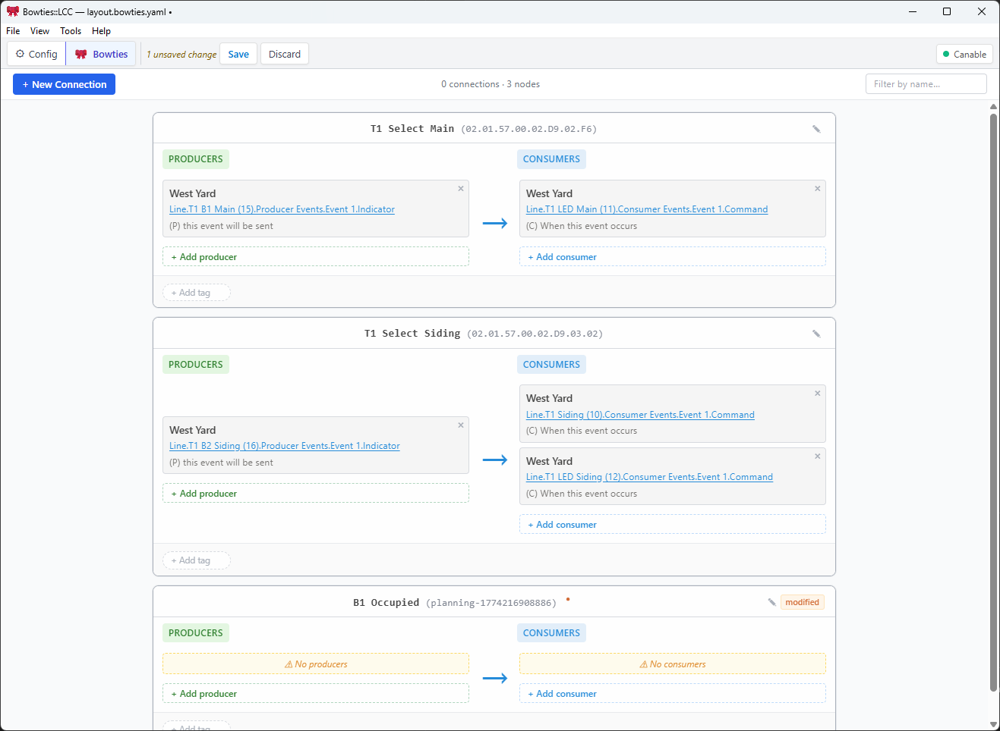

# Bowties

**Visual LCC/OpenLCB Configuration Tool for Model Railroads**

Bowties transforms complex LCC (Layout Command Control) event configuration into simple visual workflows. Understand your existing layout at a glance and navigate node configuration—no protocol expertise required.

## Getting started

1. **[Download and install](docs/user/installing.md)** — pre-built installers for Windows and Linux.
2. **[Connect and explore](docs/user/using.md)** — connect to your LCC network, discover nodes, view and edit configuration, and explore the Bowties event map.



## What Bowties does

- **Connects** to your LCC network via TCP hub (JMRI, port 12021) or direct USB-to-CAN adapter
- **Discovers** every node on the network and shows manufacturer, model, and status
- **Displays** full node configuration using a sidebar and card-based CDI browser — read and write any setting
- **Maps** event producer/consumer relationships across all nodes in the Bowties view
- **Links** events between nodes: click **+ New Connection**, pick a producer and a consumer, and Bowties writes the matching event ID to the node

## Supported hardware

| Connection type | Examples |
|----------------|---------|
| TCP hub | JMRI (port 12021), any GridConnect TCP bridge |
| USB GridConnect serial | SPROG CANISB, SPROG USB-LCC, RR-Cirkits Buffer LCC, CAN2USBINO |
| USB SLCAN | Canable, Lawicel CANUSB, any `slcand`-compatible adapter |

---

## For developers

See **[docs/project/development.md](docs/project/development.md)** for full details on building, testing, architecture, project principles, and contributing.

Quick reference:

```bash
cd app && npm install
npm run tauri dev      # development build with hot-reload
npm run tauri build    # production build
```

- **[Developer Guide](docs/project/development.md)** — build, test, architecture, contributing
- **[Releasing](docs/project/releasing.md)** — version bumps, tagging, GitHub Actions workflow
- **[Feature Roadmap](docs/project/roadmap.md)** — development timeline and priorities

---

## License

Licensed under either of

- [MIT License](LICENSE-MIT)
- [Apache License, Version 2.0](LICENSE-APACHE)

at your option.
