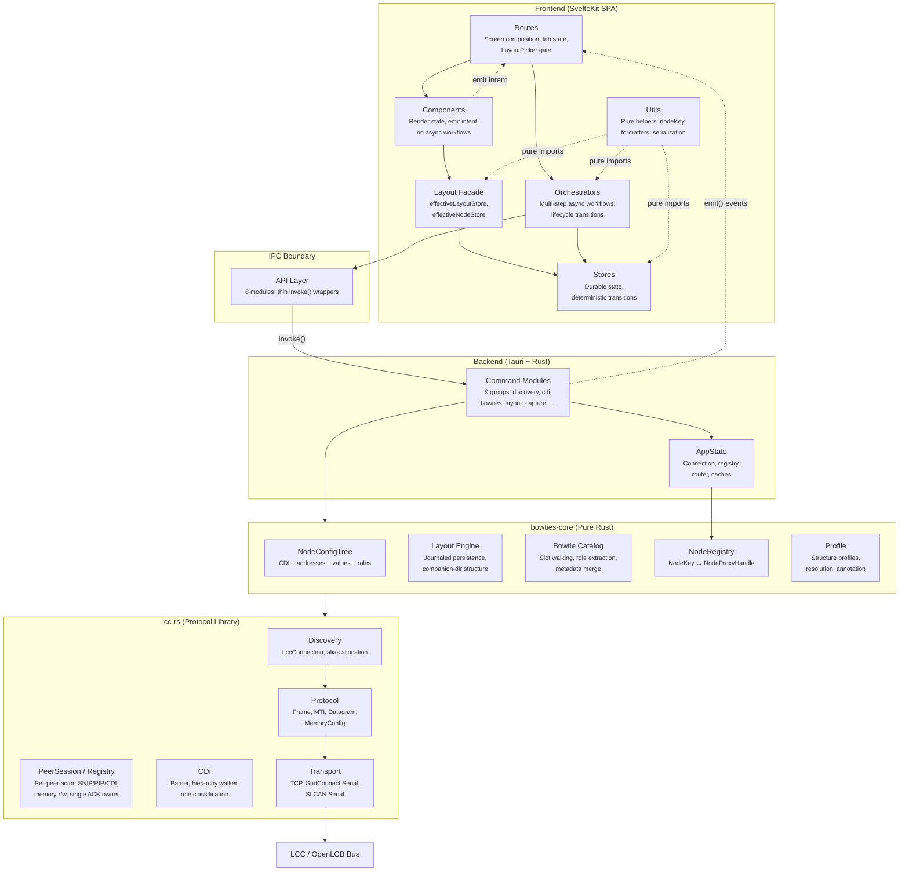
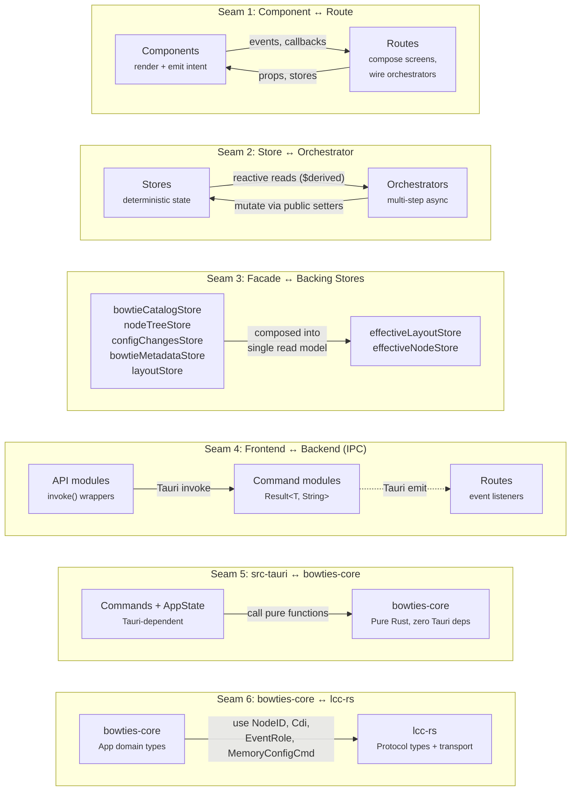
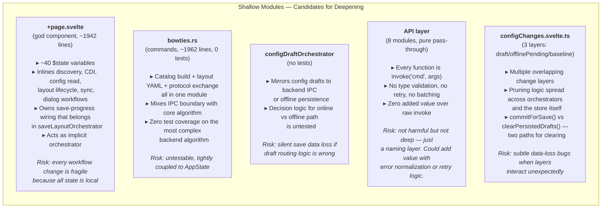
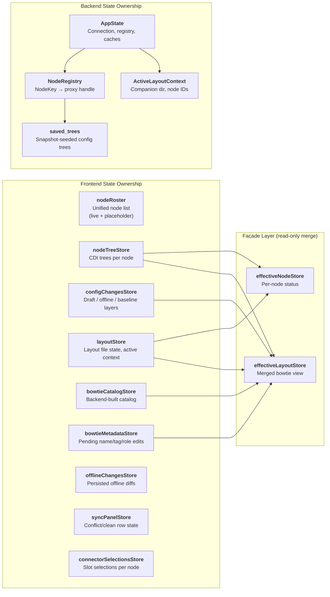

# Architecture Diagrams

Visual reference for Bowties architecture: layers, seams, deep modules, and shallow-module risks. Use these diagrams as a shared vocabulary in conversations.

---

## System Layers

Six layers from user-facing UI down to the LCC bus. Each layer has a single responsibility and communicates only with its immediate neighbors (except Tauri event emissions, which bridge backend → frontend).

---

## Deep Modules

Deep modules hide significant complexity behind a narrow public API. These are the architectural anchors — the places where important decisions are encapsulated. Touching them should be deliberate.

### `layout/*` — bowties-core

- Journaled writes (ADR-0006)
- Companion-dir structure
- Snapshot read/write
- Offline change staging
- Manifest reconstruction
- Known-layouts registry
- **API:** `save_capture`, `read_capture`, `update_offline_changes`, `execute` (journal)

### `bowtie/catalog` — bowties-core

- CDI slot walking
- Event role extraction
- Producer/consumer pairing
- Layout metadata merge
- Well-known EventID filtering
- **API:** `build_catalog()`, `CdiReadCompletePayload`

### `effectiveLayoutStore` — Layout Facade

- catalog × tree × metadata × layout merge
- Pending-deletion filter
- `effectiveRole()` waterfall
- `effectiveValue()` waterfall
- `slotsByRole()`, `isSlotFree()`
- **API:** `preview`, `effectiveBowties`, `effectiveRole`, `effectiveValue`

### `effectiveNodeStore` — Layout Facade

- Per-node origin tracking
- Capture/read status projection
- Persistability predicate
- Aggregate isDirty signal
- **API:** `nodeOrigin()`, `isPersistableInLayout()`, `isDirty`, `unsavedInMemoryNodeIds`

### `nodeRoster` — Store

- Unified live + placeholder facade
- Reactive `allEntries`/`liveEntries`/`placeholderEntries`
- Layout-scope clearing
- Profile stem tracking
- **API:** `allEntries`, `upsertLive`, `addPlaceholder`, `clearLayoutScope`

### `layoutLifecycleOrchestrator` — Orchestrator

- Single owner of lifecycle resets (ADR-0011)
- `resetForNewLayout` (full teardown)
- `resetForFreshLiveSession`
- `closeLayout` sequencing
- **API:** 3 entry points

### `LccConnection` — lcc-rs

- TCP/Serial connect + alias allocation
- Node discovery protocol
- Transport actor lifecycle
- **API:** `connect()`, `discover_nodes()`
- SNIP/PIP queries, CDI download, and memory config read/write are owned per-peer by `PeerSession` (see ADR-0016 / ADR-0018), not by a shared `BatchReader`

### `DatagramAssembler` — lcc-rs

- Multi-frame reassembly
- Pending/complete datagram tracking
- Error datagram handling
- **API:** `process_frame()` → `Option<Datagram>`

---

## Key Seams

Seams are the boundaries where ownership changes. Getting a fix or feature into the wrong seam causes architectural decay. This diagram shows the major seams and what crosses each one.

---

## Shallow Module Risks

Shallow modules expose complexity rather than hiding it. They force callers to understand implementation details, create coupling, and make changes fragile. These are candidates for deepening.

---

## Data Ownership Map

Which module is the authoritative owner of each major piece of state. When state is owned in the wrong place, bugs appear as stale data, race conditions, or reset leaks.

---

## Major Workflow Seam Crossings

Each workflow crosses multiple seams. The number of seam crossings indicates the coordination cost of a change. High-crossing workflows need more careful testing.

| Workflow | Seams Crossed | Modules Involved | Key Risk |
|----------|:---:|---|---|
| **Discovery** | 5 | Route → Orchestrator → API → Commands → lcc-rs → Bus | Placeholder crash if unfiltered |
| **Config Read Session** | 5 | Route → Orchestrator → API → Commands → lcc-rs → Bus | Phase machine in orchestrator + backend |
| **Save Layout** | 4 | Route → Orchestrator → API → Commands → bowties-core | 3-phase ordering, stale catalog |
| **Sync Apply** | 5 | Route → Orchestrator → API → Commands → lcc-rs → Bus | Offline→online value reconciliation |
| **Layout Open** | 4 | Route → Orchestrator → API → Commands → bowties-core | Snapshot hydration, catalog rebuild |
| **Bowtie Catalog Build** | 3 | Orchestrator → API → Commands → bowties-core | Event role exchange timing |
| **Connector Selection** | 4 | Orchestrator → API → Commands → Profile → tree re-annotate | Tree refresh after mode change |
| **Placeholder Add** | 4 | Orchestrator → API → Commands → bowties-core → profile | UUID minting, CDI synthesis |

---

## Module Depth Assessment

Depth = complexity hidden behind the API ÷ API surface area. Deep modules encapsulate; shallow modules spread complexity to callers.

| Module | Depth | Rationale |
|--------|:---:|---|
| `layout/*` (bowties-core) | **Deep** | Journaled writes, manifest reconstruction, companion-dir structure — all behind `save_capture`/`read_capture` |
| `bowtie/catalog` (bowties-core) | **Deep** | Complex slot-walking + role extraction behind `build_catalog()` |
| `effectiveLayoutStore` | **Deep** | 5-store merge hidden behind `preview` / `effectiveBowties` |
| `effectiveNodeStore` | **Deep** | Multi-store projection behind `isPersistableInLayout()` / `isDirty` |
| `LccConnection` (lcc-rs) | **Deep** | Protocol orchestration, alias allocation, transport actor — behind `connect()`/`discover()` |
| `DatagramAssembler` (lcc-rs) | **Deep** | Multi-frame reassembly behind `process_frame()` |
| `layoutLifecycleOrchestrator` | **Deep** | All reset paths consolidated into 3 entry points (ADR-0011) |
| `nodeRoster` | **Deep** | Unifies 4 backing stores behind one reactive facade |
| `saveLayoutOrchestrator` | **Medium** | Coordinates 3-phase save but callers still manage some wiring |
| `configChanges.svelte.ts` | **Medium** | 3-layer stack is powerful but pruning is partially external |
| `+page.svelte` | **Shallow** | 1942 lines, ~40 state vars, inlines workflows that should be orchestrated |
| `bowties.rs` (commands) | **Shallow** | 1962 lines mixing IPC + algorithm + protocol, untested |
| `configDraftOrchestrator` | **Shallow** | Untested routing logic for online/offline draft persistence |
| API layer (8 modules) | **Shallow** | Pure pass-through; no error normalization, no retry |
| `configSidebarPresenter` | **Medium** | Derives sidebar state but some badge logic lives in callers |

---

## Deepening Opportunities

Concrete actions that would convert shallow modules into deep ones:

1. **`+page.svelte` → extract workflows**: Move discovery, CDI download, and config-read session state into their respective orchestrators. The route should wire callbacks and render, not sequence multi-step flows.

2. **`bowties.rs` → decompose**: Split into catalog-builder (extract to `bowties-core`), layout YAML commands, and protocol exchange. The catalog algorithm should be testable without `AppState`.

3. **`configDraftOrchestrator` → add tests**: The online/offline routing decision is a critical data-integrity seam. Test it.

4. **API layer → add error normalization**: A thin `invokeWithErrorHandling()` wrapper could normalize backend error strings into typed frontend errors, adding depth without complexity.

5. **`configChanges` → consolidate pruning**: Move all layer-interaction logic (commitForSave, clearPersistedDrafts, pruneResolvedDrafts) into the store's public API with clear preconditions, rather than spreading across orchestrators.
