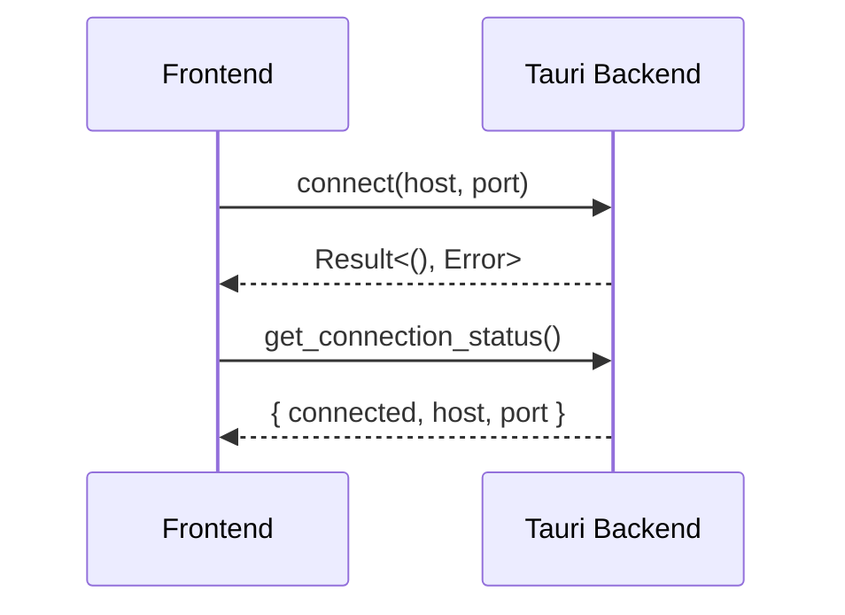
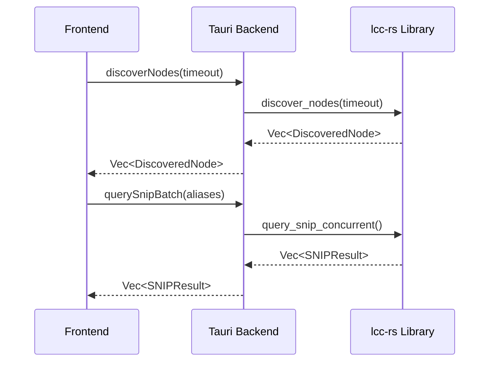
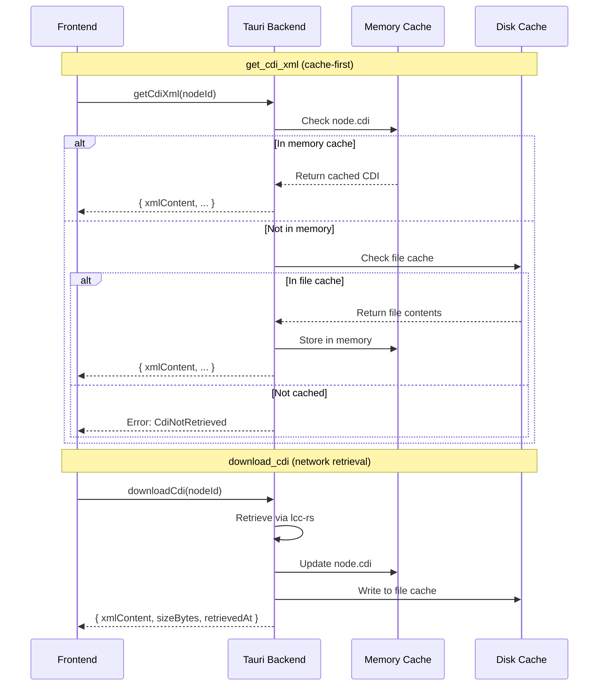

# Current Architecture

*This document describes the current implementation of Bowties, including what's built, what's in progress, and what remains to be implemented. For the aspirational vision, see [docs/design/vision.md](../design/vision.md).*

**Last Updated:** 2026-02-18

## Implementation Status

### ✅ Completed (Phase 1)

**Connection & Discovery MVP:**
- TCP connection to GridConnect hub
- Connection state persistence
- Node discovery using Verify Node ID protocol
- SNIP data retrieval (manufacturer, model, version, user name)
- Compact UX for connection and discovery

**lcc-rs Library:**
- GridConnect frame parsing/encoding
- MTI encoder/decoder
- Basic TCP transport with tokio
- Node discovery protocol
- SNIP datagram protocol
- Memory Configuration Protocol (CDI retrieval)
- Datagram assembly/disassembly
- Async I/O with proper error handling

**Tauri Backend:**
- Connection management commands
- Discovery and SNIP query commands
- CDI retrieval and caching commands
- Type-safe IPC layer
- State management for connections and nodes
- Platform-specific cache directory management

**Frontend (SvelteKit):**
- Connection form with host/port config
- Compact status bar when connected
- Node discovery interface with single discover/refresh button
- Node list table with SNIP data display
- CDI XML Viewer modal with syntax highlighting
- Context menu for node actions (View CDI, Force Re-download)
- XML formatting utility with proper indentation
- Advanced timeout control (collapsible)
- Responsive layout (800px → 1200px)

### ✅ Completed (Phase 2)

**CDI XML Viewer (Debugging Tool):**
- Memory Configuration Protocol implementation
- CDI retrieval from nodes via datagram protocol
- Platform-specific disk caching (app data directory)
- XML formatting with proper indentation
- Syntax highlighting using Prism.js
- Modal viewer component with copy-to-clipboard
- Context menu integration (right-click on nodes)
- Force re-download capability
- Error handling for missing/invalid CDI
- Large file warning (>500KB)

### ✅ Completed (Phase 3)

**Miller Columns Configuration Navigator (Feature 003):**
- CDI XML parsing (roxmltree-based parser in lcc-rs)
- Dynamic column-based navigation UI (Svelte components)
- Hierarchical CDI structure display (segments → groups → elements)
- Replicated group expansion with instance numbering
- Element details panel with metadata display
- Breadcrumb navigation with instance indicators
- pathId-based navigation system (seg:N, elem:N, elem:N#I format)
- UUID-based unique IDs for UI elements
- Keyboard navigation support (arrow keys, Enter/Space)
- WCAG 2.1 AA accessibility compliance
- CDI parsing cache (lazy_static HashMap)
- Error handling with graceful degradation
- Performance optimizations (debouncing, request cancellation)

**lcc-rs CDI Module:**
- Complete CDI type system (Cdi, Segment, DataElement, Group, etc.)
- Recursive XML parser with error recovery
- Group replication expansion logic
- Hierarchy navigation helpers (navigate_to_path, calculate_max_depth)
- Index-based path resolution (eliminates name ambiguity)
- Comprehensive test coverage (unit, integration, property-based)

### ✅ Completed (Phase 4)

**Persistent Message Monitoring & Event-Driven Architecture:**
- Message dispatcher with background listener task (tokio)
- Broadcast channels for multi-subscriber message distribution
- MTI-based message filtering and routing
- Event router for backend-to-frontend notifications
- Tauri event emissions (`lcc-node-discovered`, `lcc-message-received`)
- Arc<Mutex<>> shared connection pattern for concurrent access
- Channel-based discovery (replaces polling pattern)
- Automatic node discovery event notifications
- Foundation for real-time event monitoring

**lcc-rs Message Dispatcher:**
- `MessageDispatcher` struct with background receive loop
- `ReceivedMessage` with frame and timestamp
- `subscribe_all()` for monitoring all messages
- `subscribe_mti(mti)` for filtered message subscriptions
- Graceful shutdown handling
- Connection resilience support

**Tauri Event System:**
- `EventRouter` for message-to-event translation
- `NodeDiscoveredEvent` payload type
- `MessageReceivedEvent` payload type
- Automatic event emission on node discovery
- Background routing task lifecycle management

### 🚧 In Progress

**Protocol Implementation:**
- Event discovery (Identify Events protocol)
- Configuration memory read/write (value retrieval and editing)

**UI Enhancements:**
- Dark mode support (partially implemented in components)
- Configuration value editing in Miller Columns

### ⏳ Not Yet Implemented

**Three Main Views:**
- Event Bowties View (canvas with diagrams)
- Event Monitor View (real-time event log)

**Core Features:**
- Event link visualization
- Drag-and-drop event linking
- Configuration value editing (UI complete, backend pending)
- Real-time event monitoring

See [docs/project/roadmap.md](../project/roadmap.md) for detailed feature timeline.

## Technology Stack

### Frontend

**Framework:** SvelteKit 2.x
- **Why:** Modern reactive framework with excellent TypeScript support
- **Mode:** SPA (SSR disabled for Tauri compatibility)
- **Reactivity:** Svelte 5 runes (`$state`, `$derived`, `$props`)
- **Component Library:** None (custom components)
- **Styling:** Scoped CSS in `.svelte` files (no CSS framework, no Tailwind)
- **Syntax Highlighting:** Prism.js for XML display

**State Management:**
- Svelte stores (in `app/src/lib/stores/`)
- Currently local component state in `+page.svelte`
- Prepared node store not yet integrated

**Type Safety:**
- TypeScript strict mode enabled
- Type definitions for all Tauri commands
- Interfaces for all data structures

### Backend

**Framework:** Tauri 2.x
- **Why:** Lightweight native desktop framework with Rust backend
- **IPC:** Tauri commands (type-safe frontend ↔ backend communication)
- **Events:** Tauri event system for backend → frontend notifications

**Protocol Library:** lcc-rs
- **Location:** `lcc-rs/` workspace crate
- **Purpose:** Reusable LCC/OpenLCB protocol implementation
- **Key Features:**
  - GridConnect frame parser/formatter
  - MTI encoding/decoding (30+ message types)
  - TCP transport with tokio async I/O
  - Node discovery and SNIP protocols
  - Memory Configuration Protocol (CDI, configuration memory)
  - Datagram assembly/disassembly
  - Message dispatcher with background listening
  - Broadcast channels for event distribution
  - Persistent connection management

**Dependencies:**
- `tokio` (v1.x): Async runtime
- `serde` (v1.x): Serialization
- `thiserror` (v1.x): Error handling
- `async-trait` (v0.1.x): Trait support for async methods
- `chrono` (v0.4.x): Timestamp handling for cache metadata
- `prismjs` (v1.x): XML syntax highlighting (frontend)
- `roxmltree` (v0.20): CDI XML parsing
- `lazy_static` (v1.4): CDI parsing cache
- `uuid` (v1.10): Unique identifier generation

See [docs/technical/lcc-rs-api.md](lcc-rs-api.md) for complete API documentation.

##Current Implementation Details

### Connection & Discovery Setup View

**Purpose:** MVP interface for connecting to LCC network and discovering nodes before implementing the three main views.

**UX Characteristics:**
- **Compact status bar** when connected (vs. full card)
- **Single discover/refresh button** (consolidates two actions)
- **Hidden advanced controls** (timeout collapsible)
- **Responsive table** (expands from 800px to 1200px)
- **Reduced visual density** (tighter spacing, smaller fonts)

**State Flow:**
1. App launches → Check connection status from backend
2. User connects → Connection state persisted in backend
3. User discovers → Scans network + queries SNIP data
4. User refreshes → Re-queries all nodes for updated status
5. User views CDI → Triggers cache-first retrieval and displays in modal

**Component Structure:**
```
app/src/routes/+page.svelte         # Main page (connection + discovery + Miller Columns)
app/src/lib/components/
  NodeList.svelte                   # Table of discovered nodes with context menu
  CdiXmlViewer.svelte               # Modal XML viewer with syntax highlighting
  NodeStatus.svelte                 # Status indicator component
  RefreshButton.svelte              # (Unused, replaced by consolidated button)
  MillerColumns/
    MillerColumnsNav.svelte         # Main container with error boundary
    NodesColumn.svelte              # Left column - discovered nodes
    NavigationColumn.svelte         # Dynamic columns (segments/groups/elements)
    DetailsPanel.svelte             # Right panel - element metadata
    Breadcrumb.svelte               # Navigation breadcrumb
    README.md                       # Component documentation
app/src/lib/stores/
  millerColumns.ts                  # Miller Columns state management
app/src/lib/utils/
  xmlFormatter.ts                   # XML indentation utility
app/src/lib/api/
  cdi.ts                            # CDI-specific Tauri commands
  tauri.ts                          # General Tauri command wrappers
app/src/lib/types/
  cdi.ts                            # CDI type definitions
```

**Styling Approach:**
- Scoped `<style>` blocks in each component
- No global CSS
- No CSS preprocessors (SCSS/LESS)
- Utility-like class names defined locally (not Tailwind)
- Purple gradient theme (#667eea to #764ba2)
- Consistent spacing with rem units

### Data Flow

**Connection (Event-Driven Architecture):**

```
Frontend                    Tauri Backend               lcc-rs Library
-------                     -------------               --------------
connect(host, port)    →    connect_lcc(host, port) →   LccConnection::connect_with_dispatcher()
                       ←    Result<(), Error>       ←   - Creates MessageDispatcher
                                                        - Spawns background listener
                                                        - Starts EventRouter
                       ←──  lcc-node-discovered event (auto-emitted on network activity)
                       ←──  lcc-message-received event (all messages)

get_connection_status  →    get_connection_status()
                       ←    { connected, host, port }
```



**Discovery (Channel-Based):**

```
Frontend                    Tauri Backend               lcc-rs Library
-------                     -------------               --------------
discoverNodes(timeout) →    discover_nodes(timeout) →   LccConnection::discover_nodes()
                       ←    Vec<DiscoveredNode>     ←   - Subscribe to VerifiedNode MTI
                                                        - Send VerifyNodeGlobal
                                                        - Collect from channel (not polling)
                       ←──  lcc-node-discovered event (emitted per node)

querySnipBatch(aliases) →   query_snip_batch()      →   query_snip_concurrent()
                        ←   Vec<SNIPResult>        ←   (datagram protocol)

[Background EventRouter continuously emits events for all network activity]
```



**CDI Retrieval & Viewing:**

```
Frontend                    Tauri Backend               Cache Strategy
-------                     -------------               --------------
getCdiXml(nodeId)      →    get_cdi_xml(nodeId)    →   Check memory cache
                       ←    { xmlContent, ... }    ←   → Check file cache
                                                        → Network if not cached

downloadCdi(nodeId)    →    download_cdi(nodeId)   →   Retrieve from network
                       ←    { xmlContent, ... }    ←   → Save to both caches

viewCdiXml()           →    (format XML locally)
  ├─ formatXml()            (indent with 2 spaces)
  ├─ Prism.highlight()      (syntax coloring)
  └─ display in modal       (CdiXmlViewer.svelte)
```



**State Management:**
- Backend holds TCP connection and discovered nodes
- Frontend caches nodes in local/store state
- CDI data cached on disk in platform-specific app data directory
- Cache key format: `cdi_{manufacturer}_{model}_{software_version}.xml`
- Tauri events notify frontend of connection changes (planned)

See [docs/technical/tauri-api.md](tauri-api.md) for complete command reference.

**Miller Columns Navigation:**

```
Frontend                    Tauri Backend               lcc-rs CDI Module
-------                     -------------               -----------------
getDiscoveredNodes()   →    get_discovered_nodes()  →   (query node cache)
                       ←    Vec<DiscoveredNode>     ←   

getCdiStructure(nodeId) →   get_cdi_structure()     →   parse_cdi(xml)
                        ←   { segments, maxDepth }  ←   calculate_max_depth()

getColumnItems(path)    →   get_column_items()      →   navigate_to_path(path)
                        ←   Vec<ColumnItem>         ←   expand_replications()

getElementDetails(path) →   get_element_details()   →   navigate_to_path(path)
                        ←   ElementDetails          ←   (extract metadata)
```

**pathId Navigation System:**

The Miller Columns feature uses an index-based pathId system for stable navigation:

**Format:** `seg:N` for segments, `elem:N` for elements, `elem:N#I` for replicated instances

**Why Index-Based:**
- Eliminates ambiguity with CDI element names containing special characters (e.g., "Variable #1")
- Provides stable references independent of name changes
- Enables efficient path resolution via array indexing

**UI vs Navigation IDs:**
- **Display ID (UUID):** Unique identifier for React/Svelte keys (prevents collision in UI)
- **Navigation pathId:** Index-based identifier for backend navigation (seg:0, elem:2#5)
- **Separation of concerns:** UUIDs for UI rendering, pathIds for data traversal

**Example Path:**
```
User navigates: Tower-LCC Node → Conditionals → Logic #12 → Variable #1 → Trigger

Backend path:   ["seg:0", "elem:0#12", "elem:2", "elem:0"]
                 └─────┘  └─────────┘  └─────┘  └─────┘
                 segment  group inst.  group    element
                 index 0  elem 0, #12  elem 2   elem 0

Display IDs:    [UUID-1, UUID-2, UUID-3, UUID-4]  (UI keys only)
```

**Path Resolution:**
1. Parse pathId (e.g., "elem:2#5")
2. Extract index (2) and optional instance (5)
3. Navigate to `elements[2]`
4. If replicated, expand to instance #5

**Benefits:**
- Handles names like "Variable #1", "Group#2", "Item #3" without parsing ambiguity
- Consistent with array-based data structures in Rust
- Fast O(1) lookup via direct indexing

### File Organization

```
Bowties/
  app/
    src/
      routes/+page.svelte           # Main UI
      lib/
        api/
          tauri.ts                    # Tauri command wrappers
          cdi.ts                      # CDI-specific commands
        components/
          NodeList.svelte             # Node table with context menu
          CdiXmlViewer.svelte         # XML viewer modal
        utils/
          xmlFormatter.ts             # XML formatting utility
        types/
          cdi.ts                      # CDI type definitions
        stores/                       # Svelte stores (prepared, not used yet)
    src-tauri/
      src/
        lib.rs                        # Tauri setup
        commands/
          connection.rs               # Connection management
          discovery.rs                # Node discovery commands
          snip.rs                     # SNIP query commands
          cdi.rs                      # CDI retrieval and caching commands
          mod.rs                      # Command module exports
  lcc-rs/
    src/
      lib.rs                        # Public API exports
      types.rs                      # NodeID, EventID, etc.
      protocol/
        frame.rs                    # GridConnect frame parsing
        mti.rs                      # MTI enum
        datagram.rs                 # Datagram assembly
        memory_config.rs            # Memory Configuration Protocol
        mod.rs                      # Protocol module exports
      cdi/
        mod.rs                      # CDI type definitions (Cdi, Segment, Group, DataElement)
        parser.rs                   # XML parsing (roxmltree-based)
        hierarchy.rs                # Navigation helpers (expand, navigate_to_path)
      transport.rs                  # LccTransport trait, TcpTransport
      connection.rs                 # LccConnection
      discovery.rs                  # Node discovery
      snip.rs                       # SNIP protocol
  docs/                             # Documentation (this file)
  specs/                            # SpecKit feature specs
    001-cdi-xml-viewer/             # CDI XML Viewer feature spec
    003-miller-columns/             # Miller Columns navigator spec
```

### CDI and Configuration Strategy

**1. CDI XML Retrieval (Implemented):**
- **Cache strategy:** Memory cache → File cache → Network retrieval
- **Cache key format:** `cdi_{manufacturer}_{model}_{software_version}.xml`
- **Location:** Platform-specific app data directory
  - Windows: `%APPDATA%\com.bowtiesapp.bowties\cdi\`
  - macOS: `~/Library/Application Support/com.bowtiesapp.bowties/cdi/`
  - Linux: `~/.local/share/com.bowtiesapp.bowties/cdi/`
- **Retrieval:** Memory Configuration Protocol (address space 0xFF)
- **Automatic caching:** First retrieval saves to both memory and disk
- **Force re-download:** Context menu option bypasses cache
- **Metadata:** Retrieval timestamp, file size

**2. CDI XML Viewer (Implemented):**
- Modal viewer with syntax-highlighted XML display
- Prism.js for XML syntax coloring
- Custom XML formatter with proper indentation (2 spaces)
- Copy-to-clipboard functionality
- Large file warning (>500KB)
- Error handling for missing/invalid CDI
- Context menu integration (right-click on nodes)

**3. Miller Columns CDI Navigator (Implemented):**
- Dynamic column-based UI for hierarchical navigation
- CDI XML parsing to structured data model (Cdi, Segment, Group, DataElement)
- pathId-based navigation system (index-based, eliminates name ambiguity)
- UUID-based unique IDs for UI elements (React/Svelte keys)
- Replicated group expansion with instance numbering
- Element metadata display (name, description, type, constraints, default value)
- Breadcrumb navigation with instance indicators
- Keyboard navigation (arrow keys, Enter/Space)
- Lazy parsing cache (parsed CDI structs cached in lazy_static HashMap)
- Graceful error handling (parsing errors, missing data, malformed XML)
- WCAG 2.1 AA accessibility compliance

**4. Configuration Values (Partially Implemented):**
- CDI structure navigation complete
- Element metadata extraction complete
- Value retrieval pending (Memory Configuration Protocol read)
- Value editing UI designed but not connected to backend

## UX Implementation Notes

###Compact Layout Rationale

**Problem Solved:** Original design had excessive vertical spacing that wasted screen real estate.

**Changes Made:**
1. **Status Bar:** Connection info condensed from full card (2rem padding) to slim bar (0.75rem)
2. **Consolidated Button:** "Discover Nodes" serves both initial and refresh operations
3. **Advanced Toggle:** Timeout control hidden by default (250ms works for most users)
4. **Responsive Width:** Increased max-width from 800px to 1200px for better table display
5. **Reduced Density:** Smaller fonts, tighter spacing throughout

**Impact:**
- More nodes visible without scrolling
- Cleaner visual hierarchy
- Faster access to common actions
- Advanced controls available but not distracting

### Design Deviations from Vision

**Current MVP intentionally omits:**
- Miller Columns navigation (CDI parsing not yet implemented)
- Event Bowties canvas
- Event Monitor view
- View switching tabs

**Debugging Tools Implemented:**
- CDI XML Viewer (displays raw CDI for verification/debugging)

**Rationale:** Building foundation (connection, discovery, protocol) before complex UI features. Current interface validates core protocol implementation and establishes patterns for future views. CDI XML viewer provides debugging capability while CDI parsing and Miller Columns navigation are being developed.

## Performance Characteristics

**Current Measurements:**

| Operation | Target | Current Status |
|-----------|--------|----------------|
| Node discovery | <1s | ✅ ~250-500ms for 3 nodes |
| SNIP query (single) | <500ms | ✅ ~200-400ms per node |
| SNIP batch (3 nodes) | <1s | ✅ ~600-900ms (concurrent) |
| Connection establishment | <1s | ✅ ~100-300ms |
| CDI retrieval (cached) | <500ms | ✅ ~50-100ms (disk read) |
| CDI retrieval (network) | <3s | ✅ ~1-2s for typical CDI (~20KB) |
| XML formatting | <200ms | ✅ ~10-50ms for typical CDI |
| XML syntax highlighting | <500ms | ✅ ~50-200ms (Prism.js) |
| UI responsiveness | <50ms | ✅ Svelte reactivity instant |
| CDI parsing (first time) | <1s | ✅ ~100-500ms for typical CDI |
| CDI parsing (cached) | <50ms | ✅ ~10-30ms (lazy_static cache) |
| Column navigation | <100ms | ✅ ~20-80ms (path resolution + expansion) |
| Replicated group expansion | <200ms | ✅ ~50-150ms for 32 instances |

**Not yet measured:**
- Configuration value read from node memory (not implemented)
- Configuration value write to node memory (not implemented)
- Event monitoring latency (not implemented)
- Large network performance (100+ nodes)
- Very large CDI files (>1MB) - parsing performance
- Deep hierarchy navigation (10+ levels)

## Technical Debt & Known Issues

**Frontend:**
- Node store prepared but not used (state management in component)
- RefreshButton component unused (replaced by consolidated button)
- Dark mode partially implemented (inconsistent across components)
- No error boundary for non-Miller Columns components
- CDI viewer modal could benefit from virtual scrolling for large files
- Main page styling needs simplification (gradient background removed in Miller Columns)

**Backend:**
- No connection pooling or retry logic
- No rate limiting for SNIP/CDI queries
- Discovery timeout not configurable from UI (hardcoded to user input)
- No persistent configuration storage (except CDI cache)
- CDI cache has no expiration or size limits
- No cleanup of old/stale cache files
- CDI parsing cache (lazy_static HashMap) has no eviction policy

**Protocol:**
- Event discovery not implemented
- Configuration memory read/write operations not implemented (values from nodes)
- Datagram retries not fully tested
- Memory Configuration read assumes data fits in expected size
- No support for configuration write operations

**Testing:**
- No end-to-end tests for Miller Columns navigation
- Limited integration tests for CDI commands
- No protocol compliance validation suite
- No performance benchmarks for CDI parsing with very large files (>500KB)
- CDI retrieval tested manually only

## Next Implementation Steps

**Immediate (Current Sprint):**
1. Implement configuration value reading from node memory
2. Add configuration value editing and write operations
3. Remove main page gradient background (match Miller Columns minimal style)
4. Add cache management (size limits, expiration, cleanup)
5. Integrate node store for state management across all views

**Short-Term (Next 2-4 weeks):**
1. Begin Event discovery implementation
2. Add end-to-end tests for Miller Columns workflow
3. Implement CDI cache eviction policy
4. Add virtual scrolling for large CDI files in XML viewer
5. Improve error handling and user feedback for connection issues

**Medium-Term (Next 1-3 months):**
1. Build Event Bowties View with canvas and drag-and-drop
2. Implement event link visualization
3. Add real-time event monitoring view
4. Create comprehensive performance benchmarks
5. Implement configuration value caching strategy

See [docs/project/roadmap.md](../project/roadmap.md) for complete timeline.

## Resolved Technical Decisions

✅ **UI Framework:** Svelte 5 (reactive, TypeScript-friendly, lightweight)  
✅ **No CSS Framework:** Custom scoped styles (avoids bloat, full control)  
✅ **State in Component:** Start simple, migrate to stores as needed  
✅ **Svelte 5 Runes:** Modern reactive patterns (`$state`, `$derived`)  
✅ **Compact UX:** Single page before implementing three-view architecture  
✅ **Consolidated Discovery:** One button for discover/refresh (simpler mental model)  
✅ **Responsive Width:** 1200px max (allows table to breathe on wider screens)  
✅ **CDI Caching:** Platform-specific app data directory with filename-based cache keys  
✅ **XML Formatting:** Frontend JavaScript (DOMParser) not Rust (minimizes dependencies)  
✅ **Syntax Highlighting:** Prism.js (established library, good performance)  
✅ **Memory Config Protocol:** Address space 0xFF for CDI, datagram-based retrieval  
✅ **CDI Parsing:** roxmltree for XML parsing (Rust-native, zero-copy, error recovery)  
✅ **Miller Columns UI:** Dynamic columns (not fixed 5-column layout) to support variable CDI depth  
✅ **pathId System:** Index-based navigation (seg:N, elem:N#I) to eliminate name ambiguity  
✅ **UUID for UI:** Separate UUIDs for React/Svelte keys vs pathIds for navigation  
✅ **Lazy Parsing Cache:** lazy_static HashMap for parsed CDI structs (90% faster navigation)  
✅ **No Loading Animations:** Removed spinners and transitions for simpler, faster UI  
✅ **Keyboard Navigation:** Arrow keys + Enter/Space for accessibility compliance  
✅ **Error Boundaries:** Component-level error handling with graceful degradation  
✅ **WCAG 2.1 AA:** Screen reader support, proper ARIA labels, focus management  
✅ **Persistent Connections:** Background dispatcher with continuous message monitoring  
✅ **Event-Driven Updates:** Tauri events for automatic UI updates on network changes  
✅ **Broadcast Channels:** tokio::broadcast for multi-subscriber message distribution  
✅ **Arc<Mutex<>> Pattern:** Shared connection access for concurrent operations  

## Open Technical Questions

1. **Configuration Value Caching:** Session-only or persistent? Dirty tracking strategy?
2. ~~**Connection Resilience:**~~ ✅ **RESOLVED:** Persistent dispatcher with background monitoring; reconnection logic to be implemented
3. **Concurrent Operations:** Allow multiple CDI/SNIP queries or enforce serial execution?
4. **CDI Cache Management:** Implement automatic cleanup? Set size limits? TTL for cache entries?
5. **Large CDI Files:** Implement chunked rendering or virtual scrolling for parsed structures?
6. **Large Networks:** Pagination strategy for 100+ nodes? Lazy loading?
7. ~~**Event Monitoring:**~~ ✅ **RESOLVED:** Shared connection with EventRouter broadcasting to frontend via Tauri events
8. **Configuration Writes:** Transaction-based or immediate? Rollback on error?
9. **CDI Parsing Cache Eviction:** LRU? Size-based? Time-based? Or unlimited?
10. **Reconnection Strategy:** Automatic reconnect with exponential backoff? Manual reconnect only?
11. **Message Queue Size:** Channel capacity limits? Backpressure handling for slow frontend?

---

*For aspirational architecture, see [docs/design/vision.md](../design/vision.md)*  
*For API reference, see [docs/technical/lcc-rs-api.md](lcc-rs-api.md) and [docs/technical/tauri-api.md](tauri-api.md)*
