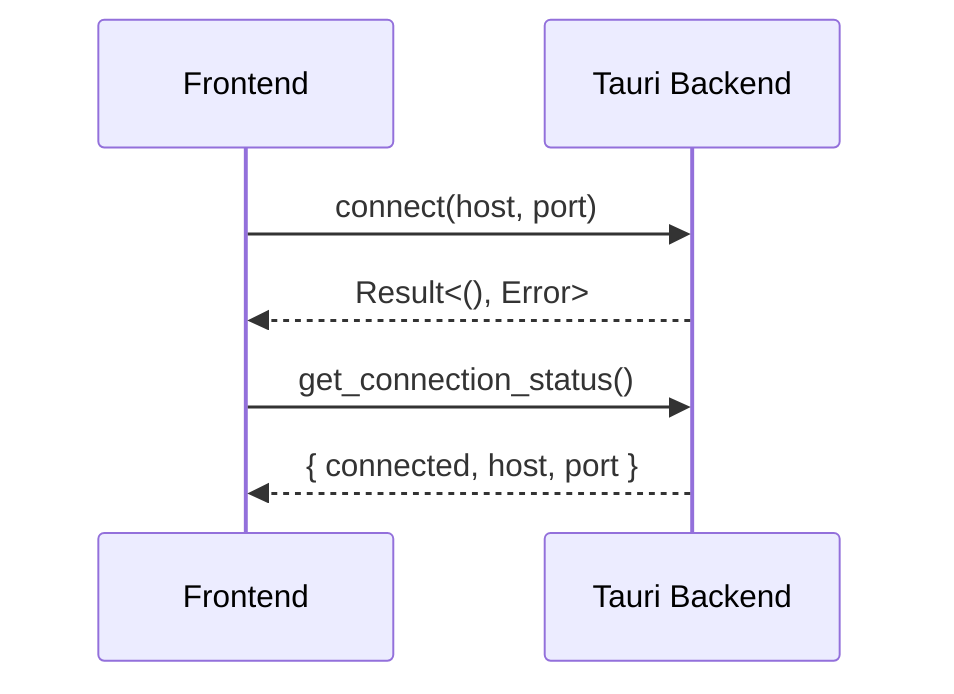
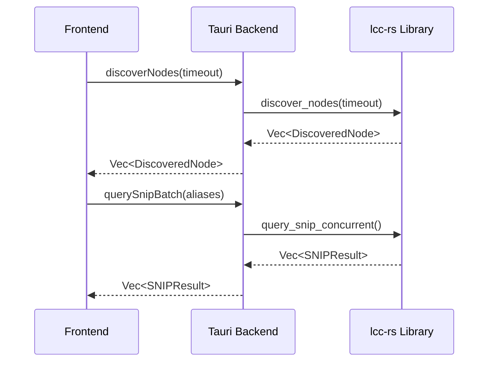
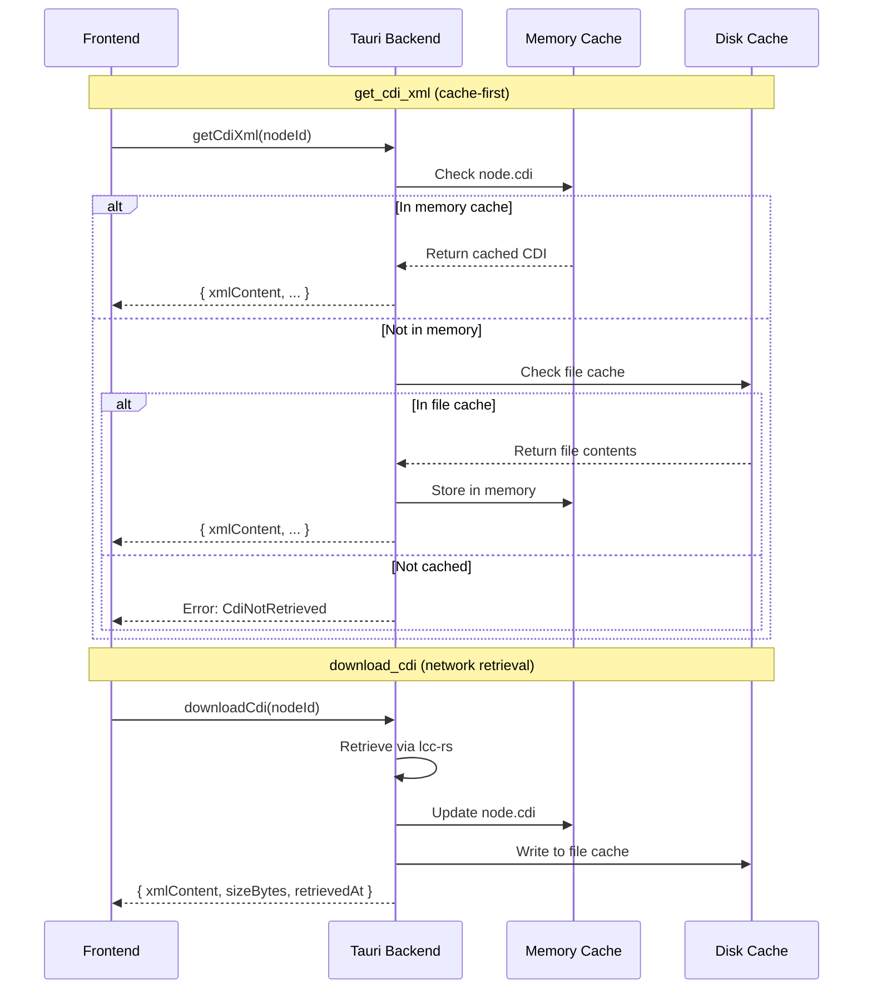

# Current Architecture

*This document describes the current implementation of Bowties, including what's built, what's in progress, and what remains to be implemented. For the aspirational vision, see [docs/design/vision.md](../design/vision.md).*

**Last Updated:** 2026-02-17

## Implementation Status

### ✅ Completed (Phase 1)

**Connection & Discovery MVP:**
- TCP connection to GridConnect hub
- Connection state persistence
- Node discovery using Verify Node ID protocol
- SNIP data retrieval (manufacturer, model, version, user name)
- Compact UX for connection and discovery

**lcc-rs Library:**
- GridConnect frame parsing/encoding
- MTI encoder/decoder
- Basic TCP transport with tokio
- Node discovery protocol
- SNIP datagram protocol
- Memory Configuration Protocol (CDI retrieval)
- Datagram assembly/disassembly
- Async I/O with proper error handling

**Tauri Backend:**
- Connection management commands
- Discovery and SNIP query commands
- CDI retrieval and caching commands
- Type-safe IPC layer
- State management for connections and nodes
- Platform-specific cache directory management

**Frontend (SvelteKit):**
- Connection form with host/port config
- Compact status bar when connected
- Node discovery interface with single discover/refresh button
- Node list table with SNIP data display
- CDI XML Viewer modal with syntax highlighting
- Context menu for node actions (View CDI, Force Re-download)
- XML formatting utility with proper indentation
- Advanced timeout control (collapsible)
- Responsive layout (800px → 1200px)

### ✅ Completed (Phase 2)

**CDI XML Viewer (Debugging Tool):**
- Memory Configuration Protocol implementation
- CDI retrieval from nodes via datagram protocol
- Platform-specific disk caching (app data directory)
- XML formatting with proper indentation
- Syntax highlighting using Prism.js
- Modal viewer component with copy-to-clipboard
- Context menu integration (right-click on nodes)
- Force re-download capability
- Error handling for missing/invalid CDI
- Large file warning (>500KB)

### 🚧 In Progress

**Protocol Implementation:**
- Event discovery (Identify Events protocol)
- Configuration memory read/write (non-CDI configuration)

**UI Enhancements:**
- Dark mode support (partially implemented in components)
- Error handling refinement
- Loading state improvements

### ⏳ Not Yet Implemented

**Three Main Views:**
- Configuration View (Miller Columns)
- Event Bowties View (canvas with diagrams)
- Event Monitor View (real-time event log)

**Core Features:**
- CDI parsing and structured display (Miller Columns)
- Event link visualization
- Drag-and-drop event linking
- Configuration value editing
- Real-time event monitoring

See [docs/project/roadmap.md](../project/roadmap.md) for detailed feature timeline.

## Technology Stack

### Frontend

**Framework:** SvelteKit 2.x
- **Why:** Modern reactive framework with excellent TypeScript support
- **Mode:** SPA (SSR disabled for Tauri compatibility)
- **Reactivity:** Svelte 5 runes (`$state`, `$derived`, `$props`)
- **Component Library:** None (custom components)
- **Styling:** Scoped CSS in `.svelte` files (no CSS framework, no Tailwind)
- **Syntax Highlighting:** Prism.js for XML display

**State Management:**
- Svelte stores (in `app/src/lib/stores/`)
- Currently local component state in `+page.svelte`
- Prepared node store not yet integrated

**Type Safety:**
- TypeScript strict mode enabled
- Type definitions for all Tauri commands
- Interfaces for all data structures

### Backend

**Framework:** Tauri 2.x
- **Why:** Lightweight native desktop framework with Rust backend
- **IPC:** Tauri commands (type-safe frontend ↔ backend communication)
- **Events:** Tauri event system for backend → frontend notifications

**Protocol Library:** lcc-rs
- **Location:** `lcc-rs/` workspace crate
- **Purpose:** Reusable LCC/OpenLCB protocol implementation
- **Key Features:**
  - GridConnect frame parser/formatter
  - MTI encoding/decoding (30+ message types)
  - TCP transport with tokio async I/O
  - Node discovery and SNIP protocols
  - Memory Configuration Protocol (CDI, configuration memory)
  - Datagram assembly/disassembly

**Dependencies:**
- `tokio` (v1.x): Async runtime
- `serde` (v1.x): Serialization
- `thiserror` (v1.x): Error handling
- `async-trait` (v0.1.x): Trait support for async methods
- `chrono` (v0.4.x): Timestamp handling for cache metadata
- `prismjs` (v1.x): XML syntax highlighting (frontend)

See [docs/technical/lcc-rs-api.md](lcc-rs-api.md) for complete API documentation.

##Current Implementation Details

### Connection & Discovery Setup View

**Purpose:** MVP interface for connecting to LCC network and discovering nodes before implementing the three main views.

**UX Characteristics:**
- **Compact status bar** when connected (vs. full card)
- **Single discover/refresh button** (consolidates two actions)
- **Hidden advanced controls** (timeout collapsible)
- **Responsive table** (expands from 800px to 1200px)
- **Reduced visual density** (tighter spacing, smaller fonts)

**State Flow:**
1. App launches → Check connection status from backend
2. User connects → Connection state persisted in backend
3. User discovers → Scans network + queries SNIP data
4. User refreshes → Re-queries all nodes for updated status
5. User views CDI → Triggers cache-first retrieval and displays in modal

**Component Structure:**
```
app/src/routes/+page.svelte         # Main page (connection + discovery)
app/src/lib/components/
  NodeList.svelte                   # Table of discovered nodes with context menu
  CdiXmlViewer.svelte               # Modal XML viewer with syntax highlighting
  NodeStatus.svelte                 # Status indicator component
  RefreshButton.svelte              # (Unused, replaced by consolidated button)
app/src/lib/utils/
  xmlFormatter.ts                   # XML indentation utility
app/src/lib/api/
  cdi.ts                            # CDI-specific Tauri commands
app/src/lib/types/
  cdi.ts                            # CDI type definitions
```

**Styling Approach:**
- Scoped `<style>` blocks in each component
- No global CSS
- No CSS preprocessors (SCSS/LESS)
- Utility-like class names defined locally (not Tailwind)
- Purple gradient theme (#667eea to #764ba2)
- Consistent spacing with rem units

### Data Flow

**Connection:**

```
Frontend                    Tauri Backend
-------                     -------------
connect(host, port)    →    connect_lcc(host, port)
                       ←    Result<(), Error>
get_connection_status  →    get_connection_status()
                       ←    { connected, host, port }
```



**Discovery:**

```
Frontend                    Tauri Backend               lcc-rs Library
-------                     -------------               --------------
discoverNodes(timeout) →    discover_nodes(timeout) →   LccConnection::discover_nodes()
                       ←    Vec<DiscoveredNode>     ←   (internal protocol)

querySnipBatch(aliases) →   query_snip_batch()      →   query_snip_concurrent()
                        ←   Vec<SNIPResult>        ←   (datagram protocol)
```



**CDI Retrieval & Viewing:**

```
Frontend                    Tauri Backend               Cache Strategy
-------                     -------------               --------------
getCdiXml(nodeId)      →    get_cdi_xml(nodeId)    →   Check memory cache
                       ←    { xmlContent, ... }    ←   → Check file cache
                                                        → Network if not cached

downloadCdi(nodeId)    →    download_cdi(nodeId)   →   Retrieve from network
                       ←    { xmlContent, ... }    ←   → Save to both caches

viewCdiXml()           →    (format XML locally)
  ├─ formatXml()            (indent with 2 spaces)
  ├─ Prism.highlight()      (syntax coloring)
  └─ display in modal       (CdiXmlViewer.svelte)
```



**State Management:**
- Backend holds TCP connection and discovered nodes
- Frontend caches nodes in local/store state
- CDI data cached on disk in platform-specific app data directory
- Cache key format: `cdi_{manufacturer}_{model}_{software_version}.xml`
- Tauri events notify frontend of connection changes (planned)

See [docs/technical/tauri-api.md](tauri-api.md) for complete command reference.

### File Organization

```
Bowties/
  app/
    src/
      routes/+page.svelte           # Main UI
      lib/
        api/
          tauri.ts                    # Tauri command wrappers
          cdi.ts                      # CDI-specific commands
        components/
          NodeList.svelte             # Node table with context menu
          CdiXmlViewer.svelte         # XML viewer modal
        utils/
          xmlFormatter.ts             # XML formatting utility
        types/
          cdi.ts                      # CDI type definitions
        stores/                       # Svelte stores (prepared, not used yet)
    src-tauri/
      src/
        lib.rs                        # Tauri setup
        commands/
          connection.rs               # Connection management
          discovery.rs                # Node discovery commands
          snip.rs                     # SNIP query commands
          cdi.rs                      # CDI retrieval and caching commands
          mod.rs                      # Command module exports
  lcc-rs/
    src/
      lib.rs                        # Public API exports
      types.rs                      # NodeID, EventID, etc.
      protocol/
        frame.rs                    # GridConnect frame parsing
        mti.rs                      # MTI enum
        datagram.rs                 # Datagram assembly
        memory_config.rs            # Memory Configuration Protocol
        mod.rs                      # Protocol module exports
      transport.rs                  # LccTransport trait, TcpTransport
      connection.rs                 # LccConnection
      discovery.rs                  # Node discovery
      snip.rs                       # SNIP protocol
  docs/                             # Documentation (this file)
  specs/                            # SpecKit feature specs
    001-cdi-xml-viewer/             # CDI XML Viewer feature spec
```

### CDI and Configuration Strategy

**1. CDI XML Retrieval (Implemented):**
- **Cache strategy:** Memory cache → File cache → Network retrieval
- **Cache key format:** `cdi_{manufacturer}_{model}_{software_version}.xml`
- **Location:** Platform-specific app data directory
  - Windows: `%APPDATA%\com.bowtiesapp.bowties\cdi\`
  - macOS: `~/Library/Application Support/com.bowtiesapp.bowties/cdi/`
  - Linux: `~/.local/share/com.bowtiesapp.bowties/cdi/`
- **Retrieval:** Memory Configuration Protocol (address space 0xFF)
- **Automatic caching:** First retrieval saves to both memory and disk
- **Force re-download:** Context menu option bypasses cache
- **Metadata:** Retrieval timestamp, file size

**2. CDI XML Viewer (Implemented):**
- Modal viewer with syntax-highlighted XML display
- Prism.js for XML syntax coloring
- Custom XML formatter with proper indentation (2 spaces)
- Copy-to-clipboard functionality
- Large file warning (>500KB)
- Error handling for missing/invalid CDI
- Context menu integration (right-click on nodes)

**3. Configuration Values (Not Yet Implemented):**
- At startup/refresh: Event IDs + user descriptions
- On-demand: Other parameters when user clicks element
- Session-only caching
- Dirty flags for tracking modifications

**4. CDI Parsing (Not Yet Implemented):**
- XML parsing to structured data model
- Miller Columns navigation of configuration structure
- Interactive editing of configuration values

## UX Implementation Notes

###Compact Layout Rationale

**Problem Solved:** Original design had excessive vertical spacing that wasted screen real estate.

**Changes Made:**
1. **Status Bar:** Connection info condensed from full card (2rem padding) to slim bar (0.75rem)
2. **Consolidated Button:** "Discover Nodes" serves both initial and refresh operations
3. **Advanced Toggle:** Timeout control hidden by default (250ms works for most users)
4. **Responsive Width:** Increased max-width from 800px to 1200px for better table display
5. **Reduced Density:** Smaller fonts, tighter spacing throughout

**Impact:**
- More nodes visible without scrolling
- Cleaner visual hierarchy
- Faster access to common actions
- Advanced controls available but not distracting

### Design Deviations from Vision

**Current MVP intentionally omits:**
- Miller Columns navigation (CDI parsing not yet implemented)
- Event Bowties canvas
- Event Monitor view
- View switching tabs

**Debugging Tools Implemented:**
- CDI XML Viewer (displays raw CDI for verification/debugging)

**Rationale:** Building foundation (connection, discovery, protocol) before complex UI features. Current interface validates core protocol implementation and establishes patterns for future views. CDI XML viewer provides debugging capability while CDI parsing and Miller Columns navigation are being developed.

## Performance Characteristics

**Current Measurements:**

| Operation | Target | Current Status |
|-----------|--------|----------------|
| Node discovery | <1s | ✅ ~250-500ms for 3 nodes |
| SNIP query (single) | <500ms | ✅ ~200-400ms per node |
| SNIP batch (3 nodes) | <1s | ✅ ~600-900ms (concurrent) |
| Connection establishment | <1s | ✅ ~100-300ms |
| CDI retrieval (cached) | <500ms | ✅ ~50-100ms (disk read) |
| CDI retrieval (network) | <3s | ✅ ~1-2s for typical CDI (~20KB) |
| XML formatting | <200ms | ✅ ~10-50ms for typical CDI |
| XML syntax highlighting | <500ms | ✅ ~50-200ms (Prism.js) |
| UI responsiveness | <50ms | ✅ Svelte reactivity instant |

**Not yet measured:**
- Configuration read/write (not implemented)
- Event monitoring latency (not implemented)
- Large network performance (100+ nodes)
- Very large CDI files (>1MB)

## Technical Debt & Known Issues

**Frontend:**
- Node store prepared but not used (state management in component)
- RefreshButton component unused (replaced by consolidated button)
- Dark mode partially implemented (inconsistent across components)
- No error boundary for component failures
- CDI viewer modal could benefit from virtual scrolling for large files

**Backend:**
- No connection pooling or retry logic
- No rate limiting for SNIP/CDI queries
- Discovery timeout not configurable from UI (hardcoded to user input)
- No persistent configuration storage (except CDI cache)
- CDI cache has no expiration or size limits
- No cleanup of old/stale cache files

**Protocol:**
- Event discovery not implemented
- Configuration memory read/write operations not implemented (non-CDI config)
- Datagram retries not fully tested
- Memory Configuration read assumes data fits in expected size

**Testing:**
- No end-to-end tests
- Limited integration tests
- No protocol compliance validation suite
- No performance benchmarks
- CDI retrieval tested manually only

## Next Implementation Steps

**Immediate (Current Sprint):**
1. Remove unused RefreshButton component
2. Integrate node store for state management
3. Add error boundary to main page
4. Implement consistent dark mode
5. Add cache management (size limits, expiration, cleanup)

**Short-Term (Next 2-4 weeks):**
1. Begin Event discovery implementation
2. Plan Miller Columns component architecture
3. Implement CDI XML parsing (quick-xml)
4. Add virtual scrolling for large CDI files
5. Improve error handling and user feedback

**Medium-Term (Next 1-3 months):**
1. Build Configuration View with Miller Columns
2. Implement CDI parsing and structured display
3. Add configuration value reading
4. Create event link visualization
5. Implement configuration value editing

See [docs/project/roadmap.md](../project/roadmap.md) for complete timeline.

## Resolved Technical Decisions

✅ **UI Framework:** Svelte 5 (reactive, TypeScript-friendly, lightweight)  
✅ **No CSS Framework:** Custom scoped styles (avoids bloat, full control)  
✅ **State in Component:** Start simple, migrate to stores as needed  
✅ **Svelte 5 Runes:** Modern reactive patterns (`$state`, `$derived`)  
✅ **Compact UX:** Single page before implementing three-view architecture  
✅ **Consolidated Discovery:** One button for discover/refresh (simpler mental model)  
✅ **Responsive Width:** 1200px max (allows table to breathe on wider screens)  
✅ **CDI Caching:** Platform-specific app data directory with filename-based cache keys  
✅ **XML Formatting:** Frontend JavaScript (DOMParser) not Rust (minimizes dependencies)  
✅ **Syntax Highlighting:** Prism.js (established library, good performance)  
✅ **Memory Config Protocol:** Address space 0xFF for CDI, datagram-based retrieval  

## Open Technical Questions

1. **State Management:** When to migrate from component state to Svelte stores?
2. **Connection Resilience:** How to handle network interruptions and reconnection?
3. **Concurrent Operations:** Allow multiple CDI/SNIP queries or enforce serial execution?
4. **CDI Parsing:** Use quick-xml or write custom parser for better error handling?
5. **Cache Management:** Implement automatic cleanup? Set size limits? TTL for cache entries?
6. **Large CDI Files:** Implement chunked loading or virtual scrolling for files >1MB?
5. **Large Networks:** Pagination strategy for 100+ nodes? Lazy loading?
6. **Event Monitoring:** Separate TCP connection or share with command channel?

---

*For aspirational architecture, see [docs/design/vision.md](../design/vision.md)*  
*For API reference, see [docs/technical/lcc-rs-api.md](lcc-rs-api.md) and [docs/technical/tauri-api.md](tauri-api.md)*
