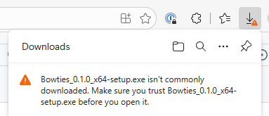
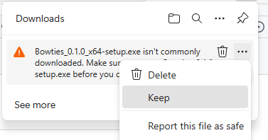
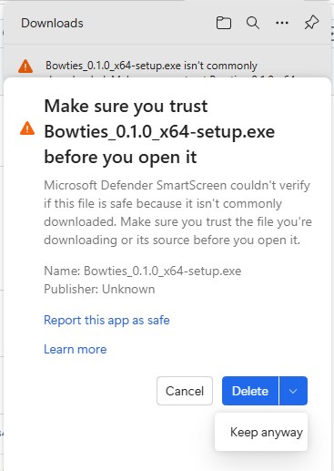

# Installing Bowties

Bowties is a desktop application for Windows and Linux. Pre-built installers are available on the [GitHub Releases page](../../releases).

## Windows

1. Download the latest `Bowties_x.y.z_x64-setup.exe` from [Releases](../../releases).
2. You may see security warnings during and after the download — see [Windows security warnings](#windows-security-warnings) below for how to proceed through each one.
3. Run the installer and follow the prompts. Bowties installs to `%LOCALAPPDATA%\Programs\Bowties` by default.
4. Launch **Bowties** from the Start Menu or desktop shortcut.

### Windows security warnings

Bowties is an open-source project that is not yet code-signed with a commercial certificate. Windows and Edge use code-signing as one signal to decide whether a file is trustworthy. Because the installer is unsigned, you will encounter up to three warnings.

**Why this happens:** Microsoft charges for code-signing certificates, and a new certificate has no reputation history even after purchase. Both Edge's SmartScreen filter and Windows Defender SmartScreen flag unsigned or low-reputation executables regardless of their actual content. This is expected behavior for any small open-source project distributing a native installer. The source code is publicly auditable on GitHub.

---

**Warning 1 — Edge download blocked**

After clicking the download link, Edge shows a warning in the Downloads panel saying the file was blocked or "isn't commonly downloaded."



Click the **…** (three dots) menu next to the download entry and choose **Keep**.



A follow-up prompt asks you to confirm. Choose **Keep anyway**.



> **Using Chrome?** Chrome uses Google Safe Browsing instead of Microsoft SmartScreen, but the result is similar for unsigned installers. Chrome will show a warning in its download shelf at the bottom of the window, labelling the file as potentially dangerous. Click the small arrow or chevron next to the filename and choose **Keep** (or **Keep dangerous file** depending on your Chrome version). You won't see the Edge-specific screens above, but the same principle applies — click through to keep and run the file.

---

**Warning 2 — Windows SmartScreen (before the installer runs)**

After opening the downloaded `.exe`, Windows may show a blue full-screen dialog:

> *Windows protected your PC*
> *Microsoft Defender SmartScreen prevented an unrecognized app from starting.*

- Click **More info** (below the message).
- A **Run anyway** button appears. Click it.

---

**Warning 3 — UAC (User Account Control)**

The installer needs to create a Start Menu entry and write to your user profile. Windows will show a standard UAC prompt asking whether to allow the app to make changes.

- Click **Yes** to proceed.

---

After these steps the installer runs normally.

## Linux

### Debian / Ubuntu (.deb)

```bash
wget https://github.com/<owner>/Bowties/releases/latest/download/bowties_x.y.z_amd64.deb
sudo dpkg -i bowties_x.y.z_amd64.deb
```

Then launch via your application menu or run `bowties` in a terminal.

### Other distributions (AppImage)

```bash
wget https://github.com/<owner>/Bowties/releases/latest/download/Bowties_x.y.z_amd64.AppImage
chmod +x Bowties_x.y.z_amd64.AppImage
./Bowties_x.y.z_amd64.AppImage
```

## Supported hardware

Bowties connects to your LCC network in two ways:

| Method | Hardware examples |
|--------|------------------|
| **TCP hub** | JMRI (port 12021), any GridConnect TCP bridge |
| **USB-to-CAN (GridConnect serial)** | SPROG CANISB, SPROG USB-LCC, RR-Cirkits Buffer LCC, CAN2USBINO |
| **USB-to-CAN (SLCAN)** | Canable, Lawicel CANUSB, any `slcand`-compatible adapter |

No additional software or drivers are required for the TCP hub method. For USB adapters, the appropriate USB serial driver for your adapter must be installed (most modern adapters use a CH340 or FTDI chip with OS-provided drivers).

## Uninstalling

**Windows:** Use **Add or Remove Programs** and uninstall **Bowties**.

**Linux (.deb):** `sudo apt remove bowties`

**Linux (AppImage):** Delete the `.AppImage` file. Configuration is stored in `~/.config/com.lcc.bowties/`.

## Next steps

See [Using Bowties](using.md) to connect to your layout and start exploring.
