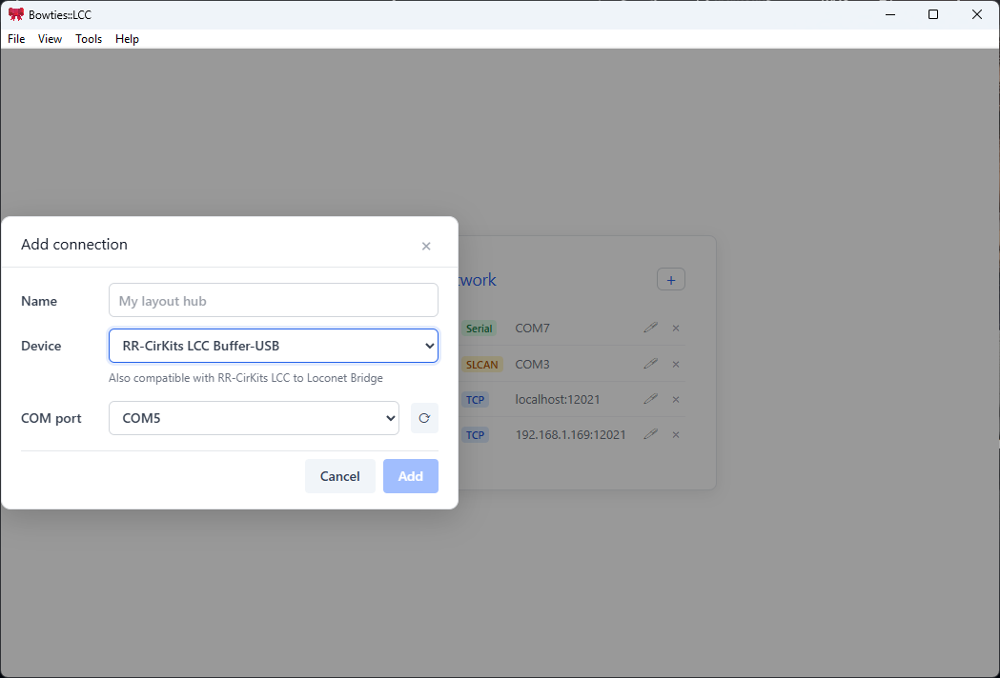
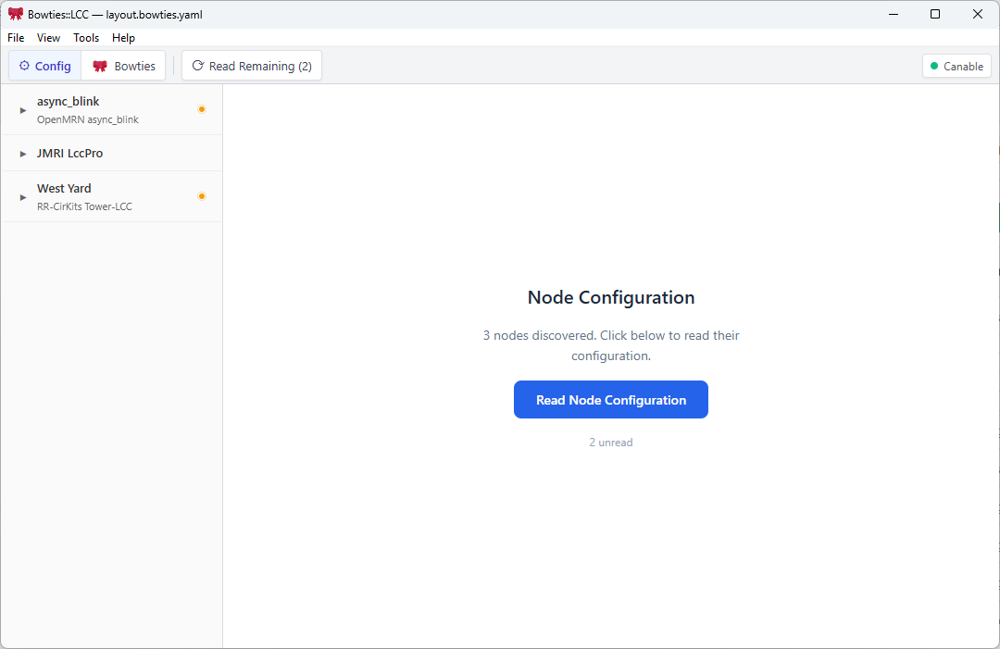
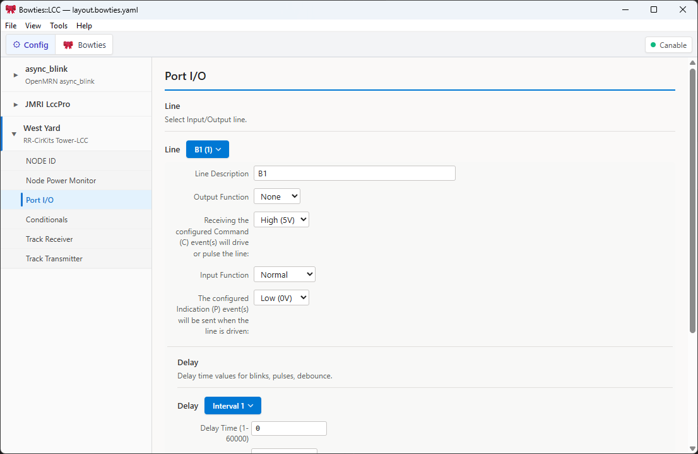
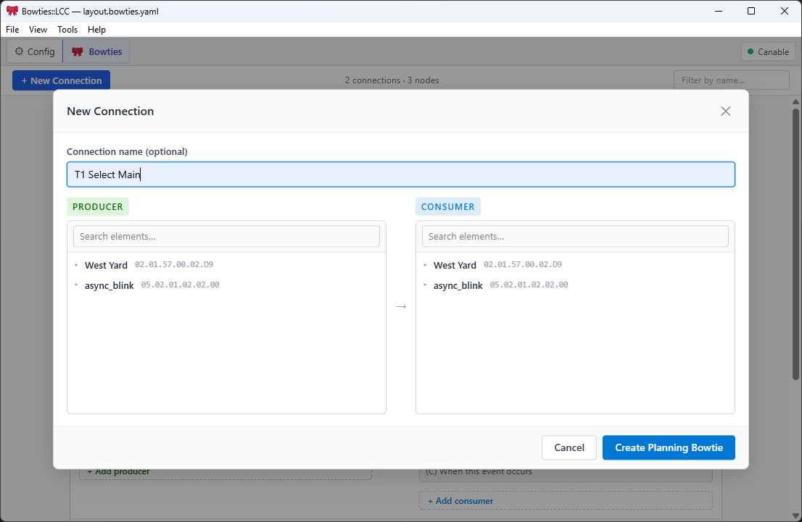

# Using Bowties

This guide walks you through connecting Bowties to your LCC layout, exploring your network, viewing and editing node configuration, and working with saved layouts offline.

## Connecting to your layout

### Via a TCP hub (JMRI or standalone bridge)

1. Launch Bowties.
2. Click **Add connection** in the top bar.
3. Select **TCP**.
4. Enter the host and port — for JMRI use `localhost:12021`.
5. Click **Connect**.

The status indicator in the connection bar turns green when the link is established.

### Via a USB-to-CAN adapter (GridConnect serial)

> Supported adapters: SPROG CANISB, SPROG USB-LCC, RR-Cirkits Buffer LCC, CAN2USBINO

1. Plug in your adapter; let Windows/Linux install the USB serial driver.
2. Click **Add connection**.
3. Select **GridConnect (USB/Serial)**.
4. Choose the correct COM port (Windows) or `/dev/ttyUSB*` device (Linux) from the dropdown.
5. Click **Connect**.

### Via a USB-to-CAN adapter (SLCAN)

> Supported adapters: Canable, Lawicel CANUSB, other `slcand`-compatible adapters

Same steps as GridConnect serial, but choose **SLCAN (USB/Serial)** in step 3.

---

## Discovering nodes

After connecting, click **Discover Nodes** in the toolbar. The **Node List** will populate with the nodes on your layout. This only takes a second or two.

## Reading node configuration

Before you can view configuration or the Bowties event map, click **Read Node Configuration** in the toolbar. Progress bars show how each node is coming along — on a large layout this can take a while.

Once complete, you can click into any node to view or edit its configuration, or switch to the Bowties view.

> **Note:** Configuration is cached after the first read, so subsequent launches are much faster.

## Saving a layout for offline work

Once discovery and configuration reads have finished, save the current layout so you can reopen it later without a live bus connection.

1. Click **Save Layout**.
2. Choose the `.layout` file you want Bowties to use.
3. Bowties writes the layout plus its companion directory, including captured node snapshots and any pending offline changes.

Later, you can reopen that layout while disconnected and continue browsing or planning changes.

---

## Opening a saved layout offline

1. Open the saved layout file.
2. Bowties restores the captured nodes, configuration data, and Bowties view from disk.
3. If no live bus is connected, you stay in offline mode and can keep browsing the saved layout.

While offline, edits are tracked as pending layout changes. They do not write to physical nodes until you reconnect and sync them.

---

## Viewing node configuration

1. Click any node row in the Node List to select it.
2. The **Configuration View** opens. The left sidebar lists the node's CDI segments. Click a segment to select it.
3. The main area shows the segment's groups as cards. Each card displays the fields and sub-groups for that configuration group.
4. Field values are read from the node and shown in-place inside each card.

---

## Editing configuration

1. Navigate to the field you want to change in the Configuration View.
2. Edit the value inside the card:
   - **Drop-down** fields: choose from the list of options.
   - **Text / number** fields: click and type the new value.
   - **Event ID** fields: enter a 64-bit event identifier in `XX.XX.XX.XX.XX.XX.XX.XX` format.
3. Click **Apply** to write the new value to the node.

The field indicator changes to ✓ when the write is confirmed by the node.

---

## Bowties view (event relationship map)

The **Bowties View** shows a visual map of event producer/consumer relationships across your entire layout.

- Each **bowtie** shape represents an event shared between one or more producers and one or more consumers.
- **Half-bowties** represent events that have producers but no consumers yet, or vice versa.
- **Hovering** a bowtie shows a summary tooltip (node name, segment, element).
- **Clicking** a bowtie jumps to that element in the Configuration View.

Use the filter bar at the top to show:

| Filter | Description |
|--------|-------------|
| Connected Only | Bowties with both a producer and consumer |
| Unconnected | Half-bowties only |
| All | Everything |

### Creating a new connection

To link a producer to a consumer:

1. Click **+ New Connection** in the Bowties view toolbar.
2. In the **New Connection** dialog, use the **Producer** panel (left) to pick the element that sends the event.
3. Use the **Consumer** panel (right) to pick the element that should respond to it.
4. Optionally enter a name for the connection.
5. Click **Create Connection**. Bowties resolves the event ID (preferring an already-configured side) and writes it to the other side.

You can also start a connection from the Configuration View: click **→ New Connection** next to any event ID field in a card. The dialog opens with that element pre-filled on the appropriate side.

---

## Saving your work

When you are connected to the live bus, clicking **Apply** writes that field directly to the node hardware.

When you are working in a saved layout, offline edits stay pending in the layout until you click **Save Layout**. **Discard** throws away unsaved offline edits and restores the last saved layout state.

If you later reconnect with a layout that still has pending offline changes, Bowties opens the **Sync Offline Changes** flow so you can review and apply them safely.

Connection settings (host, port, adapter) are saved automatically and restored the next time you launch Bowties.

---

## Syncing offline changes back to the bus

When a saved layout with pending offline changes is open and you reconnect to the bus, Bowties compares the planned values in the layout with the current live values.

- **Conflicts** require you to choose whether to apply the offline value or skip it.
- **Clean changes** are ready to apply and are selected by default.
- **Already applied** changes are cleared automatically and reported as a count.
- **Missing nodes** stay pending in the layout until those nodes are present again.

If Bowties is not confident the connected bus matches the saved layout, it asks whether this is the **Target layout bus** or a **Bench / other bus** before showing apply choices.

---

## Troubleshooting

**No nodes appear after discovery**
- Check that the connection status is green.
- Ensure your LCC network has power and that at least one node is online.
- Try running **Discover Nodes** again — some nodes respond slowly on first boot.

**A USB adapter is not listed**
- Check Device Manager (Windows) or `dmesg` (Linux) to confirm the adapter is recognized as a serial port.
- Try unplugging and re-plugging the adapter, then reopen the connection dialog.

**Configuration changes are not accepted**
- Some nodes require a reboot before new configuration takes effect. Check the node's manual.
- Ensure you are connected when clicking Apply — a dropped connection will prevent writes.
