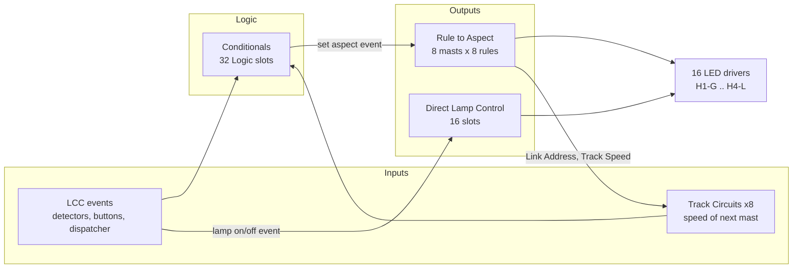

# Signal-LCC Hardware Model

Source of truth: `docs/ref/RR-CirKits_Inc__Signal-LCC_rev-C7c.cdi.xml`.

## The Four Subsystems

The node is best understood as four cooperating subsystems, not one configuration screen.

Two things follow immediately, and both matter for UX:

- **Conditionals are optional.** A lamp can be driven straight from an incoming event through Direct Lamp Control with no logic at all.
- **The 16 physical LED drivers are a shared, contended resource.** Every output belongs to either a mast or a direct-lamp slot, never both.

## Hard Capacity Limits

All counts are the `replication` attributes in the CDI.

| Resource | Limit | CDI path |
|---|---:|---|
| LED drivers (physical outputs) | 16 | `#1 H1-G` … `#16 H4-L` |
| Mast slots | 8 | `Rule to Aspect/Mast` |
| Rules (aspects) per mast | 8 | `Rule to Aspect/Mast/Rule` |
| Rules per mast when chained | 16 | via `Mast Processing = Linked to Previous` |
| Lamps lit per aspect | 4 | `Rule to Aspect/Mast/Rule/Appearance` |
| Direct lamp slots | 16 | `Direct Lamp Control/Lamp` |
| Conditional logic slots | 32 | `Conditionals/Logic` |
| Variables per conditional | 2 | `Variable #1`, `Variable #2` |
| Action events per conditional | 4 | `Conditionals/Logic/Action` (replication 4) |
| Track circuit receivers | 8 | `Track Circuits/Circuit` |

These are the numbers a capacity indicator in Bowties must track. **32 conditionals is the scarce resource in practice** — a single mast's ABS ladder typically consumes three to five of them.

## The Lamp Namespace

Outputs are named by head and colour position: `H1-G`, `H1-Y`, `H1-R`, `H1-L` (Lunar), repeating for `H2`–`H4`.

These are **positional labels only**. They carry no requirement about the actual LED colour you wire to them. Dick Bronson, [#15216](https://groups.io/g/layoutcommandcontrol/message/15216):

> These are just labels, and have nothing whatever to do with the actual LED colors that you connect, unless you choose to do it that way.

Consequences worth surfacing in UI:

- A 3-lamp signal leaves the `-L` output of that head free, so 16 outputs cover **five 3-lamp masts plus one spare** ([#15216](https://groups.io/g/layoutcommandcontrol/message/15216)).
- Physical terminal labels wrap **clockwise** around the board, which is a common wiring mistake ([#15216](https://groups.io/g/layoutcommandcontrol/message/15216)).
- A single `CA`/`CC` jumper sets common-anode vs common-cathode for the whole board. Top two pins = CC, lower two = CA (David Harris, [Atlas signal thread](https://groups.io/g/layoutcommandcontrol/topic/signal_lcc_board_and_atlas/98184931)). It is not documented in the connector pinout table, which caused a multi-day dead end for one user.

## Ownership Of An Output Is Exclusive

`Direct Lamp Control/Lamp/Lamp Selection` includes the sentinel value `0 = Used by Mast`. The manual-derived field description states:

> Set to *Used by Mast* to leave the lamp to the Rule-to-Aspect table (the slot then has no effect). Otherwise pick a specific lamp identifier; configuration tools warn if the same lamp is also claimed by an Appearance, so each lamp should be controlled by exactly one path.

This is a **validation rule Bowties should enforce**, not merely warn about after the fact. Leaving a lamp in direct-control mode after testing it is a documented failure: a user wired and tested lamps individually, then found none of his aspects worked because the rows were never returned to `Used by Mast` ([#13986 thread, Tom Cherepko](https://groups.io/g/layoutcommandcontrol/topic/signal_lcc_board_and_atlas/98184931)):

> **Important:** When you are done return lamp selection to Used by Mast.

## Electrical Notes

- Modern LED signals draw roughly **5 mA or less per lit LED**, and typically only about a third of a mast's LEDs are lit, so an interlocking is around 15–30 mA rather than the half-amp people assume — Dick Bronson, [#966](https://groups.io/g/layoutcommandcontrol/message/966).
- A two-pin header at the opposite end from the LCC connectors accepts external lamp power. It must be **at least as high a voltage as the bus supply** or it will not source the LEDs ([#966](https://groups.io/g/layoutcommandcontrol/message/966)).
- Current-limiting resistors are already on the outputs; LEDs connect directly ([#3745-era guidance](https://groups.io/g/layoutcommandcontrol/topic/32048138)).
- For power wiring, land the heavy bus on nearby terminals and run short smaller stranded tails with ferrules to the board — Dick Bronson, [#15073](https://groups.io/g/layoutcommandcontrol/message/15073).

## Firmware And Revision Traps

| Trap | Detail | Source |
|---|---|---|
| Rev G board, I/O lines 1–2 | Board routing changed; lines 1 and 2 did not work as output/consumer. Fixed in **C7a**. Input/producer was unaffected. | Rob Heikens, [#7542](https://groups.io/g/layoutcommandcontrol/message/7542) |
| Firmware won't load | Older firmware will not load on rev-G hardware by design | [#7547](https://groups.io/g/layoutcommandcontrol/message/7547) |
| Version numbering | Signal-LCC was bumped to C7 to align with Tower-LCC numbering, so a "higher" version is not a different product | [#7547](https://groups.io/g/layoutcommandcontrol/message/7547) |
| **32H only:** power cycle | Most configuration changes need a power cycle before they take effect | Bob Gamble, [#7955](https://groups.io/g/layoutcommandcontrol/message/7955) |
| **32H only:** lamp order | Lamp 1 = Red, 2 = Green, 3 = Yellow on the WS2811 output | Bob Gamble, [#7955](https://groups.io/g/layoutcommandcontrol/message/7955) |

## Related

- [rule-to-aspect.md](rule-to-aspect.md)
- [direct-lamp-control.md](direct-lamp-control.md)
- [conditionals.md](conditionals.md)
- [sources.md](sources.md)
