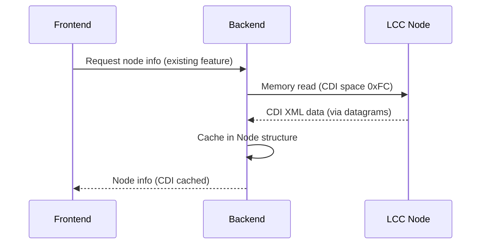
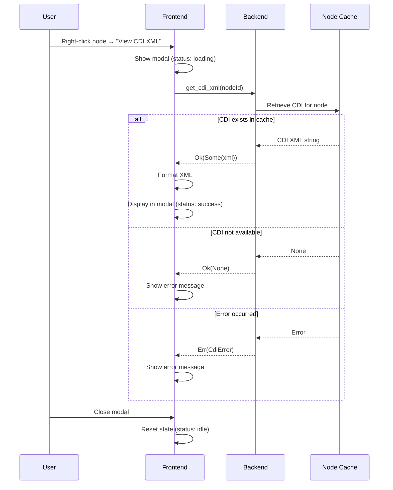

# Data Model: CDI XML Viewer

**Feature**: 001-cdi-xml-viewer  
**Phase**: 1 - Design  
**Date**: February 16, 2026

## Overview

This document defines the data structures and state management for the CDI XML viewer feature. The feature is primarily presentational, dealing with displaying existing CDI data rather than managing complex domain entities.

---

## Core Entities

### 1. CdiViewerState (Frontend)

Represents the state of the CDI XML viewer modal in the UI.

**Attributes**:
- `visible: boolean` - Whether the modal is currently displayed
- `nodeId: string | null` - The node ID whose CDI is being viewed (null if modal closed)
- `xmlContent: string | null` - The raw CDI XML content (null if not loaded or error)
- `formattedXml: string | null` - The formatted/indented XML for display
- `status: ViewerStatus` - Current status (idle, loading, success, error)
- `errorMessage: string | null` - Error message if status is error

**Validation Rules**:
- `visible` is true only when `nodeId` is not null
- `xmlContent` is populated only when `status` is success
- `errorMessage` is populated only when `status` is error

**State Transitions**:
1. **Idle** → User right-clicks node → **Loading**
2. **Loading** → CDI retrieved successfully → **Success** (display XML)
3. **Loading** → CDI retrieval fails → **Error** (display message)
4. **Success/Error** → User closes modal → **Idle**

---

### 2. CdiXmlData (Backend/Protocol)

Represents CDI data retrieved from an LCC node. This is existing data structure (not new for this feature).

**Attributes**:
- `nodeId: NodeId` - Unique identifier of the LCC node (6-byte node ID)
- `xmlContent: String` - Raw XML content as retrieved from node memory
- `retrievedAt: DateTime` - Timestamp when CDI was retrieved
- `size: usize` - Size of XML content in bytes

**Relationships**:
- **Belongs to**: `Node` entity (existing in node management)
- **Retrieved via**: LCC memory configuration protocol (datagrams)

**Storage**:
- Cached in-memory as part of `Node` structure in backend state
- Not persisted to disk (debugging tool, not production data)

**Source**: 
- Retrieved from LCC node memory space 0xFC (Configuration Definition Information space per TN-9.7.4.1)
- Retrieved via datagram protocol (TN-9.7.3.2) with memory read operations

---

### 3. ViewerStatus (Enum)

Represents the current status of the CDI viewer operation.

**Values**:
- `Idle` - No CDI viewing in progress
- `Loading` - Fetching or formatting CDI data
- `Success` - CDI loaded and formatted successfully
- `Error` - Failed to retrieve or display CDI

**Frontend Representation (TypeScript)**:
```typescript
type ViewerStatus = 'idle' | 'loading' | 'success' | 'error';
```

---

### 4. CdiError (Result Type)

Represents errors that can occur during CDI viewing.

**Error Categories**:

| Error Type | Description | User Message |
|------------|-------------|--------------|
| `CdiNotRetrieved` | CDI data not yet fetched from node | "CDI data has not been retrieved for this node. Retrieve configuration first." |
| `CdiUnavailable` | Node doesn't provide CDI | "This node does not provide CDI (Configuration Description Information)." |
| `RetrievalFailed` | CDI fetch operation failed | "CDI retrieval failed: {details}. Check node connection." |
| `InvalidXml` | XML parsing/formatting failed | "XML parsing failed. Raw content shown below." |
| `NodeNotFound` | Requested node ID not in cache | "Node {id} not found. Refresh node list." |

**Rust Representation**:
```rust
#[derive(Debug, thiserror::Error)]
pub enum CdiError {
    #[error("CDI not yet retrieved for node {0}")]
    CdiNotRetrieved(String),
    
    #[error("Node {0} does not provide CDI")]
    CdiUnavailable(String),
    
    #[error("CDI retrieval failed: {0}")]
    RetrievalFailed(String),
    
    #[error("Invalid XML format: {0}")]
    InvalidXml(String),
    
    #[error("Node {0} not found")]
    NodeNotFound(String),
}
```

---

## Data Flow

### 1. CDI Retrieval Flow (Existing - Not Modified)



### 2. CDI Viewing Flow (New Feature)



---

## State Management

### Frontend (Svelte Store)

**Store: `cdiViewerStore`** (new)

```typescript
import { writable } from 'svelte/store';

interface CdiViewerState {
  visible: boolean;
  nodeId: string | null;
  xmlContent: string | null;
  formattedXml: string | null;
  status: ViewerStatus;
  errorMessage: string | null;
}

const initialState: CdiViewerState = {
  visible: false,
  nodeId: null,
  xmlContent: null,
  formattedXml: null,
  status: 'idle',
  errorMessage: null,
};

export const cdiViewerStore = writable<CdiViewerState>(initialState);

// Actions
export const cdiViewerActions = {
  open(nodeId: string) { /* ... */ },
  close() { /* ... */ },
  setLoading() { /* ... */ },
  setSuccess(xml: string) { /* ... */ },
  setError(message: string) { /* ... */ },
};
```

### Backend (Tauri State)

**No new state required** - CDI data already exists in node management state.

The backend simply provides a read-only accessor:
```rust
// Existing state structure (not modified)
struct AppState {
    nodes: Arc<RwLock<HashMap<NodeId, Node>>>,
    // ... other state
}

// Node structure already contains CDI (or will with CDI retrieval feature)
struct Node {
    id: NodeId,
    snip: Option<SnipData>,
    cdi: Option<String>, // CDI XML - may already exist or be added
    // ... other fields
}
```

---

## Performance Considerations

### Caching Strategy
- **Backend**: CDI cached in-memory per node (already planned)
- **Frontend**: Formatted XML cached per viewing session (reset on modal close)
- **No persistent storage**: CDI viewer is debugging tool, data not preserved across app restarts

### Memory Limits
- **Small CDI** (< 100KB): Format and display immediately
- **Large CDI** (100KB - 1MB): Format with progress indicator
- **Very Large CDI** (> 1MB): Warn user, offer to display first 1000 lines

### Render Optimization
- Lazy load modal component (not rendered until first use)
- Format XML only when modal opens (not during node discovery)
- Use `<pre>` with `white-space: pre` for efficient text rendering
- Avoid re-formatting on every render (cache formatted result)

---

## Validation & Constraints

### Input Validation
- **Node ID**: Must match existing node in cache (validated by backend)
- **XML Content**: May be invalid XML (handled gracefully - display raw)

### Output Validation
- **Formatted XML**: Must preserve all original content (no data loss)
- **Formatting**: Must use consistent indentation (2 or 4 spaces)

### Constraints  
- **Max XML Size**: 10MB (per spec) - issue warning if exceeded
- **Modal Size**: Max viewport width 90%, max height 80% (scrollable)
- **Copy Operation**: Browser clipboard API requires HTTPS or localhost

---

## Schema Definitions (TypeScript)

### Frontend Types

```typescript
// lib/types/cdi.ts

export type ViewerStatus = 'idle' | 'loading' | 'success' | 'error';

export interface CdiViewerState {
  visible: boolean;
  nodeId: string | null;
  xmlContent: string | null;
  formattedXml: string | null;
  status: ViewerStatus;
  errorMessage: string | null;
}

export interface CdiXmlResponse {
  xmlContent: string | null;
  errorMessage?: string;
}

export interface FormatXmlOptions {
  indent?: number; // spaces per indentation level (default: 2)
  preserveWhitespace?: boolean; // preserve text node whitespace (default: false)
}
```

---

## Testing Data Structures

### Mock CDI XML (Small)
```xml
<?xml version="1.0"?>
<cdi>
  <identification>
    <manufacturer>Example Manufacturer</manufacturer>
    <model>Test Node</model>
  </identification>
  <segment space="253">
    <int size="1">
      <name>Sample Config</name>
    </int>
  </segment>
</cdi>
```

### Mock CDI XML (Large - for performance testing)
- Generate procedurally: 100+ segments with 10+ fields each
- Target size: ~1MB (test formatting performance)
- Use for testing scroll behavior and copy operations

### Error State Mocks
```typescript
// Unit test fixtures
export const mockCdiStates = {
  notRetrieved: { nodeId: 'ABC123', cdi: null, error: 'CdiNotRetrieved' },
  unavailable: { nodeId: 'DEF456', cdi: null, error: 'CdiUnavailable' },
  invalidXml: { nodeId: 'GHI789', cdi: '<invalid><xml', error: null },
  success: { nodeId: 'JKL012', cdi: mockValidCdi, error: null },
};
```

---

## Migration & Compatibility

**No migration required** - This is a new feature with no database or persisted state.

**Backward Compatibility**: N/A

**Forward Compatibility**: 
- CDI XML structure may evolve (per LCC standards)
- Viewer displays raw XML regardless of schema version
- No parsing/interpretation required, so schema changes don't affect viewer

---

## Summary

The CDI XML viewer has a simple data model focused on display state:
- **Frontend**: Modal state (visible, loading, success, error)
- **Backend**: Read-only access to existing cached CDI data
- **No new storage**: Leverages existing node management cache
- **Error handling**: 5 well-defined error states
- **Performance**: Lazy loading, caching formatted XML per session

This lightweight design aligns with the feature's purpose as a debugging tool rather than a production data management system.
