# Phase 1 Data Model

This feature touches two data domains: the **profile schema** (v1 → v2) and the **layout file** (additive `placeholderBoards`). `lcc-rs` is untouched.

## Profile schema (v2)

### `StructureProfile` (root)

| Field | Type | Required | Notes |
|---|---|---|---|
| `schemaVersion` | `"2.0"` (string) | yes | Bumped from `"1.0"`. Loader rejects `"1.0"` only when v1-only fields (`connectorSlots`, `connectorConstraintVariants`, `daughterboardReferences`, `carrierOverrides`) are also present (defensive). New profiles must be v2. |
| `nodeType.manufacturer` | string | yes | Unchanged. |
| `nodeType.model` | string | yes | Unchanged. |
| `firmwareVersionRange` | `{min?, max?}` | no | Unchanged. |
| `eventRoles` | `EventRoleDecl[]` | no | **Relaxed**: now allows leaf-targeted paths (FR-003). |
| `relevanceRules` | `RelevanceRule[]` | no | **Relaxed**: cross-segment + leaf-targeted paths (FR-004, FR-005). |
| `configurationModes` | `ConfigurationMode[]` | no | **NEW** (FR-001). |

### `ConfigurationMode`

| Field | Type | Required | Notes |
|---|---|---|---|
| `id` | string | yes | Unique within profile (e.g. `"turnoutboss-side"`, `"connector-a"`). |
| `label` | string | yes | User-facing name shown in the variant picker. |
| `selector` | `Selector` (tagged enum) | yes | See below. |
| `variants` | `Variant[]` | yes, ≥1 | Declared variants. Spec FR-007 governs unmatched stored values. |

### `Selector` (tagged enum, `kind` discriminator)

```yaml
# enum-field variant
selector:
  kind: enumField
  fieldPath: "Layout Configuration Setup/How this TurnoutBoss is used on your layout."
# structural-slot variant
selector:
  kind: structuralSlot
  slotId: "connector-a"
  affectedPaths:                # CDI paths whose shape this slot drives
    - "Port I/O/Line#1"
    - "Port I/O/Line#2"
    # ...
  allowNoneInstalled: true
```

### `Variant`

| Field | Type | Required | Notes |
|---|---|---|---|
| `id` | string | yes | For `enumField`: the integer enum byte stringified (or the `<property>` value). For `structuralSlot`: the daughterboard id (e.g. `"BOD4-CP"`). The literal `"__none__"` is reserved for `allowNoneInstalled` slots. |
| `label` | string | yes | User-facing variant name (e.g. `"Left"`, `"BOD4-CP"`). |
| `overlay` | `Overlay` | yes | Payload applied when this variant is active. |

### `Overlay`

| Field | Type | Required | Notes |
|---|---|---|---|
| `eventRoles` | `EventRoleDecl[]` | no | Per-leaf-or-group role overrides contributed by this variant. |
| `relevanceRules` | `RelevanceRule[]` | no | Rules that fire only when this variant is active. |
| `structuralConstraints` | `ConnectorConstraintRule[]` | no | Replaces v1 `connectorConstraintVariants` + `carrierOverrides` (re-uses the existing rule struct). |

### `EventRoleDecl` (relaxed)

| Field | Type | Required | Notes |
|---|---|---|---|
| `groupPath` | string | yes | **Now** may resolve to a group **or** to an individual `eventid` leaf (FR-003). Same `'/' + '#N'` syntax. |
| `role` | `"Producer" \| "Consumer"` | yes | Unchanged. |
| `label` | string | no | Unchanged. |

### `RelevanceRule` (relaxed)

| Field | Type | Required | Notes |
|---|---|---|---|
| `id` | string | yes | Unique within profile. |
| `affectedTarget` | string | yes | **Renamed** from `affectedGroupPath`. May target a group, a single replication instance, or a leaf (FR-005). |
| `allOf` | `RelevanceCondition[]` | yes, ≥1 | V1 single-condition limit is **removed**: multi-condition rules are now evaluated (all-AND). |
| `explanation` | string | yes | Verbatim banner text. Unchanged. |

### `RelevanceCondition` (relaxed)

| Field | Type | Required | Notes |
|---|---|---|---|
| `field` | string | yes | **Now** any CDI field path (cross-segment allowed). Same `'/' + '#N'` syntax. |
| `irrelevantWhen` | `integer[]` | yes, ≥1 | Unchanged. |

### Composition rules (FR-006)

1. Build the list of currently-active overlays by walking `configurationModes` in profile-YAML declaration order; for each mode, resolve the selector's current value to a single variant (or no variant if FR-007 fires).
2. Concatenate every active overlay's `eventRoles`, then every overlay's `relevanceRules`, then every overlay's `structuralConstraints`, in that declaration order.
3. Append the profile's *top-level* `eventRoles` and `relevanceRules` **after** overlay contributions, so an explicit profile-level statement wins over an overlay statement targeting the same path (overlay → base last-write-wins).
4. Apply per-target last-write-wins: for any given CDI path + concern (event-role / relevance / structural constraint), the last entry in the concatenated list is the effective one.

### Removed (FR-008)

`connectorSlots`, `connectorConstraintVariants`, `daughterboardReferences`, `carrierOverrides` are removed from both the schema and the Rust struct. The shared daughterboard library file (`RR-CirKits.shared-daughterboards.yaml`) is retained — its `DaughterboardDefinition`s become referenceable by `structuralConstraints` rule sets inside Variant overlays.

## Layout file changes (v2)

### `LayoutFile`

| Field | Type | Required | Notes |
|---|---|---|---|
| `schemaVersion` | `"2.0"` (string) | yes | **Bumped from `"1.0"`**. Removing `connector_selections` and adding placeholder boards is a non-additive change; `validate()` rejects `"1.0"` with the documented "older Bowties build that did not ship daughterboard support" message. No migration code (daughterboards never shipped). |
| `bowties` | `BTreeMap<String, BowtieMetadata>` | no | Unchanged. |
| `role_classifications` | `BTreeMap<String, RoleClassification>` | no | Unchanged. |
| `connector_selections` | — | **REMOVED** | Replaced by `node_mode_selections` (ADR-0008 + F2). |
| `node_mode_selections` | `BTreeMap<NodeKey, BTreeMap<ModeId, VariantId>>` | no, defaults to empty | **NEW**. `NodeKey` = `NodeID` (canonical LCC node id) OR `placeholder:<uuidv4>`. Single home for "which Configuration Mode variant is selected" across real and placeholder boards. |
| `placeholder_boards` | `BTreeMap<PlaceholderId, PlaceholderBoard>` | no, defaults to empty | **NEW** (FR-011, FR-016, FR-017). |

### `PlaceholderBoard`

| Field | Type | Required | Notes |
|---|---|---|---|
| `id` | `PlaceholderId` (key in the map; mirrored here for clarity) | yes | Format: `placeholder:<uuidv4>` (FR-018). |
| `profileStem` | string | yes | Profile filename stem (e.g. `"RR-CirKits_Tower-LCC"`); the de-facto board-model identity (FR-019). |
| `name` | string | yes | User-given name (default derived from profile + ordinal, editable). |
| `configValues` | `BTreeMap<String, serde_yaml_ng::Value>` | no | Persisted non-event-ID field values, keyed by CDI path (FR-013, FR-017). |
| `createdAt` | RFC3339 string | no | Audit only. |

Note: per-placeholder `modeSelections` is **not** a field on `PlaceholderBoard`. Mode selections for placeholders live in the top-level `nodeModeSelections` map keyed by the placeholder's id (ADR-0008).

### New `LayoutEditDelta` variants

| Variant | Fields | Effect |
|---|---|---|
| `AddPlaceholderBoard` | `id`, `profileStem`, `name` | Inserts a new entry; no-op if id already present. |
| `DeletePlaceholderBoard` | `id` | Removes entry from `placeholder_boards` AND clears the matching entry in `node_mode_selections` (single transaction). Frontend wraps with confirmation per FR-017a. |
| `SetPlaceholderConfigValue` | `id`, `cdiPath`, `value` | Upserts into `placeholder_boards[id].configValues`. |
| `SetNodeModeSelection` | `nodeKey`, `modeId`, `variantId` | Upserts into `node_mode_selections[nodeKey][modeId]`. Accepts both real `NodeID` and `placeholder:<uuidv4>` (ADR-0008). Reserved variant id `"__none__"` permitted when the targeted ConfigurationMode has `allowNoneInstalled: true`. |
| `RenamePlaceholderBoard` | `id`, `newName` | Renames. |

### Placeholderness check

```rust
fn is_placeholder(node_key: &str) -> bool {
    node_key.starts_with("placeholder:")
}
```

Used by every binding-enumeration command in `commands/bowties.rs` to exclude placeholder eventids from cross-node binding flows (FR-014, FR-015). No per-leaf `is_placeholder` annotation is emitted on the rendered tree — placeholderness is a property of the node, not its individual leaves.

### Validation rules (backend)

- `placeholder_boards[id].id` must match `^placeholder:[0-9a-f]{8}-[0-9a-f]{4}-4[0-9a-f]{3}-[89ab][0-9a-f]{3}-[0-9a-f]{12}$` (UUID v4). Any delta carrying a malformed id is rejected with `Error::InvalidPlaceholderId`.
- `node_mode_selections` keys must be either a canonical `NodeID` or match the placeholder regex above; mismatch → `Error::InvalidNodeKey`.
- `profileStem` must resolve to a bundled profile + CDI pair at load time. If it doesn't, the layout MUST still load (FR-022) and the placeholder is marked "unknown model" in the rendered payload; user data is preserved.
- A binding-creation command receiving a placeholder eventid as source or target returns `Error::PlaceholderEventNotBindable` (FR-015).

## State transitions

```mermaid
stateDiagram-v2
    [*] --> Empty: layout loaded
    Empty --> Configured: AddPlaceholderBoard
    Configured --> Configured: SetPlaceholderConfigValue / SetNodeModeSelection / RenamePlaceholderBoard
    Configured --> Empty: DeletePlaceholderBoard (with confirm; also clears nodeModeSelections entry)
    Configured --> UnknownModel: profileStem no longer bundled (FR-022)
    UnknownModel --> Configured: matching profile bundle restored
```



## Cross-cutting invariants

- **Determinism**: overlay composition is purely a function of profile YAML + current selector values; identical inputs always produce identical annotated trees (testable property).
- **Idempotence**: applying the same `LayoutEditDelta` twice is a no-op for `AddPlaceholderBoard` and `Set*` variants (the `Set*` form is upsert; `Add` short-circuits on duplicate id).
- **Isolation**: deleting one placeholder MUST NOT touch any other placeholder or any real-node layout state (FR-017a).
