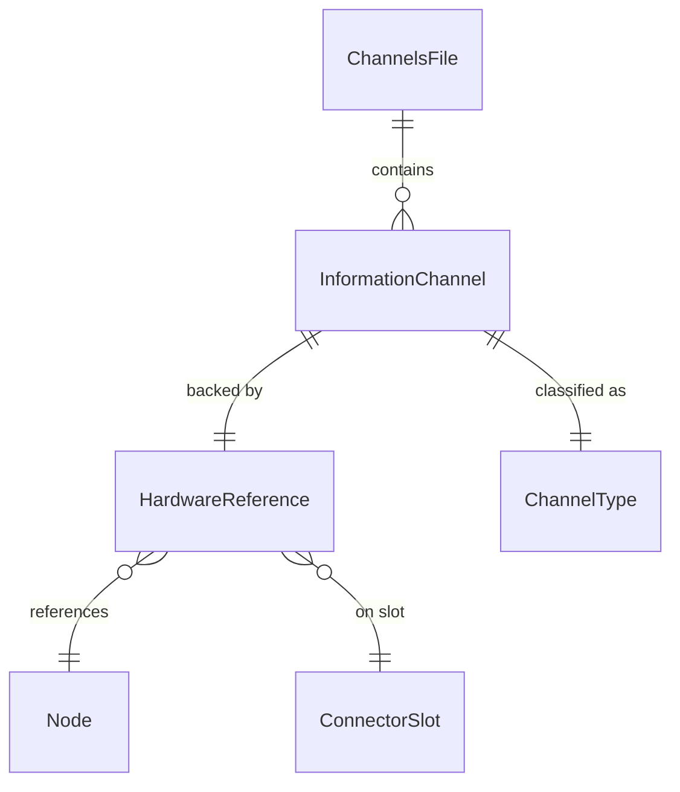
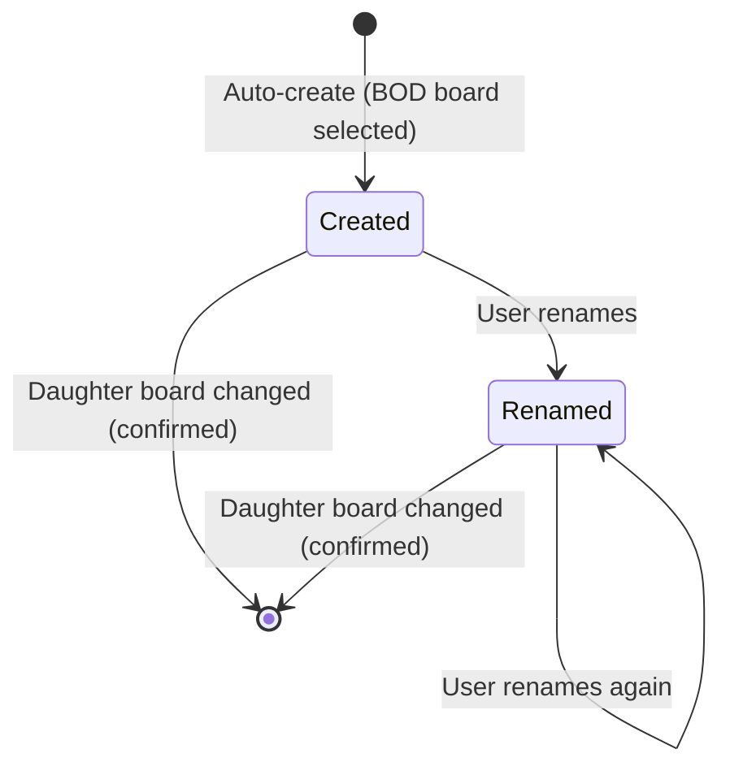

# Data Model: Information Channels — Auto-Create & Inventory

**Feature**: 015-information-channels  
**Date**: 2026-06-24

## Entities

### InformationChannel

A typed, named representation of a single piece of layout-meaningful information (e.g., "Block 7 Occupancy"). Channels are layout-level abstractions — never written to hardware nodes.

| Field | Type | Constraints | Description |
|-------|------|-------------|-------------|
| `id` | `String` (UUID v4) | Required, globally unique | Immutable channel identifier. Generated at creation time. |
| `name` | `String` | Required, non-empty | User-editable display name. Initialized to a default pattern; independently editable. |
| `channelType` | `ChannelType` enum | Required | Classification of the information this channel carries. |
| `hardwareRef` | `HardwareReference` | Required | Back-reference to the physical input that sources this channel. |
| `createdAt` | `String` (ISO 8601) | Required | Timestamp of channel creation (informational, not business logic). |

### HardwareReference

Links a channel to its backing hardware input on a specific node and connector.

| Field | Type | Constraints | Description |
|-------|------|-------------|-------------|
| `nodeKey` | `String` | Required | Canonical node key (NodeID hex or `placeholder:<uuid>`). Stable across sessions. |
| `slotId` | `String` | Required | Connector slot identifier (e.g., `"connector-a"`, `"connector-b"`). |
| `inputOrdinal` | `u32` | Required, 1-based | Physical input number on the daughter board (1–8). |

### ChannelType (Enum)

| Value | Display Name | Possible States | Description |
|-------|-------------|-----------------|-------------|
| `block-occupancy` | Block Occupancy | Occupied / Clear | A block occupancy detection input. Initially the only type. |

### ChannelsFile

Top-level persistence structure for `channels.yaml` in the layout folder.

| Field | Type | Constraints | Description |
|-------|------|-------------|-------------|
| `schemaVersion` | `String` | Required, `"1.0"` | Schema version for forward compatibility. |
| `channels` | `Map<String, InformationChannel>` | Default: empty | Keyed by channel `id` (UUID). |

## Relationships



- One `ChannelsFile` per layout (1:N channels).
- Each `InformationChannel` has exactly one `HardwareReference` (1:1).
- Multiple channels can reference the same node (N:1 node).
- Multiple channels can reference the same slot (N:1 slot), but each `inputOrdinal` within a slot is unique per channel (enforced at creation — one channel per physical input).

## State Transitions

### Channel Lifecycle



Channels have no complex state machine — they exist or they don't. The only mutations are creation (auto), rename (user), and deletion (on daughter board change with confirmation).

## Validation Rules

| Rule | Scope | Description |
|------|-------|-------------|
| Non-empty name | `InformationChannel.name` | Empty string rejected; previous name retained. |
| Unique input per slot | `HardwareReference` | No two channels may share the same `(nodeKey, slotId, inputOrdinal)` triple. Enforced at creation time. |
| Valid channel type | `InformationChannel.channelType` | Must be a recognized `ChannelType` enum value. |
| Valid node key format | `HardwareReference.nodeKey` | Must be a canonical node key (dotted hex or `placeholder:<uuid>`). |
| Valid slot ID | `HardwareReference.slotId` | Must match known connector slug pattern (`connector-a`, `connector-b`). |
| Input ordinal range | `HardwareReference.inputOrdinal` | Must be 1-based and within the daughter board's channel count. |

## Rust Types (bowties-core)

```rust
use std::collections::BTreeMap;
use serde::{Deserialize, Serialize};

pub const CHANNELS_SCHEMA_VERSION: &str = "1.0";

#[derive(Debug, Clone, Serialize, Deserialize)]
#[serde(rename_all = "camelCase")]
pub struct ChannelsFile {
    pub schema_version: String,
    #[serde(default)]
    pub channels: BTreeMap<String, InformationChannel>,
}

impl Default for ChannelsFile {
    fn default() -> Self {
        Self {
            schema_version: CHANNELS_SCHEMA_VERSION.to_string(),
            channels: BTreeMap::new(),
        }
    }
}

#[derive(Debug, Clone, Serialize, Deserialize)]
#[serde(rename_all = "camelCase")]
pub struct InformationChannel {
    pub name: String,
    pub channel_type: ChannelType,
    pub hardware_ref: HardwareReference,
    pub created_at: String,
}

#[derive(Debug, Clone, Serialize, Deserialize, PartialEq, Eq)]
#[serde(rename_all = "kebab-case")]
pub enum ChannelType {
    BlockOccupancy,
}

#[derive(Debug, Clone, Serialize, Deserialize)]
#[serde(rename_all = "camelCase")]
pub struct HardwareReference {
    pub node_key: String,
    pub slot_id: String,
    pub input_ordinal: u32,
}
```

## TypeScript Types (frontend)

```typescript
export interface InformationChannel {
  id: string;           // UUID v4
  name: string;
  channelType: ChannelType;
  hardwareRef: HardwareReference;
  createdAt: string;    // ISO 8601
}

export interface HardwareReference {
  nodeKey: string;      // Canonical node key
  slotId: string;       // "connector-a", "connector-b"
  inputOrdinal: number; // 1-based
}

export type ChannelType = 'block-occupancy';

export interface ChannelsFile {
  schemaVersion: string;
  channels: Record<string, InformationChannel>;
}
```

## Default Name Generation

When channels are auto-created, the default name follows the pattern:

```
{nodeName} — {connectorLabel} — Input {ordinal}
```

Examples:
- `"West Yard — Connector A — Input 1"`
- `"East Panel — Connector B — Input 8"`

Where:
- `nodeName` = the node's SNIP `user_name` (or fallback to model name / node ID)
- `connectorLabel` = human-readable form of the slot ID (`"connector-a"` → `"Connector A"`)
- `ordinal` = 1-based input number

This logic lives in `app/src/lib/utils/channelDefaults.ts` as a pure function.

## Persistence Format (channels.yaml)

```yaml
schemaVersion: "1.0"
channels:
  "a1b2c3d4-e5f6-7890-abcd-ef1234567890":
    name: "West Yard — Connector A — Input 1"
    channelType: block-occupancy
    hardwareRef:
      nodeKey: "05.01.01.01.03.00"
      slotId: connector-a
      inputOrdinal: 1
    createdAt: "2026-06-24T10:30:00Z"
  "b2c3d4e5-f6a7-8901-bcde-f12345678901":
    name: "Mainline Block 7"
    channelType: block-occupancy
    hardwareRef:
      nodeKey: "05.01.01.01.03.00"
      slotId: connector-a
      inputOrdinal: 2
    createdAt: "2026-06-24T10:30:00Z"
```
