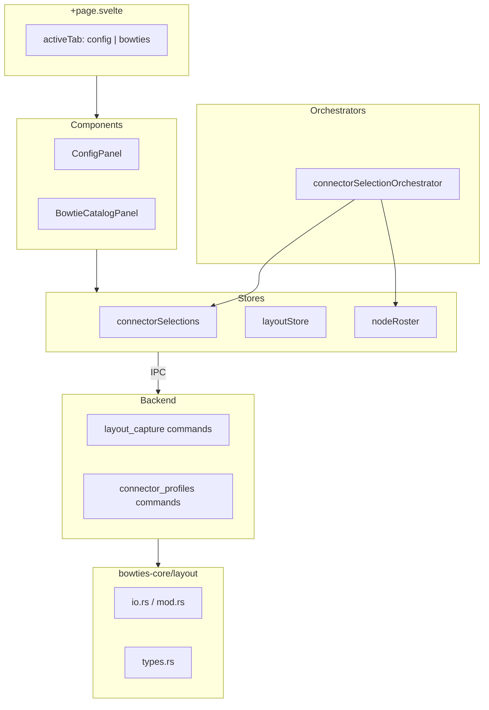
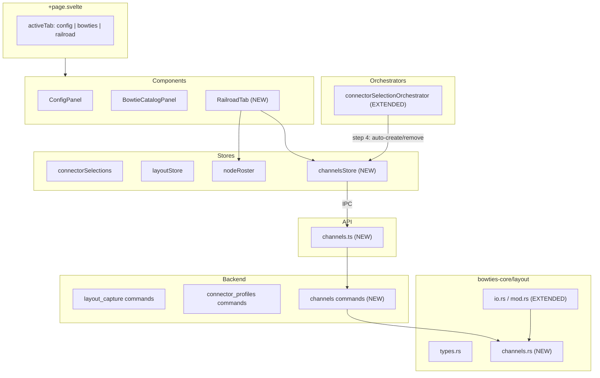

# Slices: Information Channels — Auto-Create & Inventory

Branch: 015-information-channels
Generated: 2026-06-24
Status: 6/6 slices complete

## Architecture

### Before

### After

### Patterns

- **Companion-file extension** — `channels.yaml` joins the existing per-concern file family (`bowties.yaml`, `manifest.yaml`, etc.) using the same journaled-write mechanism and read-capture/save-capture lifecycle.
- **Orchestrator step extension** — `connectorSelectionOrchestrator` gains a 4th step (channel auto-create/remove), extending an existing multi-step async workflow rather than creating a parallel one.
- **Store + IPC delta** — `channelsStore` follows the established pattern: frontend holds in-memory state, sends `LayoutEditDelta` variants to backend, backend persists. Same as bowties, offline changes, connector selections.

### Module Changes

| Module | Today | After |
|---|---|---|
| `+page.svelte` | Owns 2-tab union (`config \| bowties`) | Owns 3-tab union; adds Railroad tab rendering |
| `connectorSelectionOrchestrator` | 3-step flow: update slot → refresh tree → recompute compatibility | 4-step flow: adds channel auto-create/remove after compatibility |
| `channelsStore` | Does not exist | Owns channel inventory state; createChannels / renameChannel / deleteChannels mutations |
| `channels.ts` (API) | Does not exist | Typed Tauri invoke wrappers for channel CRUD |
| `RailroadTab/*` | Does not exist | Renders channel inventory grouped by type; inline rename |
| `channelDefaults.ts` | Does not exist | Pure default name generation helper |
| `channels.rs` (commands) | Does not exist | IPC boundary for channel CRUD; error translation |
| `channels.rs` (core) | Does not exist | `channels.yaml` read/write; domain types; CRUD logic |
| `bowties-core/layout/mod.rs` | Reads/writes layout files (manifest, bowties, snapshots, offline changes) | Additionally reads/writes `channels.yaml` in save/read capture |
| `bowties-core/layout/types.rs` | `LayoutEditDelta` with bowtie/offline variants | Adds `CreateChannel` / `RenameChannel` / `DeleteChannel` delta variants |
| `layoutLifecycleOrchestrator` | Resets layout-scoped stores on close | Additionally resets `channelsStore` on layout close |

### Behavior Summary

| Slice | User-visible change | Demoable? |
|---|---|---|
| S1: Railroad tab with stubbed channels | New Railroad tab button; clicking shows hardcoded channels grouped by type | Yes |
| S2: Backend channel persistence | Channels survive layout close/reopen | Yes |
| S3: Auto-create channels on BOD board selection | Selecting a BOD daughter board populates channels in Railroad tab | Yes |
| S4: Channel rename | Inline rename in Railroad tab; name persists | Yes |
| S5: Channel removal on board change | Confirmation dialog on board change; channels removed | Yes |
| S6: Lifecycle integration + empty state | Layout close clears channels; empty state guidance shown | Yes |

---

## Roadmap

| # | Slice title | Label | Blocked by | Status |
|---|---|---|---|---|
| S1 | Railroad tab with stubbed channels | HITL | None | done |
| S2 | Backend channel persistence | AFK | S1 | done |
| S3 | Auto-create channels on BOD board selection | HITL | S2 | done |
| S4 | Channel rename | AFK | S1 | done |
| S5 | Channel removal on board change | AFK | S3 | done |
| S6 | Lifecycle integration + empty state | AFK | S1 | done |

### S1: Railroad tab with stubbed channels [HITL]

**Intent**: User can click a new "Railroad" tab and see channel entries grouped by type (hardcoded data)
**Boundary**: Route → Component → Store → API → Backend command → Core (stub)
**Blocked by**: None
**Status**: done
**Complexity**: medium
**User stories**: US3 (Railroad Tab as Channel Inventory)

**Acceptance criteria**:
- [x] Railroad tab button appears as rightmost tab after Config and Bowties
- [x] Clicking Railroad tab renders stubbed channel entries grouped under "Block Occupancy" with count
- [x] Each channel row shows name, type, and hardware reference
- [x] Empty state guidance shown when no channels exist

**Architecture note**: Establishes the full vertical path end-to-end: IPC contract shape (`list_channels` → `InformationChannel[]`), `channelsStore` pattern, and component hierarchy (`RailroadPanel` → `ChannelGroup` → `ChannelRow`). Backend returns empty vec (real behavior for layout with no channels). Component tests verify grouped-rows rendering with test data.

**Decisions**:
- D1: Tab label "Railroad" (per spec vision — broader home for layout abstractions)
- D2: Backend stub returns empty vec (truthful behavior; component tests verify rows)
- D3: Domain types in `bowties-core/src/layout/channels.rs` (single owner, serde-shared)
- D4: Keyboard nav cycles all 3 tabs (Left/Right wrap)
- D5: Components in `Railroad/` folder (follows `Bowtie/` pattern)
- D6: Store hydrated on layout open (eager, matches existing stores)

**Tasks**:
- [x] S1-T1: Write integration test — Railroad tab renders, empty state shown, grouped channels render when store populated
- [x] S1-T2: Core types (`bowties-core/src/layout/channels.rs`) — `InformationChannel`, `ChannelType`, `HardwareReference` structs
- [x] S1-T3: Backend command (`app/src-tauri/src/commands/channels.rs`) — `list_channels` stub returning empty vec
- [x] S1-T4: API wrapper (`app/src/lib/api/channels.ts`) — `listChannels()` typed invoke
- [x] S1-T5: Store (`app/src/lib/stores/channels.svelte.ts`) — `channelsStore` with `loadChannels()`, `reset()`, reactive getters
- [x] S1-T6: Components (`app/src/lib/components/Railroad/`) — `RailroadPanel`, `ChannelGroup`, `ChannelRow`, empty state
- [x] S1-T7: Route integration (`+page.svelte`) — add Railroad tab button, 3-tab keyboard nav, conditional panel render
- [x] S1-T8: Validate — `vitest run` passes, `cargo test -p bowties-core` passes, tab renders in dev

### S2: Backend channel persistence [AFK]

**Intent**: Channels survive layout close/reopen — read from and written to `channels.yaml`
**Boundary**: Backend command → Core (`channels.rs`, `mod.rs`, `io.rs`)
**Blocked by**: S1
**Status**: done
**Complexity**: medium
**User stories**: US1 (persistent channel inventory), US3 (Railroad Tab)

**Acceptance criteria**:
- [x] Layout with `channels.yaml` on disk → channels appear in Railroad tab on open
- [x] Layout save writes `channels.yaml` with correct schema version and channel data
- [x] Layout without `channels.yaml` (pre-015) opens with empty channel list (no crash, no migration)

**Architecture note**: Follows the companion-file pattern (ADR-0005, ADR-0006). `io.rs` gains a `CHANNELS_FILE` constant and channels are included in `LayoutDirectoryReadData` / `LayoutDirectoryWriteData`. Read path tolerates missing file (backward compat). Write path goes through journal. Backend `list_channels` reads from active layout state instead of returning stub data. Partial update via `update_channels()` in `mod.rs` follows existing `update_offline_changes()` pattern.

**Tasks**:
- [x] S2-T1: Write integration test — round-trip: write channels → read_capture → verify; missing file → empty vec
- [x] S2-T2: Core persistence (`io.rs`) — add `CHANNELS_FILE` constant; extend `LayoutDirectoryWriteData` / `LayoutDirectoryReadData` with `channels: ChannelsDocument`; serialize in `write_layout_capture`; deserialize in `read_layout_capture` (tolerating missing file)
- [x] S2-T3: Core public API (`mod.rs`) — add `update_channels(layout_dir, doc)` and `read_channels(layout_dir)` for partial reads/writes via journal
- [x] S2-T4: Backend command (`channels.rs`) — replace stub with real read from active layout path via `AppState`
- [x] S2-T5: Validate — 316 bowties-core tests pass, Tauri app compiles clean, 1148 vitest pass

### S3: Auto-create channels on BOD board selection [HITL]

**Intent**: Selecting a BOD daughter board instantly populates matching channels in Railroad tab
**Boundary**: Profile YAML → Core profile types → Backend command → API → Orchestrator → Store
**Blocked by**: S2
**Status**: done
**Complexity**: large
**User stories**: US1 (persistent channel inventory), US2 (auto-create channels), US3 (Railroad Tab)

**Acceptance criteria**:
- [x] Select BOD-8-SM on connector-a → 8 block-occupancy channels appear with default names `"{nodeName} — Connector A — Input 1"` through `"… Input 8"`
- [x] Select BOD4 on connector-b → 4 channels appear (only detection-half pins 1-4)
- [x] Railroad tab updates immediately without manual refresh
- [x] Channels persist across layout save/reopen

**Architecture note**: Extends `connectorSelectionOrchestrator` with a 4th step (channel auto-create). Profile YAML gains `metadata.channelInputs` — a pin-to-template capability mapping per board (e.g., `channelType: block-occupancy, inputs: [1,2,3,4]`). This is a capability declaration, not a creation instruction: S3 auto-creates for all listed inputs; future single-pin assignment will use the same data to present available templates per pin. Frontend owns display naming (`channelDefaults.ts`) and UUID generation; backend is a persistence boundary.

**Decisions** (approved 2026-06-24):
- D1: `metadata.channelInputs` per board in YAML — pin-to-template capability map (supports future multi-template pins)
- D2: Frontend constructs full `InformationChannel[]` (names, IDs, hardwareRef) and sends to backend (ADR-0005)
- D3: Frontend generates UUID v4 via `crypto.randomUUID()`
- D4: S3 is additive only — re-selection appends; S5 handles removal + confirmation
- D5: Read slot `label` from `ConnectorProfileView.slots[]` for display names

**Tasks**:
- [x] S3-T1: Write integration test — orchestrator auto-creates channels when BOD board selected; `channelDefaults` generates correct names; backend persists
- [x] S3-T2: Core profile types (`bowties-core/src/profile/types.rs`) — add `ChannelInputMapping` struct (`channel_type: String`, `inputs: Vec<u32>`); add `channel_inputs: Vec<ChannelInputMapping>` to `DaughterboardMetadata`
- [x] S3-T3: Thread `channelInputs` to frontend — add field to `SupportedDaughterboard` in `node_tree.rs`; populate in profile build (`profile/mod.rs`); add to `DaughterboardView` in `connectorProfile.ts`; update profile YAML (BOD4, BOD4-CP, BOD-8-SM) with `channelInputs` entries
- [x] S3-T4: Backend command (`app/src-tauri/src/commands/channels.rs`) — `create_channels` that appends channels to `channels.yaml` via `update_channels`
- [x] S3-T5: API wrapper (`app/src/lib/api/channels.ts`) — `createChannels(channels: InformationChannel[])`
- [x] S3-T6: Channel defaults util (`app/src/lib/utils/channelDefaults.ts`) — `generateDefaultChannelName(nodeName, slotLabel, inputOrdinal): string` pure function + tests
- [x] S3-T7: Orchestrator step 4 (`connectorSelectionOrchestrator.ts`) — after compatibility, look up selected board's `channelInputs`; for each mapping generate channels with default names; call `createChannels` API; update `channelsStore`
- [x] S3-T8: Validate — bowties-core 316 tests pass, vitest 1157 pass, Tauri compiles clean

### S4: Channel rename [AFK]

**Intent**: User can inline-rename a channel; name persists across sessions
**Boundary**: Component → Store → API → Backend command → Core
**Blocked by**: S1
**Status**: done
**Complexity**: medium
**User stories**: US1 (persistent channel inventory), US3 (Railroad Tab)

**Acceptance criteria**:
- [x] Click channel name → edit inline → Enter → new name displayed immediately
- [x] Empty name rejected; previous name retained
- [x] Close and reopen layout → renamed channel retains user-assigned name with 100% fidelity

**Architecture note**: Follows the same draft-layer pattern as channel creations (ADR-0012). Store tracks renames in `_pendingRenames: Map<id, newName>`; the `channels` getter applies renames over baseline + creations. At save time, pending renames are flushed via a new `rename_channel` backend command. Component inline-edit reuses the BowtieCard pattern: local `$state` for edit mode, `onRename` callback prop emitting intent to parent.

**Tasks**:
- [x] S4-T1: Write tests — store rename mutation (happy path, empty rejection, dirty tracking, discard, hydrateBaseline clears); backend round-trip (rename persists in channels.yaml); component inline edit (enter commits, escape cancels, empty rejected)
- [x] S4-T2: Backend command (`app/src-tauri/src/commands/channels.rs`) — `rename_channel(id, new_name)` reads channels.yaml, finds channel by ID, updates name, writes via journal
- [x] S4-T3: API wrapper (`app/src/lib/api/channels.ts`) — `renameChannel(id: string, newName: string)`
- [x] S4-T4: Store (`app/src/lib/stores/channels.svelte.ts`) — add `_pendingRenames` map, `renameChannel(id, newName)` method, extend `isDirty`/`editCount`/`channels` getter/`discard()`/`hydrateBaseline()`
- [x] S4-T5: Component (`app/src/lib/components/Railroad/ChannelRow.svelte`) — inline edit: `isEditingName` state, `onRename` callback prop, focus/select on start, commit on blur/Enter, cancel on Escape, reject empty
- [x] S4-T6: Save flush (`app/src/routes/+page.svelte`) — after pending creation flush, loop pending renames and call `renameChannel` API, then hydrate baseline
- [x] S4-T7: Validate — `vitest run` passes, `cargo test -p bowties-core` passes, rename persists across save/reopen

### S5: Channel removal on board change [AFK]

**Intent**: Changing/clearing a daughter board warns and removes associated channels
**Boundary**: Route → Component → Orchestrator → Store → API → Backend command
**Blocked by**: S3
**Status**: done
**Complexity**: medium
**User stories**: US1 (persistent channel inventory), US2 (auto-create channels)

**Acceptance criteria**:
- [x] Change BOD-8 to BOD4 → confirmation dialog ("Changing the daughter board will remove 8 channels. Continue?")
- [x] Confirm → old 8 channels removed, 4 new channels created
- [x] Cancel → daughter board selection reverted, channels unchanged
- [x] Change to non-BOD board → channels removed (after confirm), no new channels created

**Architecture note**: Confirmation dialog uses the BowtieCatalogPanel inline-state pattern (local state machine in route handler). Route checks for affected channels BEFORE calling orchestrator; on confirm the orchestrator's step 4 removes old channels then creates new ones. Deletion is draft-layer (ADR-0012): `_pendingDeletions` for baseline channels, direct removal for pending creations. Backend `delete_channels` command added for save flush (same pattern as `create_channels` / `rename_channel`).

**Tasks**:
- [x] S5-T1: Write tests — store `deleteChannels` mutation (baseline → pendingDeletions, pending → removed from creations, isDirty/editCount/discard/hydrate); orchestrator step 4 removes old channels before creating new; backend `delete_channels` removes from channels.yaml
- [x] S5-T2: Backend command (`app/src-tauri/src/commands/channels.rs`) — `delete_channels(ids: Vec<String>)` reads channels.yaml, filters out matching IDs, writes via journal
- [x] S5-T3: API wrapper (`app/src/lib/api/channels.ts`) — `deleteChannels(ids: string[]): Promise<void>`
- [x] S5-T4: Store (`app/src/lib/stores/channels.svelte.ts`) — add `_pendingDeletions` set; `deleteChannels(ids)` method (removes from pending creations or tracks baseline deletions); update `channels` getter, `isDirty`, `editCount`, `pendingDeletions`, `discard()`, `hydrateBaseline()`
- [x] S5-T5: Orchestrator (`connectorSelectionOrchestrator.ts`) — extend step 4: before auto-creating, delete channels matching the slot being changed via `channelsStore.deleteChannels(ids)`
- [x] S5-T6: Route integration (`+page.svelte`) — add confirmation dialog state; `handleConnectorSelectionChange` checks for affected channels; shows dialog; on confirm proceeds with orchestrator; on cancel no-ops; save flush calls `deleteChannels` API for pending deletions
- [x] S5-T7: Validate — `vitest run` passes, `cargo test -p bowties-core` passes, board change with confirm removes old channels and creates new ones

### S6: Lifecycle integration + empty state [AFK]

**Intent**: Layout close clears channels; empty Railroad tab shows guidance
**Boundary**: Orchestrator (lifecycle) → Store → Component
**Blocked by**: S1
**Status**: done
**Complexity**: small
**User stories**: US3 (Railroad Tab as Channel Inventory)

**Acceptance criteria**:
- [x] Close layout → `channelsStore` is empty; Railroad tab shows empty state guidance
- [x] Open layout with no `channels.yaml` → empty state shown
- [x] Open layout with channels → channels displayed (no stale data from previous layout)

**Architecture note**: `layoutLifecycleOrchestrator.resetForNewLayout()` already resets all layout-scoped stores. Adding `channelsStore.reset()` follows the same pattern as existing stores (ADR-0011). The load path (`channelsStore.loadChannels()`) is already called on layout open (confirmed in +page.svelte line 223).

**Tasks**:
- [x] S6-T1: Write test — lifecycle orchestrator test verifies channelsStore.reset() is called during resetForNewLayout
- [x] S6-T2: Orchestrator (`layoutLifecycleOrchestrator.ts`) — add `channelsStore.reset()` to `resetForNewLayout()`
- [x] S6-T3: Validate — `vitest run` passes, layout close clears channels, re-open shows fresh state

<!-- Session: 2026-06-24 — Completed S1 (HITL). Next: S2 (AFK — backend channel persistence). All decisions approved as recommended. Full vertical path established: core types → backend command → API → store → components → route. 1153 tests green (1148 vitest + 3 core Rust + 313 bowties-core total). -->
<!-- Session: 2026-06-24 — Completed S2 (AFK). Next: S3 (HITL — auto-create on BOD selection). Channels now persist via journaled write (ADR-0006). `read_channels`/`update_channels` intent-shaped APIs added (ADR-0005). Backend stub replaced with real read from active layout. 316 bowties-core + 1148 vitest green. -->
<!-- Session: 2026-06-24 — Completed S3 (HITL). Next: S4 (AFK — channel rename). Key domain insight: channel templates are board-agnostic; channel instances are created by applying a template to hardware. Profile YAML gains `metadata.channelInputs` — a pin-to-template capability map (not a creation instruction). This supports future multi-template-per-pin selection. Orchestrator step 4 added to connectorSelectionOrchestrator (additive only; S5 handles removal). `ChannelInputMapping` struct added to Rust profile types. 316 bowties-core + 1157 vitest green. -->
<!-- Session: 2026-06-24 — Completed S4 (AFK). Next: S5 (AFK — channel removal on board change). Channels now support inline rename via draft layer (ADR-0012): store tracks pending renames, flush at save time via `rename_channel` backend command. Component follows BowtieCard pattern (local isEditingName state, onRename callback). Save flush refactored to capture pending state before hydration, then re-read from backend. 319 bowties-core + 1173 vitest green. -->
<!-- Session: 2026-06-25 — Completed S5+S6 (AFK). Feature complete — all 6/6 slices done. S5: channel deletion via draft layer (`_pendingDeletions`), orchestrator step 4 now removes old channels before creating new, route shows confirmation dialog before board change, backend `delete_channels` command added, save flush handles deletions. S6: `channelsStore.reset()` added to `layoutLifecycleOrchestrator.resetForNewLayout()`. 319 bowties-core + 1186 vitest green. -->
