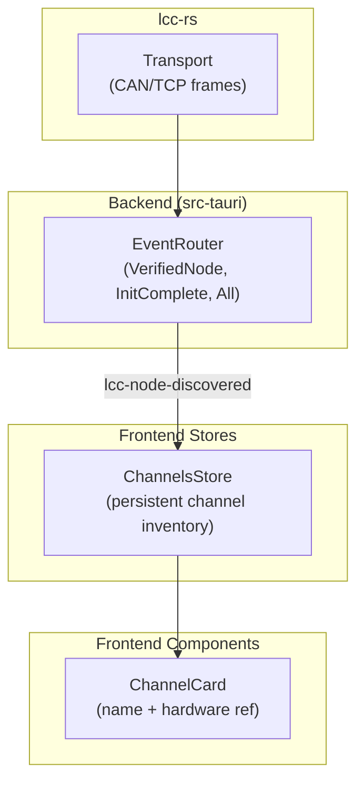
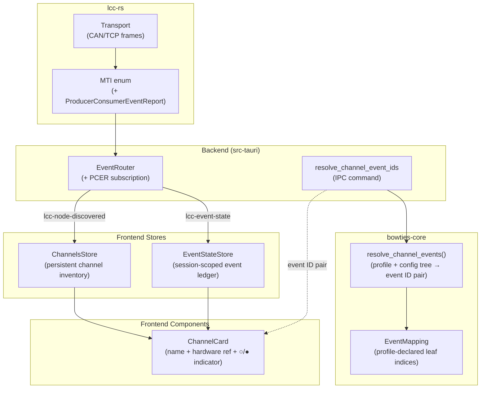

# Slices: Live Channel State — Event State Store & Occupancy Indicators

Branch: 016-live-channel-state
Generated: 2026-06-25
Status: 2/2 slices complete

## Architecture

### Before

### After

### Patterns

- **Channel-unaware event ledger** — the event state store records ALL PCER events by event ID with timestamps, independent of channel definitions. Channel state is derived at display time by joining the ledger with resolved event IDs.
- **Profile-declared event mapping** — board profiles declare which CDI producer event leaf indices map to which channel-type states (e.g., `occupied: producerLeafIndex 0`), keeping the resolution function generic.
- **Frontend-resolved event matching** — the backend forwards raw PCER events; the frontend calls a one-time IPC to resolve event IDs per channel, then matches locally. The backend stays stateless for channel-event correlation.

### Module Changes

| Module | Today | After |
|---|---|---|
| `lcc-rs/protocol/mti.rs` | No PCER MTI | Adds `ProducerConsumerEventReport` (0x195B4) |
| `bowties-core/profile/types.rs` | `ChannelInputMapping` has channel_type + inputs | Adds `EventMapping` (occupied/clear leaf indices) |
| `bowties-core` (new function) | — | `resolve_channel_events()`: hardware ref + profile + config tree → event ID pair |
| `app/src-tauri/events/router.rs` | Subscribes to VerifiedNode, InitComplete, All | Adds PCER subscription, emits `lcc-event-state` |
| `app/src-tauri/commands/` (new) | — | `resolve_channel_event_ids` IPC command |
| Profile YAML files | No `eventMapping` in channelInputs | Adds `eventMapping` to BOD-family channelInputs |
| `app/src/lib/stores/` (new) | — | `eventState.svelte.ts` — transient event ledger |
| `app/src/lib/components/Railroad/ChannelCard.svelte` | Name + hardware ref label | Adds ○/● occupancy indicator |

### Behavior Summary

| Slice | User-visible change | Demoable? |
|---|---|---|
| S1: Live occupancy indicators | Channel rows show real-time ○/● occupancy indicators from LCC bus events; retroactive state for late-defined channels | Yes |
| S2: Lifecycle and edge cases | Indicators clear on disconnect, start fresh on reconnect, degrade gracefully for placeholder nodes and unloaded configs | Yes |

---

## Roadmap

The ordered slice set. An overview table for at-a-glance scanning, followed by one **roadmap card** per slice. `/build` appends a task breakdown to a card when it implements that slice; it does not pre-author tasks.

| # | Slice title | Label | Blocked by | Status |
|---|---|---|---|---|
| S1 | Live occupancy indicators | HITL | None | done |
| S2 | Lifecycle and edge cases | AFK | S1 | done |

### S1: Live occupancy indicators [HITL]

**Intent**: Block-occupancy channel rows in the Railroad tab show real-time ○/● indicators reflecting live bus state, including retroactive state for channels created after events arrive.
**Boundary**: lcc-rs → Backend EventRouter → Backend command → bowties-core domain → Profile YAML → Frontend store → Frontend component
**Blocked by**: None
**Status**: done

**Acceptance criteria**:
- [ ] Each block-occupancy channel row displays a three-state indicator: ○ hollow (unknown), ● teal-green (clear), or ● vermillion (occupied)
- [ ] State updates within ~100ms of PCER event arrival (no perceptible lag)
- [ ] All three states are distinguishable without relying solely on color (shape + size + color)
- [ ] Each indicator shows a tooltip describing the state on hover
- [ ] Channels created after PCER events are already received show the correct state without waiting for new events (retroactive)

**Architecture note**: Establishes three new patterns: (1) PCER MTI subscription in the backend EventRouter, extending the existing MTI dispatch pattern; (2) profile-declared event-leaf mapping resolved via `bowties-core` domain function; (3) a transient, channel-unaware event state store on the frontend — the first instance of live bus state driving UI outside the traffic monitor. Needs review because the event pipeline and store are foundational infrastructure for future channel types.

**Decisions (approved)**:
- D1: Event mapping as map schema (`HashMap<String, EventMappingEntry>`) matching spec YAML
- D2: Minimal `lcc-event-state` payload: `{ eventId, timestamp }` only
- D3: New `eventStateOrchestrator.ts` owns event listener lifecycle + batch event ID resolution
- D4: ChannelCard receives `occupancyState` prop — derivation in RailroadPanel via utility
- D5: Batch IPC for event ID resolution (one call per channel-list change)

**Complexity**: Medium-high — crosses all layers, establishes new patterns
**User stories**: US1 (live indicator), US2 (retroactive state)

**Tasks**:
- [x] S1-T1: Integration test — ChannelCard renders occupancy indicator with correct states (RED)
- [x] S1-T2: `lcc-rs` — Add `ProducerConsumerEventReport` MTI variant (0x195B4) with unit test
- [x] S1-T3: `bowties-core` — Add `EventMapping` type + `event_mapping` field on `ChannelInputMapping`
- [x] S1-T4: `bowties-core` — Implement `resolve_channel_event_ids()` pure function with unit tests
- [x] S1-T5: Backend — Add PCER subscription to EventRouter, emit `lcc-event-state` Tauri event
- [x] S1-T6: Backend — Add `resolve_channel_event_ids` IPC command (batch)
- [x] S1-T7: Profile YAML — Add `eventMapping` to BOD-family `channelInputs`
- [x] S1-T8: Frontend — Create `eventStateStore` (transient: eventId → timestamp)
- [x] S1-T9: Frontend — Create `deriveChannelState()` utility function with unit test
- [x] S1-T10: Frontend — Create `eventStateOrchestrator` (subscribe events, batch-resolve IDs)
- [x] S1-T11: Frontend — Add `occupancyState` prop to ChannelCard + indicator rendering
- [x] S1-T12: Frontend — Wire RailroadPanel to pass derived states via ChannelGroup → ChannelCard
- [x] S1-T13: Route — Wire `startEventStateListening()` on connect, `$effect` to resolve event IDs when channels + trees change, pass `resolvedEventIds` to RailroadPanel
- [x] S1-T14: Validation — all tests green, end-to-end data flow verified

### S2: Lifecycle and edge cases [AFK]

**Intent**: Indicators clear on disconnect, start fresh on reconnect, degrade gracefully for placeholder nodes and unloaded configs.
**Boundary**: Frontend store → Frontend orchestration (lifecycle resets) → Frontend component (already in place)
**Blocked by**: S1
**Status**: done

**Acceptance criteria**:
- [x] All channel indicators show ○ hollow (unknown) when disconnected from the bus
- [x] On reconnect, event store starts fresh — no stale state from the previous session
- [x] Channels on nodes without loaded config show ○ (unknown), not an error
- [x] Placeholder node channels always show ○ (unknown)
- [x] Changing a connector's daughter board recomputes event ID mapping for affected channels

**Architecture note**: Of the five criteria, only #1 and #2 require new code — wire `eventStateStore.clear()` into the existing disconnect/connect lifecycle resets. Criteria #3, #4 already work because channels on placeholder/unloaded-config nodes never get resolved event IDs, so `deriveChannelState(events, undefined, undefined) → 'unknown'`. Criterion #5 already works because the route's `$effect` re-resolves event IDs whenever `channelsStore.channels` changes — which happens when a connector daughter board change reshapes the channel list.

The new clears go in three places matching the existing lifecycle-reset pattern (single concept: bus-session state ends, drop event ledger):

1. `layoutLifecycleOrchestrator.resetForFreshLiveSession()` — canonical reset enumeration per ADR-0011 (connect-side defense-in-depth)
2. The `clearLiveState` lambda in `+page.svelte` (disconnect without offline snapshots, plus `preserved_layout` branch)
3. The `rehydrateOffline` lambda in `+page.svelte` (disconnect with snapshots — bus state ends even though layout view continues)

Inline `eventStateStore.clear()` at each site rather than introducing a new "bus-session state" abstraction — only one store needs clearing today (YAGNI).

**Tasks**:
- [x] S2-T1: Test — `layoutLifecycleOrchestrator.resetForFreshLiveSession()` clears `eventStateStore` (RED)
- [x] S2-T2: Wire `eventStateStore.clear()` into `resetForFreshLiveSession()` (GREEN)
- [x] S2-T3: Test — `eventStateStore` is cleared when the route's `clearLiveState` callback runs (route-level integration test in `page.route.test.ts`)
- [x] S2-T4: Wire `eventStateStore.clear()` into the `clearLiveState` and `rehydrateOffline` lambdas in `+page.svelte` (GREEN)
- [x] S2-T5: Verify retroactive AC #3/#4/#5 are covered by existing tests (`channelState.test.ts` already covers `'unknown'` when event IDs undefined); add focused test if any path uncovered
- [x] S2-T6: Validation — full app test suite green; aiwiki/owners.md updated for the lifecycle integration

<!-- Session: 2026-06-25 — Completed S1. Next: S2 (AFK). Renamed ChannelRow→ChannelCard. All infrastructure + route wiring in place: PCER MTI, EventRouter subscription, event state store, deriveChannelState utility, resolve IPC command, ChannelCard indicator rendering, route $effect for resolution on channel/tree change, startEventStateListening on connect, resolvedEventIds passed to RailroadPanel. End-to-end data flow: PCER on bus → EventRouter → lcc-event-state → eventStateStore → deriveChannelState → ChannelCard indicator. -->
<!-- Session: 2026-06-26 — Completed S2. eventStateStore.clear() wired into layoutLifecycleOrchestrator.resetForFreshLiveSession() (connect-side) and the clearLiveState/rehydrateOffline lambdas in +page.svelte (both disconnect branches). AC#3/#4 covered by existing deriveChannelState behavior (returns 'unknown' when event IDs undefined — no resolution happens for placeholder/unloaded-config nodes). AC#5 covered by the existing $effect dep on channelsStore.channels — connector daughter-board change rebuilds the channels list which retriggers resolveChannelEventIds. Full suite 1219/1219 green. -->

