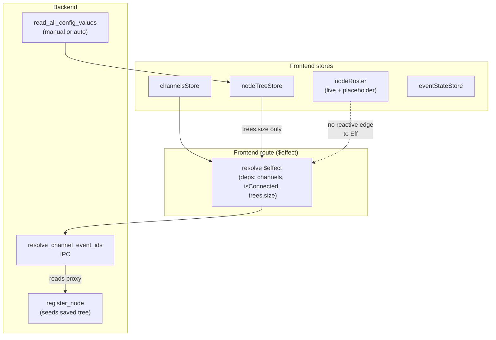
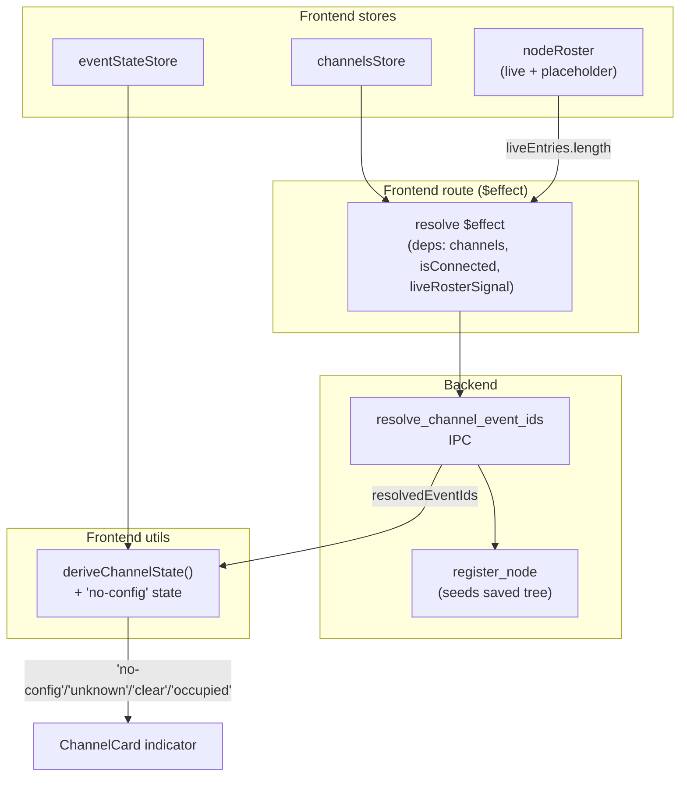

# Slices: Channel State on Connect — Eager Resolution & "No Config" Indicator

Branch: 017-channel-state-on-connect
Generated: 2026-06-26
Status: 3/3 slices complete

## Architecture

### Before

### After

### Patterns

- **Live roster as resolution boundary** — resolution depends on "does a live proxy exist for this channel's node?" The frontend signal that tracks that is `nodeRoster.liveEntries`. Using `trees.size` was a proxy that worked for fresh-CDI-read nodes but missed saved nodes whose proxies are seeded silently on register.
- **Four-state indicator** — `deriveChannelState()` distinguishes "we don't know what events to look for" (no-config) from "we know the events but nothing has happened" (unknown). The predicate falls out of the existing `resolvedEventIds` shape — no new data needed.

### Module Changes

| Module | Today | After |
|---|---|---|
| `app/src/routes/+page.svelte` — resolve `$effect` | Reads `trees.size > 0` as the discovery signal | Reads `liveEntries.length` (or equivalent signal) so re-resolves on each live node registration |
| `app/src/lib/utils/channelState.ts` | Returns `'unknown' \| 'clear' \| 'occupied'` | Adds `'no-config'` when neither event ID is resolvable for the channel |
| `app/src/lib/components/Railroad/ChannelCard.svelte` | Three visual states | Adds a fourth visual state with a slashed / question-marked icon + tooltip |
| `app/src/lib/components/Railroad/RailroadPanel.svelte` | Passes resolved state to ChannelCard | No change beyond propagating the new state value |

### Behavior Summary

| Slice | User-visible change | Demoable? |
|---|---|---|
| S1: Eager resolution on roster change | Channels on saved nodes go live immediately on connect — no manual CDI read required | Yes |
| S2: "No config data" indicator | Channels with unresolvable event IDs show a distinct icon + tooltip instead of generic ○ | Yes |

---

## Roadmap

| # | Slice title | Label | Blocked by | Status |
|---|---|---|---|---|
| S1 | Eager resolution on live roster change | AFK | None | done |
| S2 | "No config data" indicator state | AFK | S1 | done |
| S3 | Annotate saved trees at layout open | AFK | None | done |

### S1: Eager resolution on live roster change [AFK]

**Intent**: After connecting, occupancy indicators for channels on saved nodes go live as soon as each node is discovered and registered — independent of any CDI read on other nodes.
**Boundary**: Frontend stores (`nodeRoster`) → Frontend route (`$effect`) → Backend IPC (already works correctly).
**Blocked by**: None
**Status**: done

**Acceptance criteria**:
- [x] When a saved layout is opened and the user connects, channels on saved nodes show live state within ~1s of each owning node being registered — no `read_all_config_values` call required.
- [x] As each new live node is registered, the resolve effect re-runs and updates `resolvedEventIds`.
- [x] No regression in existing Spec 016 acceptance criteria (PCER events still flow, disconnect still clears, retroactive resolution still works).

**Architecture note**: This is a single-line conceptual fix (swap the reactive dep) wrapped in a real test that exercises the timing bug. The test must drive: layout-open with saved trees → connect → discovery arrives → assert resolve was called *after* discovery without any CDI read in between. The risk seam is reactivity correctness in Svelte 5 — read the live roster signal in a way that establishes a true reactive dep (the same load-bearing pattern Spec 016 used for `trees.size`).

**Tasks**:
- [x] S1-T1: Test — re-resolves channel event IDs after live node discovery without a CDI read (RED) — `page.route.test.ts`
- [x] S1-T2: Add `nodeRoster.liveEntries.length` as a reactive dep on the resolve `$effect`; condition becomes `(liveCount > 0 || treesCount > 0)` (GREEN)
- [x] S1-T3: Validation — run Spec 016 + 017 tests, no regression

### S2: "No config data" indicator state [AFK]

**Intent**: A channel whose event IDs cannot be resolved shows a visually distinct indicator (not the generic ○ "unknown") with a tooltip naming the cause.
**Boundary**: Frontend utils (`deriveChannelState`) → Frontend component (`ChannelCard` styling + tooltip).
**Blocked by**: S1 (so the new state is meaningful — once S1 lands, "no config" is the durable case for unbacked channels, not a transient connect-window glitch).
**Status**: done

**Acceptance criteria**:
- [x] `deriveChannelState()` returns a new `'no-config'` value when both `occupiedEventId` and `clearEventId` are undefined (regardless of event-store contents).
- [x] `ChannelCard` renders a visually distinct indicator for `'no-config'` — colorblind-safe (shape + color + tooltip), distinguishable from `'unknown'`.
- [x] Tooltip for `'no-config'` is meaningfully different from `'unknown'` (names "configuration not available," not "no events received").
- [x] Existing three states render unchanged in the same color/shape/tooltip as Spec 016.

**Tasks**:
- [x] S2-T1: Test — `deriveChannelState` returns `'no-config'` when both event IDs undefined (RED) — `channelState.test.ts`
- [x] S2-T2: Test — `ChannelCard` applies `.no-config` class and a configuration-naming tooltip (RED) — `ChannelCard.test.ts`
- [x] S2-T3: Extend `OccupancyState` union with `'no-config'` and update `deriveChannelState` precondition (GREEN)
- [x] S2-T4: Add `INDICATOR_TOOLTIP['no-config']`, `class:no-config`, and dashed-border CSS rule on `ChannelCard.svelte` (GREEN)
- [x] S2-T5: Validation — full app suite green (1223/1223)

### S3: Annotate saved trees at layout open [AFK]

**Intent**: After layout open, the trees stored in `node_registry.saved_trees` carry profile annotations (event_role + connector_profile + profile_applied flag). This is the missing piece behind S1: without `event_role`, `bowties_core::channel_events::find_producer_leaves` filters every leaf out and resolution returns empty for every channel — so indicators stay at `'no-config'` even though S1 fires the resolve IPC promptly.

**Boundary**: Backend layout open path (`app/src-tauri/src/commands/layout_capture.rs`).
**Blocked by**: None (depends on S1 for the user-visible benefit, but is independent code-wise).
**Status**: done

**Acceptance criteria**:
- [x] Backend regression test: `bowties_core::channel_events::resolve_channel_event_ids` returns empty for a tree whose producer leaves have `event_role: None` (documents the precondition that the fix must satisfy).
- [x] Trees stored in `saved_trees` by `open_layout_directory` have `profile_applied = true` and have `event_role = Some(Producer)` on producer event ID leaves.
- [x] When a saved BOD node is rediscovered live (without any CDI read), `resolve_channel_event_ids` IPC returns non-empty `occupied` / `clear` event IDs for that node's channels — to be verified by manual user test in the dev app.

**Architecture note**: Locality fix per the architecture-first analysis — annotate at the seam where the tree is created (`open_layout_directory`), not at every reader. `apply_profile_metadata_to_tree` already exists as `pub(crate)` in `cdi.rs` and is idempotent via `profile_applied` flag, so the existing `get_node_tree` fast-path won't double-annotate. Mode selections come from `loaded.bowties.selections_for_node(node_key)` directly (not via `active_node_mode_selections`) because `state.active_layout` isn't set yet at the saved-tree-building point in the open flow.

**Tasks**:
- [x] S3-T1: Test — `resolve_channel_event_ids` returns empty when producer leaves have `event_role: None` (regression contract) — [`bowties-core/src/channel_events.rs`](../../bowties-core/src/channel_events.rs)
- [x] S3-T2: Wire `apply_profile_metadata_to_tree` into the saved-tree loop in `open_layout_directory` before `set_saved_trees`, sourcing mode selections from `loaded.bowties` (GREEN)
- [x] S3-T3: Validation — `cargo build` + `cargo test --no-run` clean; bowties-core 331/331 green; frontend vitest 1223/1223 green; src-tauri test execution blocked by the pre-existing Windows DLL launch issue (`STATUS_ENTRYPOINT_NOT_FOUND`) documented in `/memories/repo/Bowties-src-tauri-test-dll-issue.md` — unrelated to this change. Manual user verification pending.

<!-- Session: 2026-06-26 (cont.) — Added S3 after S1 was empirically incomplete. Root cause: saved trees in node_registry.saved_trees were built without `apply_profile_metadata_to_tree`, so producer leaves lacked `event_role` annotations and `find_producer_leaves` filtered them out — resolve returned empty for every saved-node channel, indicators stayed at 'no-config' until a CDI read incidentally ran annotate_tree on the live proxy. Fix: call `apply_profile_metadata_to_tree` inside the saved-tree loop in `open_layout_directory`, sourcing mode selections from `loaded.bowties` (state.active_layout is not yet set at that point). Bowties-core regression test documents the precondition. -->

<!-- Session: 2026-06-26 — Completed S1 + S2. S1: route's resolve $effect now reads `nodeRoster.liveEntries.length` so it re-runs each time a live proxy is registered; saved nodes light up indicators on connect without any CDI read. S2: deriveChannelState distinguishes 'no-config' (neither event ID resolvable) from 'unknown' (resolved but no event seen); ChannelCard renders dashed-border + configuration-naming tooltip for 'no-config'. All Spec 016 acceptance criteria preserved. -->

