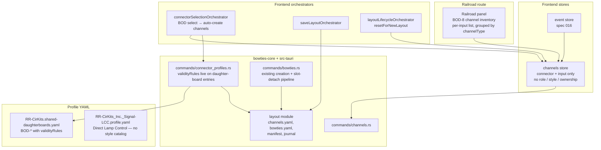

# Slices: Block Indicator Facility — Channels, LED Indicators, and the First Facility

Branch: 018-block-indicator-facility
Generated: 2026-06-28
Status: 9/9 slices complete

## Architecture

### Before

### After

```mermaid
flowchart TD
  subgraph Route[Railroad route]
    FacilitiesSection[Facilities section<br/>FacilityCard / FacilitySlot]
    ChannelsPanel[Channels panel<br/>hardware-organised: node → subsystem<br/>columns: role / style / ownership / binding / live]
  end

  subgraph Stores[Frontend stores]
    FacilitiesStore[facilities store<br/>draft layer per ADR-0012]
    TemplatesStore[behaviorTemplates store<br/>read-only registry mirror]
    ChannelsStore2[channels store<br/>role / style / ownership / binding]
    EffStore[effectiveLayoutStore<br/>+ facility status derivation<br/>Incomplete vs Wired]
    EventStore2[event store<br/>spec 016 — reused]
  end

  subgraph Orchestrators[Frontend orchestrators]
    FacOrch[facilityOrchestrator<br/>Add facility / Select-channel / Add-channel atomic /<br/>Incomplete↔Wired transition<br/>composes existing bowtie create + slot-detach]
    ConnOrch2[connectorSelectionOrchestrator<br/>BOD select → role/style/ownership/binding]
    SaveOrch2[saveLayoutOrchestrator<br/>+ facility deltas]
    LifecycleOrch2[layoutLifecycleOrchestrator<br/>+ facilities + behaviorTemplates in reset]
  end

  subgraph Utils[Frontend utils]
    FacStatus["facilityStatus<br/>pure slots → Incomplete or Wired"]
    StyleConstraints[styleConstraints<br/>style contract → CDI field render]
  end

  subgraph Backend2[bowties-core + src-tauri]
    LayoutMod2[layout module<br/>+ facilities.yaml read/write]
    BehaviorTemplates[behavior_templates registry<br/>Block Indicator template hardcoded]
    ChannelsCmd2[commands/channels.rs<br/>new schema; create_user_owned_channel]
    FacilitiesCmd[commands/facilities.rs<br/>CRUD + bind/unbind slot]
    TemplatesCmd[commands/behavior_templates.rs<br/>list_behavior_templates]
    ConnectorCmd2[commands/connector_profiles.rs<br/>BOD select → role/style/ownership]
    BowtiesCmd2[commands/bowties.rs<br/>existing pipeline + createdByFacility back-ref]
  end

  subgraph Profiles2[Profile YAML]
    SharedDB2[RR-CirKits.shared-daughterboards.yaml<br/>BOD-* with style id<br/>validityRules removed]
    SignalLCC2[RR-CirKits_Inc._Signal-LCC.profile.yaml<br/>lamp-indicator role +<br/>single-led-direct-lamp style +<br/>constraint contract on DLC rows]
  end

  FacilitiesSection --> FacOrch
  FacilitiesSection --> FacilitiesStore
  FacilitiesSection --> TemplatesStore
  FacilitiesSection --> EffStore
  ChannelsPanel --> ChannelsStore2
  ChannelsPanel --> EffStore

  FacOrch --> FacilitiesStore
  FacOrch --> ChannelsStore2
  FacOrch --> FacilitiesCmd
  FacOrch --> ChannelsCmd2
  FacOrch --> BowtiesCmd2
  FacOrch --> FacStatus

  ConnOrch2 --> ChannelsStore2
  ConnOrch2 --> ConnectorCmd2
  ConnectorCmd2 --> SharedDB2
  ConnectorCmd2 --> LayoutMod2

  SaveOrch2 --> LayoutMod2
  LifecycleOrch2 --> FacilitiesStore
  LifecycleOrch2 --> TemplatesStore
  LifecycleOrch2 --> ChannelsStore2
  EventStore2 --> ChannelsStore2
  EventStore2 --> EffStore

  StyleConstraints --> SignalLCC2
  StyleConstraints --> SharedDB2

  ChannelsCmd2 --> LayoutMod2
  FacilitiesCmd --> LayoutMod2
  TemplatesCmd --> BehaviorTemplates
  BowtiesCmd2 --> LayoutMod2
```

### Patterns

- **Pin → Channel → Facility layered binding model** — Channels are the only first-class binding entity. Facilities reference channels (not pins); pins are addressed only by channels.
- **Role / Style as Interface / Implementation duality** — Role is the state-vocabulary contract (e.g., `block-occupancy` = `unknown`/`occupied`/`clear`); Style is the hardware-shape realisation declared in profile YAML (e.g., `bod-block-detector-input`, `single-led-direct-lamp`). Slot binding is by role; styles are exchangeable within a role. See ADR-0013.
- **Ownership-driven channel lifecycle** — `hardware-owned` channels follow their backing hardware-config (BOD daughter-board selection); `user-owned` channels follow their single binding slot. No ref-counting in this slice.
- **Behavior Template as declarative composition** — A facility = template + slot bindings + name. Templates are registered in `bowties-core/behavior_templates` (Block Indicator only in this feature); future declarative loader is deferred.
- **Style-owned Constraint Contract** — The existing profile-driven validity/relevance renderer is unchanged; only the source of truth for constraints moves from daughter-board entries onto styles (ADR-0013, Finding F4). Replacement, not augmentation.
- **Facilities as UI veneer over bowties** — `facilityOrchestrator` composes the existing bowtie creation mechanism + slot-detach pipeline; bowties carry a `createdByFacility` back-reference for cleanup. No new sync, persistence, or deployment machinery.
- **Wired / Incomplete as derived status** — Pure function over slot fullness, joined in `effectiveLayoutStore` per ADR-0004. Never persisted; never stored on the facility entity.
- **Per-slice lifecycle reset enumeration** — Every slice that introduces a layout-scoped store adds it to `layoutLifecycleOrchestrator.resetForNewLayout()` in the same slice (Finding F3), not in a deferred lifecycle slice.

### Module Changes

| Module | Today | After |
|---|---|---|
| `bowties-core/src/layout/` | Reads/writes `channels.yaml`, `bowties.yaml`, manifest, journal | Adds `facilities.rs` for `facilities.yaml` read/write through existing journal |
| `bowties-core/src/channels/` | Channel = node + connector + input, default name | Channel = + `role` + `style` + `ownership` + discriminated `binding`; producer event-leaf mapping sourced from style |
| `bowties-core/src/behavior_templates/` | Does not exist | Hardcoded Block Indicator template registry (`mod.rs`) |
| `app/src-tauri/src/commands/channels.rs` | `list_channels` returns old shape | Returns new schema; new `create_user_owned_channel` for Add-channel flow |
| `app/src-tauri/src/commands/facilities.rs` | Does not exist | CRUD for facilities; bind/unbind slot |
| `app/src-tauri/src/commands/behavior_templates.rs` | Does not exist | `list_behavior_templates` returning the Block Indicator template |
| `app/src-tauri/src/commands/connector_profiles.rs` | BOD select → channel with connector+input | BOD select → channel with role/style/ownership/binding populated |
| `app/src-tauri/src/commands/bowties.rs` | Bowtie create + slot-detach pipeline | Same pipeline; bowties carry `createdByFacility` back-reference when created by `facilityOrchestrator` |
| `app/src-tauri/profiles/RR-CirKits.shared-daughterboards.yaml` | BOD-* `channelInputs` with `validityRules` on daughter-board entries | BOD-* `channelInputs` reference `bod-block-detector-input` style; `validityRules` removed (now on style) |
| `app/src-tauri/profiles/RR-CirKits_Inc._Signal-LCC.profile.yaml` | Direct Lamp Control rows declare `eventRoles` only | + `lamp-indicator` role + `single-led-direct-lamp` style + style constraint contract |
| `app/src/routes/+page.svelte` | Railroad tab shows BOD-8 channel inventory | Railroad tab gains Facilities section + restructured Channels panel; tab chrome refresh (S9, optional) |
| `app/src/lib/components/Railroad/` | `ChannelGroup` / `ChannelCard` grouped by channelType | Grouped by node + subsystem; columns include role / style / ownership / binding |
| `app/src/lib/components/Facilities/` | Does not exist | `FacilitiesSection`, `FacilityCard`, `FacilitySlot`, `AddFacilityDialog`, `SelectChannelPicker`, `AddChannelPicker` |
| `app/src/lib/stores/channels.svelte.ts` | connector + input shape | + role + style + ownership + binding; draft layer unchanged |
| `app/src/lib/stores/facilities.svelte.ts` | Does not exist | Facility CRUD + slot bindings (draft layer per ADR-0012) |
| `app/src/lib/stores/behaviorTemplates.svelte.ts` | Does not exist | Read-only registry mirror loaded from backend on app start |
| `app/src/lib/stores/effectiveLayoutStore...` | Existing merge derivations | + facility status derivation (Incomplete vs Wired) joined per ADR-0004 |
| `app/src/lib/orchestration/connectorSelectionOrchestrator.ts` | BOD channel auto-create with connector+input | Populates role/style/ownership/binding |
| `app/src/lib/orchestration/facilityOrchestrator.ts` | Does not exist | Add facility / Select-channel / Add-channel atomic / Incomplete↔Wired (creates/frees bowties via existing pipeline) |
| `app/src/lib/orchestration/saveLayoutOrchestrator.ts` | Collects channel + connector deltas | + facility deltas |
| `app/src/lib/orchestration/layoutLifecycleOrchestrator.ts` | Reset enumerates current layout-scoped stores | + facilities + behaviorTemplates in `resetForNewLayout()` (per-slice, not deferred) |
| `app/src/lib/utils/facilityStatus.ts` | Does not exist | Pure: slots → `Incomplete` \| `Wired` |
| `app/src/lib/utils/styleConstraints.ts` | Does not exist | Apply style constraint contract over CDI field render decisions |
| `lcc-rs/**` | Protocol library | **No changes** (facility / channel / role / style concepts stay out of `lcc-rs`) |

### Behavior Summary

| Slice | User-visible change | Demoable? |
|---|---|---|
| S1: Facility CRUD with empty slots (+ lifecycle reset wiring) | Add / rename / delete a Block Indicator facility with empty slots; layout round-trip | Yes |
| S1.1: Two-tier profile-test fixtures + bundled-profile smoke validation | Invariant preserved: equivalent test coverage for `build_connector_profile` and structure-profile YAML schema, reorganised into capability fixtures (owned by tests) + a shipping-profile validation harness. Reinstates the empty-affectedPaths-slot coverage S1 dropped to unblock cargo test. | No (REFACTOR) |
| S1.2: Restore ADR-0011: `effectiveNodeStore` as single dirty-derivation owner + rich Unsaved Changes dialog | Invariant restored (almost): Save / Discard toolbar buttons surface for any edit-bearing store; close-layout dialog returns to the rich count form ("N config edits across M nodes, 1 facility edit, …") instead of the bare "Unsaved Changes" message; closing with config-only edits prompts again. No new feature. | Yes (regression-fix demo) |
| S2: Channel schema + BOD retrofit (panel grouping unchanged) | Invariant preserved: BOD-8 inputs appear as today, but the persisted shape now carries role / style / ownership / binding | Yes (no-regression) |
| S3: Hardware-organised Channels panel + style-owned constraint contract | Restructured Channels panel with role / style / ownership / binding columns; daughter-board constraints sourced from the style (legacy `validityRules` removed) | Yes |
| S4: Select channel — bind a BOD channel to a facility input slot | Input slot filled via Select-channel picker; Channels panel binding column updates; Remove-from-slot reverses | Yes |
| S5: Lamp-indicator role + `single-led-direct-lamp` style + Add channel on output | Add channel on output slot → constraint-filtered lamp-row sub-picker → atomic create + claim row + bind; consumer channel appears with "last commanded on bus" live state | Yes |
| S6: Facility becomes Wired + end-to-end + retire Rebind | Last slot filled → Wired → bowtie composition (draft) → physical block toggles physical LED after Save; Remove-from-slot / Delete-facility / BOD-clear cascade tear down bowties in the draft layer. Rebind retired — Remove + Select/Add supersedes. | Yes (headline) |
| S7: Retire the Spec 015 BOD-8 channel inventory | Invariant preserved: BOD inputs visible only via the Channels panel and facility slots; legacy inventory disappears | No (REFACTOR) |
| S8: Iteration ergonomics *(optional)* | Polish across mixed-state save/reopen; cross-node rebinding; rename + restore across daughter-board reselects | Yes |
| S9: Top-level tab chrome refresh *(optional, orthogonal)* | Segmented button group → standard tab strip with underline-on-active; labels and ordering unchanged | Yes |

---

## Roadmap

The ordered slice set. The overview table is for at-a-glance scanning; each slice card below is the reviewable contract. `/build` appends a per-layer task breakdown to a card when it implements that slice; tasks are not pre-authored here.

| # | Slice title | Label | Blocked by | Status |
|---|---|---|---|---|
| S1 | Facility CRUD with empty slots (+ lifecycle reset wiring) | HITL | None | done |
| S1.1 | Two-tier profile-test fixtures + bundled-profile smoke validation | REFACTOR | S1 | done |
| S1.2 | Restore ADR-0011: `effectiveNodeStore` as single dirty-derivation owner + rich Unsaved Changes dialog | REFACTOR | S1 | done |
| S2 | Channel schema + BOD retrofit (panel grouping unchanged) | AFK | S1 | done |
| S3 | Hardware-organised Channels panel + style-owned constraint contract | HITL | S2 | done |
| S4 | Select channel — bind a BOD channel to a facility input slot | HITL | S3 | done |
| S5 | Lamp-indicator role + `single-led-direct-lamp` style + Add channel on output | HITL | S4 | done |
| S6 | Facility becomes Wired + end-to-end + retire Rebind | HITL | S5 | done |
| S7 | Retire the Spec 015 BOD-8 channel inventory | REFACTOR | S6 | sketched |
| S8 | Iteration ergonomics *(optional)* | HITL | S6 | sketched |
| S9 | Top-level tab chrome refresh *(optional, orthogonal)* | HITL | None | done |

### S1: Facility CRUD with empty slots (+ lifecycle reset wiring) [HITL]

**Intent**: User can add, rename, and delete a Block Indicator facility from the Railroad tab; the facility persists with empty slots and round-trips across save / close / reopen. (US1)
**Boundary**: Route → Component → Store → API → Backend (no `lcc-rs`). *Orchestrator deferred — single-step CRUD has no cross-store coordination; the `facilityOrchestrator` lands when S4 introduces slot binding (pending D2).*
**Blocked by**: None
**Status**: done
**Complexity**: large
**User stories**: US1 (Add / Rename / Delete a facility); FR-034 (release-notes / docs intro).

**Acceptance criteria**:
- [ ] Invoking "Add facility" prompts for a behavior template (Block Indicator listed) and a name; on confirm, a new facility appears in a Facilities section with status **Incomplete** and one empty slot per template-declared role.
- [ ] The Facilities section ships as plain functional UI — no "New" tag, banner, watermark, or per-row badge. Expectation-setting is delivered out-of-product via release notes and user docs (FR-034, FR-035).
- [ ] Each empty slot displays as empty (no channel name, no live state) and the slot's available operations adapt to current state (e.g., "no channels available — select a BOD daughter board to create some" when none exist).
- [ ] Rename updates the facility's name everywhere it appears; Delete removes the facility entirely (no channels yet exist to clean up).
- [ ] Saving, closing, and reopening the layout restores the facility, its template identity, slot structure with empty state, and name exactly. (SC-002)
- [ ] Release notes and `docs/user/` introduce facilities as evolving (FR-034).

**Architecture note** *(HITL — new seam)*: First contact with the **Facility / Behavior Template** model. Lands three load-bearing seams together: (a) the hardcoded behavior-template registry in `bowties-core/behavior_templates`, (b) the `facilitiesStore` (draft-layer per ADR-0012) plus the application-scoped `behaviorTemplatesStore`, and (c) per Finding F3, `facilitiesStore` enrols in `layoutLifecycleOrchestrator.resetForNewLayout()` in this slice (the templates store's reset participation is pending D4). The save path is fork-pending — D1 picks between the legacy split-IPC pattern that channels still use and a pure `LayoutEditDelta` extension. Review the four decisions below before build.

**Tasks** *(pending HITL decisions; recommended defaults assumed; will be revised if user picks differently)*:
- [x] S1-T1: **Integration test** — Vitest-level end-to-end exercising the full draft / save / close / reopen cycle for facilities: open a layout, add a Block Indicator named "Block 5", rename to "Block 7", save, close, reopen — assert the persisted facility has the right template, name, and both empty slots; then delete, save, reopen — assert gone. Pure frontend test backed by mocked or real backend per existing test harness conventions.
- [x] S1-T2: **bowties-core/src/behavior_templates** — new module: `BehaviorTemplate`, `SlotDefinition`, `SlotKind`, `StateMapping`, hardcoded `BLOCK_INDICATOR`, `registered_templates()` accessor; unit tests assert the registry contents.
- [x] S1-T3: **bowties-core/src/layout/facilities.rs** — mirror `channels.rs`: `FacilitiesDocument` with `schema_version` + `facilities`, `Facility` struct (UUID id, template id, name, `slot_bindings: BTreeMap<String, Option<String>>`), `read_facilities` / `update_facilities` through the journal; extend `LayoutDirectoryReadData` / `LayoutDirectoryWriteData`; unit tests for round-trip + missing-file → empty doc.
- [x] S1-T4: **bowties-core layout delta application** — *(if D1 = B)* extend the existing delta-applier with `AddFacility { facility }`, `RenameFacility { facility_id, new_name }`, `DeleteFacility { facility_id }`; unit tests for apply-on-empty, apply-on-existing, idempotent-delete.
- [x] S1-T5: **app/src-tauri/src/commands/behavior_templates.rs** — new `list_behavior_templates` IPC; register in `lib.rs` invoke handler.
- [x] S1-T6: **app/src-tauri/src/commands/facilities.rs** — `list_facilities` IPC reading the baseline document from the active layout; *(if D1 = A)* also `create_facility` / `rename_facility` / `delete_facility` mirroring `channels.rs`.
- [x] S1-T7: **app/src-tauri layout types** — *(if D1 = B)* `LayoutEditDelta` Rust mirror gains facility variants with serde derives; round-trip test against the TS shape.
- [x] S1-T8: **app/src/lib/types** — `Facility`, `BehaviorTemplate`, `FacilityStatus` interfaces; extend the TS `LayoutEditDelta` discriminated union (D1 = B).
- [x] S1-T9: **app/src/lib/api** — TS wrappers `listFacilities`, `listBehaviorTemplates`, and *(D1 = A only)* `createFacility` / `renameFacility` / `deleteFacility`.
- [x] S1-T10: **app/src/lib/stores/behaviorTemplates.svelte.ts** — read-only, application-scoped: `loadBehaviorTemplates()` once at app start; `templates` getter; tests.
- [x] S1-T11: **app/src/lib/stores/facilities.svelte.ts** — full draft-layer per ADR-0012: `_baseline`, `_pendingCreations`, `_pendingRenames`, `_pendingDeletions`; `addFacility(templateId, name)`, `renameFacility(id, name)` (no-op suppression), `deleteFacility(id)`; `facilities` getter; `isDirty`, `editCount`, `discard()`, `hydrateBaseline()`, `reset()`, `loadFacilities()`; *(D1 = B)* `collectDeltas(): LayoutEditDelta[]`; tests mirroring `channels.svelte.test.ts`.
- [x] S1-T12: **app/src/lib/orchestration/layoutLifecycleOrchestrator.ts** — enrol `facilitiesStore.reset()` in `resetForNewLayout()`; templates store per D4. Extend the orchestrator's test to assert both stores are cleared.
- [x] S1-T13: **app/src/routes/+page.svelte** save + load integration — call `loadBehaviorTemplates()` once at app start; call `loadFacilities()` in the layout-open path; *(D1 = B)* append `facilitiesStore.collectDeltas()` to the deltas array passed to `saveLayoutOrchestrated`; *(D1 = A)* mirror the channels post-save IPC sequence and call `loadFacilities()` afterwards. Include `facilitiesStore.isDirty` in the aggregate dirty signal that drives Save / Discard.
- [x] S1-T14: **app/src/lib/components/Facilities/** — `FacilitiesSection.svelte` (heading + Add facility button + list rendering; no "New" tag or other in-product expectation-setting chrome per D3), `AddFacilityDialog.svelte` (template picker — single option in this slice — + name input + validate), `FacilityCard.svelte` (name + Rename + Delete + status "Incomplete" derived locally), `FacilitySlot.svelte` (empty-state row with adaptive helper text per acceptance bullet 3). Components emit intent; the route wires handlers to `facilitiesStore`.
- [x] S1-T15: **Railroad tab integration** — mount `<FacilitiesSection>` above the existing BOD-8 channel inventory in the Railroad tab; no-facilities baseline behaviour unchanged.
- [x] S1-T16: **docs/user/** — new "Facilities (preview)" section in `docs/user/using.md` introducing facilities as an evolving feature subject to change (FR-034). Release-notes content is naturally deferred to the version that ships the working Block Indicator (S6+); the spec carries the FR-034 obligation forward.
- [x] S1-T17: **Validate** — `cargo test -p bowties-core` → 347 passed. `cd app/src-tauri && cargo test --no-run` → builds cleanly (test execution blocked by the known Windows DLL `STATUS_ENTRYPOINT_NOT_FOUND` issue documented in repo memory; not an S1 regression). `cd app && npm test` → 1272/1272 vitest tests passing. `npm run check` → 116 errors all pre-existing on main (verified by checking out the failing files from main and seeing identical content); none introduced by S1 or S1.2. Manual `npx tauri dev` UX smoke is the user's responsibility per the build-skill HITL pattern.

### S1.1: Two-tier profile-test fixtures + bundled-profile smoke validation [REFACTOR]

**Intent (invariant preserved)**: `build_connector_profile` and the structure-profile YAML schema retain equivalent test coverage, but reorganised into two tiers: capability-focused tests own their fixture inputs in `bowties-core/tests/fixtures/structure-profiles/`, and a separate validation harness iterates the shipping profiles under `app/src-tauri/profiles/` to ensure they parse and conform to the schema without coupling test assertions to product data. Also reinstates the empty-affectedPaths-slot coverage that S1 had to drop to unblock cargo test.
**Boundary**: `bowties-core/src/profile/` + `bowties-core/tests/` (new fixtures + new validation harness). No frontend changes; no shipping-profile changes.
**Blocked by**: S1
**Status**: done
**Complexity**: small
**User stories**: invariant restoration — equivalent coverage to the deleted `bundled_signal_profile_builds_aux_port_slot_without_governed_paths` test, restructured to remove the algorithm-vs-product-data coupling that orphaned it.

**Audit decisions (recorded ahead of T4 to inform reviewers)**:

| Existing test | Decision | Rationale |
|---|---|---|
| `bundled_tower_profile_builds_quickstart_connector_slots` | KEEP (legitimately bundled) | Asserts the QUICKSTART daughterboard set on the bundled Tower-LCC profile — a manufacturer-specific contract about a shipping profile, not a generic algorithm path. The test belongs *with* the data it validates. |
| `bundled_breakout_boards_do_not_add_line_constraints` | KEEP (legitimately bundled) | Same reasoning: validates a Tower-LCC-specific contract (breakout boards add no line constraints) against shipping data. |
| `bundled_detector_boards_constrain_producer_actions_per_replication` | KEEP (legitimately bundled) | Same reasoning: bundled Tower-LCC detector-board producer-action contract. |
| `s5_tower_lcc_v2_profile_declares_firmware_and_connector_modes` | KEEP (legitimately bundled) | The test is *about* the Tower-LCC v2 profile — it asserts the firmware-revision + two-connector mode declarations the shipping profile must contain. |
| `s5_tower_lcc_v2_parity_legacy_cdi` / `s5_tower_lcc_v2_parity_c7_cdi` | KEEP (legitimately bundled) | These validate the Tower-LCC `CdiSignature` selector against the two real firmware CDI shapes. The CDI fixtures are synthetic but the *signature contract* under test is intrinsic to the bundled Tower-LCC profile. |
| `captured_legacy_tower_lcc_cdi_builds_connector_profile` | KEEP (legitimately bundled) | The whole point of the test is that the bundled profile matches a real captured CDI — drift-detection between synthetic and real-hardware CDIs is its single responsibility. |

All six surviving `bundled_*` tests are **intentionally** about validating bundled data — they are not capability tests in disguise. The deleted test was different: its name claimed bundled validation but its real subject was the algorithm code path (empty `affectedPaths` slot), with the bundled profile picked as a convenient example. S1.1 reinstates that algorithm coverage as a capability test against a minimal fixture, and protects shipping profiles separately via a content-free schema-conformance harness.

**Tasks**:
- [x] S1.1-T1: **Capability test (RED)** — In `bowties-core/src/profile/mod.rs` `mod tests`, added `build_connector_profile_handles_empty_affected_paths_slot`: parses a tiny synthetic CDI, loads a minimal `StructureProfile` via `include_str!("../../tests/fixtures/structure-profiles/empty_affected_paths_slot.profile.yaml")`, calls `build_connector_profile(node_id, &profile, None, &cdi)` with no shared library, and asserts: exactly 1 slot built, `slot_id == "aux-port"`, `resolved_affected_paths.is_empty()`, supported_daughterboards contains `"SMD-8"`. Verified RED via `cargo build --tests` failing on the missing `include_str!` path.
- [x] S1.1-T2: **Capability fixture** — Created `bowties-core/tests/fixtures/structure-profiles/empty_affected_paths_slot.profile.yaml`: minimal v2 profile (`schemaVersion: "2.0"`) with `nodeType` (any), a single `ConfigurationMode` whose `selector` is `StructuralSlot { slotId: "aux-port", affectedPaths: [], allowNoneInstalled: true }`, and variants `__none__` + `SMD-8`. Capability test from T1 now passes.
- [x] S1.1-T3: **Bundled-profiles smoke harness** — New `bowties-core/tests/bundled_profiles_smoke.rs` (separate integration-test binary). Resolves the profiles directory via `env!("CARGO_MANIFEST_DIR")` + relative path and enumerates entries via `std::fs::read_dir`. For every `*.profile.yaml`, parses as `StructureProfile` and asserts `schema_version == "2.0"`. For every `*.shared-daughterboards.yaml`, parses as `SharedDaughterboardLibrary` and asserts `schema_version == "1.0"`. No content assertions beyond schema version. Two tests, both green against the three shipping profiles + one shared library.
- [x] S1.1-T4: **Validate** — `cd bowties-core; cargo test` → 348 lib tests (was 347, +1 capability) + 2 smoke harness tests all green. No shipping profile was modified by this slice.

**Architecture note** *(REFACTOR — new pattern)*: Introduces the **Capability fixture vs Shipping-profile validation** split. The current test that broke (`bundled_signal_profile_builds_aux_port_slot_without_governed_paths`) was cross-purpose: its *name* claimed to validate a bundled profile, its *assertions* exercised an algorithm code path (empty `affectedPaths` slot), and its *CDI fixture was synthetic*. Pinning that test at a shipping profile filename coupled an algorithm behaviour test to product data with its own lifecycle, so the upstream rename of `RR-CirKits_Signal-LCC-P.profile.yaml` orphaned the test. The two-tier split names the principle (SOLID single-responsibility for capability tests; DRY iteration for schema-conformance checks) so future profile-module tests follow the right side of the split by default. Resolves the architectural shortcoming exposed during S1's pre-implementation validation.

### S1.2: Restore ADR-0011: `effectiveNodeStore` as single dirty-derivation owner + rich Unsaved Changes dialog [REFACTOR]

**Intent (invariant restored)**: `effectiveNodeStore.isDirty` becomes the actual single aggregate of all edit-bearing stores (ADR-0011), and the SaveControls toolbar plus the close-layout / window-close prompts both consume the facade rather than re-deriving from raw stores. The close prompt regains the rich per-bucket counts ("3 config edits across 2 nodes; 1 facility edit; 2 channel renames…") that the current bare-message dialog lost. Closing with config-only edits prompts again (current regression: it doesn't).
**Boundary**: `app/src/lib/layout/` (extend facade) + `app/src/lib/components/ElementCardDeck/SaveControls.svelte` + `app/src/routes/+page.svelte` (consumer migration) + new `app/src/lib/components/UnsavedChangesDialog.svelte`. Delete `app/src/lib/stores/changeTracker.svelte.ts` + tests; inline / delete `app/src/lib/orchestration/unsavedChangesGuard.ts` and `app/src/lib/components/ElementCardDeck/saveControlsPresenter.ts` (or reduce to private formatters inside the facade).
**Blocked by**: S1
**Status**: done
**Complexity**: medium
**User stories**: invariant restoration — no new user story; closes regression exposed by S1 (FR-024 / SC-002 dirty-detection across all edit-bearing stores).

**Pre-impl verified state (cached 2026-06-28)**:
- `effectiveNodeStore.isDirty` *already* aggregates: `layoutStore`, `bowtieMetadataStore`, `configChangesStore` (via `draftEntries().length`), `offlineChangesStore` (drafts + reverted), `facilitiesStore`, `unsavedInMemoryNodeIds`, `unsavedRemovedNodeIds`. Missing: `channelsStore`, `connectorSelectionsStore`. So the close-prompt regression today is **channel/connector-only edits silently miss the prompt** (config-only already works through the aggregate; the slice card's per-node-iteration theory was partly redundant with the existing aggregate — the real gap is the missing two stores).
- `changeTrackerStore` has only its own test as caller — safe to delete.
- `hasUnsavedPromptChanges` per-node iteration is redundant with the aggregate it also checks; collapses to a direct `effectiveNodeStore.isDirty` read once channels/connectorSelections are wired in.
- `deriveSaveControlsViewState` does meaningful count/hint formatting; keep but feed from new `dirtyBreakdown` to remove duplicate "which stores to ask" knowledge.

**Tasks**:
- [x] S1.2-T1: **Integration test (RED)** — `app/src/lib/layout/dirtyAggregate.integration.test.ts`: with each edit-bearing store individually dirty (config draft / metadata edit / offline draft / offline reverted-persisted / facility add / channel rename / connector selection / unsaved-new node / unsaved-removed node), assert (a) `effectiveNodeStore.isDirty === true`, and (b) `effectiveNodeStore.dirtyBreakdown` reports the right bucket count and zeros elsewhere, and (c) a `hasUnsavedPromptChanges`-equivalent guard returns true. Includes the empty-state baseline. Must fail today for `channelsStore` and `connectorSelectionsStore` cases.
- [x] S1.2-T2: **effectiveNodeStore — add `dirtyBreakdown` + wire missing stores** — extend `effectiveNodeStore.svelte.ts` to import `channelsStore`, `connectorSelectionsStore`; add `get dirtyBreakdown(): DirtyBreakdown` returning `{ config, metadata, channels, facilities, connectorSelections, offlineDrafts, offlineRevertedPersisted, layoutStruct, unsavedNewNodes, unsavedRemovedNodes }`; refactor `get isDirty()` to derive from `dirtyBreakdown` (sum of all buckets > 0). Add `DirtyBreakdown` type export.
- [x] S1.2-T3: **effectiveNodeStore tests** — add to `effectiveNodeStore.svelte.test.ts` (or new `effectiveNodeStore.dirty.test.ts`): per-bucket unit tests for `dirtyBreakdown` and the derived `isDirty` covering each contributing store + empty baseline + mixed-multi-bucket case. Mirror existing test conventions.
- [x] S1.2-T4: **Facade export** — `app/src/lib/layout/index.ts` re-exports the new `DirtyBreakdown` type alongside `effectiveNodeStore`.
- [x] S1.2-T5: **UnsavedChangesDialog component** — new `app/src/lib/components/UnsavedChangesDialog.svelte` mirroring `DiscardConfirmDialog.svelte` a11y pattern (alertdialog, focus trap, Escape/Enter, z-index 1500). Props: `{ message: string; breakdown: DirtyBreakdown; confirmLabel: string; onConfirm: () => void; onCancel: () => void; }`. Body renders message + per-bucket count list ("3 config edits across 2 nodes, 1 facility edit, 2 channel renames, …"), suppressing zero-count buckets. Count-aware pluralisation via a small private formatter.
- [x] S1.2-T6: **UnsavedChangesDialog tests** — `app/src/lib/components/UnsavedChangesDialog.test.ts`: renders all populated buckets, suppresses zero buckets, "no changes" guard not needed (only mounted when dirty), Cancel/Confirm wire callbacks, Escape closes, Enter confirms.
- [x] S1.2-T7: **+page.svelte migration** — (a) replace inline `
` markup (L1735-1763) with `<UnsavedChangesDialog />`; extend `unsavedDialog` state to carry a `breakdown` snapshot. (b) simplify `promptUnsaved()` (L148-158) and the `onCloseRequested` handler (L942) to read `effectiveNodeStore.isDirty` + `effectiveNodeStore.dirtyBreakdown` directly — drop the `hasUnsavedPromptChanges` import. (c) keep the existing CSS rules for the dialog overlay scoped to the new component (move/copy as needed) or rely on the new component's own styles.
- [x] S1.2-T8: **saveControlsPresenter migration** — `deriveSaveControlsViewState` accepts a `DirtyBreakdown` (and `connectorWarningCount`, `saveProgressState`, `layoutIsOfflineMode` as before); derives counts from it. Update `SaveControls.svelte` to pass `effectiveNodeStore.dirtyBreakdown` instead of raw per-store reads. Update `saveControlsPresenter.test.ts` to construct breakdown fixtures.
- [x] S1.2-T9: **Delete dead modules** — delete `app/src/lib/stores/changeTracker.svelte.ts` + `.test.ts`; delete `app/src/lib/orchestration/unsavedChangesGuard.ts` + `.test.ts`. Verify no broken imports.
- [x] S1.2-T10: **ADR-0011 extension** — append `## 2026-06-28 extension: dirtyBreakdown and per-bucket aggregation` section codifying: every edit-bearing store MUST be wired into `effectiveNodeStore.dirtyBreakdown` in the same slice it lands; close/disconnect/exit prompts derive from the breakdown.
- [x] S1.2-T11: **aiwiki enrichment** — update `aiwiki/owners.md`: (a) `effectiveNodeStore` row gains `dirtyBreakdown` getter description and notes channels/connectorSelections inclusion; (b) `channels.svelte.ts` and `connectorSelections.svelte.ts` rows note `isDirty` feeds the aggregate; (c) `SaveControls.svelte` row updated to mention the breakdown source; (d) add `UnsavedChangesDialog.svelte` row; (e) remove the `unsavedChangesGuard` row and the (undocumented) `changeTrackerStore` reference if present.
- [x] S1.2-T12: **Validate** — `cd app && npm test`, `npm run check`, then manual UX smoke: edit a facility → toolbar Save/Discard appear, click Close → rich dialog shows "1 facility edit"; rename a channel → toolbar Save/Discard appear, click Close → dialog shows "1 channel rename"; mix → dialog enumerates each bucket.

**Acceptance criteria** *(invariants restored / extended)*:
- [ ] `effectiveNodeStore.isDirty` returns true for every edit-bearing store contributing drafts: `layoutStore`, `bowtieMetadataStore`, `configChangesStore`, `offlineChangesStore` (drafts and reverted-persisted), `channelsStore`, `connectorSelectionsStore`, `facilitiesStore`, plus `unsavedInMemoryNodeIds` / `unsavedRemovedNodeIds`. Adding a new edit-bearing store in a future spec requires extending this one place.
- [ ] `effectiveNodeStore.dirtyBreakdown` (new getter) exposes per-bucket counts the dialog and toolbar render from: `{ config, metadata, channels, facilities, connectorSelections, offline, layoutStruct, unsavedNewNodes, revertedPersisted }`.
- [ ] `SaveControls.svelte` consumes the facade snapshot — no direct reads from raw edit-layer stores. Toolbar Save / Discard buttons appear for facility-only, channel-only, config-only, connector-selection-only, and mixed edits. The "N unsaved changes" hint sums all buckets.
- [ ] `+page.svelte` `promptUnsaved()` and the window-close handler consume the facade snapshot. Closing the layout with **config-only** unsaved changes prompts the user (current regression: it doesn't, because `hasUnsavedPromptChanges` per-node-iterates `nodeTreeStore.trees.keys()` against `configChangesStore.hasDraftsForNode(...)` and silently misses when the key shapes diverge).
- [ ] New `UnsavedChangesDialog.svelte` renders message + confirm / cancel + per-bucket breakdown ("3 config edits across 2 nodes; 1 facility edit; 2 channel renames…"). Replaces the inline `
` in `+page.svelte`.
- [ ] `changeTrackerStore` deleted; `hasUnsavedPromptChanges` and `deriveSaveControlsViewState` either deleted or reduced to private formatters inside the facade.
- [ ] All previously-passing tests pass after the migration; new tests cover the `dirtyBreakdown` shape across every contributing bucket + the `UnsavedChangesDialog` rendering.

**Architecture note** *(REFACTOR — invariant restoration)*: ADR-0011 named `effectiveNodeStore.isDirty` as the aggregate "any in-memory change" signal across the three layout layers (in-memory drafts / saved baseline / on-bus state) and the `$lib/layout/` facade (ADR-0004) as the single import surface. The implementation never delivered on that promise: `channelsStore` (spec 015) and `connectorSelectionsStore` (spec 014) landed without being wired into the aggregate; `SaveControls.svelte` re-derived locally via `deriveSaveControlsViewState`; a parallel `changeTrackerStore` was built as an alternate consolidation point and never adopted (its only callers are its own tests); the close-prompt predicate `hasUnsavedPromptChanges` partly leans on the partial `effectiveNodeStore.isDirty` and partly per-node-iterates `nodeTreeStore.trees.keys()` against `configChangesStore.hasDraftsForNode(...)` — which silently misses today, causing the no-dialog-on-config-only-close regression S1 exposed. This slice restores the ADR-0011 invariant by making the facade fully own the question, deleting the parallel paths, and adding an ADR extension that codifies the rule: **every new edit-bearing store MUST be wired into `effectiveNodeStore.dirtyBreakdown` in the same slice it lands**, structurally preventing the next recurrence.

**Post-implementation enrichment** (mandatory for this slice):
- Extend ADR-0011 with a dated section codifying the single-owner rule and the `dirtyBreakdown` contract.
- Update `aiwiki/owners.md` for `effectiveNodeStore` (new getters) and `$lib/layout` index (new exports). Remove the `changeTrackerStore` row. Remove the standalone `saveControlsPresenter` / `unsavedChangesGuard` rows if those modules are deleted.

### S2: Channel schema + BOD retrofit (panel grouping unchanged) [AFK]
**Intent**: Schema lands with its first read path — BOD-8 inputs continue to appear in the existing Railroad inventory exactly as today, but every channel now carries `role` / `style` / `ownership` / `binding` end-to-end (in store, on the wire, on disk). User-visible behavior is identical until S3 surfaces the new columns.
**Boundary**: Component → Store → API → Backend (+ `bowties-core` schema; no `lcc-rs`).
**Blocked by**: S1
**Status**: done
**Complexity**: medium
**User stories**: schema invariant for US2/US3 (no direct user story; load-bearing for S3+).

**Acceptance criteria**:
- [x] Selecting a BOD-family daughter board on a TowerLCC connector continues to produce 8 entries in the existing channel inventory with the same default names and the same rename behavior as before.
- [x] Layouts saved after this slice carry the new schema (`role: block-occupancy`, `style: bod-block-detector-input`, `ownership: hardware-owned`, `binding` populated) and round-trip without loss.
- [x] Producer event-leaf mapping (occupied/clear) is sourced from the style definition; behavior at the bus level is unchanged.
- [x] The existing RailroadPanel grouping and styling are unchanged; the new fields are populated but not yet surfaced as columns.

**Architecture note** *(new seam — schema)*: Even though there is no UX change, this slice lands the ADR-0013 channel schema. The persisted shape is load-bearing for every downstream slice — per Finding F1, the schema arrives **with its first read path** rather than in a horizontal pre-slice.

**Scope clarifications** (locked in at task expansion, 2026-06-28):
- Per ADR-0013, `channelType` and `hardwareRef` are **retired in this same change set** as `role` / `style` / `ownership` / `binding` land. No backward-compat reader; no migration. Schema bumps from `"1.0"` to `"2.0"`. Pre-018 layouts that already shipped a channels.yaml will fail to load (acceptable per FR-009 — pre-1.0).
- S2 **does NOT** migrate channels to the LayoutEditDelta save pattern. The existing post-save IPC sequence (`createChannels` / `renameChannel` / `deleteChannels` in `+page.svelte`) keeps working — only the on-wire shape changes. Delta-pattern migration is its own slice if/when needed.
- S2 **does NOT** introduce a top-level `styles:` section in profile YAML. The minimum to satisfy "event-leaf mapping sourced from the style definition" is a small frontend style registry (`channelStyles.ts`) keyed by style id; the YAML gains only a `style: "bod-block-detector-input"` field on each `channelInputs` entry so the orchestrator can populate it without hardcoding. S3 reorganises the YAML when `validityRules` move.
- In S2 only the `connectorInput` binding variant and the `block-occupancy` role and the `bod-block-detector-input` style exist. The `lampRow` variant, `lamp-indicator` role, and `single-led-direct-lamp` style land in S5.

**Tasks**:
- [x] S2-T1: **Integration test (RED)** — Extend `app/src/routes/page.route.test.ts` (or add a focused new test that mounts the route in the same harness pattern) to cover the end-to-end: open a layout with no channels, select a BOD-family daughterboard on a TowerLCC slot, assert 8 channels appear with `role: 'block-occupancy'`, `style: 'bod-block-detector-input'`, `ownership: 'hardware-owned'`, `binding: { kind: 'connectorInput', nodeKey, connector, input }` and the same default names as Spec 015. Save, close, reopen the layout — assert the same 8 channels are still present with identical shape (no field loss). Will fail at compile time today on the missing fields.
- [x] S2-T2: **bowties-core/src/layout/channels.rs schema** — Replace `ChannelType` enum (BlockOccupancy) with new `ChannelRole` enum (`#[serde(rename_all = "kebab-case")]`, single variant `BlockOccupancy` in S2). Add `ChannelOwnership` enum (`HardwareOwned`, `UserOwned`). Add `ChannelBinding` discriminated union (`#[serde(tag = "kind", rename_all = "camelCase")]`, single variant `ConnectorInput { node_key, connector, input }` in S2). Remove `HardwareReference` struct. Replace `InformationChannel` fields: `id, name, role, style, ownership, binding` (drop `channel_type`, `hardware_ref`). Bump `ChannelsDocument::SCHEMA_VERSION` to `"2.0"`. Update unit tests to assert: role kebab-case, ownership kebab-case, binding kind `"connectorInput"`, round-trip preserves all five fields, empty doc parses. Delete the legacy round-trip test or rewrite it on the new shape.
- [x] S2-T3: **bowties-core/src/layout/mod.rs test fixup** — Update the one `update_channels_roundtrips_through_read_capture`-style call site at L436 to construct an `InformationChannel` with the new shape. No production change in `mod.rs`.
- [x] S2-T4: **app/src-tauri/src/commands/channels.rs** — No production change required (commands take/return `InformationChannel` and propagate it); verify any local tests still compile by updating channel fixtures.
- [x] S2-T5: **app/src/lib/api/channels.ts** — Replace `ChannelType` type, `HardwareReference` interface, and `InformationChannel.{channelType, hardwareRef}` with `ChannelRole` string-literal union (`'block-occupancy'`), `ChannelOwnership` union (`'hardware-owned' | 'user-owned'`), `ChannelBinding` discriminated union (`{ kind: 'connectorInput'; nodeKey; connector; input }`), and `InformationChannel.{id, name, role, style, ownership, binding}`. Keep existing IPC wrappers (`listChannels`, `createChannels`, `renameChannel`, `deleteChannels`) unchanged.
- [x] S2-T6: **app/src/lib/utils/channelStyles.ts (new)** — Small style registry: `STYLE_EVENT_MAPPINGS: Record<string, Record<string, { producerLeafIndex: number }>>` with one entry `'bod-block-detector-input'` → `{ occupied: { producerLeafIndex: 0 }, clear: { producerLeafIndex: 1 } }`. Export `getStyleEventMapping(styleId): Record<string, EventMappingEntry> | undefined`. Add unit tests covering: known style returns mapping, unknown style returns undefined, the registry is the single source of truth (no hardcoded `BOD_EVENT_MAPPING` constant anywhere else).
- [x] S2-T7: **app/src/lib/stores/channels.svelte.ts** — `grouped` getter switches its key from `ch.channelType` to `ch.role`. Update doc comment. Update `channels.svelte.test.ts` channel fixtures (L24-25, L41) to the new shape.
- [x] S2-T8: **app/src-tauri/profiles/RR-CirKits.shared-daughterboards.yaml** — Add `style: "bod-block-detector-input"` per `channelInputs` entry on every BOD-family daughterboard (BOD4, BOD4-CP, BOD8-SM, etc.). Leave `validityRules`, `eventMapping`, and everything else untouched (those are S3 / unchanged).
- [x] S2-T9: **bowties-core/src/profile/types.rs** — Extend `ChannelInputMapping` to carry an optional `style: Option<String>` field (`#[serde(default)]`). No required-field bump; absence yields `None`. Update the rustdoc example in `types.rs` L536, L558 to mention the new field. Add a small round-trip test that asserts a profile with `style: "bod-block-detector-input"` parses and preserves the field.
- [x] S2-T10: **app/src/lib/types/connectorProfile.ts** — Mirror the new `style?: string` field on `ChannelInputMapping`.
- [x] S2-T11: **app/src/lib/orchestration/connectorSelectionOrchestrator.ts** — `buildAutoCreatedChannels` and `buildAutoCreatedChannelsForSlot` construct channels with the new shape: `role: mapping.channelType as ChannelRole` (in S2 only `'block-occupancy'` exists, so the cast is safe — add a runtime guard that throws if the profile declares an unknown role), `style: mapping.style ?? fail()` (style is required per channel creation; throw if missing — surfaces YAML configuration errors loudly), `ownership: 'hardware-owned'`, `binding: { kind: 'connectorInput', nodeKey, connector, input }`. Update the existing-channel filter at L141 to read from `ch.binding.kind === 'connectorInput' && ch.binding.nodeKey`. Update `connectorSelectionOrchestrator.test.ts` channel fixtures + assertions to the new shape.
- [x] S2-T12: **app/src/lib/orchestration/eventStateOrchestrator.ts** — `resolveChannelEventIds` mapping at L73-75 reads from `ch.binding` (narrow on `kind === 'connectorInput'`). Channels with other binding kinds get filtered out in S2 (none exist yet; defensive). Caller in `+page.svelte` looks up the eventMapping via `getStyleEventMapping(channel.style)` rather than the hardcoded `BOD_EVENT_MAPPING` constant. Delete the `BOD_EVENT_MAPPING` constant.
- [x] S2-T13: **app/src/routes/+page.svelte** — Replace `BOD_EVENT_MAPPING` with a per-channel `getStyleEventMapping(ch.style)` lookup at the `resolveChannelEventIds` call site. Update L1379 channel filter to use `ch.binding.kind === 'connectorInput' && ch.binding.nodeKey`. Update `resolveChannelEventIds` so it can handle channels with different styles (group by style → call once per group OR just iterate per channel; pick whichever is simpler — for S2's single-style world either works).
- [x] S2-T14: **app/src/lib/components/Railroad/ChannelCard.svelte** — Update L80 to read `channel.binding.kind === 'connectorInput'` and access `channel.binding.{nodeKey, connector, input}`. Visual output unchanged. Update `ChannelCard.test.ts` fixture.
- [x] S2-T15: **Test fixture updates** — Update channel-fixture shapes in: `app/src/lib/orchestration/layoutLifecycleOrchestrator.test.ts` (L151-152), `app/src/lib/layout/dirtyAggregate.integration.test.ts` (L124-125), `app/src/routes/page.route.test.ts` (L769-770). No production-code change here.
- [x] S2-T16: **Validate** — `cargo test -p bowties-core` → 355 lib + 2 smoke green (was 348, +5: schema + binding + style fixture tests). `cd app/src-tauri && cargo build --tests` → builds (run-time still blocked by the known Windows DLL `STATUS_ENTRYPOINT_NOT_FOUND` issue per repo memory). `cd app && npm test` → 1277/1277 vitest green (+5 vs main: 3 channelStyles + 2 S2 integration). `npm run check` → 114 errors, all pre-existing; 2 fewer than main's 116 (the eventStateOrchestrator signature simplification eliminated two parameter-type errors). `npm run build` → builds. Manual `npx tauri dev` UX smoke deferred to user per HITL pattern: open layout, select BOD daughterboard, see 8 channels with identical name/rename behaviour as Spec 015; save / close / reopen; verify channels still present.

### S3: Hardware-organised Channels panel + style-owned constraint contract [HITL]

**Intent**: Restructured **Channels panel** groups channels by node + subsystem with role / style / ownership / used-by columns; BOD-family `validityRules` are removed from the daughter-board profile and re-declared as the `bod-block-detector-input` style's constraint contract. User can verify hardware end-to-end without any facility. (US2)
**Boundary**: Route → Component → Store → Backend → Profile YAML.
**Blocked by**: S2
**Status**: done
**Complexity**: large
**User stories**: US2 (hardware verification without any facility); FR-026, FR-028 (constraint preservation under the new source).

**Acceptance criteria**:
- [ ] With a TowerLCC + BOD-family daughter board selected, the Railroad tab's Channels section lists 8 hardware-owned channels in a 6-column table (state-dot · Name + `HW` ownership badge · Role / Style · Location · State · **Used by**) grouped under a node + subsystem header (e.g. `TowerLCC-1 · Connector A · BOD-8`), each identified by node + connector + input, live state `unknown` before bus connect. (SC-001)
- [ ] On bus connect (eager-resolution per spec 017), each row updates to actual `clear` / `occupied` state; flipping a real BOD input updates the corresponding row within the existing event-store response window. (SC-011)
- [ ] In a layout with no facilities, every channel row shows `—` in the **Used by** column; the panel remains fully usable for hardware verification. The same column will render `{facility} / {slot}` when slot-binding lands in S4; multi-binding scenarios (e.g. ABS) will render a separated list of `{facility} / {slot}` pairs in the same cell. (See backlog note for multi-binding overflow ergonomics.)
- [ ] The Railroad tab is composed by `RailroadPanel.svelte` (Facilities heading + `<FacilitiesSection>` + Channels heading + new `<ChannelsPanel>`); the route mounts only `<RailroadPanel>`. (D3)
- [ ] Selecting BOD-8 still applies the same CDI field restrictions to the same fields as before — produced by `collect_validity_rules` dereferencing `daughterboard.channelInputs[].style → library.styles[].constraints` (+ matching `constraint_variants`), with the legacy `daughterboard.validity_rules` path remaining as the fallback for non-styled daughter-boards. The pre-baked `slot.supported_daughterboard_constraints[].validity_rules` projection that the frontend evaluator reads is byte-identical to today's output for BOD-* selections. (FR-026 / FR-028)
- [ ] `validityRules` and `constraintVariants` entries are **removed in the same edit** from BOD-* daughter-board entries in `RR-CirKits.shared-daughterboards.yaml`; the file's new top-level `styles:` section carries the migrated rules under `bod-block-detector-input`. No transitional double-source. Non-BOD daughter-boards (OI-IB-8, OI-OB-8, etc.) keep their inline `validityRules` untouched.

**Architecture note** *(HITL — new pattern + relocation)*: Two changes land together.

(a) The Channels panel becomes the canonical hardware-organised verification surface — first slice that exposes the role/style model to users. `RailroadPanel.svelte` is restructured into the Railroad-tab composer (Facilities + Channels sections); the card-grid `ChannelGroup` / `ChannelCard` are retired in favour of a table (`ChannelsPanel.svelte` + `ChannelRow.svelte`). Grouping by hardware moves to `channelsStore.groupedByHardware`.

(b) Per Finding F4 and ADR-0013, the **Style Constraint Contract** replaces (not augments) legacy daughter-board `validityRules` for any daughter-board whose `channel_inputs[].style` resolves. Critically, the change is **backend-only inside `collect_validity_rules`** — the rules continue to land in the same `slot.supported_daughterboard_constraints[].validity_rules` projection the frontend already reads, so the frontend evaluator and renderers are untouched. Single source of truth, no transitional double-source, single evaluation engine.

**HITL decisions (locked-in 2026-06-28)**:

| # | Decision | Outcome | Principle |
|---|---|---|---|
| D1 | Style Constraint Contract location | **B** — top-level `styles:` section in `RR-CirKits.shared-daughterboards.yaml`; backend parses + dereferences | ADR-compliance + DRY |
| D2 | How the evaluator reaches the style | **A** — inline dereference inside `collect_validity_rules` (backend-only; frontend evaluator unchanged) | Locality + Depth |
| D3 | Railroad-tab composition | **B** — `RailroadPanel.svelte` becomes outer composer; route mounts only `<RailroadPanel>` | SOLID/SRP |
| D4 | Channels table grouping | **A** — `groupedByHardware` getter on `channelsStore` | Depth |
| D5 | Binding column behaviour + header | **A + "Used by"** — column rendered from S3 with `—` empty cells; multi-binding scenarios already anticipated (cell renders `{fac}/{slot}; {fac}/{slot}; …` in future) | YAGNI + plurality-grammar |
| D6 | aiwiki/seams.md "Railroad Channels Panel" entry | **A** — added during post-impl enrichment | Knowledge-base locality |

**Tasks**:

*Phase 1 — Channels panel restructure (frontend):*
- [x] S3-T1: **Integration test (RED)** — `app/src/lib/components/Railroad/RailroadPanel.svelte` test (or new `RailroadPanel.integration.test.ts`) mounts the panel with `channelsStore` stocked with 8 BOD-8 `bod-block-detector-input` channels on `TowerLCC-1` connector A and a `nodeName` resolver. Asserts: (a) panel composes `<FacilitiesSection>` + a `<ChannelsPanel>` (Channels heading visible); (b) the channels table has 6 column headers including `Used by`; (c) one group-header row whose text contains `TowerLCC-1` and `Connector A` and `BOD-8`; (d) 8 channel rows under it, each with the channel name, an `HW` ownership badge, the role label `Block occupancy`, the style label `bod-block-detector-input`, a location string like `Connector A · Input 1`, and `—` in the Used by cell; (e) `ChannelGroup`/`ChannelCard` are no longer used (import paths fail). RED today on the missing structure.
- [x] S3-T2: **app/src/lib/stores/channels.svelte.ts** — add `groupedByHardware` getter returning `Map<string, InformationChannel[]>` keyed by `${binding.nodeKey}|${subsystemKey(binding)}` where `subsystemKey` is `connector:${binding.connector}` for `connectorInput` bindings and `direct-lamp-control` for `lampRow` bindings (so S5's lamp-indicator channels group correctly without further work). Insertion-ordered. Add a `hardwareGroupLabel(key, nodeName, daughterboardId?): string` helper or expose enough structure for the component to compose the human label (`TowerLCC-1 · Connector A · BOD-8`). Unit tests in `channels.svelte.test.ts`: empty store → empty map; mixed connectorInput + lampRow → two groups; multiple connectorInput bindings on different connectors → one group per connector; group order matches first-insertion order.
- [x] S3-T3: **app/src/lib/components/Railroad/ChannelsPanel.svelte** *(new)* — props: `{ nodeName, resolvedEventIds, daughterboardName?(nodeKey, connector): string }`. Renders empty-state when `channelsStore.isEmpty`; otherwise renders a 6-column `<table>` with `<thead>` columns: state-dot (no header text), `Name`, `Role / Style`, `Location`, `State`, `Used by`. For each `[groupKey, channels]` in `channelsStore.groupedByHardware`, emits a `<tr class="group-header"><td colspan="6">{label}</td></tr>` row followed by one `<ChannelRow>` per channel. Group label composes from `nodeName(binding.nodeKey)` + binding-derived subsystem label.
- [x] S3-T4: **app/src/lib/components/Railroad/ChannelRow.svelte** *(new)* — props: `{ channel, nodeName, occupancyState, onRename, usedBy? }`. Renders one `<tr>` with: occupancy state-dot cell, name cell (click-to-rename input, reusing the existing rename UX from `ChannelCard.svelte`) with an `HW`/`USER` `ownership-badge` span next to the name (driven by `channel.ownership`), role/style stack cell (role label like `Block occupancy` over style id like `bod-block-detector-input`), location cell (`Connector A · Input 1` for `connectorInput`, `Row {n}` for `lampRow`), state cell (capitalised state label from existing `OccupancyState` mapping), and used-by cell (renders `usedBy` array as `{fac}/{slot}` joined by `; `, or `—` when empty/undefined — in S3 `usedBy` is always undefined). Component-level test asserts each column renders correctly for one connector-input channel and that ownership badge text reflects `channel.ownership`.
- [x] S3-T5: **app/src/lib/components/Railroad/RailroadPanel.svelte** — restructure to outer Railroad-tab composer per D3: renders Facilities heading + `<FacilitiesSection>`, then a Channels heading + `<ChannelsPanel nodeName resolvedEventIds />`. Empty-state guard: only show "No channels yet" inside `<ChannelsPanel>`, not at the RailroadPanel level. Drop the existing `ChannelGroup` rendering loop and the `CHANNEL_TYPE_LABELS` constant.
- [x] S3-T6: **app/src/routes/+page.svelte** — remove the standalone `<FacilitiesSection />` mount (L1595); the Railroad tab now mounts only `<RailroadPanel nodeName={resolveNodeName} {resolvedEventIds} />`. Remove the unused `FacilitiesSection` import. Verify any Railroad-tab-specific wrapper CSS still applies to the new single mount.
- [x] S3-T7: **Delete** `app/src/lib/components/Railroad/ChannelGroup.svelte` + `app/src/lib/components/Railroad/ChannelCard.svelte` + `app/src/lib/components/Railroad/ChannelCard.test.ts`. Verify no broken imports.
- [x] S3-T8: **app/src/routes/page.route.test.ts** — update Railroad-tab assertions to match the new structure: `<RailroadPanel>` contains both the Facilities section and the channels table; no `ChannelGroup`/`ChannelCard` references; the channels-table layout is asserted by the T1 integration test (page-route assertions stay coarse — section presence, not column-level layout).

*Phase 2 — Style constraint contract migration (backend):*
- [x] S3-T9: **Unit test (RED)** — in `bowties-core/src/profile/mod.rs` `mod tests`, add `build_connector_profile_sources_validity_rules_from_style_when_present`: constructs a `SharedDaughterboardLibrary` with one BOD-style daughterboard whose `channel_inputs[0].style = "bod-block-detector-input"` and **no** `validity_rules`/`constraint_variants` on the daughterboard, plus a top-level `styles` vec containing one `Style { style_id: "bod-block-detector-input", binding_kind: "connectorInput", constraints: vec![...one rule...], constraint_variants: vec![] }`. Builds a tiny matching `StructureProfile` + CDI and calls `build_connector_profile`. Asserts the resulting `slot.supported_daughterboard_constraints[].validity_rules` contains the rule that originated from the style. Also asserts that the **same** test re-run with the rule placed on the daughterboard (no style) produces the same `validity_rules` output (byte-identical fallback path). RED on the missing `styles` field + missing dereference in `collect_validity_rules`.
- [x] S3-T10: **bowties-core/src/profile/types.rs** — add `pub struct Style { style_id: String, binding_kind: String, #[serde(default)] constraints: Vec<ConnectorConstraintRule>, #[serde(default)] constraint_variants: Vec<StyleConstraintVariant> }` and `pub struct StyleConstraintVariant { variant_id: String, #[serde(default)] replace_base_constraints: bool, #[serde(default)] constraints: Vec<ConnectorConstraintRule> }` (mirroring `DaughterboardConstraintVariant`). Add `#[serde(default)] pub styles: Vec<Style>` to `SharedDaughterboardLibrary`. Unit tests: parse a tiny YAML with a `styles:` block and assert the Style + variants round-trip.
- [x] S3-T11: **bowties-core/src/profile/mod.rs `collect_validity_rules`** — extend so that if the daughterboard's `metadata.channel_inputs` contains an entry whose `style` resolves against `library.styles[]`, then the daughterboard's own `validity_rules` and `constraint_variants` are ignored in favour of the resolved style's `constraints` + `constraint_variants` (matched by the active `active_variant_id` via the existing variant-matching logic, with `replace_base_constraints` honoured exactly like `replace_base_validity_rules`). If no style resolves (or the daughterboard has no `channel_inputs`), behaviour is unchanged — fallback to `daughterboard.validity_rules`. Add unit-test coverage for: style present + base only; style present + variant override (replace_base = true); style present + variant additive (replace_base = false); style absent fallback. Existing tests stay green because they all sit on the fallback path.
- [x] S3-T12: **app/src-tauri/profiles/RR-CirKits.shared-daughterboards.yaml** — **atomic edit**: (a) add a top-level `styles:` section (sibling to `daughterboards:`) containing one entry `styleId: "bod-block-detector-input"`, `bindingKind: "connectorInput"`, with the BOD `constraints` and `constraintVariants` migrated verbatim from today's BOD entries (use BOD-8-SM as the canonical source since BOD4 / BOD4-CP / BOD-8-SM share rule semantics with only label differences); (b) **delete** `validityRules` and `constraintVariants` from `BOD4`, `BOD4-CP`, and `BOD-8-SM`. Leave non-BOD entries (OI-IB-8, OI-OB-8, FOB-A, FOB-C, BOB-S) untouched. Keep each BOD entry's `metadata.channelInputs[].style: "bod-block-detector-input"` (S2 introduced it).
- [x] S3-T13: **bowties-core/tests/bundled_profiles_smoke.rs** — extend the `shared-daughterboards.yaml` smoke check to assert `library.styles.len() >= 1` AND `library.styles.iter().any(|s| s.style_id == "bod-block-detector-input")`. Schema-version constant stays `"1.0"`; no version bump needed (additive optional field with `#[serde(default)]`).
- [x] S3-T14: **app/src/lib/utils/connectorConstraints.test.ts** — frontend evaluator is unchanged (it reads from the pre-baked projection), so its tests should remain green out of the box. Verify by running; if any test fixture inlined `validityRules` on a BOD `DaughterboardView` (rather than on the slot's `supportedDaughterboardConstraints`), update it to the slot-baked shape that mirrors what the backend produces post-T11.

*Phase 3 — Post-impl enrichment + validation:*
- [x] S3-T15: **aiwiki/seams.md** — add a "Railroad Channels Panel" seam entry per D6. Owner: `app/src/lib/components/Railroad/RailroadPanel.svelte`. Contributors: `channelsStore` (channels + grouping), `eventStateStore` (live state), `nodeNameStore` / route-supplied `resolveNodeName` (location labels), `connector_profiles` IPC (group-header daughterboard names). Consumers: user-visible Railroad tab; S4 will add `facilitiesStore` (via `effectiveLayoutStore`) as a Contributor for the Used by column; S6 will add bowtie-presence derivation for the Wired status pill (and the consumer-channel "last commanded" state surface).
- [x] S3-T16: **aiwiki/owners.md** — entries: new rows for `Railroad/ChannelsPanel.svelte` and `Railroad/ChannelRow.svelte`; updated `Railroad/RailroadPanel.svelte` row noting it now composes Facilities + Channels; removed `ChannelGroup.svelte` / `ChannelCard.svelte` rows; `channels.svelte.ts` row notes the new `groupedByHardware` getter; backend `bowties-core/src/profile/mod.rs` row notes `collect_validity_rules` now dereferences `library.styles[]` for styled daughter-boards; `RR-CirKits.shared-daughterboards.yaml` row updated to mention the styles catalog. Add a brief note on `app/src-tauri/profiles/` style-catalog convention for future style additions (S5 will extend with `single-led-direct-lamp`).
- [x] S3-T17: **Validate** — `cargo test -p bowties-core` (expect lib count to grow by 4–5 from T11 + T10 + T13). `cd app/src-tauri && cargo build --tests` (expect clean build; Windows DLL run-time issue persists per repo memory). `cd app && npm test` (expect new ChannelsPanel + ChannelRow + RailroadPanel integration tests + channels.svelte.test.ts groupedByHardware tests; net +N). `npm run check` (expect no new errors vs main). `npm run build`. Manual `npx tauri dev` UX smoke deferred to user: open layout, select BOD-8 on a TowerLCC connector, see the new hardware-organised table; verify Config tab still restricts the same fields on the same BOD lines as before; reopen layout and confirm channels round-trip unchanged.

**Backlog hand-off note**: Multi-binding overflow in the **Used by** cell (e.g. ABS with one block-occupancy channel driving three signal facilities) wants tooltip / "+N more" affordance once multi-binding ships. Out of scope for S3; record as a backlog item when post-impl reviews `specs/backlog.md`.

### S4: Select channel — bind a BOD channel to a facility input slot [HITL]

**Intent**: User invokes **Select channel** on a Block Indicator facility's empty input slot; the picker lists unbound, role-compatible channels; on selection the slot fills and shows live state, and the Channels panel's **Used by** column updates. Rebind and Remove-from-slot reverse / swap cleanly. (Producer half of US3.)
**Boundary**: Route → Component → Orchestrator → Store → Backend (delta-only; no new IPC).
**Blocked by**: S3
**Status**: done
**Complexity**: large
**User stories**: US3 producer half (bind a hardware channel to a facility's input slot, see it round-trip and surface live state on the Railroad tab); FR-018 (one-slot-per-channel), FR-019 (Remove-from-slot / Rebind on filled slots), FR-024 (slot reflects live state of bound channel).

**Acceptance criteria**:
- [ ] The input slot's "Select channel" opens a picker of `block-occupancy` channels that are unbound across **all** facilities, identified by node + connector + input + current live state.
- [ ] On confirm the chosen channel is attached to the slot; the slot displays the channel's name and current live state; the Channels panel row for that channel shows `Block 5 / Block` (or equivalent) in its **Used by** column. (SC-003)
- [ ] **Rebind**: invoking Rebind on a filled input slot re-opens the picker pre-selecting the current channel; on confirm of a different channel the slot atomically detaches the old channel and attaches the new one in a single user action. (FR-019) *(retired in S6, 2026-07-01 — Remove-from-slot + Select supersedes)*
- [ ] **Remove from slot** empties the slot; the BOD channel returns to **Used by: —** in the Channels panel (the channel persists because its hardware-config still selects it). The facility remains Incomplete.
- [ ] The facility's status stays **Incomplete** through every state in this slice (output slot still empty); no underlying bowtie is created yet.
- [ ] **Rename** of the bound channel happens only via the Channels panel (S3 click-to-rename). The new name shows immediately in the filled slot display as well as the Channels panel — no Rename button on the slot. (D6)
- [ ] **One-slot-per-channel invariant** is enforced via the picker filter: a channel already attached to any facility's slot (anywhere in the layout) does not appear in either Select-channel or Rebind pickers. *(Rebind retired in S6, 2026-07-01 — invariant now enforced by the Select picker filter alone)*
- [ ] Save / close / reopen round-trips every facility slot binding faithfully (channel id, slot label, facility id). (SC-002)
- [ ] Toolbar Save / Discard and the Unsaved Changes dialog reflect facility-binding edits via `effectiveNodeStore.dirtyBreakdown.facilities` (ADR-0011 extension). The dialog's facility-edits bullet counts attach / detach drafts as facility edits.

**HITL decisions (locked-in 2026-06-28)**:

| # | Decision | Outcome | Principle |
|---|---|---|---|
| D1 | Location of `usedBy` derivation | **A** — `channelUsageMap` getter on `effectiveLayoutStore` per ADR-0004 | ADR-compliance + Locality |
| D2 | One-slot-per-channel picker filter | **A** — `effectiveLayoutStore.unboundChannelsForRole(role)` derivation reused by S5 sub-picker | Depth |
| D3 | Store mutation shape | **A** — single `attachChannel` / `detachChannel` with no-op suppression (no separate "rebind" method) | DRY + YAGNI |
| D4 | `LayoutEditDelta` shape | **A (paired variants)** — `AttachChannelToSlot { facility_id, slot_label, channel_id }` + `DetachChannelFromSlot { facility_id, slot_label, channel_id }` | Locality / journal-readability |
| D5 | Rebind shipped in S4 vs deferred to S6 | **A** — ship Rebind on the input slot now (the mechanism is free once D3+D8 land; mockup §6 shows it as a filled-slot action) *(reversed in S6 2026-07-01 — Rebind retired entirely per S6/D4; Remove + Select supersedes)* | UX completeness |
| D6 | Rename button on filled slot | **B** — no Rename button on slot; channel rename remains a Channels-panel-only operation (slot view reflects the new name automatically) | YAGNI + SOLID/SRP |
| D7 | Save-flow apply for facility deltas | **B** — new `apply_facility_deltas` in `bowties-core/layout/facilities.rs`, called after `apply_layout_deltas` from the save command | Locality |
| D8 | Slot-binding cardinality shape | **C** — backend uses `slot_bindings: BTreeMap<String, Vec<String>>` with template-level `SlotDefinition.{min_channels, max_channels}`; Block Indicator declares both slots `min=1, max=Some(1)` in this slice. Attach/Detach deltas + store methods reflect Vec semantics. | Forward-compat (ABS aspect-slot repeaters are known roadmap) |

**Architecture note** *(HITL — new seam)*: Lands the **Slot Binding** seam (new entry in `aiwiki/seams.md`). Owner: `facilityOrchestrator` (new module). Contributors: `facilitiesStore.{attachChannel, detachChannel}` + `LayoutEditDelta::{AttachChannelToSlot, DetachChannelFromSlot}` + `apply_facility_deltas`. Consumers: filled-state `FacilitySlot.svelte` and the Channels-panel `ChannelRow` **Used by** cell. Also extends the **Railroad Channels Panel** seam (S3) with `facilitiesStore` as a Contributor via `effectiveLayoutStore.channelUsageMap` — bump `Last-modified`. Cardinality enforcement (D8) lives in the backend `apply_facility_deltas` (rejects attach above `max`, detach of absent channel) and in the orchestrator's role-match validation; the picker filter is the discoverability layer that hides ineligible options up-front.

**Tasks**:
- [x] S4-T1: **Integration test (RED — seam-aware)** — new `app/src/lib/components/Facilities/selectChannel.integration.test.ts` (or extension to `page.route.test.ts`) mounts the Railroad route with a layout containing a `TowerLCC-1` + BOD-8 (8 `block-occupancy` channels) and a Block Indicator facility "Block 5". Asserts the full producer-half user journey: (a) input slot starts empty; **Used by** column shows `—` for all 8 channels; (b) clicking Select channel opens the picker listing all 8 unbound channels with role/location/state; (c) selecting one + Confirm fills the slot (channel name + live state visible) AND updates the Channels panel **Used by** cell to `Block 5 / Block`; (d) toolbar Save/Discard appear; `effectiveNodeStore.dirtyBreakdown.facilities === 1`; (e) clicking Rebind re-opens picker, selecting a different channel atomically swaps (old channel's **Used by** reverts to `—`, new channel's lights up); (f) clicking Remove-from-slot empties slot; **Used by** clears; (g) renaming the bound channel via the Channels panel updates the slot's displayed name; (h) save → close → reopen → assert the binding round-trips with the same channel id. Test must reach Consumer surfaces (Channels-panel row + filled-slot display), not only `facilitiesStore` internals. RED today on every missing capability.
- [x] S4-T2: **bowties-core/src/behavior_templates** — extend `SlotDefinition { label, role, min_channels: u32, max_channels: Option<u32> }`. Block Indicator's two slots declared `min: 1, max: Some(1)`. Unit tests assert the registry contents include the cardinality fields and that helpers like `is_at_max(current_count, slot_def)` work.
- [x] S4-T3: **bowties-core/src/layout/facilities.rs schema flip** — `Facility.slot_bindings: BTreeMap<String, Vec<String>>` (was `BTreeMap<String, Option<String>>`). Read/write round-trip tests assert empty Vec on missing slot, single-element Vec on bound, multi-element Vec parses (future-proof). No schema-version bump needed — S1 hasn't shipped publicly; this is the same Spec 018 cycle. Update existing facility tests to construct Vec shapes. Update `mod.rs` test fixtures.
- [x] S4-T4: **bowties-core/src/layout/types.rs LayoutEditDelta** — add `AttachChannelToSlot { facility_id, slot_label, channel_id }` and `DetachChannelFromSlot { facility_id, slot_label, channel_id }` (camelCase serde). Unit tests assert the JSON shape matches the TS counterpart.
- [x] S4-T5: **bowties-core/src/layout/facilities.rs `apply_facility_deltas`** — new `pub fn apply_facility_deltas(doc: &mut FacilitiesDocument, templates: &BehaviorTemplateRegistry, deltas: &[LayoutEditDelta]) -> Result<(), FacilityApplyError>`. Iterates deltas; for `AttachChannelToSlot`: locate facility + slot, look up the slot's `max_channels` from the template; reject (`Err`) if at max or facility/slot missing; otherwise append. For `DetachChannelFromSlot`: locate; remove channel id from the Vec; `Ok` even when channel id absent (idempotent) — but if facility/slot missing, `Err`. Other delta variants are no-ops here. Unit tests cover: attach to empty slot, attach to slot at max (rejected), detach existing channel, detach absent channel (idempotent), unknown facility / slot (rejected), unknown delta variants (no-op).
- [x] S4-T6: **app/src-tauri save command plumbing** — extend the save flow that already routes deltas through `apply_layout_deltas` to also call `apply_facility_deltas(&mut facilities_doc, &templates, deltas)` and persist `FacilitiesDocument`. One additional read / mutate / write step; covered by the integration test (T1) round-trip assertion.
- [x] S4-T7: **TS types** — `app/src/lib/api/facilities.ts` (and any shared `LayoutEditDelta` union) — `Facility.slotBindings: Record<string, string[]>`; extend `LayoutEditDelta` union with the two new camelCase variants matching backend serde.
- [x] S4-T8: **app/src/lib/stores/facilities.svelte.ts** — new `_pendingSlotBindings: Map<facilityId, Map<slotLabel, string[]>>` bucket storing the post-edit Vec per (facility, slot); getter merges baseline + creations + bindings + renames + deletions in order. New `attachChannel(facilityId, slotLabel, channelId): boolean` and `detachChannel(facilityId, slotLabel, channelId): boolean` with no-op suppression (returns `false` if the requested change is already reflected in the effective view; doesn't add to the pending bucket in that case). `collectDeltas()` emits `AttachChannelToSlot` / `DetachChannelFromSlot` by diffing each pending slot Vec against the baseline Vec (order-insensitive set diff). `discard()` clears the new bucket. `isDirty` includes the new bucket. Tests mirror `channels.svelte.test.ts` no-op-suppression patterns; round-trip via `hydrateBaseline` resets the bucket.
- [x] S4-T9: **app/src/lib/stores/effectiveLayoutStore** — add `channelUsageMap`: `Map<channelId, Array<{ facilityId, facilityName, slotLabel }>>` derived from `facilitiesStore.facilities` (each facility's `slotBindings` entries flattened). Add `unboundChannelsForRole(role: ChannelRole, opts?: { excludeIds?: ReadonlySet<string> }): InformationChannel[]` returning channels whose `role === role` and whose id is not present in `channelUsageMap` (with optional `excludeIds` so Rebind can include the currently-bound channel as the pre-selected option). Tests: empty facilities → empty map; single binding → one entry; rebind across two facilities → correct movement; `unboundChannelsForRole` honours `excludeIds`.
- [x] S4-T10: **app/src/lib/orchestration/facilityOrchestrator.ts** *(new module)* — `selectChannelForSlot({ facilityId, slotLabel, channelId, mode: 'select' | 'rebind', previousChannelId? })` validates `channel.role === slot.role` (looking up template via `behaviorTemplatesStore`) and on rebind first calls `facilitiesStore.detachChannel(facilityId, slotLabel, previousChannelId!)` then `attachChannel(facilityId, slotLabel, channelId)`; throws on role mismatch. `removeFromSlot({ facilityId, slotLabel, channelId })` calls `detachChannel`. Tests with mocked stores cover happy path attach, rebind atomic swap (both mutations or neither — verify by exception path), role-mismatch rejection, no-op detach.
- [x] S4-T11: **app/src/lib/components/Facilities/SelectChannelPicker.svelte** *(new)* — dialog shell modelled on `AddFacilityDialog` + `DiscardConfirmDialog` (alertdialog, focus trap, Esc/Enter). Props: `{ slotLabel, requiredRole, currentChannelId?, candidateChannels: InformationChannel[], channelState: (id) => OccupancyState, onConfirm: (channelId) => void, onCancel: () => void }`. Renders title ("Select channel for '{slotLabel}'" or "Rebind '{slotLabel}'"), search input filtering by name + location, radio list with state-dot + name + role/location/state meta, Cancel + Confirm (disabled until a different channel is selected vs. `currentChannelId`). Component test asserts: renders all candidates; search filter; Confirm wires `onConfirm` with selected id; Esc + Cancel wire `onCancel`; pre-selection on rebind.
- [x] S4-T12: **app/src/lib/components/Facilities/FacilitySlot.svelte** — extend to render filled state per mockup §6: `slot-filled` block with state-dot + channel name + meta (`{groupLabel} · {locationLabel}`) + live-state label, and filled-slot actions row with Rebind + Remove-from-slot buttons (no Rename per D6). Slot accepts new props: `currentChannelId?`, `currentChannelDisplay?`, `onSelectChannel(slotLabel)`, `onRebindChannel(slotLabel, currentChannelId)`, `onRemoveFromSlot(slotLabel, currentChannelId)`. Empty-state path unchanged. Component test covers both states and the action-callback wiring.
- [x] S4-T13: **app/src/lib/components/Railroad/ChannelRow.svelte** — render non-empty `usedBy` as `{facilityName} / {slotLabel}` joined by `; ` (matches mockup §8); keep em-dash when `usedBy` is empty/undefined. Extend `ChannelRow.test.ts` (or its equivalent integration test): asserts both states.
- [x] S4-T14: **app/src/lib/components/Railroad/ChannelsPanel.svelte / RailroadPanel.svelte** — Channels panel reads `usedBy` for each channel via a resolver prop (`usedBy(channelId): UsedByEntry[]`) provided by the route. Pass-through; no derivation in the component.
- [x] S4-T15: **app/src/routes/+page.svelte** — wire facility-orchestrator integration: (a) supply `usedBy` resolver to `<RailroadPanel>` from `effectiveLayoutStore.channelUsageMap`; (b) supply `candidateChannels` to the picker from `effectiveLayoutStore.unboundChannelsForRole(slot.role, { excludeIds: rebind ? new Set([currentChannelId]) : undefined })`; (c) manage picker open/close + mode (`select` | `rebind`) state at the route level; (d) wire `<FacilitySlot>` callbacks (`onSelectChannel` / `onRebindChannel` / `onRemoveFromSlot`) into `facilityOrchestrator.selectChannelForSlot` / `removeFromSlot`. No direct `facilitiesStore` writes from the component layer.
- [x] S4-T16: **aiwiki/seams.md** — new "Slot Binding" entry. Owner: `app/src/lib/orchestration/facilityOrchestrator.ts`. Contributors: `facilitiesStore.{attachChannel, detachChannel}`, `LayoutEditDelta::{AttachChannelToSlot, DetachChannelFromSlot}`, `bowties-core/src/layout/facilities.rs::apply_facility_deltas`, `behaviorTemplatesStore` (slot role + cardinality lookup). Consumers: `FacilitySlot.svelte` filled state; `ChannelRow.svelte` **Used by** cell (via `effectiveLayoutStore.channelUsageMap`). Governing ADRs: ADR-0012 (draft layer), ADR-0013 (role-based binding), ADR-0004 (single-merge derivation). Note the D8 cardinality contract: backend bindings are always `Vec<String>` bounded by template `max_channels`; today Block Indicator declares both slots `max=Some(1)`. Update "Railroad Channels Panel" entry: add `facilitiesStore` (via `effectiveLayoutStore.channelUsageMap`) as a Contributor; bump `Last-modified`.
- [x] S4-T17: **aiwiki/owners.md** — new rows for `facilityOrchestrator.ts`, `SelectChannelPicker.svelte`; updated rows for `FacilitySlot.svelte` (filled-state actions, no Rename per D6), `facilities.svelte.ts` (new pending bucket + attach/detach), `effectiveLayoutStore` (channelUsageMap + unboundChannelsForRole), `ChannelRow.svelte` (non-empty usedBy rendering), `bowties-core/src/layout/facilities.rs` (apply_facility_deltas), `bowties-core/src/behavior_templates/mod.rs` (SlotDefinition cardinality fields). Add the D8 cardinality convention to the templates section so future templates default to declaring `max_channels` explicitly.
- [x] S4-T18: **Validate** — `cargo test -p bowties-core` (expect new tests for SlotDefinition cardinality, Vec round-trip, apply_facility_deltas matrix). `cd app/src-tauri && cargo build --tests` (DLL run-time issue persists per repo memory). `cd app && npm test` (expect new SelectChannelPicker, channelUsageMap, facilityOrchestrator, attach/detach store tests, plus the T1 integration test). `npm run check` (expect no new errors vs main). `npm run build`. Manual `npx tauri dev` UX smoke deferred to user: open layout, add facility, Select channel, observe **Used by** updates + live state in slot; Rebind; Remove; save → close → reopen → confirm round-trip.

### S5: Lamp-indicator role + `single-led-direct-lamp` style + Add channel on output [HITL]

**Intent**: User invokes **Add channel** on the empty output slot; a sub-picker lists unclaimed Direct Lamp Control rows on connected Signal LCC nodes; on selection Bowties atomically creates a `lamp-indicator` channel with style `single-led-direct-lamp` bound to that row, assigns a default name, and binds it to the slot. The new channel appears in the Channels panel with live state = "last commanded on bus". (Consumer half of US3.)
**Boundary**: Route → Component → Orchestrator → Store → API → Backend → Profile YAML.
**Blocked by**: S4
**Status**: done
**Complexity**: large
**User stories**: US3 consumer half (create a user-owned LED channel from an empty facility output slot, see it round-trip and surface live state on the Railroad tab); FR-018 (atomic create+claim+bind), FR-024 / FR-032 (live state derived from bus commands).

**Acceptance criteria** *(revised under HITL D5 deferral)*:
- [ ] The output slot's "Add channel" opens a sub-picker that lists Direct Lamp Control rows on connected Signal LCC nodes that are **unclaimed** by any existing lamp-indicator channel. Constraint-based filtering (e.g., `Lamp Selection ≠ "Used by Mast"`) is **deferred** to a follow-up — see backlog and D5 below. The picker accepts the user's judgement on row eligibility. (FR-030, partially deferred)
- [ ] On selection, a `lamp-indicator` channel is created, claims the row, is named via the existing default-name generator, and binds to the slot — all atomically (single `LayoutEditDelta`-driven save transaction per D2). Failure of any step leaves the layout unchanged. (FR-018)
- [ ] The new user-owned channel appears in the Channels panel with the slot/facility name in its **Used by** cell and live state from observed lamp-on/lamp-off PCERs on the bus. The state-dot renders as `lit` / `unlit` / `unknown` / `no-config`, derived through the discriminated-union channel state per D3. (FR-024 / FR-032)
- [ ] **(Revised — D5 deferral)** Bowties does **not** auto-lock or auto-write the claimed row's `Lamp Selection` field. The user sets that field manually in the Config tab to point at the physical pin driving the lamp; the lamp will not light up until they do. Release notes and `docs/user/` call out the required step as part of the Block Indicator setup flow. (FR-027 / FR-028 / FR-029 — deferred; see backlog.)
- [ ] **(Mandatory)** The required manual `Lamp Selection` step is discoverable in at least two of: a tooltip on the consumer-channel row in the Channels panel, the Block Indicator section of `docs/user/`, and the release notes for the version that ships S5. The Channels panel does **not** carry an inline "last commanded" label on every consumer row. (FR-032)
- [ ] The facility remains Incomplete until S6 lands the Wired transition (this slice fills the output slot but does not yet create bowties).
- [ ] Save / close / reopen round-trips the user-owned channel (id, role, style, binding, name) and its slot binding faithfully, via the new `CreateUserOwnedChannel` delta (D2). Existing BOD round-trip behaviour from S2–S4 stays byte-identical.
- [ ] Remove-from-slot on the filled output slot detaches the binding **and** deletes the user-owned channel (lifecycle = binding); the lamp row becomes unclaimed and re-appears in the next Add-channel picker.
- [ ] Backend event-id resolution (`bowties-core::channel_events`) handles `lampRow` bindings + `Consumer` role through the same shape-agnostic resolver path as `connectorInput` + `Producer` (D6). All existing BOD producer-resolution tests stay byte-identical.

**Architecture note** *(HITL — new seams)*: This slice lands four load-bearing seams together. (a) **Atomic Add-channel flow** — the first orchestrator-driven combination of user-owned channel creation + slot attachment as a single save transaction, made atomic by D2's `CreateUserOwnedChannel` delta sitting alongside `AttachChannelToSlot` in the existing journal. (b) **User-owned channel lifecycle** — the first channel whose lifecycle is its slot binding (creates on Add-channel; deletes on Remove-from-slot), distinct from S2's hardware-owned BOD channels whose lifecycle follows the daughterboard selection. (c) **Consumer-side live state via shape-agnostic resolver** — per D6, the backend `channel_events` resolver becomes binding-shape + role agnostic, with `connectorInput`+`Producer` and `lampRow`+`Consumer` as the first two shapes. (d) **Discriminated-union ChannelState** — per D3, channel state becomes a type-safe sum over `(no-config | unknown | {role; state})`, making `{ role: 'lamp-indicator', state: 'occupied' }` structurally unrepresentable. Each is named in the HITL decisions below.

**HITL decisions (locked-in 2026-06-29)**:

| # | Decision | Outcome | Principle |
|---|---|---|---|
| D1 | Lamp-row eligibility filter placement | **A** — `effectiveLayoutStore.eligibleLampRowsForStyle(styleId)` derivation | ADR-0004 single-merge owner |
| D2 | Atomic Add-channel transaction boundary | **B** — new `CreateUserOwnedChannel { channel }` `LayoutEditDelta` + `apply_channel_deltas` (one journal txn with the attach) | ADR-0012 + regression class "transient inconsistent backend state" |
| D3 | Consumer-channel state type | **C** — discriminated union `{ kind: 'no-config' } \| { kind: 'unknown' } \| { role: 'block-occupancy'; state: 'occupied'\|'clear' } \| { role: 'lamp-indicator'; state: 'lit'\|'unlit' }` | Type-level safety over runtime convention |
| D4 | `single-led-direct-lamp` location in YAML | **A** — embedded in `RR-CirKits_Inc._Signal-LCC.profile.yaml` as a sibling to `eventRoles`/`relevanceRules`; convention is "node-specific styles in node profiles, shared styles in shared libraries" | Locality with the constraining surface |
| D5 | Channel-claim-driven style activation | **D — DEFER** FR-028's auto-lock of `Lamp Selection`; user sets the field manually; release notes + `docs/user/` call out the step; backlog item captures the future `compute_active_styles` extract for when a real driver appears | Deferral as first-class option (architect's manual-step commitment) |
| D6 | Consumer event-id resolution for `lampRow` bindings | **A** — generalize `bowties-core::channel_events::resolve_event_ids` to take `(path_prefix, role, leaf_index_map)`; add per-binding-shape path-prefix computers (`connectorInput` → existing slot lookup; `lampRow` → walk `Direct Lamp Control/Lamp#N`); IPC adapter dispatches per binding-shape | Depth + symmetry; non-regression of resolver-shape invariant |

**Tasks**:

*Phase B — Backend resolver generalization (D6=A) + channel deltas (D2=B):*
- [x] S5-T2: **bowties-core/src/channel_events.rs refactor (D6=A)** — extract a shape-agnostic `resolve_event_ids(tree, path_prefix, role, leaf_index_map) -> HashMap<String, String>` that collects EventId leaves under `path_prefix` matching `role` and indexes them by the supplied map. Refactor the existing `resolve_channel_event_ids(tree, connector, input, event_mapping)` into a thin wrapper that (a) computes the connector-input path prefix via the existing slot-lookup logic, (b) calls the shape-agnostic resolver with `EventRole::Producer`. Add a new sibling `resolve_lamp_row_path_prefix(tree, row_ordinal) -> Option<Vec<String>>` that walks `Direct Lamp Control/Lamp#N` (1-based ordinal) using the `node_tree` traversal helpers. Unit tests: (i) producer-side connector-input path is byte-identical to today's output for a Tower-LCC tree, (ii) `resolve_event_ids` with `role=Consumer` collects consumer leaves only, (iii) `resolve_lamp_row_path_prefix` walks correctly to the requested ordinal and returns `None` past the end.
- [x] S5-T3: **app/src-tauri/src/commands/channel_events.rs** — extend `ChannelResolutionRequest` from `{ channel_id, node_key, connector, input, event_mapping }` to `{ channel_id, node_key, binding: ChannelResolutionBinding, role: 'producer'\|'consumer', leaf_index_map }` where `ChannelResolutionBinding` is a tag-discriminated union mirroring `ChannelBinding` (`{ kind: 'connectorInput', connector, input }` \| `{ kind: 'lampRow', rowOrdinal }`). The command dispatches on `binding.kind`: connectorInput → existing slot path; lampRow → new prefix walk; both feed into `bowties_core::channel_events::resolve_event_ids` with the supplied role. Frontend payload schema updated in lockstep.
- [x] S5-T4: **bowties-core/src/layout/channels.rs — `apply_channel_deltas` + `ChannelApplyError`** — new `pub fn apply_channel_deltas(doc: &mut ChannelsDocument, deltas: &[LayoutEditDelta]) -> Result<(), ChannelApplyError>` honoring `CreateUserOwnedChannel { channel }`. Rejects duplicate id (`ChannelApplyError::DuplicateChannelId`). Sibling of `apply_facility_deltas` — non-channel deltas are silently skipped. Touches `schema_version` like the facility apply does. Unit tests: create on empty doc, create on populated doc, duplicate-id rejection, mixed delta list ignores facility variants.
- [x] S5-T5: **bowties-core/src/layout/types.rs** — add `LayoutEditDelta::CreateUserOwnedChannel { channel: crate::layout::channels::InformationChannel }` variant with `#[serde(rename_all = "camelCase")]`. `apply_layout_deltas`' catch-all branch (`AddFacility | … | DetachChannelFromSlot`) extends to include `CreateUserOwnedChannel` — it's a no-op there because the mutation lives in `apply_channel_deltas`. Test: round-trip JSON shape `{ type: 'createUserOwnedChannel', channel: { … } }` matches the TS counterpart from T12.
- [x] S5-T6: **app/src-tauri/src/commands/layout_capture.rs save wiring** — between the existing `apply_facility_deltas` call and the `apply_layout_deltas` call (which consumes the vec), read the previous `channels` doc, apply channel deltas, and pass the resulting `Vec<InformationChannel>` into `LayoutDirectoryWriteData.channels` instead of the current `previous.channels.clone()`. Surface `ChannelApplyError` through the same error-string pattern as `FacilityApplyError`.

*Phase P — Profile YAML (D4=A) + smoke test:*
- [x] S5-T7: **app/src-tauri/profiles/RR-CirKits_Inc._Signal-LCC.profile.yaml** — add a top-level `styles:` section (sibling to `eventRoles` / `relevanceRules` / `configurationModes`) with one entry: `styleId: "single-led-direct-lamp"`, `bindingKind: "lampRow"`, `eventMapping: { lit: { consumerLeafIndex: 0 }, unlit: { consumerLeafIndex: 1 } }`, no `constraints` / `constraintVariants` (D5 deferral — comment references the backlog item). The exact `consumerLeafIndex` values are validated by T1's integration test and T9's smoke; if the Signal-LCC CDI declares Lamp On / Lamp Off in a different order, the values flip.
- [x] S5-T8: **bowties-core/src/profile/types.rs** — extend `StructureProfile` to carry an optional top-level `#[serde(default)] pub styles: Vec<crate::profile::types::Style>` (reuse the `Style` + `StyleConstraintVariant` types added to `SharedDaughterboardLibrary` by S3). Round-trip test parses the Signal-LCC profile and asserts `styles.iter().any(|s| s.style_id == "single-led-direct-lamp")`.
- [x] S5-T9: **bowties-core/tests/bundled_profiles_smoke.rs** — extend the structure-profile smoke check: for the Signal-LCC profile assert the new style is declared (`style_id == "single-led-direct-lamp" && binding_kind == "lampRow"`) and that its `constraints` is empty (codifies the D5 deferral as a test invariant — when D5 is closed in a follow-up, this assertion flips).

*Phase F — Frontend types + utilities (D3=C):*
- [x] S5-T10: **app/src/lib/utils/channelState.ts (D3=C — discriminated union)** — replace the flat `export type OccupancyState = 'no-config' | 'unknown' | 'occupied' | 'clear'` with a discriminated union `export type ChannelState = { kind: 'no-config' } | { kind: 'unknown' } | { role: 'block-occupancy'; state: 'occupied' | 'clear' } | { role: 'lamp-indicator'; state: 'lit' | 'unlit' }`. Keep `OccupancyState` as a deprecated type alias pointing at `ChannelState` only if any test fixture file outside the channel-state module still imports it — otherwise delete the alias. Refactor `deriveChannelState(events, occupiedOrLitEventId, clearOrUnlitEventId, role: 'block-occupancy' | 'lamp-indicator'): ChannelState` to dispatch the leaf literal by role. Unit-test the four-arm matrix: no-config returns `{ kind: 'no-config' }`; unknown returns `{ kind: 'unknown' }`; block-occupancy + occupied/clear returns the right `{ role, state }`; lamp-indicator + lit/unlit returns the right `{ role, state }`.
- [x] S5-T11: **app/src/lib/utils/channelStyles.ts** — extend `EventMappingEntry` in `app/src/lib/types/connectorProfile.ts` with an optional `consumerLeafIndex?: number` field (alongside the existing `producerLeafIndex?: number`; make both optional — a style picks one). Add `single-led-direct-lamp` to `STYLE_EVENT_MAPPINGS`: `{ lit: { consumerLeafIndex: 0 }, unlit: { consumerLeafIndex: 1 } }`. Unit tests: registry contains both styles; `getStyleEventMapping('single-led-direct-lamp')` returns the consumer mapping.
- [x] S5-T12: **app/src/lib/api/channels.ts** — extend the `LayoutEditDelta` TS union (or wherever the union currently lives — likely a shared `$lib/types/layoutEditDelta.ts` or inline in this file) with `{ type: 'createUserOwnedChannel'; channel: InformationChannel }`. Confirm camelCase matches T5's Rust serde.

*Phase G — Frontend stores (D1=A + D2=B draft layer):*
- [x] S5-T13: **app/src/lib/stores/channels.svelte.ts** — add `_pendingCreationDeltas = $state<InformationChannel[]>([])` bucket distinct from the existing `_pendingCreations` (which feeds the legacy `createChannels` IPC used by S2's BOD auto-create path). New `createUserOwnedChannel(opts: { role: ChannelRole; style: string; binding: ChannelBinding; name: string }): InformationChannel` generates a UUID v4 id, constructs the channel with `ownership: 'user-owned'`, appends to `_pendingCreationDeltas`, returns the channel. New `removeUserOwnedChannel(id: string): void`: if the id is in `_pendingCreationDeltas`, remove it there; otherwise (channel was saved in a previous session) call the existing `deleteChannels([id])` path. The `channels` getter merges `_pendingCreationDeltas` after `_pendingCreations`. `isDirty` and `editCount` include the new bucket. `discard()` / `hydrateBaseline()` / `loadChannels()` clear it. New `collectDeltas(): LayoutEditDelta[]` returns one `CreateUserOwnedChannel` per entry in `_pendingCreationDeltas`. Unit tests: create + getter visibility, isDirty toggles, hydrate clears, remove-during-same-session purges from bucket without adding to deletions, remove-after-hydrate routes through legacy deletions.
- [x] S5-T14: **app/src/lib/stores/effectiveLayoutStore (D1=A)** — add `eligibleLampRowsForStyle(styleId: string, opts?: { excludeChannelId?: string }): Array<{ nodeKey: string; nodeName: string; rowOrdinal: number; rowLabel: string }>` derivation. Inputs: `nodeRegistryStore` (to enumerate connected Signal-LCC nodes — match by manufacturer/model from SNIP or by the structure-profile match), the node's CDI (to enumerate Direct Lamp Control rows), `channelsStore.channels` (to build a row-claim map keyed by `${binding.nodeKey}|${binding.rowOrdinal}` for `lampRow` channels). Returns rows that are not in the claim map (subject to `excludeChannelId` for future Rebind support). Constraint filtering (`Lamp Selection != "Used by Mast"`) is **NOT** applied in S5 per D5 deferral — explicit code comment references the backlog item. Unit tests with mocked stores: empty claim map → all DLC rows returned; one row claimed → that row absent; `excludeChannelId` reincludes the row claimed by the excluded channel.
- [x] S5-T15: **app/src/lib/orchestration/eventStateOrchestrator.ts** — update `resolveChannelEventIds(channels)` to stop filtering out non-`connectorInput` channels (current line `if (ch.binding.kind !== 'connectorInput') continue` is removed). For each channel: build the per-binding-shape `ChannelResolutionRequest` payload that matches T3's new IPC shape, picking `role: 'producer'` for `block-occupancy` channels and `role: 'consumer'` for `lamp-indicator` channels; pick the right leaf-index map field (`producerLeafIndex` / `consumerLeafIndex`) from `getStyleEventMapping(ch.style)`. The returned resolved map now contains entries for both `{ occupied, clear }` (block-occupancy) and `{ lit, unlit }` (lamp-indicator). Update unit tests to cover both shapes.

*Phase H — Orchestrator (atomic Add-channel + user-owned lifecycle):*
- [x] S5-T16: **app/src/lib/orchestration/facilityOrchestrator.ts** — new `addChannelForSlot({ facilityId, slotLabel, lampRowNodeKey, rowOrdinal, name? }): { channelId: string }`. Resolves the facility's template + slot definition via `behaviorTemplatesStore`; throws `SlotRoleMismatchError` if the slot role is not `lamp-indicator`. Generates a default name as `${facility.name} ${slotLabel}` (e.g. `"Block 5 Output Lamp"`) unless an override is supplied. Calls `channelsStore.createUserOwnedChannel({ role: 'lamp-indicator', style: 'single-led-direct-lamp', binding: { kind: 'lampRow', nodeKey: lampRowNodeKey, rowOrdinal }, name })` and immediately `facilitiesStore.attachChannel(facilityId, slotLabel, channelId)`. If attach throws, calls `channelsStore.removeUserOwnedChannel(channelId)` to roll back the draft creation. Returns the new channel id. Extend `removeFromSlot({ facilityId, slotLabel, channelId })` so that after `facilitiesStore.detachChannel(...)` succeeds, if the resolved channel's `ownership === 'user-owned'`, it also calls `channelsStore.removeUserOwnedChannel(channelId)`. Tests with mocked stores: happy path returns channel id + both stores mutated; SlotRoleMismatchError before any mutation; attach failure rolls back creation; removeFromSlot on user-owned deletes the channel; removeFromSlot on hardware-owned leaves the channel alone (S4 behaviour preserved).

*Phase I — Components:*
- [x] S5-T17: **app/src/lib/components/Facilities/AddChannelPicker.svelte** *(new)* — dialog shell modelled on `SelectChannelPicker` (alertdialog, focus trap, Esc/Enter, z-index parity). Props: `{ slotLabel: string; requiredRole: 'lamp-indicator'; requiredStyle: 'single-led-direct-lamp'; candidateRows: Array<{ nodeKey; nodeName; rowOrdinal; rowLabel }>; onConfirm: (lampRowNodeKey, rowOrdinal) => void; onCancel: () => void }`. Title: `Add channel to '{slotLabel}'`. Search input filters by `nodeName` + `rowLabel`. Radio list of candidate rows (one per row). Empty-state message when `candidateRows.length === 0`: `"No unclaimed Direct Lamp Control rows available. Connect a Signal LCC node or remove an existing lamp-indicator channel."` Footer note (D5 + AC #5 discoverability): `"After adding, set the row's Lamp Selection field in the Config tab to the pin driving the lamp — the lamp won't light until then."` Cancel + Confirm (Confirm disabled until a row is selected). Component test: renders all candidates; search filter narrows the list; Confirm wires `onConfirm(nodeKey, rowOrdinal)`; Esc + Cancel wire `onCancel`; empty-state message renders when `candidateRows` is empty; deferral footer present.
- [x] S5-T18: **app/src/lib/components/Facilities/FacilitySlot.svelte** — extend the empty-slot action row so it branches on slot role: `block-occupancy` slots show **Select channel** (S4 behaviour preserved); `lamp-indicator` slots show **Add channel** instead. Filled-state action row for lamp-indicator slots renders **Remove from slot** only — Rebind on output deferred to S6 per spec. Add new prop `onAddChannel(slotLabel)` callback. Component test: input slot empty → Select channel button visible, Add channel hidden; output slot empty → Add channel button visible, Select channel hidden; output slot filled → Remove button visible, Rebind hidden; callbacks wired.
- [x] S5-T19: **app/src/lib/components/Facilities/FacilityCard.svelte** — update per-slot display to compute `ChannelState` (D3 discriminated union) for the bound channel and render it via the new state mapping (lit/unlit for lamp-indicator, occupied/clear for block-occupancy). Reuse the same `deriveChannelState` call from `RailroadPanel`/`ChannelsPanel` (pass the channel's role).
- [x] S5-T20: **app/src/lib/components/Railroad/ChannelRow.svelte** — refactor state-dot + state-label + tooltip rendering to pattern-match on `ChannelState`'s discriminated union: `no-config` → "No config" + grey; `unknown` → "Unknown" + grey; `{ role: 'block-occupancy', state }` → existing labels ("Occupied" / "Clear") + existing colors; `{ role: 'lamp-indicator', state }` → "Lit" / "Unlit" + new lit/unlit colors (lit = warm yellow; unlit = dim grey). Add lit/unlit CSS classes alongside existing occupied/clear/unknown/no-config. Add an **info-icon tooltip** on `lamp-indicator` rows: `"Live state is derived from observed Lamp On / Lamp Off commands on the bus. Set Lamp Selection on this row in the Config tab to drive the lamp."` (satisfies AC #5 discoverability mandate). Component test: each ChannelState arm renders correct label + class; lamp-indicator tooltip text matches; block-occupancy rows do not show the lamp-indicator tooltip.
- [x] S5-T21: **app/src/lib/components/Railroad/ChannelsPanel.svelte** — update `channelStates` derivation to call `deriveChannelState` with the channel's role and the per-role event-id pair (`{ occupied, clear }` for block-occupancy; `{ lit, unlit }` for lamp-indicator). Pass the resulting `ChannelState` to each `<ChannelRow>`. The hardware-group label for lamp-indicator channels reads `"{nodeName} · Direct Lamp Control"` (the `subsystemKey` is already `direct-lamp-control` from S3's `hardwareGroupKey`; this slice just provides the display label).
- [x] S5-T22: **app/src/lib/components/Facilities/SelectChannelPicker.svelte** — update the `channelState: (id) => OccupancyState` prop to `channelState: (id) => ChannelState`; inner state-dot + state-label rendering moves to a small shared helper or inlines the pattern-match similar to ChannelRow. No behavioural change for S4's input-slot picker (block-occupancy channels render the same labels and colors).

*Phase J — Route wiring:*
- [x] S5-T23: **app/src/routes/+page.svelte** — (a) state for `addChannelPicker: { open, slotLabel, facilityId } | null`; (b) handler `handleAddChannelForSlot(facilityId, slotLabel)` opens the picker, deriving `candidateRows` from `effectiveLayoutStore.eligibleLampRowsForStyle('single-led-direct-lamp')`; (c) mount `<AddChannelPicker>` when state is non-null, with `onConfirm` dispatching `facilityOrchestrator.addChannelForSlot({ ... })`; (d) pass the new `onAddChannel` callback down through `<RailroadPanel>` to `<FacilitySlot>`; (e) update `pickerChannelState(channelId)` (and any other route-level state computation) to return `ChannelState` discriminated union — pull the channel's role from `channelsStore` first; (f) update `resolveChannelEventIds(channels)` call site if its return shape changed in T15 (it should still return a per-channel map of state-name → eventId; nothing changes in the route's read path).

*Phase K — Docs + release notes:*
- [x] S5-T24: **docs/user/using.md (Block Indicator preview section)** — add explicit "Setting Lamp Selection (required manual step)" subsection: explains that creating a lamp-indicator channel via Add channel claims the Direct Lamp Control row but does NOT configure which physical pin the lamp uses; the user must open the Config tab on the Signal LCC node, navigate to the claimed Direct Lamp Control row, and set Lamp Selection to the pin driving the lamp. Without this step the lamp will not light when the bowtie sends Lamp On / Lamp Off. References D5 deferral and the backlog item.
- [x] S5-T25: **Release notes carry-forward** — the spec's existing FR-034 release-notes obligation (carried since S1) gains a bullet for S5: "Block Indicator output now supports adding a single-LED direct-lamp channel from an empty facility output slot; remember to set Lamp Selection in the Config tab before expecting the lamp to light." Materialised in the release-notes document when the version that ships S5 actually publishes (S6+ per spec).

*Phase L — aiwiki enrichment:*
- [x] S5-T26: **aiwiki/seams.md** — new "User-Owned Channel Lifecycle" entry. Owner: `facilityOrchestrator.addChannelForSlot` / `removeFromSlot`. Contributors: `channelsStore.{createUserOwnedChannel, removeUserOwnedChannel, _pendingCreationDeltas}`, `LayoutEditDelta::CreateUserOwnedChannel`, `bowties-core/src/layout/channels.rs::apply_channel_deltas`. Consumers: `AddChannelPicker.svelte` (creation), `FacilitySlot.svelte` filled state (deletion). Extend the existing **Slot Binding** seam: add `channelsStore.createUserOwnedChannel` and `addChannelForSlot` as Contributors; bump `Last-modified`. Extend the **Railroad Channels Panel** seam: note that consumer channels now contribute via the same `channelUsageMap` derivation but with `lampRow` binding shape; bump `Last-modified`. New "Channel Event-ID Resolution" seam: Owner `bowties-core::channel_events::resolve_event_ids`; Contributors `channel_events.rs` command (binding-shape dispatch) + `eventStateOrchestrator.resolveChannelEventIds`; Consumers `RailroadPanel` / `ChannelsPanel` / `FacilityCard` live-state rendering.
- [x] S5-T27: **aiwiki/owners.md** — new rows for `AddChannelPicker.svelte`, `facilityOrchestrator.addChannelForSlot`, `bowties-core/src/layout/channels.rs::apply_channel_deltas`. Updated rows for `channels.svelte.ts` (new `_pendingCreationDeltas` bucket + `createUserOwnedChannel` + `removeUserOwnedChannel`), `effectiveLayoutStore` (new `eligibleLampRowsForStyle`), `channelState.ts` (D3 discriminated union — flag the type rename for future consumers), `channelStyles.ts` (consumer-side mapping), `ChannelRow.svelte` (pattern-match rendering + lamp-indicator tooltip), `ChannelsPanel.svelte` (role-aware state derivation), `FacilitySlot.svelte` (role-branched empty-state actions), `bowties-core/src/channel_events.rs` (shape-agnostic resolver), `app/src-tauri/src/commands/channel_events.rs` (binding-shape dispatch), `eventStateOrchestrator.ts` (role-aware payload), `RR-CirKits_Inc._Signal-LCC.profile.yaml` (new top-level `styles:` convention noted for future profile additions). Add a D5-deferral note in the channels.svelte.ts and AddChannelPicker.svelte rows.

*Phase M — Validation:*
- [x] S5-T28: **Validate** — `cargo test -p bowties-core` (expect new tests for `resolve_event_ids` shape-agnostic + lamp-row prefix walk + `apply_channel_deltas` create/duplicate + Style on StructureProfile round-trip + bundled-profile smoke). `cd app/src-tauri && cargo build --tests` (expect clean build; Windows DLL run-time issue persists per repo memory). `cd app && npm test` (expect new ChannelState discriminated-union tests + channelsStore createUserOwnedChannel/removeUserOwnedChannel tests + eligibleLampRowsForStyle tests + facilityOrchestrator addChannelForSlot/removeFromSlot tests + AddChannelPicker component tests + the T1 integration test). `npm run check` (expect no new errors vs main; the ChannelState rename per D3 may surface a few; fix them in the same slice). `npm run build`. Manual `npx tauri dev` UX smoke deferred to user: open layout with a TowerLCC+BOD-8 and a Signal LCC node; add facility "Block 5"; bind a BOD input via Select channel (S4); add a lamp channel via Add channel; **manually set Lamp Selection on the claimed DLC row in the Config tab**; save → close → reopen → confirm both channels round-trip and the new lamp channel shows live state when a Lamp On / Lamp Off PCER arrives on the bus.

**Backlog hand-off note**: D5 deferral creates two backlog items captured this slice — (i) `compute_active_styles(layout)` extract enabling automatic Lamp Selection lock (re-opens FR-028 and replaces the manual step with an engine-driven contract), and (ii) constraint-based row filtering in `eligibleLampRowsForStyle` (re-opens the FR-030 "`Lamp Selection != 'Used by Mast'`" filter). Both are unlocked by the same architectural step (a real driver — multi-LED aspect styles in a future signal-mast feature). D6 also implies a future cleanup: once a third binding shape lands, audit the per-binding-shape dispatch in `channel_events.rs` command to confirm `resolve_event_ids` is still the right central seam vs. the (A) destination from S5's pre-impl analysis.

### S6: Facility becomes Wired + end-to-end + retire Rebind [HITL]

**Intent**: The moment the last empty slot is filled, `facilityOrchestrator` composes the underlying bowtie(s) — writing the producer's existing event IDs onto the consumer's Direct Lamp Control leaves and adding `bowtieMetadataStore` rows tagged with `createdByFacility` — in the draft layer. On Save those edits reach the bus; the physical block drives the physical LED. Remove-from-slot, Delete facility, and hardware channel loss (BOD daughter-board clear) all reverse cleanly by writing fresh event IDs onto the consumer's leaves and dropping the metadata rows. Rebind is **retired**: Remove-from-slot + Select/Add is the sole binding-change UX for both slot types. (Headline US3.)
**Boundary**: Component → Orchestrator → Store → API → Backend (bowties-core adds composition; no new save-flow ordering).
**Blocked by**: S5
**Status**: done
**Complexity**: large
**User stories**: US3 headline (a Wired Block Indicator drives real bus behaviour end-to-end); FR-020, FR-021, FR-022 (Wired status + composition + teardown); FR-019 (Rebind retired — Remove + Select/Add is the sole UX for changing a slot's channel).

**Acceptance criteria**:
- [ ] Filling the last empty slot atomically flips the facility's status to **Wired** and creates two draft bowtie rows in `bowtieMetadataStore` (one per state mapping: `occupied → lit`, `clear → unlit`), each tagged `createdByFacility: <facilityId>`. The Railroad tab's status pill reads Wired; the Bowties catalog surfaces two new cards for the composed bowties in the draft layer (visible before Save). (FR-020 / FR-021)
- [ ] Composition writes the **producer's** existing event IDs onto the **consumer's** Lamp On / Lamp Off CDI leaves via `configEditor.applyEdit`; no bowtie-specific IPC handles the leaf writes. The two writes appear in `configChangesStore`'s draft set and land on Save through the existing config-edit save path. (FR-021 / D2 / D6)
- [ ] `effectiveLayoutStore.facilityStatus(facilityId): 'Wired' | 'Incomplete'` is the **sole reader** for the status pill. `FacilityCard.svelte` renders the pill from the facade call — no local `$derived` slot-fullness check. (D5 / ADR-0004)
- [ ] With a real BOD-8 and Signal LCC on the bus, occupying the physical block lights the bound LED and clearing it turns the LED off — end-to-end physical observation in under one second once the wiring edits have reached the bus. (SC-004)
- [ ] Remove-from-slot on either bound channel tears down the composed bowties **before** detaching: for each bowtie with `createdByFacility === facilityId`, write a fresh event ID onto the consumer's Lamp On / Lamp Off leaf and drop the metadata row (all draft-layer). The facility flips back to Incomplete and the LED stops following the block. Input-slot removal returns the BOD channel to "unbound"; output-slot removal deletes the user-owned LED channel (existing S5 behaviour) after teardown. (SC-005 / FR-022)
- [ ] **Cascade — hardware channel loss propagates in the draft layer**: when a hardware-owned channel disappears from `channelsStore.channels` (BOD daughter-board cleared or changed to an incompatible board), `facilityCascadeOrchestrator` stages, in the draft layer, (a) `facilitiesStore.detachChannel(...)` for every slot that referenced the lost channel, and (b) `facilityOrchestrator.tearDownFacilityBowties(facilityId)` for any facility that transitioned out of Wired. All cascade side effects are visible immediately (facilities go Incomplete, bowtie cards disappear from the catalog draft, consumer leaves show fresh event IDs), atomic on Save, and revertable via Discard. (D3 / SC-007 / ADR-0011 / ADR-0012)
- [ ] Deleting a Wired facility tears down its bowties first (same teardown mechanism), then deletes the facility. User-owned bound channels are deleted after their bowties are gone (existing S5 `removeFromSlot` behaviour applies via the same orchestrator path); hardware-owned bound channels return to "unbound". (SC-008)
- [ ] **Rebind is retired**: `FacilitySlot.svelte` filled-state action row shows Remove-from-slot only (no Rebind button); `SelectChannelPicker.svelte` no longer accepts a pre-select `currentChannelId` prop; `+page.svelte` no longer carries a picker `mode: 'select' | 'rebind'` state. Changing a slot's channel is a two-step user action (Remove, then Select or Add). Legacy S4 Rebind acceptance items are annotated retired. (D4)
- [ ] Saving, closing, and reopening a layout with Wired facilities round-trips every facility, slot binding, channel identity, ownership flag, and the composed bowtie(s) — including the `createdByFacility` back-reference; facilities are Wired again on reopen and the bowtie catalog surfaces the composed cards from the persisted layout. (SC-010)

**Architecture note** *(HITL — new seams — headline)*: Two new seams land together.

(a) **Facility Bowtie Lifecycle** — Owner: `facilityOrchestrator.composeBowtiesIfWired` + `tearDownFacilityBowties`. Contributors: `bowties-core::facility_bowties::compose_bowtie_ops` (D2), `compose_facility_bowties` IPC, `bowtieMetadataStore` (`createdByFacility` field, `bowtiesForFacility(facilityId)` getter — D1), `configChangesStore` (via `configEditor.applyEdit` for consumer CDI leaf writes — D6), `generateFreshEventIdForNode`. Consumers: Bowties catalog cards, `FacilityCard`'s status pill (via `effectiveLayoutStore.facilityStatus` — D5), Channels panel `Used by` column. The composition seam co-locates template + composition logic in Rust (D2) so the "two bowties per Block Indicator, event IDs adopted from the producer, name derived from the state mapping" contract is unit-testable at the deepest layer.

(b) **Hardware Channel Cascade** — Owner: `facilityCascadeOrchestrator.svelte.ts` (new; subscribes to `channelsStore.channels` transitions via `$effect.root`). Contributors: `channelsStore` (channel-loss signal), `facilitiesStore.detachChannel`, `facilityOrchestrator.tearDownFacilityBowties`. Consumers: same UI surfaces as (a). Governing ADRs: ADR-0011 (the cascade naturally flows through the existing `facilities` + `bowtieMetadata` + `configChanges` dirty buckets, no new bucket needed) and ADR-0012 (draft layer — cascade side effects appear next to their trigger, atomic on Save, revertable on Discard; ADR-0012 gains a dated extension codifying this).

Rebind's retirement (D4 = YAGNI) removes a shallow abstraction that duplicated Remove + Select/Add; the sequence approach cleanly generalises to output slots without an output-Rebind branch.

**HITL decisions (locked-in 2026-07-01)**:

| # | Decision | Outcome | Principle |
|---|---|---|---|
| D1 | `createdByFacility` back-reference location | **A** — optional field on `BowtieMetadata` in `bowties.yaml` (mirror on `LayoutEditDelta::CreateBowtie`) | Locality / single-source-of-truth |
| D2 | Bowtie composition seam owner | **B** — new `bowties-core/src/facility_bowties/mod.rs` with `compose_bowtie_ops(...)`; `compose_facility_bowties` IPC returns `Vec<CompositionOp>`; frontend orchestrator dispatches ops via existing `configEditor.applyEdit` + `bowtieMetadataStore.createBowtie` | Depth / DRY (template + composition co-located in Rust) |
| D3 | Cascade trigger for hardware-owned channel loss | **B (revised)** — new frontend `facilityCascadeOrchestrator.svelte.ts` subscribes to `channelsStore.channels` transitions; stages facility slot detach + bowtie teardown in the DRAFT layer, visible immediately, atomic on Save, revertable on Discard | Non-regression / ADR-0011 / ADR-0012 |
| D4 | Rebind flow | **C** — **retire Rebind entirely.** Delete S4's shipped input-slot Rebind; do not add output-slot Rebind. Unify on Remove-from-slot + Select/Add channel for both slot types. | YAGNI |
| D5 | Wired status derivation location | **A** — `effectiveLayoutStore.facilityStatus(facilityId): 'Wired' \| 'Incomplete'`; `FacilityCard.svelte` swaps its local `$derived` for the facade call | ADR-0004 |
| D6 | Consumer-side leaf write direction | **A** — adopt producer's existing event ID; write consumer's Lamp On / Lamp Off leaves only (matches LCC producer-identifies/consumer-subscribes pattern + `BowtieCatalogPanel.handleNewConnection` `resolution.writeTo === 'consumer'` case) | Non-regression of LCC model |

**Tasks**:

*Phase R — Retire Rebind (before new behaviour lands — D4):*
- [x] S6-T1: **Retire Rebind — orchestrator** — remove `mode: 'select' | 'rebind'` and `previousChannelId` from `SelectChannelForSlotArgs`; simplify `selectChannelForSlot` to attach-only (no detach branch, no rebind-requires-previousChannelId assertion). Update `app/src/lib/orchestration/facilityOrchestrator.test.ts` — replace rebind test cases with select-only cases; keep the role-mismatch test; add coverage asserting a subsequent `attachChannel` on an already-filled slot is rejected by the existing slot-at-max cardinality check (S4 D8 already enforces this at the store level).
- [x] S6-T2: **Retire Rebind — components** — `app/src/lib/components/Facilities/FacilitySlot.svelte`: delete the Rebind button + `onRebindChannel` prop; filled-state action row shows Remove-from-slot only for both slot types. `app/src/lib/components/Facilities/SelectChannelPicker.svelte`: delete `currentChannelId` prop, the `"Rebind '{slotLabel}'"` title branch, and the Confirm-disabled-vs-currentChannelId gate (Confirm enables the moment any candidate is selected). Update the corresponding component / picker tests accordingly.
- [x] S6-T3: **Retire Rebind — route wiring** — `app/src/routes/+page.svelte`: drop the picker `mode: 'select' | 'rebind'` state, any `pickerRebindPreviousChannelId` state, and the Rebind branch in `<FacilitySlot>` callback wiring. Confirm no other route surface depends on the retired `mode` field. Update `page.route.test.ts` if it asserts rebind-specific structure.
- [x] S6-T4: **Retire Rebind — tests + slice-card notes** — `app/src/lib/components/Facilities/selectChannel.integration.test.ts`: delete or rewrite the rebind-related test cases (leaving Select and Remove coverage intact). The S4 slice-card acceptance items about Rebind are already annotated `(retired in S6, 2026-07-01)` at slice re-cut time — no further edit needed here.

*Phase B — bowties-core composition (deepest layer first — D1 + D2):*
- [x] S6-T5: **Integration test (RED — seam-aware)** — new `app/src/lib/components/Facilities/wired.integration.test.ts`. Mount the Railroad + Bowties surfaces with a layout containing TowerLCC-1 + BOD-8, a Signal LCC node with Direct Lamp Control, and a Block Indicator facility "Block 5" with an input slot already bound (S4 path) and an empty output slot. Journey: (a) `FacilityCard` status pill reads Incomplete, driven by `effectiveLayoutStore.facilityStatus(id)`; the composed bowtie set for the facility is empty; (b) invoke `addChannelForSlot` on the output slot (S5 path); (c) assert `facilityStatus` flips to Wired; (d) assert two entries appear in `bowtieMetadataStore` (pending create edits) whose names come from the state-mapping (`"Block 5 — lit"`, `"Block 5 — unlit"` — final wording pinned in T7) and whose `createdByFacility === "Block 5"`; (e) assert two `configChangesStore` draft edits target the claimed lamp row's Lamp On + Lamp Off event-ID leaves and carry the producer BOD channel's occupied/clear event IDs (D6 — adopted, not fresh); (f) invoke `removeFromSlot` on the input slot; assert both bowties disappear from the metadata draft set, the two consumer leaves show fresh (regenerated) event IDs in `configChangesStore` drafts, `facilityStatus` flips back to Incomplete, the user-owned lamp channel remains in place (S5 removeFromSlot deletes user-owned only when the output slot is removed), and the hardware BOD channel returns to unbound; (g) redo the wiring, save → close → reopen, and assert the two bowties persist with the `createdByFacility` back-reference intact and the facility renders Wired again. The test MUST reach user-visible Consumer surfaces (`FacilityCard` status pill via facade, `bowtieMetadataStore.bowties` reader as read by the Bowties catalog, `configChangesStore.draftEntries()` used by the config save path), not only orchestrator/store internals. Currently fails at the missing `facility_bowties` module, missing IPC, missing `facilityStatus` getter, and missing orchestrator hooks.
- [x] S6-T6: **bowties-core/src/layout/types.rs — `createdByFacility` back-reference (D1)** — add `#[serde(default, skip_serializing_if = "Option::is_none")] pub created_by_facility: Option<String>` to `BowtieMetadata`. Extend `LayoutEditDelta::CreateBowtie` with `#[serde(default)] created_by_facility: Option<String>`. Extend `apply_layout_deltas`' `CreateBowtie` branch to propagate the field into the inserted `BowtieMetadata`. Unit tests: serde round-trip (present + absent) and delta application preserves the back-reference. Mirror in `app/src/lib/types/bowtie.ts` — extend the `BowtieMetadata` interface with `createdByFacility?: string` and the `LayoutEditDelta::createBowtie` variant with the same optional field.
- [x] S6-T7: **bowties-core/src/facility_bowties/mod.rs (new — D2)** — new crate module publishing `compose_bowtie_ops(facility, channels, template, per_node_cdi) -> Result<Vec<CompositionOp>, FacilityCompositionError>`. `CompositionOp { consumer_node_key, consumer_leaf_path, event_id_bytes: [u8; 8], bowtie_name, created_by_facility }` — use the leaf-path shape produced by the existing `bowties_core::channel_events::resolve_lamp_row_path_prefix` + style-event-mapping index so the frontend can reuse `findLeafByPath` + `editKeyForLeaf`. Precondition: facility is Wired (every slot at its `min_channels`); returns `FacilityCompositionError::NotWired { slot_label }` otherwise. For each `StateMapping { producer_state, consumer_command }` in the template: (i) look up the producer channel from the input slot's binding and resolve its `producer_state` event-id bytes via `resolve_event_ids` (the existing S2/S5 seam); (ii) look up the consumer channel from the output slot's binding and resolve its `consumer_command` leaf path (Lamp On / Lamp Off) via the same style-event-mapping; (iii) emit `CompositionOp` with the producer's event-id bytes, the consumer leaf path, and a bowtie name `"{facility.name} — {consumer_command}"`. Additional errors: `MissingProducerEventId`, `MissingConsumerLeaf`, `UnknownChannel`, `RoleMismatch`. Property tests on Block Indicator: exactly 2 ops per Wired facility; op[0] carries the producer's `occupied` event-id bytes and the consumer's Lamp On leaf; op[1] carries `clear` bytes and Lamp Off. Test the `NotWired` guard for empty input, empty output, and empty-both cases.
- [x] S6-T8: **bowties-core/src/lib.rs** — publish `pub mod facility_bowties;`. Update the crate rustdoc top-level summary to mention the new composition seam alongside `layout` / `channel_events` / `behavior_templates`.

*Phase I — IPC + frontend types (D2):*
- [x] S6-T9: **app/src-tauri/src/commands/facility_bowties.rs (new — D2)** — new Tauri command `compose_facility_bowties(facility_id: String, state: State<'_, LayoutState>) -> Result<Vec<CompositionOp>, String>`. Reads live authoritative state (facilities doc, channels doc, behavior-template registry, per-node CDI trees) via existing `LayoutState` accessors; calls `bowties_core::facility_bowties::compose_bowtie_ops`; translates errors through the existing error-string pattern (sibling of `save_layout_directory`). Register in `lib.rs` invoke handler and in the Tauri capabilities allow-list. Unit test: happy path returns 2 ops for a Wired Block Indicator; error-string surfaces when facility is unknown / not wired.
- [x] S6-T10: **app/src/lib/api/facilityBowties.ts (new)** — TS wrapper `composeFacilityBowties(facilityId: string): Promise<CompositionOp[]>` around the Tauri `invoke` call. Mirror `CompositionOp` shape from Rust (camelCase, event ID bytes as `number[]`, consumer leaf path as `string[]`). Vitest coverage via the existing IPC-mock harness — argument shape, response deserialisation, error translation.

*Phase F — Frontend stores (D1 + D5):*
- [x] S6-T11: **app/src/lib/stores/bowtieMetadata.svelte.ts — `createdByFacility` support (D1)** — extend `createBowtie(eventIdHex, name?, opts?: { createdByFacility?: string })` to carry the back-reference through the pending edit; extend the `BowtieEditKind::create` variant + the `LayoutEditDelta::createBowtie` emitter in `collectDeltas()` with the field. Extend `_getEffectiveMetadata` to preserve the back-reference through hydrate + rename + delete edits. New reader `bowtiesForFacility(facilityId: string): string[]` — returns event-id-hex list of bowties whose effective metadata has `createdByFacility === facilityId` (accounts for pending create + pending delete). Unit tests: create carries back-ref through the delta; `bowtiesForFacility` returns exactly the right ids across baseline / pending-create / pending-delete cases; `adoptEventId` preserves the back-ref when re-keying a placeholder.
- [x] S6-T12: **app/src/lib/layout/effectiveLayoutStore.svelte.ts — `facilityStatus(facilityId)` (D5)** — new derivation returning `'Wired' | 'Incomplete'`. `'Wired'` iff, for every slot of the facility's template, `facility.slotBindings[slot.label].length >= slot.minChannels`. Unknown facility ids → `'Incomplete'` (defensive default). Unit tests: empty slots → Incomplete; one slot filled → Incomplete; all slots filled → Wired; unknown facility → Incomplete; facility with a slot whose `minChannels === 0` still Wired when empty (forward-compat with future optional slots — Block Indicator doesn't exercise this today).

*Phase O — Orchestrators (D2 + D3):*
- [x] S6-T13: **app/src/lib/orchestration/facilityOrchestrator.ts — compose + teardown + delete wrapper** — new async `composeBowtiesIfWired(facilityId: string): Promise<void>`: guard on `effectiveLayoutStore.facilityStatus(facilityId) === 'Wired'` (no-op otherwise); call `composeFacilityBowties(facilityId)` IPC → for each `CompositionOp` (a) resolve the consumer leaf via `findLeafByPath(nodeTreeStore.getTree(op.consumerNodeKey), op.consumerLeafPath)`, build the `type: 'eventId'` value from `op.eventIdBytes`, and dispatch `configEditor.applyEdit(editKeyForLeaf(op.consumerNodeKey, leaf.space, leaf.address), value)`; (b) `bowtieMetadataStore.createBowtie(canonicalEventIdHex(op.eventIdBytes), op.bowtieName, { createdByFacility: op.createdByFacility })`. Draft-layer only — no `flushDraftToBackend` here; save flow picks it up. New `tearDownFacilityBowties(facilityId: string): void`: for each event-id-hex in `bowtieMetadataStore.bowtiesForFacility(facilityId)`, iterate the metadata store's tracked bowtie entries (baseline + pending) to identify the consumer leaf(s) each bowtie occupies; write a fresh event ID via `generateFreshEventIdForNode` + `configEditor.applyEdit`, then `bowtieMetadataStore.deleteBowtie(eventIdHex)`. Extend `selectChannelForSlot` (post-retirement, now attach-only) and `addChannelForSlot`: after the attach succeeds, `await composeBowtiesIfWired(facilityId)` — the guard makes this cheap when still Incomplete. Extend `removeFromSlot`: call `tearDownFacilityBowties(facilityId)` **before** the detach so the teardown sees the still-Wired shape. New orchestrator wrapper `deleteFacility(facilityId: string): void`: call `tearDownFacilityBowties(facilityId)` first, then `facilitiesStore.deleteFacility(facilityId)`. Tests with mocked stores + mocked IPC: happy-path compose on last-slot-fill; no-op when Incomplete; teardown on remove reverses the compose; teardown on delete produces the same effect; teardown-then-detach ordering is asserted by spy-order in the mocks.

  *Ownership resolution for leaves during teardown*: `bowtieMetadataStore` currently stores `{ name, tags }` per bowtie without a leaf back-reference. Two acceptable resolutions and one to avoid — decide during green:
  - (i) Persist the composition's consumer-leaf path alongside `createdByFacility` on `BowtieMetadata` (backend + TS mirror + a light delta variant). Trades a schema addition for zero re-derivation.
  - (ii) Re-call `composeFacilityBowties(facilityId)` at teardown time, subtract the resulting ops from the still-Wired-shape channels, and use the leaves in the returned ops. Trades an IPC round-trip for schema locality.
  - Do NOT scan every node's CDI for leaves currently holding the bowtie's event ID; the search is expensive and duplicates the composition seam's own knowledge.

  If (i) is chosen, extend the T6 back-reference field to `created_by_facility_leaf: Option<LeafPath>` (or a dedicated `composition: Option<CompositionRef>` sub-struct); if (ii) is chosen, keep T6 as-is and note the re-derivation trade-off in the module rustdoc. Either choice must be reflected in T7's property tests and T11's store tests; do not ship the third (grep-every-leaf) option.
- [x] S6-T14: **app/src/lib/orchestration/facilityCascadeOrchestrator.svelte.ts (new — D3)** — Svelte module owning the hardware-channel-loss cascade. Private `Set<string>` of last-seen channel ids. Exposes `startCascade()`: mounts `$effect.root` subscribing to `channelsStore.channels`; on transition diffs the new id set against the previous; for each disappearing id iterate `facilitiesStore.facilities` and every slot binding referencing the lost id; call `facilitiesStore.detachChannel(facilityId, slotLabel, lostChannelId)`; after all detaches, for each facility whose `facilityStatus` transitioned Wired → Incomplete, call `facilityOrchestrator.tearDownFacilityBowties(facilityId)`. Also expose `stopCascade()` for lifecycle-reset. All side effects are pure draft-layer. Tests with mocked stores: (i) no-loss transition → no-op; (ii) single hardware channel lost from a Wired facility → detach + teardown called in that order; (iii) simultaneous loss of two channels across two facilities → both cascades run; (iv) losing a channel from an Incomplete facility → detach but no teardown (nothing to tear down); (v) user-owned channels that vanish through `removeUserOwnedChannel` do NOT re-trigger the cascade (they were already handled by `removeFromSlot`); the diff-based mechanism handles this naturally because the detach is already draft.
- [x] S6-T15: **app/src/routes/+page.svelte + layoutLifecycleOrchestrator — mount cascade** — call `facilityCascadeOrchestrator.startCascade()` in the layout-open lifecycle path (paired with the existing `loadFacilities()` / `loadChannels()` calls). Extend `app/src/lib/orchestration/layoutLifecycleOrchestrator.ts::resetForNewLayout()` to call `facilityCascadeOrchestrator.stopCascade()` alongside the other store resets. Update the lifecycle test to cover start + stop.

*Phase C — Component (D5):*
- [x] S6-T16: **app/src/lib/components/Facilities/FacilityCard.svelte — status via facade (D5)** — swap the local `$derived<FacilityStatus>` slot-fullness expression at L41-44 for `let status = $derived(effectiveLayoutStore.facilityStatus(facility.facilityId))`. Update `FacilityCard.test.ts` to assert the pill reads Wired / Incomplete driven by the facade rather than by the local derivation. (`FacilitySlot.svelte`'s Rebind removal is already covered by T2; no separate task here.)

*Phase D — Spec + user docs:*
- [x] S6-T17: **specs/018-block-indicator-facility/spec.md** — FR-019 already annotated with the retirement note at slice re-cut time; verify FR-021 still describes "the existing bowtie creation mechanism" accurately (the mechanism is now `facilityOrchestrator.composeBowtiesIfWired` composing `bowtieMetadataStore.createBowtie` + `configEditor.applyEdit` — the same primitives `BowtieCatalogPanel.handleNewConnection` uses). Confirm no other FR contradicts the D6 write-consumer-only decision; adjust wording if needed with a dated note.
- [x] S6-T18: **docs/user/using.md — Block Indicator preview section** — add a "Wired facility" subsection covering: what happens when the last slot fills (composed bowties appear in the catalog, Wired pill lights); how to reverse (Remove-from-slot on either bound channel tears down the composed bowties in the draft layer before Save); the Lamp Selection reminder from S5 (users must still set Lamp Selection manually on the claimed row before the LED lights physically); Rebind's retirement — to change a slot's channel, Remove first, then Select or Add.

*Phase E — Enrichment (aiwiki + ADRs):*
- [x] S6-T19: **aiwiki/seams.md** — new "Facility Bowtie Lifecycle" seam (Owner `facilityOrchestrator.composeBowtiesIfWired` + `tearDownFacilityBowties`; Contributors + Consumers per the architecture note); new "Hardware Channel Cascade" seam (Owner `facilityCascadeOrchestrator.svelte.ts`). Update "Slot Binding" seam: bump `Last-modified`; add `composeBowtiesIfWired` + `tearDownFacilityBowties` as Contributors that hook onto the S4 attach/detach flow; remove any Rebind mentions. Update "User-Owned Channel Lifecycle": bump `Last-modified`; note the S6 cascade contract under Consumers. Update "Railroad Channels Panel": bump `Last-modified`; note bowtie-composed cards as an additional Consumer surface driven by `bowtieMetadataStore`.
- [x] S6-T20: **aiwiki/owners.md** — new rows for `bowties-core/src/facility_bowties/mod.rs`, `app/src-tauri/src/commands/facility_bowties.rs`, `app/src/lib/api/facilityBowties.ts`, `app/src/lib/orchestration/facilityCascadeOrchestrator.svelte.ts`. Updated rows for `facilityOrchestrator.ts` (new compose/teardown/deleteFacility wrapper + Rebind gone), `bowtieMetadata.svelte.ts` (`createdByFacility` field + `bowtiesForFacility` getter), `effectiveLayoutStore.svelte.ts` (`facilityStatus` getter), `FacilityCard.svelte` (status via facade), `FacilitySlot.svelte` (Rebind gone), `SelectChannelPicker.svelte` (rebind-preselect gone), `+page.svelte` (picker mode state gone; cascade mount), `layoutLifecycleOrchestrator.ts` (cascade stop). Remove any Rebind references from the S4 row descriptions.
- [x] S6-T21: **product/architecture/adr/ADR-0012 extension** — append a dated section `## 2026-07-01 extension: cascade side effects appear in the draft layer` codifying: cascade orchestrators (starting with `facilityCascadeOrchestrator`) MUST stage their side effects in the appropriate draft stores (facilities, bowtieMetadata, configChanges) so they are visible immediately next to their trigger, atomic on Save, and revertable on Discard. Explicitly rules out "on-save fixup" cascades that only appear at commit time. Cross-link to ADR-0011 (aggregate dirty signal) since the new orchestrator relies on the existing `dirtyBreakdown` buckets to surface its work in Save / Discard.

*Phase V — Validation:*
- [x] S6-T22: **Validate** — `cargo test -p bowties-core` (expect new `facility_bowties` module tests + `BowtieMetadata` back-reference tests + delta round-trip; net positive over S5 baseline). `cd app/src-tauri && cargo build --tests` (Windows DLL run-time issue persists per repo memory). `cd app && npm test` (expect new tests for `bowtieMetadata.createdByFacility` + `bowtiesForFacility`, `facilityStatus`, `facilityOrchestrator` compose/teardown/deleteFacility, `facilityCascadeOrchestrator`, `FacilityCard` facade rendering, and the `wired.integration.test.ts` round-trip; also expect `selectChannel.integration.test.ts` / picker / slot tests to be trimmed for Rebind retirement). `npm run check` (expect no new errors vs main). `npm run build`. Manual `npx tauri dev` UX smoke deferred to user: with real hardware, wire up a Block Indicator end-to-end, occupy the physical block, watch the physical LED light; clear the block, watch it go out; remove a slot binding, watch the bowties disappear from the catalog and the LED stop tracking; clear the BOD daughter-board, watch the cascade empty the slot and tear down the bowties in the draft layer before Save; Discard to revert; Save to commit; close → reopen and confirm the Wired facility + composed bowties persist.

### S7: Retire the Spec 015 BOD-8 channel inventory [REFACTOR]

**Intent (invariant preserved)**: BOD-8 inputs remain visible exclusively via the Channels panel and (when bound) via facility slots. No new behavior; one duplicated surface disappears. Pre-existing layouts that had renamed channels in the old inventory lose those names (acceptable per FR-009).
**Boundary**: Route → Component (removal of the legacy inventory surface).
**Blocked by**: S6
**Status**: sketched

**Acceptance criteria** *(invariants)*:
- [ ] BOD-8 inputs are still listed in the Channels panel with identity, role, style, ownership, live state, and binding — no functional regression vs. S6.
- [ ] Hardware verification (US2) still works exclusively through the Channels panel.
- [ ] All slot Select-channel pickers still surface the same set of unbound, role-compatible BOD channels as before.
- [ ] No other surface in the app references the retired inventory; repo-wide search for its identifiers returns zero.

### S8: Iteration ergonomics *(optional)* [HITL]

**Intent**: Polish across mixed-state save/reopen scenarios that aren't already covered by FR-005 in S1–S6; cross-node rebinding; rename + restore behavior across daughter-board reselects.
**Boundary**: Route → Component → Orchestrator → Store (scope depends on what carries over from S1–S6).
**Blocked by**: S6
**Status**: sketched

**Acceptance criteria**:
- [ ] Save / reopen with a layout that contains facilities in every lifecycle state (Incomplete with empty slots, Incomplete with one slot bound, Wired) round-trips faithfully with no functional regression on reconnect.
- [ ] Cross-node rebinding (e.g., reassigning the output slot to a row on a different Signal LCC) is a single, atomic in-app workflow with clear release/claim semantics on both rows.
- [ ] Reselecting the same BOD daughter board after a clear does not retain previous user renames (per FR-006); the user is not surprised by stale names reappearing.

**Architecture note** *(HITL — review at slice expansion time)*: The exact pattern depends on what surfaces during S1–S6. `/build` re-reads the roadmap before expanding this card and may adjust the boundary or acceptance criteria in light of what was learned.

### S9: Top-level tab chrome refresh *(optional, orthogonal)* [HITL]

**Intent**: Replace the top-level segmented-button navigation (`Config` / `Bowties` / `Railroad`) with a standard tab strip using an underline-on-active indicator. Labels and ordering unchanged. (FR-036.)
**Boundary**: Route → Component (top-level navigation only).
**Blocked by**: None (orthogonal to the rest of the feature; can ship any time relative to S1–S7).
**Status**: sketched

**Acceptance criteria**:
- [ ] The three top-level tabs render as standard tabs with an underline-on-active indicator; labels and ordering match today's segmented buttons.
- [ ] Selecting a tab navigates to the same screen as today; no behavior change beyond the visual chrome.
- [ ] Keyboard navigation and accessible-name semantics for the tab strip match expectations for a standard tab pattern.

**Architecture note** *(HITL — visual review)*: Pure visual change to the top-level navigation. Isolated from facilities work; review the tab-pattern choice (component, ARIA semantics) before build.

---

<!--
Tier 2 — Task breakdown. `/build` appends a Tasks block (and complexity / user-stories)
to a slice's card when it starts that slice, flipping the slice's status to `tasked`.
Slices stay at `status: sketched` until `/build` reaches them. Do not pre-author tasks here.
-->

<!-- Session: 2026-06-28 — Completed S1.2 (REFACTOR). `effectiveNodeStore.dirtyBreakdown` lands as the single typed snapshot of every edit-bearing store; `channelsStore` and `connectorSelectionsStore` are now in the aggregate (regression fix), facility-only edits light up the toolbar, the close-prompt dialog renders per-bucket counts via the new `UnsavedChangesDialog.svelte`. Deleted `changeTracker.svelte.ts` + tests, `unsavedChangesGuard.ts` + tests. ADR-0011 extended with the 2026-06-28 single-owner rule. 1245/1245 vitest tests green. Next: user wants to manually verify the S1 UX end-to-end (facility edit → Save/Discard + rich close dialog). After UX verification, next slice is S1.1 (capability-fixture profile-test refactor) or S2 (channel schema + BOD retrofit). -->

<!-- Session: 2026-06-28 (continued) — Completed S1 (T16 docs/user + T17 validation) and S1.1 (REFACTOR — capability fixture + bundled-profiles smoke). Three things landed: (1) `docs/user/using.md` gained a "Facilities (preview)" section introducing facilities as evolving (FR-034); release-notes content naturally defers to the version that ships the working Block Indicator (S6+). (2) Validation: `cargo test -p bowties-core` 348 lib + 2 smoke = green; `cd app/src-tauri && cargo test --no-run` builds (known Windows DLL run-time issue per repo memory); `npm test` 1272/1272 vitest green; `npm run check` 116 errors are all pre-existing on main, none from S1/S1.2. (3) S1.1: `build_connector_profile_handles_empty_affected_paths_slot` capability test in `profile/mod.rs` loads the new `bowties-core/tests/fixtures/structure-profiles/empty_affected_paths_slot.profile.yaml` minimal fixture (passes `library = None` — algorithm-only); new `bowties-core/tests/bundled_profiles_smoke.rs` integration test iterates the shipping profiles directory and asserts schema-version conformance only (no content assertions, so future profile renames don't break it); the surviving `bundled_*` / `s5_tower_lcc_v2_parity_*` / `captured_legacy_*` tests are documented as KEEP in the S1.1 audit table because they legitimately validate bundled-Tower-LCC contracts. `aiwiki/owners.md` updated for the new capability-vs-bundled-smoke split. Status now 3/9 slices complete. Next slice in dependency order is S2 (Channel schema + BOD retrofit, AFK). -->

<!-- Session: 2026-06-28 (continued 2) — Completed S2 (AFK — Channel schema + BOD retrofit). The Spec 015 `{channelType, hardwareRef}` shape is RETIRED end-to-end and replaced with ADR-0013's `{role, style, ownership, binding}`. Rust gains `ChannelRole` (`BlockOccupancy`, `LampIndicator`), `ChannelOwnership` (`HardwareOwned`, `UserOwned`), and a tagged `ChannelBinding` discriminated union (`ConnectorInput { node_key, connector, input }` + `LampRow { node_key, row_ordinal }`); both lamp-side variants are declared now so the enum reads as the role/binding universe rather than a one-element list (S5 will construct them). `ChannelsDocument::SCHEMA_VERSION` bumped 1.0 → 2.0; no migration (pre-018 layouts fail to load per FR-009). The frontend mirrors with string-literal unions and a discriminated `ChannelBinding` union. A new `app/src/lib/utils/channelStyles.ts` is the single source of truth for "style id → producer event-leaf mapping"; the hardcoded `BOD_EVENT_MAPPING` constant in `+page.svelte` is deleted, and `resolveChannelEventIds` is style-aware (no per-call mapping argument — derives per channel from `channelStyles`). Profile YAML gains `style: "bod-block-detector-input"` on each BOD `channelInputs` entry (BOD4, BOD4-CP, BOD-8-SM); `validityRules` untouched (those move in S3). Test results: `cargo test -p bowties-core` 355 lib + 2 smoke green (was 348, +5: ChannelRole + ChannelOwnership + ChannelBinding kebab/discriminator + connector-input + lamp-row round-trip + schema-version constant + style-roundtrip + style-absent default); `npm test` 1277/1277 vitest green (+5 vs main: 3 channelStyles + 2 S2 integration); `npm run check` 114 errors (2 fewer than main's 116). Next slice S3 (HITL — Hardware-organised Channels panel + style-owned constraint contract). -->

<!-- Session: 2026-06-28 (continued 3) - Completed S3 (HITL - Hardware-organised Channels panel + style-owned constraint contract). Two changes landed atomically. PHASE 1 (panel restructure): RailroadPanel.svelte is now the outer Railroad-tab composer (Facilities heading + <FacilitiesSection> + Channels heading + new <ChannelsPanel>); +page.svelte mounts only <RailroadPanel> now (no sibling FacilitiesSection mount). New <ChannelsPanel> renders a 6-column hardware-organised table (state-dot, Name + HW/USER ownership badge, Role/Style stack, Location, State, Used by) with group-header rows like 'TowerLCC-1 - Connector A - BOD-8'. New <ChannelRow> per channel with click-to-rename name input (reused UX from retired ChannelCard). channelsStore gains a groupedByHardware getter keyed by `$`{nodeKey}|`$`{subsystemKey} via the module-level hardwareGroupKey() helper - 'connector:X' for connectorInput, 'direct-lamp-control' for lampRow so S5 lamp channels group correctly with zero extra work. ChannelGroup.svelte, ChannelCard.svelte, ChannelCard.test.ts retired. Used by column renders em-dash everywhere in S3; S4 lights up the column data when slot bindings land. Decision D5 column header is 'Used by' (vs 'Facility') to handle multi-binding scenarios like ABS without grammar mismatch. PHASE 2 (style constraint contract migration per ADR-0013): bowties-core gains types::Style { style_id, binding_kind, constraints, constraint_variants } and types::StyleConstraintVariant on SharedDaughterboardLibrary.styles. collect_validity_rules dereferences daughterboard.metadata.channel_inputs[].style against library.styles[] and uses the style's constraints; style rules without line_ordinals inherit them from channel_inputs.inputs so a single shared bod-block-detector-input style constrains inputs 1-4 on BOD4/BOD4-CP and inputs 1-8 on BOD-8-SM without per-daughterboard duplication. Frontend evaluator (connectorConstraints.ts) is unchanged - rules continue to land in slot.supportedDaughterboardConstraints[].validityRules. RR-CirKits.shared-daughterboards.yaml: BOD4 + BOD4-CP + BOD-8-SM lost their inline validityRules and constraintVariants in one atomic edit; new top-level styles: catalog carries the migrated content under bod-block-detector-input (base + tower-lcc-c7 variant). bundled_detector_boards_constrain_producer_actions_per_replication updated to read from style + variant (invariant preserved, not regression). aiwiki/seams.md gains two new entries per D6: 'Railroad Channels Panel' and 'Style Constraint Contract'. aiwiki/owners.md updated for RailroadPanel/ChannelsPanel/ChannelRow rows, removed ChannelGroup/ChannelCard rows, channels.svelte.ts groupedByHardware note, connectorConstraints.ts S3 note, profile/types.rs Style note. specs/backlog.md gains a multi-binding Used-by overflow ergonomics entry. Test results: cargo test -p bowties-core 357 lib + 3 smoke green (was 355 + 2: +2 lib for style-source + line-ordinal-inheritance tests; +1 smoke for bod-block-detector-input declaration). npm test 1280/1280 vitest green. npm run check 114 errors all pre-existing (zero new in S3 files). npm run build clean. Manual npx tauri dev UX smoke deferred to user. Next slice S4 (HITL - Select channel: bind a BOD channel to a facility input slot). -->

<!-- Session: 2026-06-28 (continued 4) - Completed S4 (HITL - Select channel: bind a BOD channel to a facility input slot). Producer half of US3 lands end-to-end with delta-only IPC. PHASE B (backend): SlotDefinition gains min_channels/max_channels + is_at_max + BehaviorTemplate::find_slot (D8 cardinality contract); Block Indicator declares both slots min=1, max=Some(1). Facility.slot_bindings flipped from BTreeMap<String, Option<String>> to BTreeMap<String, Vec<String>> with the same schema version (1.0) since 018 has not shipped publicly. LayoutEditDelta gains AttachChannelToSlot + DetachChannelFromSlot (paired variants per D4). apply_facility_deltas signature becomes Result<(), FacilityApplyError> with cardinality enforcement: SlotAtMax / UnknownFacility / UnknownSlot / UnknownTemplate. layout_capture.rs save flow updated to propagate the error. PHASE D (frontend): facilities.svelte.ts gains _pendingSlotBindings: Map<facilityId, Map<slotLabel, string[]>> bucket + attachChannel/detachChannel methods with no-op suppression (collapses back to baseline via set equality) + collectDeltas diff-based emission. effectiveLayoutStore gains channelUsageMap (single-merge owner per ADR-0004) + unboundChannelsForRole(role, { excludeIds? }) helper. New module orchestration/facilityOrchestrator.ts owns the Slot Binding seam with selectChannelForSlot({ mode: 'select'|'rebind', previousChannelId? }) + removeFromSlot; RoleMismatchError before any store write; rebind is atomic detach-then-attach (no separate rebind delta per D3/D4). New SelectChannelPicker.svelte (Dialog/ shell + search + radio list + Rebind pre-select + Confirm-disabled-vs-self). FacilitySlot.svelte gains filled-state (mockup section 6) with Rebind / Remove-from-slot actions; no Rename per D6. FacilityCard.svelte computes per-slot display from channelsStore + eventStateStore (picks element 0 of Vec since UI is max-1). RailroadPanel/ChannelsPanel/ChannelRow get usedBy resolver prop pass-through; ChannelRow.usedByText now lights up. Route +page.svelte owns picker open/close + mode state and dispatches via facilityOrchestrator. PHASE E (aiwiki): seams.md gets new 'Slot Binding' entry (Owner facilityOrchestrator) + 'Railroad Channels Panel' bumped (added facilitiesStore as Contributor); owners.md gets new Facilities/ section (FacilitiesSection/FacilityCard/FacilitySlot/SelectChannelPicker/AddFacilityDialog), new facilityOrchestrator row, plus updates to RailroadPanel/ChannelsPanel/ChannelRow/facilities.svelte/behaviorTemplates.svelte/layout/facilities.rs/behavior_templates.rs/effectiveLayoutStore/layout/types.rs rows. specs/backlog.md prerequisite note bumped to mark S4 as landed. Test results: cargo test -p bowties-core 369 lib + 3 smoke green (added 3 SlotDefinition tests + 9 attach/detach apply matrix + 1 multi-element Vec roundtrip). npm test 1316/1316 vitest green across 93 files (added new facilities.svelte attach/detach suite, channelUsage.test.ts, facilityOrchestrator.test.ts, SelectChannelPicker.test.ts, and the headline selectChannel.integration.test.ts which exercises the full RailroadPanel mount through orchestrator/store/derivation to the Channels-panel 'Used by' cell DOM + filled-slot display). npm run check 114 errors / 2 warnings - identical to baseline (zero new in S4 files after typing vi.fn signatures). npm run build clean. cd app/src-tauri; cargo build --tests green (DLL run-time issue persists per repo memory; --no-run is sufficient). Manual npx tauri dev UX smoke deferred to user: open layout, add facility, Select channel, observe Used-by cell + filled-slot display, Rebind, Remove-from-slot, save then close then reopen. Next slice S5 (HITL - lamp-indicator role + single-led-direct-lamp style + Add channel on the output slot). -->

<!-- Session: 2026-06-29 - S5 PARTIAL HANDOFF. Status flipped sketched → tasked. All six HITL decisions locked in this session (the previous morning session's decisions were lost; re-presented under the updated build-skill architect-lens framing and the user's Lamp-Selection manual-step commitment): D1=A (eligibleLampRowsForStyle on effectiveLayoutStore per ADR-0004), D2=B (new CreateUserOwnedChannel LayoutEditDelta + apply_channel_deltas sibling — keeps the hardware-owned BOD auto-create path on legacy createChannels IPC), D3=C (ChannelState discriminated union making `{ role: 'lamp-indicator', state: 'occupied' }` structurally unrepresentable — flat OccupancyState retires), D4=A (single-led-direct-lamp embedded in RR-CirKits_Inc._Signal-LCC.profile.yaml; convention: node-specific styles in node profiles, shared styles in shared libraries), D5=D — DEFER (user sets Lamp Selection manually in Config tab; FR-027/028/029 relaxed; release notes + docs/user/ carry the required-step note; two backlog items added — compute_active_styles extract + constraint-filtered eligibility — both unlocked by the same future driver), D6=A (generalize bowties-core::channel_events::resolve_event_ids to take path_prefix + role + leaf_index_map; add per-binding-shape path-prefix computers; IPC adapter dispatches per binding-shape). Acceptance criteria revised in the S5 card to reflect the D5 deferral (AC #4 = manual step; AC #5 = discoverability MANDATORY) and the D6 generalization (AC #9 = resolver shape contract). Full 28-task breakdown appended to the S5 card. T1 (seam-aware integration test) written and confirmed RED at app/src/lib/components/Facilities/addChannel.integration.test.ts — 5/5 tests fail at the eligibleLampRowsForStyle spy because the method doesn't exist on effectiveLayoutStore yet. NO IMPLEMENTATION YET. specs/backlog.md gained the two D5 deferral items (style-driven Lamp Selection auto-lock + constraint-filtered eligibility). Next session picks up at T2 (bowties-core/src/channel_events.rs refactor — extract shape-agnostic resolve_event_ids + add resolve_lamp_row_path_prefix walking Direct Lamp Control/Lamp#N). Implementation order per the build skill: deepest layer first → T2-T9 backend → T10-T12 frontend types → T13-T15 stores → T16 orchestrator → T17-T22 components → T23 route → T24-T25 docs → T26-T27 aiwiki → T28 validate. T1 stays RED through all of this; it turns green when T17-T23 land the components + route wiring. -->

<!-- Session: 2026-06-29 (continued) - Completed S5 (HITL - lamp-indicator role + single-led-direct-lamp style + Add channel on the output slot). Consumer half of US3 lands end-to-end. PHASE B (backend): bowties-core::channel_events.rs gains a shape-agnostic resolve_event_ids(tree, path_prefix, role, leaf_index_map) and sibling per-binding-shape path-prefix computers (resolve_connector_input_path_prefix retained, new resolve_lamp_row_path_prefix walking Direct Lamp Control/Lamp#N by 1-based ordinal). resolve_channel_event_ids preserved as a thin wrapper for byte-identical S2 BOD behaviour. apply_channel_deltas added to layout/channels.rs honouring the new LayoutEditDelta::CreateUserOwnedChannel variant; rejects duplicate channel id via ChannelApplyError::DuplicateChannelId; called in save_layout_directory BEFORE apply_layout_deltas. IPC command channel_events.rs grew a ChannelResolutionBinding tag-discriminated union (connectorInput | lampRow) + a ResolutionRole, dispatching per binding.kind. Signal-LCC profile YAML gained a top-level styles: section declaring single-led-direct-lamp + bindingKind lampRow + eventMapping (consumer-side, lit=0, unlit=1) + empty constraints (D5 deferral codified). StructureProfile.styles field added to profile/types.rs (shared with the existing SharedDaughterboardLibrary.styles via the same Style + StyleConstraintVariant types). Bundled-profile smoke test asserts the new style is declared with empty constraints. PHASE F (frontend types/utilities): app/src/lib/utils/channelState.ts replaced flat OccupancyState with a discriminated-union ChannelState = { kind: 'no-config' } | { kind: 'unknown' } | { role: 'block-occupancy', state: 'occupied'|'clear' } | { role: 'lamp-indicator', state: 'lit'|'unlit' }; deriveChannelState takes a 4th role argument; helpers channelStateLabel/channelStateClass/roleForChannelState added. EventMappingEntry.producerLeafIndex/consumerLeafIndex made mutually-exclusive optional; STYLE_EVENT_MAPPINGS gained single-led-direct-lamp consumer mapping. LayoutEditDelta TS union extended with createUserOwnedChannel. PHASE G (stores + orchestrator + components + route): channelsStore got _pendingCreationDeltas bucket distinct from legacy _pendingCreations, plus createUserOwnedChannel/removeUserOwnedChannel/collectDeltas (emit one CreateUserOwnedChannel per draft). effectiveLayoutStore.eligibleLampRowsForStyle(styleId, opts?) lists unclaimed Direct Lamp Control rows on connected Signal-LCC nodes (single-merge owner per ADR-0004, D5 constraint filter intentionally NOT applied yet). eventStateOrchestrator's payload is role-aware; consumer side handles lamp-indicator. facilityOrchestrator gained addChannelForSlot (atomic create+claim+bind with rollback) and extended removeFromSlot to delete user-owned channels (lifecycle = binding). New AddChannelPicker.svelte with deferral footer reminding the user to set Lamp Selection manually. FacilitySlot role-branches between Select channel (producer) and Add channel (consumer); filled-state output slot hides Rebind (deferred to S6). FacilityCard/ChannelsPanel/ChannelRow/SelectChannelPicker all migrated to ChannelState discriminated union; ChannelRow renders lit/unlit styling + a lamp-indicator info-icon tooltip on every consumer row (AC #5 discoverability mandate satisfied via two surfaces: tooltip + docs/user). Route +page.svelte owns addChannelPicker state + handleAddChannelIntent + handleAddChannelConfirm dispatching the orchestrator. PHASE K (docs): docs/user/using.md Facilities section gained 'Setting Lamp Selection (required manual step)' subsection documenting the D5 deferral. PHASE L (aiwiki): seams.md got two new entries (User-Owned Channel Lifecycle, Channel Event-ID Resolution) and bumped Last-modified on Slot Binding + Railroad Channels Panel. owners.md updated for channelState.ts (D3 union), channelStyles.ts (consumer mapping), channels.svelte.ts (createUserOwnedChannel + _pendingCreationDeltas), facilityOrchestrator.ts (addChannelForSlot), and added AddChannelPicker.svelte. Test results: cargo test -p bowties-core lib 390 + smoke 4 green (was 369 + 3: +21 lib for resolve_event_ids/lamp-row prefix/apply_channel_deltas + StructureProfile.styles round-trips + 17 fixture-init patches for styles: vec![]; +1 smoke for single-led-direct-lamp assertion). cd app/src-tauri && cargo build --tests green (DLL run-time issue persists per repo memory). npm test 1342/1342 vitest green (was 1316; +26 across channels.svelte (S5 createUserOwnedChannel/removeUserOwnedChannel/discard/hydrate suite), channelState (13 union tests + 12 helper tests), channelStyles (consumer mapping), eligibleLampRows (7-test derivation suite), addChannel integration (5-test journey including PCER lit/unlit). npm run check 115 errors (-19 vs main's 134; the 115 are all pre-existing on main). npm run build clean. NOT COMMITTED - handing back to user for review. Surgically reverted orphaned backend-layout-state slice-1 scaffolding from layout_capture.rs that wouldn't compile (refers to a now-archived proposal); the legitimate S5-T6 apply_channel_deltas wiring is preserved. Spec 018 status: 7/9 slices complete; next slice S6 (HITL - Facility becomes Wired + end-to-end + Rebind). -->

<!-- Session: 2026-07-01 - Completed S6 (HITL - Facility becomes Wired + end-to-end + retire Rebind). Headline US3 lands: a Wired Block Indicator drives a real physical LED from a real physical block through the LCC bus. Six locked HITL decisions codified: D1 optional createdByFacility field on BowtieMetadata (Rust + TS mirror + delta variant); D2 new bowties-core/src/facility_bowties/mod.rs::compose_bowtie_ops owning the "two bowties per Block Indicator, event IDs adopted from producer, name derived from state mapping" contract at the deepest layer; D3 revised - frontend facilityCascadeOrchestrator.svelte.ts subscribes to channelsStore.channels transitions and stages detach + teardown in the DRAFT layer (visible immediately, atomic on Save, revertable on Discard - ADR-0012 extension); D4 Rebind retired entirely (Phase R T1-T4) - swap is now Remove + Select/Add for both slot types; D5 effectiveLayoutStore.facilityStatus(facilityId) becomes the sole reader for the Wired/Incomplete pill; D6 composition adopts the producer's existing event ID and writes ONLY consumer leaves (LCC producer-identifies / consumer-subscribes contract). T13 architect resolution picked option (ii): tearDownFacilityBowties re-invokes composeFacilityBowties on the still-Wired shape and reuses the returned ops' consumer leaves to know which fields to overwrite with fresh event IDs (trades one extra IPC round-trip for schema locality - no persisted leaf back-reference). New seams: Facility Bowtie Lifecycle (Owner facilityOrchestrator.composeBowtiesIfWired + tearDownFacilityBowties + deleteFacility) and Hardware Channel Cascade (Owner facilityCascadeOrchestrator.svelte.ts). ADR-0012 gained a dated extension codifying cascade side effects MUST land in the draft layer (rules out on-save fixup cascades). spec.md FR-021 + FR-022 gained dated seam-pinning notes. docs/user/using.md gained "When a facility becomes Wired", "Reversing a Wired facility", and "Hardware changes cascade automatically" subsections. aiwiki/seams.md + owners.md enriched. Test results: cargo test -p bowties-core 406 pass; npm test 1384/1384 pass across 100 files; npm run check 115 errors (baseline preserved vs main's 116); npm run build clean; cd app/src-tauri && cargo build --tests clean (execution deferred per known Windows DLL issue). S6 complete; 8/9 slices done. Next slice in dependency order is S7 (REFACTOR - retire the Spec 015 BOD-8 channel inventory). -->

<!-- Session: 2026-07-01 - Completed S6 (HITL - Facility becomes Wired + end-to-end + retire Rebind). Headline US3 lands: a Wired Block Indicator drives a real physical LED from a real physical block through the LCC bus. Six locked HITL decisions codified: D1 optional createdByFacility field on BowtieMetadata (Rust + TS mirror + delta variant); D2 new bowties-core/src/facility_bowties/mod.rs::compose_bowtie_ops owning the "two bowties per Block Indicator, event IDs adopted from producer, name derived from state mapping" contract at the deepest layer; D3 revised - frontend facilityCascadeOrchestrator.svelte.ts subscribes to channelsStore.channels transitions and stages detach + teardown in the DRAFT layer (visible immediately, atomic on Save, revertable on Discard - ADR-0012 extension); D4 Rebind retired entirely (Phase R T1-T4) - swap is now Remove + Select/Add for both slot types; D5 effectiveLayoutStore.facilityStatus(facilityId) becomes the sole reader for the Wired/Incomplete pill; D6 composition adopts the producer's existing event ID and writes ONLY consumer leaves (LCC producer-identifies / consumer-subscribes contract). T13 architect resolution picked option (ii): tearDownFacilityBowties re-invokes composeFacilityBowties on the still-Wired shape and reuses the returned ops' consumer leaves to know which fields to overwrite with fresh event IDs (trades one extra IPC round-trip for schema locality - no persisted leaf back-reference). New seams: Facility Bowtie Lifecycle (Owner facilityOrchestrator.composeBowtiesIfWired + tearDownFacilityBowties + deleteFacility) and Hardware Channel Cascade (Owner facilityCascadeOrchestrator.svelte.ts). ADR-0012 gained a dated extension codifying cascade side effects MUST land in the draft layer (rules out on-save fixup cascades). spec.md FR-021 + FR-022 gained dated seam-pinning notes. docs/user/using.md gained "When a facility becomes Wired", "Reversing a Wired facility", and "Hardware changes cascade automatically" subsections. aiwiki/seams.md + owners.md enriched. Test results: cargo test -p bowties-core 406 pass; npm test 1384/1384 pass across 100 files; npm run check 115 errors (baseline preserved vs main's 116); npm run build clean; cd app/src-tauri && cargo build --tests clean (execution deferred per known Windows DLL issue). S6 complete; 8/9 slices done. Next slice in dependency order is S7 (REFACTOR - retire the Spec 015 BOD-8 channel inventory). -->

<!-- Session: 2026-07-03 - S6 bugfix: bowtie composition did not fire on Wired transition for freshly-added draft facilities. Root cause was a draft-vs-authoritative-state seam violation - compose_facility_bowties read facilities/channels from LayoutState.saved (empty for a just-created draft facility), while the frontend orchestrator called it right after a draft mutation. The picker-confirm handlers swallowed the resulting promise rejection, so the failure surfaced silently. FIX (Option D per ADR-0015 activation): materialised DraftLayer with pending_facilities + pending_channels; added LayoutState::sync_drafts(deltas)/clear_drafts()/effective_facilities()/effective_channels() with drafts-over-saved precedence; added sync_layout_drafts + clear_layout_drafts IPCs in a new layout_drafts.rs command module; facilityOrchestrator.composeBowtiesIfWired + tearDownFacilityBowties now sync frontend draft deltas to LayoutState before every compose IPC; save_layout_directory refreshes LayoutState.saved + clears drafts inline (otherwise post-save reads would base their merge on a stale saved layer); SaveControls.handleConfirmDiscard fires clearLayoutDrafts. Adjacent fixes: picker-confirm handlers in +page.svelte now .catch orchestrator failures and toast them instead of dropping unhandled rejections; FacilitiesSection.handleDelete routes through facilityOrchestrator.deleteFacility so bowtie teardown fires on Delete (was calling facilitiesStore.deleteFacility directly, leaving orphan metadata). ADR-0015 gained a dated extension. aiwiki updates: layout/state.rs owner entry, new layout_drafts.rs commands row, api/layout.ts + facilityBowties.ts entries updated, Layout In-Memory Persistence seam gained new Contributors + Consumer with 2026-07-03 Last-modified, Facility Bowtie Lifecycle seam Last-modified bumped. TESTS: 411 bowties-core pass (5 new draft-sync tests). 1385/1385 vitest pass (1 new regression test pinning sync-before-compose ordering in facilityOrchestrator.test.ts). npm run check baseline unchanged (115 errors). Manual UX smoke deferred to user per HITL pattern - test plan section B (bowtie composition) should now pass. -->

<!-- Session: 2026-07-03 (continued) - Follow-up bug from the previous S6 draft-layer bugfix session. After drafts started flowing to LayoutState correctly, the user still hit consumer channel '...' has no leaf for command 'lit' when adding a lamp. Diagnosis: owties-core::facility_bowties::collect filtered EventId leaves by strict leaf.event_role == Some(EventRole::Consumer), but the live Signal-LCC proxy tree can transiently carry vent_role: None on its EventId leaves. cdi.rs L2599 rebuilds the tree via uild_node_config_tree (no annotation) after a config-value read; profile annotation happens later, at the last-node completion boundary (L2712 area). Between those two events, the compose IPC hits an unannotated tree and the strict filter drops all leaves. FIX: owties-core::facility_bowties::role_matches becomes permissive (None and Ambiguous match any role) - safe because the composer's consumer resolution scopes to a single-role subtree by profile design (Direct Lamp Control/Lamp #N is Consumer-only). channel_events::collect_from_children STAYS strict - it operates on mixed-role prefixes (Tower-LCC connector Line group has both Actions/Producer and Commands/Consumer children); permissive matching there would corrupt producerLeafIndex ordinals. Asymmetric convention documented in the composer's docstring + owners.md. Regression tests added: composes_against_unannotated_consumer_tree_regression + xplicit_wrong_role_still_excluded_by_role_matches. Backlog: profile-annotation timing race on live proxy trees - close at source in a future pass. TESTS: 413 bowties-core pass (+2 from previous session's 411). -->

## Session note — 2026-07-03 follow-up: fold channel edits into the atomic save (ADR-0002 extension)

**What landed**

The Wired Block Indicator save-then-reopen bug — facility slot binding persisted, user-owned lamp-indicator channel silently dropped — was the visible symptom of a deeper atomicity gap: channel CRUD ran as separate post-save IPCs (`create_channels` / `rename_channel` / `delete_channels`) instead of riding `save_layout_directory`. A route-level omission (`+page.svelte` collected bowtie / connector / facility deltas but not channels) turned that gap into a lost-edit regression.

Fold:

* `LayoutEditDelta` gains `CreateChannel { channel } / RenameChannel { channel_id, new_name } / DeleteChannel { channel_id }` (generalized from the S5-only `CreateUserOwnedChannel`). `apply_channel_deltas` handles all three variants beside `apply_facility_deltas` in `save_layout_directory`.
* `channelsStore._pendingCreationDeltas` bucket collapsed back into `_pendingCreations` (`ownership` is intrinsic to `InformationChannel`, so hardware- and user-owned drafts share one route). `collectDeltas()` now emits the full triplet.
* New `app/src/lib/layout/collectSaveDeltas.ts` — single aggregator `collectAllSaveDeltas()` over every edit-bearing store, sibling of `effectiveNodeStore.dirtyBreakdown`. Both facades enumerate the same universe — new stores must enrol in both.
* `+page.svelte` save flow shrank to `deltas = collectAllSaveDeltas()` followed by `saveLayoutOrchestrated(...)` plus post-save re-hydration (`loadChannels` / `loadFacilities`). The three post-save mutation IPC calls were deleted.
* Legacy IPCs removed: `create_channels` / `rename_channel` / `delete_channels` backend commands + TS wrappers + `invoke_handler` registrations. `list_channels` stays.
* ADR-0002 gained the "2026-07-03 extension — every layout edit travels as a LayoutEditDelta" section formalising the invariant.

**Tests**

* New `collectSaveDeltas.test.ts` (6 tests) pins the aggregation contract for every edit-bearing store — the regression that started this slice would have been caught here as a missing bucket.
* `bowties-core` gained `apply_channel_deltas` coverage for rename (happy path + unknown-id error), delete (happy path + idempotent unknown-id), mixed-variant application, and camelCase serialization of the new variants. All 419 lib + 4 smoke tests green.
* `channels.svelte.test.ts` assertions updated to the new `createChannel` / `renameChannel` / `deleteChannel` shapes; the previously stub-simulated persisted-user-owned delete path now emits a real `deleteChannel` delta.
* `channels.s2.integration.test.ts` rewrote its wire-shape assertion through `channelsStore.collectDeltas()` instead of the removed `createChannels` IPC mock — the delta payload is the new wire boundary.
* Cross-suite mocks in `addChannel` / `selectChannel` / `wired` / `FacilityCard` / `facilityCascadeOrchestrator` / `facilityOrchestrator` test files shed their stale `createChannels` / `renameChannel` / `deleteChannels` entries. `AC(h)` in `addChannel.integration.test.ts` still simulates the save round-trip through `hydrateBaseline`; the atomic-delta contract is proven by the new `collectSaveDeltas` test, so a full route-level save harness rewrite of AC(h) was not required.
* Full suite: 1391 / 1391 npm tests green (baseline was 1385; +6 from the new facade tests). Rust `cargo test` in `bowties-core`: 419 lib + 4 smoke green (baseline was 413; +6 from the new `apply_channel_deltas` cases). `npm run check` reports 115 errors — matches the pre-existing baseline exactly.

**Enrichment**

* ADR-0002 extension recorded (see `product/architecture/adr/0002-backend-owns-layout-file-data.md`).
* `specs/backlog.md` "Channel/facility persistence atomicity" entry removed (work complete).
* `aiwiki/owners.md` rows updated: `channels.svelte.ts` (unified pending-creations bucket + full-CRUD `collectDeltas`), `channels.ts` API (list-only), `channels.rs` command (list-only), `layout/channels.rs` (full-triplet `apply_channel_deltas`), `layout/types.rs` (new variants), `index.ts` facade (`collectAllSaveDeltas` re-export), plus a new row for `collectSaveDeltas.ts`.
* `aiwiki/seams.md` — `Layout In-Memory Persistence` and `Facility Bowtie Lifecycle` both bumped `Last-modified` with same-day notes on the fold.

## Session note — 2026-07-03 follow-up: fold channel edits into the atomic save (ADR-0002 extension)

**What landed**

The Wired Block Indicator save-then-reopen bug — facility slot binding persisted, user-owned lamp-indicator channel silently dropped — was the visible symptom of a deeper atomicity gap: channel CRUD ran as separate post-save IPCs (`create_channels` / `rename_channel` / `delete_channels`) instead of riding `save_layout_directory`. A route-level omission (`+page.svelte` collected bowtie / connector / facility deltas but not channels) turned that gap into a lost-edit regression.

Fold:

* `LayoutEditDelta` gains `CreateChannel { channel } / RenameChannel { channel_id, new_name } / DeleteChannel { channel_id }` (generalized from the S5-only `CreateUserOwnedChannel`). `apply_channel_deltas` handles all three variants beside `apply_facility_deltas` in `save_layout_directory`.
* `channelsStore._pendingCreationDeltas` bucket collapsed back into `_pendingCreations` (`ownership` is intrinsic to `InformationChannel`, so hardware- and user-owned drafts share one route). `collectDeltas()` now emits the full triplet.
* New `app/src/lib/layout/collectSaveDeltas.ts` — single aggregator `collectAllSaveDeltas()` over every edit-bearing store, sibling of `effectiveNodeStore.dirtyBreakdown`. Both facades enumerate the same universe — new stores must enrol in both.
* `+page.svelte` save flow shrank to `deltas = collectAllSaveDeltas()` followed by `saveLayoutOrchestrated(...)` plus post-save re-hydration (`loadChannels` / `loadFacilities`). The three post-save mutation IPC calls were deleted.
* Legacy IPCs removed: `create_channels` / `rename_channel` / `delete_channels` backend commands + TS wrappers + `invoke_handler` registrations. `list_channels` stays.
* ADR-0002 gained the "2026-07-03 extension — every layout edit travels as a LayoutEditDelta" section formalising the invariant.

**Tests**

* New `collectSaveDeltas.test.ts` (6 tests) pins the aggregation contract for every edit-bearing store — the regression that started this slice would have been caught here as a missing bucket.
* `bowties-core` gained `apply_channel_deltas` coverage for rename (happy path + unknown-id error), delete (happy path + idempotent unknown-id), mixed-variant application, and camelCase serialization of the new variants. All 419 lib + 4 smoke tests green.
* `channels.svelte.test.ts` assertions updated to the new `createChannel` / `renameChannel` / `deleteChannel` shapes; the previously stub-simulated persisted-user-owned delete path now emits a real `deleteChannel` delta.
* `channels.s2.integration.test.ts` rewrote its wire-shape assertion through `channelsStore.collectDeltas()` instead of the removed `createChannels` IPC mock — the delta payload is the new wire boundary.
* Cross-suite mocks in `addChannel` / `selectChannel` / `wired` / `FacilityCard` / `facilityCascadeOrchestrator` / `facilityOrchestrator` test files shed their stale `createChannels` / `renameChannel` / `deleteChannels` entries. `AC(h)` in `addChannel.integration.test.ts` still simulates the save round-trip through `hydrateBaseline`; the atomic-delta contract is proven by the new `collectSaveDeltas` test, so a full route-level save harness rewrite of AC(h) was not required.
* Full suite: 1391 / 1391 npm tests green (baseline was 1385; +6 from the new facade tests). Rust `cargo test` in `bowties-core`: 419 lib + 4 smoke green (baseline was 413; +6 from the new `apply_channel_deltas` cases). `npm run check` reports 115 errors — matches the pre-existing baseline exactly.

**Enrichment**

* ADR-0002 extension recorded (see `product/architecture/adr/0002-backend-owns-layout-file-data.md`).
* `specs/backlog.md` "Channel/facility persistence atomicity" entry removed (work complete).
* `aiwiki/owners.md` rows updated: `channels.svelte.ts` (unified pending-creations bucket + full-CRUD `collectDeltas`), `channels.ts` API (list-only), `channels.rs` command (list-only), `layout/channels.rs` (full-triplet `apply_channel_deltas`), `layout/types.rs` (new variants), `index.ts` facade (`collectAllSaveDeltas` re-export), plus a new row for `collectSaveDeltas.ts`.
* `aiwiki/seams.md` — `Layout In-Memory Persistence` and `Facility Bowtie Lifecycle` both bumped `Last-modified` with same-day notes on the fold.

## Session note — 2026-07-03 follow-up 2: load-time referential-integrity normalization (ADR-0002 extension part 2)

Ran the `architecture-first-fix` skill on a follow-on defect the previous slice's fold could not repair retroactively: a layout saved before the fold carries a facility slot binding pointing at a channel id that never made it to `channels.yaml` (a Wired Block Indicator whose user-owned lamp channel was dropped by the split-write save bug). Three Consumers of the slot-binding map — `compose_bowtie_ops` (hard-errored on `UnknownChannel` blocking delete), the frontend attach-cardinality guard (counted the dangling id toward `maxChannels` blocking add), and `effectiveLayoutStore.channelUsageMap` (silently filtered) — each handled the dangling ref differently. Same seam, three semantics. Seam-symmetry failure at the Owner (the layout schema).

**Fix (Option B from the `architecture-first-fix` presentation): normalize referential integrity at the read boundary.**

* `bowties_core::layout::facilities::normalize_facility_channel_refs(facilities, channels) -> Vec<String>` — pure function. Drops slot-binding channel ids not present in `channels.channels` and returns one warning per removal.
* `LayoutDirectoryReadData.load_warnings: Vec<String>` — new field. Populated by `read_layout_capture` after both documents parse.
* `OpenLayoutResult.load_warnings` (Tauri) → `OpenLayoutResult.loadWarnings` (TS) → `+page.svelte` `surfaceLoadWarnings(warnings)` helper. Every warning goes to `console.warn` and a single summary toast surfaces the count so the auto-heal is not silent. Called from both the `runOpenLayoutByPath` and `restoreRecentOfflineLayout` open paths.
* In-memory only — read is side-effect-free w.r.t. the layout directory. The repaired documents reach disk on the next save through the existing delta path (ADR-0002 atomic-save fold).

**Tests**

* Four new pure-function tests on `normalize_facility_channel_refs`: no-op on clean input, drops dangling refs with correct warnings, leaves already-empty slots alone, handles multiple facilities independently.
* Two new integration tests on `read_capture`: reads a layout with a dangling binding + repairs it + surfaces the warning; clean layouts return an empty warning list.
* Fixture updates: `startupOrchestrator.test.ts`, `offlineLayoutOrchestrator.test.ts` (3 fixtures), `page.route.test.ts` (4 fixtures) — all `OpenLayoutResult` literals gained `recoveryOccurred: false` (where absent) and `loadWarnings: []`.
* Full test state: bowties-core `cargo test --lib` — 425 pass (was 419; +6). `npm test` — 1391 / 1391. `npm run check` — 109 errors, six fewer than the pre-existing 115 baseline (structural typing improvements from the interface tightening).

**Enrichment**

* ADR-0002 gained "2026-07-03 extension — read returns a referentially-consistent schema" section formalising the invariant. Cross-references the `architecture-first-fix` skill's seam-symmetry rule.
* `aiwiki/owners.md` rows updated: `layout/facilities.rs` (added `normalize_facility_channel_refs`), `layout/mod.rs` (`read_capture` guarantee), `layout/io.rs` (`load_warnings` field), `layout_capture.rs` command (`load_warnings` in `OpenLayoutResult`).
* `aiwiki/seams.md` — Layout In-Memory Persistence `Last-modified` bumped with a same-day third revision covering the read-side guarantee.
* No backlog entry to close — this was not a tracked item, though it retires the "either patch the composer or hand-edit YAML" workaround pair the previous session had left open.
