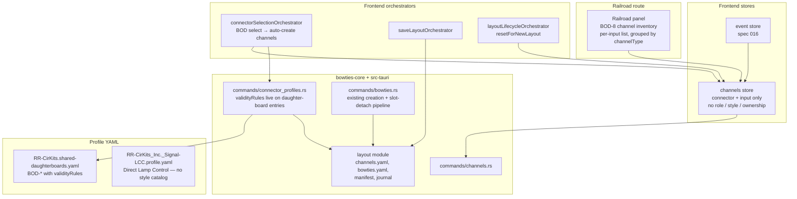

# Slices: Block Indicator Facility — Channels, LED Indicators, and the First Facility

Branch: 018-block-indicator-facility
Generated: 2026-06-28
Status: 2/9 slices complete

## Architecture

### Before

### After

```mermaid
flowchart TD
  subgraph Route[Railroad route]
    FacilitiesSection[Facilities section<br/>FacilityCard / FacilitySlot]
    ChannelsPanel[Channels panel<br/>hardware-organised: node → subsystem<br/>columns: role / style / ownership / binding / live]
  end

  subgraph Stores[Frontend stores]
    FacilitiesStore[facilities store<br/>draft layer per ADR-0012]
    TemplatesStore[behaviorTemplates store<br/>read-only registry mirror]
    ChannelsStore2[channels store<br/>role / style / ownership / binding]
    EffStore[effectiveLayoutStore<br/>+ facility status derivation<br/>Incomplete vs Wired]
    EventStore2[event store<br/>spec 016 — reused]
  end

  subgraph Orchestrators[Frontend orchestrators]
    FacOrch[facilityOrchestrator<br/>Add facility / Select-channel / Add-channel atomic /<br/>Incomplete↔Wired transition<br/>composes existing bowtie create + slot-detach]
    ConnOrch2[connectorSelectionOrchestrator<br/>BOD select → role/style/ownership/binding]
    SaveOrch2[saveLayoutOrchestrator<br/>+ facility deltas]
    LifecycleOrch2[layoutLifecycleOrchestrator<br/>+ facilities + behaviorTemplates in reset]
  end

  subgraph Utils[Frontend utils]
    FacStatus["facilityStatus<br/>pure slots → Incomplete or Wired"]
    StyleConstraints[styleConstraints<br/>style contract → CDI field render]
  end

  subgraph Backend2[bowties-core + src-tauri]
    LayoutMod2[layout module<br/>+ facilities.yaml read/write]
    BehaviorTemplates[behavior_templates registry<br/>Block Indicator template hardcoded]
    ChannelsCmd2[commands/channels.rs<br/>new schema; create_user_owned_channel]
    FacilitiesCmd[commands/facilities.rs<br/>CRUD + bind/unbind slot]
    TemplatesCmd[commands/behavior_templates.rs<br/>list_behavior_templates]
    ConnectorCmd2[commands/connector_profiles.rs<br/>BOD select → role/style/ownership]
    BowtiesCmd2[commands/bowties.rs<br/>existing pipeline + createdByFacility back-ref]
  end

  subgraph Profiles2[Profile YAML]
    SharedDB2[RR-CirKits.shared-daughterboards.yaml<br/>BOD-* with style id<br/>validityRules removed]
    SignalLCC2[RR-CirKits_Inc._Signal-LCC.profile.yaml<br/>lamp-indicator role +<br/>single-led-direct-lamp style +<br/>constraint contract on DLC rows]
  end

  FacilitiesSection --> FacOrch
  FacilitiesSection --> FacilitiesStore
  FacilitiesSection --> TemplatesStore
  FacilitiesSection --> EffStore
  ChannelsPanel --> ChannelsStore2
  ChannelsPanel --> EffStore

  FacOrch --> FacilitiesStore
  FacOrch --> ChannelsStore2
  FacOrch --> FacilitiesCmd
  FacOrch --> ChannelsCmd2
  FacOrch --> BowtiesCmd2
  FacOrch --> FacStatus

  ConnOrch2 --> ChannelsStore2
  ConnOrch2 --> ConnectorCmd2
  ConnectorCmd2 --> SharedDB2
  ConnectorCmd2 --> LayoutMod2

  SaveOrch2 --> LayoutMod2
  LifecycleOrch2 --> FacilitiesStore
  LifecycleOrch2 --> TemplatesStore
  LifecycleOrch2 --> ChannelsStore2
  EventStore2 --> ChannelsStore2
  EventStore2 --> EffStore

  StyleConstraints --> SignalLCC2
  StyleConstraints --> SharedDB2

  ChannelsCmd2 --> LayoutMod2
  FacilitiesCmd --> LayoutMod2
  TemplatesCmd --> BehaviorTemplates
  BowtiesCmd2 --> LayoutMod2
```

### Patterns

- **Pin → Channel → Facility layered binding model** — Channels are the only first-class binding entity. Facilities reference channels (not pins); pins are addressed only by channels.
- **Role / Style as Interface / Implementation duality** — Role is the state-vocabulary contract (e.g., `block-occupancy` = `unknown`/`occupied`/`clear`); Style is the hardware-shape realisation declared in profile YAML (e.g., `bod-block-detector-input`, `single-led-direct-lamp`). Slot binding is by role; styles are exchangeable within a role. See ADR-0013.
- **Ownership-driven channel lifecycle** — `hardware-owned` channels follow their backing hardware-config (BOD daughter-board selection); `user-owned` channels follow their single binding slot. No ref-counting in this slice.
- **Behavior Template as declarative composition** — A facility = template + slot bindings + name. Templates are registered in `bowties-core/behavior_templates` (Block Indicator only in this feature); future declarative loader is deferred.
- **Style-owned Constraint Contract** — The existing profile-driven validity/relevance renderer is unchanged; only the source of truth for constraints moves from daughter-board entries onto styles (ADR-0013, Finding F4). Replacement, not augmentation.
- **Facilities as UI veneer over bowties** — `facilityOrchestrator` composes the existing bowtie creation mechanism + slot-detach pipeline; bowties carry a `createdByFacility` back-reference for cleanup. No new sync, persistence, or deployment machinery.
- **Wired / Incomplete as derived status** — Pure function over slot fullness, joined in `effectiveLayoutStore` per ADR-0004. Never persisted; never stored on the facility entity.
- **Per-slice lifecycle reset enumeration** — Every slice that introduces a layout-scoped store adds it to `layoutLifecycleOrchestrator.resetForNewLayout()` in the same slice (Finding F3), not in a deferred lifecycle slice.

### Module Changes

| Module | Today | After |
|---|---|---|
| `bowties-core/src/layout/` | Reads/writes `channels.yaml`, `bowties.yaml`, manifest, journal | Adds `facilities.rs` for `facilities.yaml` read/write through existing journal |
| `bowties-core/src/channels/` | Channel = node + connector + input, default name | Channel = + `role` + `style` + `ownership` + discriminated `binding`; producer event-leaf mapping sourced from style |
| `bowties-core/src/behavior_templates/` | Does not exist | Hardcoded Block Indicator template registry (`mod.rs`) |
| `app/src-tauri/src/commands/channels.rs` | `list_channels` returns old shape | Returns new schema; new `create_user_owned_channel` for Add-channel flow |
| `app/src-tauri/src/commands/facilities.rs` | Does not exist | CRUD for facilities; bind/unbind slot |
| `app/src-tauri/src/commands/behavior_templates.rs` | Does not exist | `list_behavior_templates` returning the Block Indicator template |
| `app/src-tauri/src/commands/connector_profiles.rs` | BOD select → channel with connector+input | BOD select → channel with role/style/ownership/binding populated |
| `app/src-tauri/src/commands/bowties.rs` | Bowtie create + slot-detach pipeline | Same pipeline; bowties carry `createdByFacility` back-reference when created by `facilityOrchestrator` |
| `app/src-tauri/profiles/RR-CirKits.shared-daughterboards.yaml` | BOD-* `channelInputs` with `validityRules` on daughter-board entries | BOD-* `channelInputs` reference `bod-block-detector-input` style; `validityRules` removed (now on style) |
| `app/src-tauri/profiles/RR-CirKits_Inc._Signal-LCC.profile.yaml` | Direct Lamp Control rows declare `eventRoles` only | + `lamp-indicator` role + `single-led-direct-lamp` style + style constraint contract |
| `app/src/routes/+page.svelte` | Railroad tab shows BOD-8 channel inventory | Railroad tab gains Facilities section + restructured Channels panel; tab chrome refresh (S9, optional) |
| `app/src/lib/components/Railroad/` | `ChannelGroup` / `ChannelCard` grouped by channelType | Grouped by node + subsystem; columns include role / style / ownership / binding |
| `app/src/lib/components/Facilities/` | Does not exist | `FacilitiesSection`, `FacilityCard`, `FacilitySlot`, `AddFacilityDialog`, `SelectChannelPicker`, `AddChannelPicker` |
| `app/src/lib/stores/channels.svelte.ts` | connector + input shape | + role + style + ownership + binding; draft layer unchanged |
| `app/src/lib/stores/facilities.svelte.ts` | Does not exist | Facility CRUD + slot bindings (draft layer per ADR-0012) |
| `app/src/lib/stores/behaviorTemplates.svelte.ts` | Does not exist | Read-only registry mirror loaded from backend on app start |
| `app/src/lib/stores/effectiveLayoutStore...` | Existing merge derivations | + facility status derivation (Incomplete vs Wired) joined per ADR-0004 |
| `app/src/lib/orchestration/connectorSelectionOrchestrator.ts` | BOD channel auto-create with connector+input | Populates role/style/ownership/binding |
| `app/src/lib/orchestration/facilityOrchestrator.ts` | Does not exist | Add facility / Select-channel / Add-channel atomic / Incomplete↔Wired (creates/frees bowties via existing pipeline) |
| `app/src/lib/orchestration/saveLayoutOrchestrator.ts` | Collects channel + connector deltas | + facility deltas |
| `app/src/lib/orchestration/layoutLifecycleOrchestrator.ts` | Reset enumerates current layout-scoped stores | + facilities + behaviorTemplates in `resetForNewLayout()` (per-slice, not deferred) |
| `app/src/lib/utils/facilityStatus.ts` | Does not exist | Pure: slots → `Incomplete` \| `Wired` |
| `app/src/lib/utils/styleConstraints.ts` | Does not exist | Apply style constraint contract over CDI field render decisions |
| `lcc-rs/**` | Protocol library | **No changes** (facility / channel / role / style concepts stay out of `lcc-rs`) |

### Behavior Summary

| Slice | User-visible change | Demoable? |
|---|---|---|
| S1: Facility CRUD with empty slots (+ lifecycle reset wiring) | Add / rename / delete a Block Indicator facility with empty slots; layout round-trip | Yes |
| S1.1: Two-tier profile-test fixtures + bundled-profile smoke validation | Invariant preserved: equivalent test coverage for `build_connector_profile` and structure-profile YAML schema, reorganised into capability fixtures (owned by tests) + a shipping-profile validation harness. Reinstates the empty-affectedPaths-slot coverage S1 dropped to unblock cargo test. | No (REFACTOR) |
| S1.2: Restore ADR-0011: `effectiveNodeStore` as single dirty-derivation owner + rich Unsaved Changes dialog | Invariant restored (almost): Save / Discard toolbar buttons surface for any edit-bearing store; close-layout dialog returns to the rich count form ("N config edits across M nodes, 1 facility edit, …") instead of the bare "Unsaved Changes" message; closing with config-only edits prompts again. No new feature. | Yes (regression-fix demo) |
| S2: Channel schema + BOD retrofit (panel grouping unchanged) | Invariant preserved: BOD-8 inputs appear as today, but the persisted shape now carries role / style / ownership / binding | Yes (no-regression) |
| S3: Hardware-organised Channels panel + style-owned constraint contract | Restructured Channels panel with role / style / ownership / binding columns; daughter-board constraints sourced from the style (legacy `validityRules` removed) | Yes |
| S4: Select channel — bind a BOD channel to a facility input slot | Input slot filled via Select-channel picker; Channels panel binding column updates; Remove-from-slot reverses | Yes |
| S5: Lamp-indicator role + `single-led-direct-lamp` style + Add channel on output | Add channel on output slot → constraint-filtered lamp-row sub-picker → atomic create + claim row + bind; consumer channel appears with "last commanded on bus" live state | Yes |
| S6: Facility becomes Wired + end-to-end + Rebind | Last slot filled → Wired → bowtie creation → physical block toggles physical LED; Remove / Delete / DB-clear / Rebind reverse via existing slot-detach pipeline | Yes (headline) |
| S7: Retire the Spec 015 BOD-8 channel inventory | Invariant preserved: BOD inputs visible only via the Channels panel and facility slots; legacy inventory disappears | No (REFACTOR) |
| S8: Iteration ergonomics *(optional)* | Polish across mixed-state save/reopen; cross-node rebinding; rename + restore across daughter-board reselects | Yes |
| S9: Top-level tab chrome refresh *(optional, orthogonal)* | Segmented button group → standard tab strip with underline-on-active; labels and ordering unchanged | Yes |

---

## Roadmap

The ordered slice set. The overview table is for at-a-glance scanning; each slice card below is the reviewable contract. `/build` appends a per-layer task breakdown to a card when it implements that slice; tasks are not pre-authored here.

| # | Slice title | Label | Blocked by | Status |
|---|---|---|---|---|
| S1 | Facility CRUD with empty slots (+ lifecycle reset wiring) | HITL | None | tasked |
| S1.1 | Two-tier profile-test fixtures + bundled-profile smoke validation | REFACTOR | S1 | sketched |
| S1.2 | Restore ADR-0011: `effectiveNodeStore` as single dirty-derivation owner + rich Unsaved Changes dialog | REFACTOR | S1 | done |
| S2 | Channel schema + BOD retrofit (panel grouping unchanged) | AFK | S1 | sketched |
| S3 | Hardware-organised Channels panel + style-owned constraint contract | HITL | S2 | sketched |
| S4 | Select channel — bind a BOD channel to a facility input slot | HITL | S3 | sketched |
| S5 | Lamp-indicator role + `single-led-direct-lamp` style + Add channel on output | HITL | S4 | sketched |
| S6 | Facility becomes Wired + end-to-end + Rebind | HITL | S5 | sketched |
| S7 | Retire the Spec 015 BOD-8 channel inventory | REFACTOR | S6 | sketched |
| S8 | Iteration ergonomics *(optional)* | HITL | S6 | sketched |
| S9 | Top-level tab chrome refresh *(optional, orthogonal)* | HITL | None | sketched |

### S1: Facility CRUD with empty slots (+ lifecycle reset wiring) [HITL]

**Intent**: User can add, rename, and delete a Block Indicator facility from the Railroad tab; the facility persists with empty slots and round-trips across save / close / reopen. (US1)
**Boundary**: Route → Component → Store → API → Backend (no `lcc-rs`). *Orchestrator deferred — single-step CRUD has no cross-store coordination; the `facilityOrchestrator` lands when S4 introduces slot binding (pending D2).*
**Blocked by**: None
**Status**: tasked
**Complexity**: large
**User stories**: US1 (Add / Rename / Delete a facility); FR-034 (release-notes / docs intro).

**Acceptance criteria**:
- [ ] Invoking "Add facility" prompts for a behavior template (Block Indicator listed) and a name; on confirm, a new facility appears in a Facilities section with status **Incomplete** and one empty slot per template-declared role.
- [ ] The Facilities section ships as plain functional UI — no "New" tag, banner, watermark, or per-row badge. Expectation-setting is delivered out-of-product via release notes and user docs (FR-034, FR-035).
- [ ] Each empty slot displays as empty (no channel name, no live state) and the slot's available operations adapt to current state (e.g., "no channels available — select a BOD daughter board to create some" when none exist).
- [ ] Rename updates the facility's name everywhere it appears; Delete removes the facility entirely (no channels yet exist to clean up).
- [ ] Saving, closing, and reopening the layout restores the facility, its template identity, slot structure with empty state, and name exactly. (SC-002)
- [ ] Release notes and `docs/user/` introduce facilities as evolving (FR-034).

**Architecture note** *(HITL — new seam)*: First contact with the **Facility / Behavior Template** model. Lands three load-bearing seams together: (a) the hardcoded behavior-template registry in `bowties-core/behavior_templates`, (b) the `facilitiesStore` (draft-layer per ADR-0012) plus the application-scoped `behaviorTemplatesStore`, and (c) per Finding F3, `facilitiesStore` enrols in `layoutLifecycleOrchestrator.resetForNewLayout()` in this slice (the templates store's reset participation is pending D4). The save path is fork-pending — D1 picks between the legacy split-IPC pattern that channels still use and a pure `LayoutEditDelta` extension. Review the four decisions below before build.

**Tasks** *(pending HITL decisions; recommended defaults assumed; will be revised if user picks differently)*:
- [x] S1-T1: **Integration test** — Vitest-level end-to-end exercising the full draft / save / close / reopen cycle for facilities: open a layout, add a Block Indicator named "Block 5", rename to "Block 7", save, close, reopen — assert the persisted facility has the right template, name, and both empty slots; then delete, save, reopen — assert gone. Pure frontend test backed by mocked or real backend per existing test harness conventions.
- [x] S1-T2: **bowties-core/src/behavior_templates** — new module: `BehaviorTemplate`, `SlotDefinition`, `SlotKind`, `StateMapping`, hardcoded `BLOCK_INDICATOR`, `registered_templates()` accessor; unit tests assert the registry contents.
- [x] S1-T3: **bowties-core/src/layout/facilities.rs** — mirror `channels.rs`: `FacilitiesDocument` with `schema_version` + `facilities`, `Facility` struct (UUID id, template id, name, `slot_bindings: BTreeMap<String, Option<String>>`), `read_facilities` / `update_facilities` through the journal; extend `LayoutDirectoryReadData` / `LayoutDirectoryWriteData`; unit tests for round-trip + missing-file → empty doc.
- [x] S1-T4: **bowties-core layout delta application** — *(if D1 = B)* extend the existing delta-applier with `AddFacility { facility }`, `RenameFacility { facility_id, new_name }`, `DeleteFacility { facility_id }`; unit tests for apply-on-empty, apply-on-existing, idempotent-delete.
- [x] S1-T5: **app/src-tauri/src/commands/behavior_templates.rs** — new `list_behavior_templates` IPC; register in `lib.rs` invoke handler.
- [x] S1-T6: **app/src-tauri/src/commands/facilities.rs** — `list_facilities` IPC reading the baseline document from the active layout; *(if D1 = A)* also `create_facility` / `rename_facility` / `delete_facility` mirroring `channels.rs`.
- [x] S1-T7: **app/src-tauri layout types** — *(if D1 = B)* `LayoutEditDelta` Rust mirror gains facility variants with serde derives; round-trip test against the TS shape.
- [x] S1-T8: **app/src/lib/types** — `Facility`, `BehaviorTemplate`, `FacilityStatus` interfaces; extend the TS `LayoutEditDelta` discriminated union (D1 = B).
- [x] S1-T9: **app/src/lib/api** — TS wrappers `listFacilities`, `listBehaviorTemplates`, and *(D1 = A only)* `createFacility` / `renameFacility` / `deleteFacility`.
- [x] S1-T10: **app/src/lib/stores/behaviorTemplates.svelte.ts** — read-only, application-scoped: `loadBehaviorTemplates()` once at app start; `templates` getter; tests.
- [x] S1-T11: **app/src/lib/stores/facilities.svelte.ts** — full draft-layer per ADR-0012: `_baseline`, `_pendingCreations`, `_pendingRenames`, `_pendingDeletions`; `addFacility(templateId, name)`, `renameFacility(id, name)` (no-op suppression), `deleteFacility(id)`; `facilities` getter; `isDirty`, `editCount`, `discard()`, `hydrateBaseline()`, `reset()`, `loadFacilities()`; *(D1 = B)* `collectDeltas(): LayoutEditDelta[]`; tests mirroring `channels.svelte.test.ts`.
- [x] S1-T12: **app/src/lib/orchestration/layoutLifecycleOrchestrator.ts** — enrol `facilitiesStore.reset()` in `resetForNewLayout()`; templates store per D4. Extend the orchestrator's test to assert both stores are cleared.
- [x] S1-T13: **app/src/routes/+page.svelte** save + load integration — call `loadBehaviorTemplates()` once at app start; call `loadFacilities()` in the layout-open path; *(D1 = B)* append `facilitiesStore.collectDeltas()` to the deltas array passed to `saveLayoutOrchestrated`; *(D1 = A)* mirror the channels post-save IPC sequence and call `loadFacilities()` afterwards. Include `facilitiesStore.isDirty` in the aggregate dirty signal that drives Save / Discard.
- [x] S1-T14: **app/src/lib/components/Facilities/** — `FacilitiesSection.svelte` (heading + Add facility button + list rendering; no "New" tag or other in-product expectation-setting chrome per D3), `AddFacilityDialog.svelte` (template picker — single option in this slice — + name input + validate), `FacilityCard.svelte` (name + Rename + Delete + status "Incomplete" derived locally), `FacilitySlot.svelte` (empty-state row with adaptive helper text per acceptance bullet 3). Components emit intent; the route wires handlers to `facilitiesStore`.
- [x] S1-T15: **Railroad tab integration** — mount `<FacilitiesSection>` above the existing BOD-8 channel inventory in the Railroad tab; no-facilities baseline behaviour unchanged.
- [ ] S1-T16: **docs/user/** — release-notes entry; new "Facilities" section introducing them as an evolving feature subject to change (FR-034).
- [ ] S1-T17: **Validate** — `cargo test -p bowties-core`, `cd app/src-tauri && cargo test`, `cd app && npm test`, `npm run check`, and manually exercise the integration test from T1 against `npx tauri dev`. *Note: S1 deletes the broken `bundled_signal_profile_builds_aux_port_slot_without_governed_paths` test in `bowties-core/src/profile/mod.rs` (stale `Signal-LCC-P` reference orphaned by an upstream profile rename); equivalent coverage is reinstated in S1.1 under a capability-fixture.*

### S1.1: Two-tier profile-test fixtures + bundled-profile smoke validation [REFACTOR]

**Intent (invariant preserved)**: `build_connector_profile` and the structure-profile YAML schema retain equivalent test coverage, but reorganised into two tiers: capability-focused tests own their fixture inputs in `bowties-core/tests/fixtures/structure-profiles/`, and a separate validation harness iterates the shipping profiles under `app/src-tauri/profiles/` to ensure they parse and conform to the schema without coupling test assertions to product data. Also reinstates the empty-affectedPaths-slot coverage that S1 had to drop to unblock cargo test.
**Boundary**: `bowties-core/src/profile/` + `bowties-core/tests/` (new fixtures + new validation harness). No frontend changes; no shipping-profile changes.
**Blocked by**: S1
**Status**: sketched

**Acceptance criteria** *(invariants preserved)*:
- [ ] Capability tests in `bowties-core/src/profile/mod.rs` (or migrated to `bowties-core/tests/`) consume minimal hand-crafted fixtures under `bowties-core/tests/fixtures/structure-profiles/` rather than shipping profiles. Each fixture's filename names the code path it proves (e.g. `empty_affected_paths_slot.profile.yaml`).
- [ ] A new validation harness (e.g. `bowties-core/tests/bundled_profiles_smoke.rs`) iterates every `.profile.yaml` and `.shared-daughterboards.yaml` under `app/src-tauri/profiles/`, parses each as the matching schema type, and asserts `schemaVersion` is supported. **No content assertions** — the harness only proves the shipping data parses and conforms to the schema, so future profile renames or content edits don't break it.
- [ ] The empty-affectedPaths-slot coverage that S1 dropped is reinstated as a capability test against a new minimal fixture (not against the deleted `Signal-LCC-P` or `Signal-LCC-32H`).
- [ ] The other `bundled_*` tests in `profile/mod.rs` (`bundled_tower_profile_*`, `s5_tower_lcc_v2_parity_*`, `captured_legacy_tower_lcc_cdi_*`) are audited and either (a) migrated to the capability tier with appropriate inline fixtures, (b) left in place because they legitimately validate bundled-profile round-trip behaviour end-to-end, or (c) explicitly noted as deferred with rationale in a follow-up backlog item. The slice card records which choice was made for each test.
- [ ] All previously-passing tests in `bowties-core` pass after the refactor; no shipping profile is modified.

**Architecture note** *(REFACTOR — new pattern)*: Introduces the **Capability fixture vs Shipping-profile validation** split. The current test that broke (`bundled_signal_profile_builds_aux_port_slot_without_governed_paths`) was cross-purpose: its *name* claimed to validate a bundled profile, its *assertions* exercised an algorithm code path (empty `affectedPaths` slot), and its *CDI fixture was synthetic*. Pinning that test at a shipping profile filename coupled an algorithm behaviour test to product data with its own lifecycle, so the upstream rename of `RR-CirKits_Signal-LCC-P.profile.yaml` orphaned the test. The two-tier split names the principle (SOLID single-responsibility for capability tests; DRY iteration for schema-conformance checks) so future profile-module tests follow the right side of the split by default. Resolves the architectural shortcoming exposed during S1's pre-implementation validation.

### S1.2: Restore ADR-0011: `effectiveNodeStore` as single dirty-derivation owner + rich Unsaved Changes dialog [REFACTOR]

**Intent (invariant restored)**: `effectiveNodeStore.isDirty` becomes the actual single aggregate of all edit-bearing stores (ADR-0011), and the SaveControls toolbar plus the close-layout / window-close prompts both consume the facade rather than re-deriving from raw stores. The close prompt regains the rich per-bucket counts ("3 config edits across 2 nodes; 1 facility edit; 2 channel renames…") that the current bare-message dialog lost. Closing with config-only edits prompts again (current regression: it doesn't).
**Boundary**: `app/src/lib/layout/` (extend facade) + `app/src/lib/components/ElementCardDeck/SaveControls.svelte` + `app/src/routes/+page.svelte` (consumer migration) + new `app/src/lib/components/UnsavedChangesDialog.svelte`. Delete `app/src/lib/stores/changeTracker.svelte.ts` + tests; inline / delete `app/src/lib/orchestration/unsavedChangesGuard.ts` and `app/src/lib/components/ElementCardDeck/saveControlsPresenter.ts` (or reduce to private formatters inside the facade).
**Blocked by**: S1
**Status**: done
**Complexity**: medium
**User stories**: invariant restoration — no new user story; closes regression exposed by S1 (FR-024 / SC-002 dirty-detection across all edit-bearing stores).

**Pre-impl verified state (cached 2026-06-28)**:
- `effectiveNodeStore.isDirty` *already* aggregates: `layoutStore`, `bowtieMetadataStore`, `configChangesStore` (via `draftEntries().length`), `offlineChangesStore` (drafts + reverted), `facilitiesStore`, `unsavedInMemoryNodeIds`, `unsavedRemovedNodeIds`. Missing: `channelsStore`, `connectorSelectionsStore`. So the close-prompt regression today is **channel/connector-only edits silently miss the prompt** (config-only already works through the aggregate; the slice card's per-node-iteration theory was partly redundant with the existing aggregate — the real gap is the missing two stores).
- `changeTrackerStore` has only its own test as caller — safe to delete.
- `hasUnsavedPromptChanges` per-node iteration is redundant with the aggregate it also checks; collapses to a direct `effectiveNodeStore.isDirty` read once channels/connectorSelections are wired in.
- `deriveSaveControlsViewState` does meaningful count/hint formatting; keep but feed from new `dirtyBreakdown` to remove duplicate "which stores to ask" knowledge.

**Tasks**:
- [x] S1.2-T1: **Integration test (RED)** — `app/src/lib/layout/dirtyAggregate.integration.test.ts`: with each edit-bearing store individually dirty (config draft / metadata edit / offline draft / offline reverted-persisted / facility add / channel rename / connector selection / unsaved-new node / unsaved-removed node), assert (a) `effectiveNodeStore.isDirty === true`, and (b) `effectiveNodeStore.dirtyBreakdown` reports the right bucket count and zeros elsewhere, and (c) a `hasUnsavedPromptChanges`-equivalent guard returns true. Includes the empty-state baseline. Must fail today for `channelsStore` and `connectorSelectionsStore` cases.
- [x] S1.2-T2: **effectiveNodeStore — add `dirtyBreakdown` + wire missing stores** — extend `effectiveNodeStore.svelte.ts` to import `channelsStore`, `connectorSelectionsStore`; add `get dirtyBreakdown(): DirtyBreakdown` returning `{ config, metadata, channels, facilities, connectorSelections, offlineDrafts, offlineRevertedPersisted, layoutStruct, unsavedNewNodes, unsavedRemovedNodes }`; refactor `get isDirty()` to derive from `dirtyBreakdown` (sum of all buckets > 0). Add `DirtyBreakdown` type export.
- [x] S1.2-T3: **effectiveNodeStore tests** — add to `effectiveNodeStore.svelte.test.ts` (or new `effectiveNodeStore.dirty.test.ts`): per-bucket unit tests for `dirtyBreakdown` and the derived `isDirty` covering each contributing store + empty baseline + mixed-multi-bucket case. Mirror existing test conventions.
- [x] S1.2-T4: **Facade export** — `app/src/lib/layout/index.ts` re-exports the new `DirtyBreakdown` type alongside `effectiveNodeStore`.
- [x] S1.2-T5: **UnsavedChangesDialog component** — new `app/src/lib/components/UnsavedChangesDialog.svelte` mirroring `DiscardConfirmDialog.svelte` a11y pattern (alertdialog, focus trap, Escape/Enter, z-index 1500). Props: `{ message: string; breakdown: DirtyBreakdown; confirmLabel: string; onConfirm: () => void; onCancel: () => void; }`. Body renders message + per-bucket count list ("3 config edits across 2 nodes, 1 facility edit, 2 channel renames, …"), suppressing zero-count buckets. Count-aware pluralisation via a small private formatter.
- [x] S1.2-T6: **UnsavedChangesDialog tests** — `app/src/lib/components/UnsavedChangesDialog.test.ts`: renders all populated buckets, suppresses zero buckets, "no changes" guard not needed (only mounted when dirty), Cancel/Confirm wire callbacks, Escape closes, Enter confirms.
- [x] S1.2-T7: **+page.svelte migration** — (a) replace inline `
` markup (L1735-1763) with `<UnsavedChangesDialog />`; extend `unsavedDialog` state to carry a `breakdown` snapshot. (b) simplify `promptUnsaved()` (L148-158) and the `onCloseRequested` handler (L942) to read `effectiveNodeStore.isDirty` + `effectiveNodeStore.dirtyBreakdown` directly — drop the `hasUnsavedPromptChanges` import. (c) keep the existing CSS rules for the dialog overlay scoped to the new component (move/copy as needed) or rely on the new component's own styles.
- [x] S1.2-T8: **saveControlsPresenter migration** — `deriveSaveControlsViewState` accepts a `DirtyBreakdown` (and `connectorWarningCount`, `saveProgressState`, `layoutIsOfflineMode` as before); derives counts from it. Update `SaveControls.svelte` to pass `effectiveNodeStore.dirtyBreakdown` instead of raw per-store reads. Update `saveControlsPresenter.test.ts` to construct breakdown fixtures.
- [x] S1.2-T9: **Delete dead modules** — delete `app/src/lib/stores/changeTracker.svelte.ts` + `.test.ts`; delete `app/src/lib/orchestration/unsavedChangesGuard.ts` + `.test.ts`. Verify no broken imports.
- [x] S1.2-T10: **ADR-0011 extension** — append `## 2026-06-28 extension: dirtyBreakdown and per-bucket aggregation` section codifying: every edit-bearing store MUST be wired into `effectiveNodeStore.dirtyBreakdown` in the same slice it lands; close/disconnect/exit prompts derive from the breakdown.
- [x] S1.2-T11: **aiwiki enrichment** — update `aiwiki/owners.md`: (a) `effectiveNodeStore` row gains `dirtyBreakdown` getter description and notes channels/connectorSelections inclusion; (b) `channels.svelte.ts` and `connectorSelections.svelte.ts` rows note `isDirty` feeds the aggregate; (c) `SaveControls.svelte` row updated to mention the breakdown source; (d) add `UnsavedChangesDialog.svelte` row; (e) remove the `unsavedChangesGuard` row and the (undocumented) `changeTrackerStore` reference if present.
- [x] S1.2-T12: **Validate** — `cd app && npm test`, `npm run check`, then manual UX smoke: edit a facility → toolbar Save/Discard appear, click Close → rich dialog shows "1 facility edit"; rename a channel → toolbar Save/Discard appear, click Close → dialog shows "1 channel rename"; mix → dialog enumerates each bucket.

**Acceptance criteria** *(invariants restored / extended)*:
- [ ] `effectiveNodeStore.isDirty` returns true for every edit-bearing store contributing drafts: `layoutStore`, `bowtieMetadataStore`, `configChangesStore`, `offlineChangesStore` (drafts and reverted-persisted), `channelsStore`, `connectorSelectionsStore`, `facilitiesStore`, plus `unsavedInMemoryNodeIds` / `unsavedRemovedNodeIds`. Adding a new edit-bearing store in a future spec requires extending this one place.
- [ ] `effectiveNodeStore.dirtyBreakdown` (new getter) exposes per-bucket counts the dialog and toolbar render from: `{ config, metadata, channels, facilities, connectorSelections, offline, layoutStruct, unsavedNewNodes, revertedPersisted }`.
- [ ] `SaveControls.svelte` consumes the facade snapshot — no direct reads from raw edit-layer stores. Toolbar Save / Discard buttons appear for facility-only, channel-only, config-only, connector-selection-only, and mixed edits. The "N unsaved changes" hint sums all buckets.
- [ ] `+page.svelte` `promptUnsaved()` and the window-close handler consume the facade snapshot. Closing the layout with **config-only** unsaved changes prompts the user (current regression: it doesn't, because `hasUnsavedPromptChanges` per-node-iterates `nodeTreeStore.trees.keys()` against `configChangesStore.hasDraftsForNode(...)` and silently misses when the key shapes diverge).
- [ ] New `UnsavedChangesDialog.svelte` renders message + confirm / cancel + per-bucket breakdown ("3 config edits across 2 nodes; 1 facility edit; 2 channel renames…"). Replaces the inline `
` in `+page.svelte`.
- [ ] `changeTrackerStore` deleted; `hasUnsavedPromptChanges` and `deriveSaveControlsViewState` either deleted or reduced to private formatters inside the facade.
- [ ] All previously-passing tests pass after the migration; new tests cover the `dirtyBreakdown` shape across every contributing bucket + the `UnsavedChangesDialog` rendering.

**Architecture note** *(REFACTOR — invariant restoration)*: ADR-0011 named `effectiveNodeStore.isDirty` as the aggregate "any in-memory change" signal across the three layout layers (in-memory drafts / saved baseline / on-bus state) and the `$lib/layout/` facade (ADR-0004) as the single import surface. The implementation never delivered on that promise: `channelsStore` (spec 015) and `connectorSelectionsStore` (spec 014) landed without being wired into the aggregate; `SaveControls.svelte` re-derived locally via `deriveSaveControlsViewState`; a parallel `changeTrackerStore` was built as an alternate consolidation point and never adopted (its only callers are its own tests); the close-prompt predicate `hasUnsavedPromptChanges` partly leans on the partial `effectiveNodeStore.isDirty` and partly per-node-iterates `nodeTreeStore.trees.keys()` against `configChangesStore.hasDraftsForNode(...)` — which silently misses today, causing the no-dialog-on-config-only-close regression S1 exposed. This slice restores the ADR-0011 invariant by making the facade fully own the question, deleting the parallel paths, and adding an ADR extension that codifies the rule: **every new edit-bearing store MUST be wired into `effectiveNodeStore.dirtyBreakdown` in the same slice it lands**, structurally preventing the next recurrence.

**Post-implementation enrichment** (mandatory for this slice):
- Extend ADR-0011 with a dated section codifying the single-owner rule and the `dirtyBreakdown` contract.
- Update `aiwiki/owners.md` for `effectiveNodeStore` (new getters) and `$lib/layout` index (new exports). Remove the `changeTrackerStore` row. Remove the standalone `saveControlsPresenter` / `unsavedChangesGuard` rows if those modules are deleted.

### S2: Channel schema + BOD retrofit (panel grouping unchanged) [AFK]
**Intent**: Schema lands with its first read path — BOD-8 inputs continue to appear in the existing Railroad inventory exactly as today, but every channel now carries `role` / `style` / `ownership` / `binding` end-to-end (in store, on the wire, on disk). User-visible behavior is identical until S3 surfaces the new columns.
**Boundary**: Component → Store → API → Backend (+ `bowties-core` schema; no `lcc-rs`).
**Blocked by**: S1
**Status**: sketched

**Acceptance criteria**:
- [ ] Selecting a BOD-family daughter board on a TowerLCC connector continues to produce 8 entries in the existing channel inventory with the same default names and the same rename behavior as before.
- [ ] Layouts saved after this slice carry the new schema (`role: block-occupancy`, `style: bod-block-detector-input`, `ownership: hardware-owned`, `binding` populated) and round-trip without loss.
- [ ] Producer event-leaf mapping (occupied/clear) is sourced from the style definition; behavior at the bus level is unchanged.
- [ ] The existing RailroadPanel grouping and styling are unchanged; the new fields are populated but not yet surfaced as columns.

**Architecture note** *(new seam — schema)*: Even though there is no UX change, this slice lands the ADR-0013 channel schema. The persisted shape is load-bearing for every downstream slice — per Finding F1, the schema arrives **with its first read path** rather than in a horizontal pre-slice.

### S3: Hardware-organised Channels panel + style-owned constraint contract [HITL]

**Intent**: Restructured **Channels panel** groups channels by node + subsystem with role / style / ownership / binding columns; BOD-family `validityRules` are removed from the daughter-board profile and re-declared as the `bod-block-detector-input` style's constraint contract. User can verify hardware end-to-end without any facility. (US2)
**Boundary**: Route → Component → Store → Backend → Profile YAML.
**Blocked by**: S2
**Status**: sketched

**Acceptance criteria**:
- [ ] With a TowerLCC + BOD-family daughter board selected, the Railroad tab's Channels section lists 8 hardware-owned channels grouped by node + subsystem, each identified by node + connector + input, each with role / style / ownership / binding columns populated and live state `unknown` before bus connect. (SC-001)
- [ ] On bus connect (eager-resolution per spec 017), each row updates to actual `clear` / `occupied` state; flipping a real BOD input updates the corresponding row within the existing event-store response window. (SC-011)
- [ ] Unbound channels show "unbound" in the binding column; channels in a layout with no facilities can be exercised entirely from the Channels panel.
- [ ] Selecting BOD-8 still applies the same CDI field restrictions to the same fields as before — managed via the style's constraint contract, not via daughter-board `validityRules`. (FR-026 / FR-028)
- [ ] Legacy `validityRules` entries are removed from `RR-CirKits.shared-daughterboards.yaml` in the same change; there is no transitional double-source of constraints.

**Architecture note** *(HITL — new pattern + relocation)*: Two changes land together. (a) The Channels panel becomes the canonical hardware-organised verification surface — first slice that exposes the role/style model to users. (b) Per Finding F4 and ADR-0013, the **Style Constraint Contract** replaces (not augments) legacy daughter-board `validityRules` — single source of truth, no transitional double-source. Review the panel structure and the migration semantics before build.

### S4: Select channel — bind a BOD channel to a facility input slot [HITL]

**Intent**: User invokes **Select channel** on a Block Indicator facility's empty input slot; the picker lists unbound, role-compatible channels; on selection the slot fills and shows live state, and the Channels panel's binding column updates. Remove-from-slot reverses cleanly. (Producer half of US3.)
**Boundary**: Route → Component → Orchestrator → Store → API → Backend.
**Blocked by**: S3
**Status**: sketched

**Acceptance criteria**:
- [ ] The input slot's "Select channel" opens a picker of unbound `block-occupancy` channels identified by node + connector + input.
- [ ] On selection the chosen channel is bound to the slot; the slot displays the channel's name and current live state; the Channels panel row for that channel shows the facility/slot name in its binding column. (SC-003)
- [ ] "Remove from slot" empties the slot; the BOD channel returns to "unbound" in the Channels panel (it persists because its hardware-config still selects it).
- [ ] The facility remains Incomplete (output slot still empty); no underlying bowtie has been created yet.
- [ ] Rename on the bound channel updates both the slot display and the Channels panel.
- [ ] One-slot-per-channel invariant is enforced: a channel already bound to another slot does not appear in the picker.

**Architecture note** *(HITL — new pattern)*: Introduces the **Select-channel picker** UX and the slot-binding contract enforced in `facilityOrchestrator` (one channel → at most one slot). First user-facing workflow that exercises the facility/channel seam — review the picker layout and the "compatible + unbound" filter rule before build.

### S5: Lamp-indicator role + `single-led-direct-lamp` style + Add channel on output [HITL]

**Intent**: User invokes **Add channel** on the empty output slot; a constraint-filtered lamp-row sub-picker opens; on selection Bowties atomically creates a `lamp-indicator` channel with style `single-led-direct-lamp` bound to that row, assigns a default name, and binds it to the slot. The new channel appears in the Channels panel with live state = "last commanded on bus". (Consumer half of US3.)
**Boundary**: Route → Component → Orchestrator → Store → API → Backend → Profile YAML.
**Blocked by**: S4
**Status**: sketched

**Acceptance criteria**:
- [ ] The output slot's "Add channel" opens a sub-picker that lists only Direct Lamp Control rows on connected Signal LCC nodes that are both **unclaimed** and **constraint-compatible** with `single-led-direct-lamp` (e.g., `Lamp Selection ≠ "Used by Mast"`). Ineligible rows are hidden, not offered with a confirmation step. (FR-030)
- [ ] On selection, a `lamp-indicator` channel is created, claims the row, is named via the existing default-name generator from spec 015, and binds to the slot — all atomically; failure of any step leaves the layout unchanged. (FR-018)
- [ ] The new user-owned channel appears in the Channels panel with the slot/facility name in its binding column and live state from observed lamp-on/lamp-off commands on the bus. (FR-024 / FR-032)
- [ ] The claimed row's `Lamp Selection` field is locked to the style-required value in the Config tab via the existing profile validity/relevance mechanism — no new Config-tab UI. (FR-027 / FR-029)
- [ ] Users can discover the "last commanded on bus" nature of consumer-channel state via at least one of: per-row tooltip on hover, release notes, user docs. The Channels panel does **not** carry an inline "last commanded" label on every consumer row. (FR-032)
- [ ] The facility remains Incomplete until S6 lands the Wired transition (this slice fills the output slot but does not yet create bowties).

**Architecture note** *(HITL — new pattern)*: Introduces (a) the atomic **Add-channel flow** (create channel + claim hardware target + bind to slot in one transaction), (b) the first **user-owned** channel and its lifecycle rules, (c) the constraint-filtered sub-picker, and (d) the FR-032 discoverability approach (tooltip + release notes + docs instead of inline labels). Each is load-bearing for future styles and roles — review before build.

### S6: Facility becomes Wired + end-to-end + Rebind [HITL]

**Intent**: The moment S5's Add-channel fills the last empty slot, the facility transitions to **Wired** and `facilityOrchestrator` creates the underlying bowtie(s) via the existing bowtie creation mechanism. Once those edits reach the bus, the physical block drives the physical LED. Remove-from-slot, Delete facility, BOD daughter-board clear, and Rebind all reverse / swap cleanly via the existing slot-detach pipeline. (Headline US3.)
**Boundary**: Component → Orchestrator → Store → API → Backend.
**Blocked by**: S5
**Status**: sketched

**Acceptance criteria**:
- [ ] Filling the last empty slot atomically flips the facility's status to **Wired** and creates the underlying bowtie(s) using the existing bowtie creation mechanism; the Railroad tab renders the Wired status visibly. (FR-020 / FR-021)
- [ ] With a real BOD-8 and Signal LCC on the bus, occupying the physical block lights the bound LED and clearing it turns the LED off — end-to-end physical observation in under one second once the wiring edits have reached the bus. (SC-004)
- [ ] Remove-from-slot on either bound channel returns the facility to Incomplete in a single atomic action; the affected bowtie(s) are removed via the existing slot-detach pipeline; the LED stops following the block. Input-slot removal returns the BOD channel to "unbound"; output-slot removal deletes the user-owned LED channel and releases the lamp row (its style-locked CDI fields become editable again). (SC-005)
- [ ] Clearing or changing the BOD daughter-board selection while a facility is Wired atomically deletes the channels, empties the slot, returns the facility to Incomplete, and frees the bowtie(s). (SC-007)
- [ ] Deleting a Wired facility removes the bowtie(s), deletes user-owned bound channels (releasing their rows), and returns hardware-owned bound channels to "unbound". (SC-008)
- [ ] Rebind on a filled slot swaps to a different compatible channel atomically; for the output slot, Rebind via Add channel on a different row releases the old row and claims the new one; the facility remains Wired throughout. (SC-006)
- [ ] Saving, closing, and reopening a layout with Wired facilities round-trips every facility, slot binding, channel identity, ownership flag, and the underlying bowtie(s); facilities are Wired again on reopen without user action. (SC-010)

**Architecture note** *(HITL — new seam — headline)*: Lands the **Facilities-as-UI-veneer-over-bowties** pattern: `facilityOrchestrator` composes the existing bowtie creation mechanism + slot-detach pipeline, and bowties carry a `createdByFacility` back-reference for cleanup. Wired/Incomplete status is a pure derivation joined in `effectiveLayoutStore` per ADR-0004 (never persisted on the facility entity). This is the first slice where facilities drive real bus behavior — review the orchestrator boundaries, the cleanup contract, and the status-derivation join before build.

### S7: Retire the Spec 015 BOD-8 channel inventory [REFACTOR]

**Intent (invariant preserved)**: BOD-8 inputs remain visible exclusively via the Channels panel and (when bound) via facility slots. No new behavior; one duplicated surface disappears. Pre-existing layouts that had renamed channels in the old inventory lose those names (acceptable per FR-009).
**Boundary**: Route → Component (removal of the legacy inventory surface).
**Blocked by**: S6
**Status**: sketched

**Acceptance criteria** *(invariants)*:
- [ ] BOD-8 inputs are still listed in the Channels panel with identity, role, style, ownership, live state, and binding — no functional regression vs. S6.
- [ ] Hardware verification (US2) still works exclusively through the Channels panel.
- [ ] All slot Select-channel pickers still surface the same set of unbound, role-compatible BOD channels as before.
- [ ] No other surface in the app references the retired inventory; repo-wide search for its identifiers returns zero.

### S8: Iteration ergonomics *(optional)* [HITL]

**Intent**: Polish across mixed-state save/reopen scenarios that aren't already covered by FR-005 in S1–S6; cross-node rebinding; rename + restore behavior across daughter-board reselects.
**Boundary**: Route → Component → Orchestrator → Store (scope depends on what carries over from S1–S6).
**Blocked by**: S6
**Status**: sketched

**Acceptance criteria**:
- [ ] Save / reopen with a layout that contains facilities in every lifecycle state (Incomplete with empty slots, Incomplete with one slot bound, Wired) round-trips faithfully with no functional regression on reconnect.
- [ ] Cross-node rebinding (e.g., reassigning the output slot to a row on a different Signal LCC) is a single, atomic in-app workflow with clear release/claim semantics on both rows.
- [ ] Reselecting the same BOD daughter board after a clear does not retain previous user renames (per FR-006); the user is not surprised by stale names reappearing.

**Architecture note** *(HITL — review at slice expansion time)*: The exact pattern depends on what surfaces during S1–S6. `/build` re-reads the roadmap before expanding this card and may adjust the boundary or acceptance criteria in light of what was learned.

### S9: Top-level tab chrome refresh *(optional, orthogonal)* [HITL]

**Intent**: Replace the top-level segmented-button navigation (`Config` / `Bowties` / `Railroad`) with a standard tab strip using an underline-on-active indicator. Labels and ordering unchanged. (FR-036.)
**Boundary**: Route → Component (top-level navigation only).
**Blocked by**: None (orthogonal to the rest of the feature; can ship any time relative to S1–S7).
**Status**: sketched

**Acceptance criteria**:
- [ ] The three top-level tabs render as standard tabs with an underline-on-active indicator; labels and ordering match today's segmented buttons.
- [ ] Selecting a tab navigates to the same screen as today; no behavior change beyond the visual chrome.
- [ ] Keyboard navigation and accessible-name semantics for the tab strip match expectations for a standard tab pattern.

**Architecture note** *(HITL — visual review)*: Pure visual change to the top-level navigation. Isolated from facilities work; review the tab-pattern choice (component, ARIA semantics) before build.

---

<!--
Tier 2 — Task breakdown. `/build` appends a Tasks block (and complexity / user-stories)
to a slice's card when it starts that slice, flipping the slice's status to `tasked`.
Slices stay at `status: sketched` until `/build` reaches them. Do not pre-author tasks here.
-->

<!-- Session: 2026-06-28 — Completed S1.2 (REFACTOR). `effectiveNodeStore.dirtyBreakdown` lands as the single typed snapshot of every edit-bearing store; `channelsStore` and `connectorSelectionsStore` are now in the aggregate (regression fix), facility-only edits light up the toolbar, the close-prompt dialog renders per-bucket counts via the new `UnsavedChangesDialog.svelte`. Deleted `changeTracker.svelte.ts` + tests, `unsavedChangesGuard.ts` + tests. ADR-0011 extended with the 2026-06-28 single-owner rule. 1245/1245 vitest tests green. Next: user wants to manually verify the S1 UX end-to-end (facility edit → Save/Discard + rich close dialog). After UX verification, next slice is S1.1 (capability-fixture profile-test refactor) or S2 (channel schema + BOD retrofit). -->

