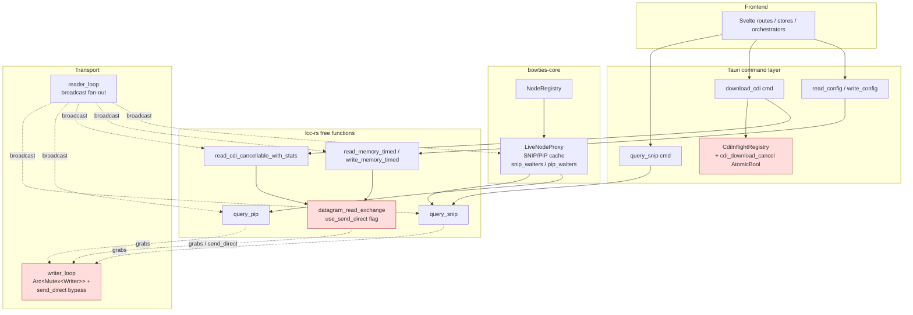
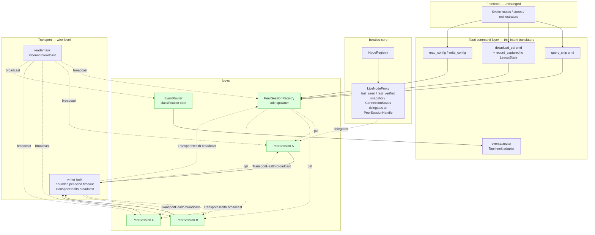

# Slices: Peer Session Actor — Per-Node Protocol Ownership

Branch: 019-peer-session-refactor
Generated: 2026-07-05
Status: S1–S3 done. Scope revised 2026-07-18 (motivating premise disproven — see note under Roadmap). S7 done 2026-07-18. S4 done 2026-07-18. S8 done 2026-07-18. S9 done 2026-07-18. S10 done 2026-07-18. All non-deferred slices complete. S5/S6 deferred (captured as `kind/idea`).

## Architecture

### Before

### After

### Patterns

- **Per-peer actor** — One `PeerSession` per remote NodeID. Owns the peer's exchanges, ACK obligations in both directions, retry state, cached SNIP/PIP, coalescing, and peer-cleanup contract. Commands processed sequentially per peer; different peers proceed in parallel.
- **Sole-spawner registry** — `PeerSessionRegistry` is the only entity that spawns sessions. It qualifies inbound frames (VNI, InitializationComplete, AMD — all NodeID-carrying) and spawns exactly once per NodeID. Alias renegotiation updates in place.
- **Bounded FIFO writer + health broadcast** — Writer holds no async mutex across `.await`; drains a single mpsc; wraps each `w.send().await` in a per-transport timeout; emits `TransportHealth::Wedged` on stall. Callers never contend for a shared writer.
- **Filter-at-consumer transport broadcast** — Reader publishes every parsed frame to a broadcast; consumers subscribe and filter by their own criteria. Bug closure is enforced by consumer-side single-owner rules, not by narrowing delivery.
- **Peer-cleanup contract** — Every exchange that terminates due to our failure (timeout, terminal `DatagramRejected`, `OptionalInteractionRejected`) emits `TerminateDueToError` to the peer before releasing (TN-9.7.2.1). Exactly once per exchange.
- **Query coalescing** — Concurrent `QuerySNIP` / `QueryPIP` callers park on a shared `Vec<oneshot::Sender>`; one wire query serves all. Cache invalidation on `PeerReinitialised`.
- **Structural invariants over runtime guards** — "One CDI in flight per peer" and "one outbound sender per peer" are structural properties of the actor model, not runtime checks (`CdiInflightRegistry` deleted).

### Module Changes

| Module | Today | After |
|---|---|---|
| `lcc-rs::transport_actor` | Writer holds `Arc<Mutex<Writer>>` and `send_direct` bypass; can deadlock under back-pressure | Single-threaded writer draining an mpsc; each `send` bounded by `SERIAL_SEND_TIMEOUT`; `TransportHealth` broadcast; `send_direct` retired in S5 |
| `lcc-rs::peer_session` | Does not exist | New actor per remote NodeID; owns exchanges, ACKs, retries, cached SNIP/PIP, coalescing, peer cleanup |
| `lcc-rs::peer_session_registry` | Does not exist | New sole spawner of sessions; keyed by NodeID; qualification frames VNI / InitComplete / AMD |
| `lcc-rs::event_router` | Does not exist (classification lives in `app/src-tauri::events::router`) | New bus-scoped classifier and fan-out of event-report frames (PCER, EventReportWithPayload, Identify, Learn) |
| `lcc-rs::snip`, `pip`, `discovery`, `datagram_reader` | Free functions each grab the shared transport | Become compatibility shims that forward to sessions in S2–S3; retired from public API in S5 |
| `bowties-core::node_proxy` (`LiveNodeProxy`) | Owns `snip_waiters` / `pip_waiters`, cached SNIP wire state, and directly calls `lcc-rs` free functions | Thin app-layer aggregator: `last_seen`, `last_verified`, `ConnectionStatus`, snapshot, `Live \| Synthesized` polymorphism; delegates every protocol call to a `PeerSessionHandle` |
| `bowties-core::cdi_inflight` | Runtime-defended "one CDI per node" invariant via a `CdiInflightRegistry` | Deleted in S3; invariant becomes structural via per-peer serialization |
| `app/src-tauri::state::AppState` | Holds `cdi_inflight`, `cdi_download_cancel` | Holds `sessions: Arc<PeerSessionRegistry>`; CDI-inflight and cancel fields removed in S3 |
| `app/src-tauri::commands::cdi` | Owns the CDI read loop indirectly (calls `read_cdi_cancellable_with_stats`) and persists to LayoutState | Thin intent translator: dispatches `PeerCommand::DownloadCDI` to the session and calls `layout_state.record_captured` on completion (ADR-0015 invariant preserved) |
| `app/src-tauri::events::router` | Owns both classification and Tauri emit | Thinned to Tauri-emit adapter over `lcc-rs::event_router` in S6 |

### Behavior Summary

| Slice | User-visible change | Demoable? |
|---|---|---|
| S1: Bounded FIFO transport writer + TransportHealth broadcast | Invariant preserved: outbound frames still reach the wire. New: stuck adapter surfaces as `TransportHealth::Wedged` within `SERIAL_SEND_TIMEOUT` instead of hanging | Yes (unplug SPROG → health event fires promptly; commands return `TransportUnhealthy` instead of hanging) |
| S2: Migrate SNIP + PIP through PeerSession | Invariant preserved: SNIP/PIP data appears in frontend snapshot identically. New: no duplicate SNIP/PIP burst per peer (coalesced) | Yes (concurrent snapshot requests → exactly one wire query per peer) |
| S3: Migrate CDI download through PeerSession; retire cdi_inflight; peer cleanup on error | Architectural: single ACK owner, peer cleanup on error, per-peer serialisation. **Correction (2026-07-18): S3 does NOT close the SPROG CDI regression — that was the serial `\r\n` framing fix (S10). S3's contribution is reduced wire traffic + peer cleanup.** No `DatagramRejected 0x2020` storms after our timeout; OIR surfaces as a diagnostic error | Yes (end-to-end CDI verified via cdi-probe) |
| S4: Migrate config read + config write through PeerSession (+ CDI cache-write guard) | Fixes a data-loss regression: config r/w now serializes through the peer session (no interleaved CDI/config assembler, no duplicate ACKs); a partial/invalid CDI can no longer overwrite a good cached file | Yes (re-download over a good cache no longer clobbers it; concurrent read-all-config + CDI download no longer collide) |
| S5: Retire send_direct + outbound-owner audit | Invariant preserved: every outbound frame is session-owned; deprecated public API removed | No (REFACTOR) |
| S6: Lift event_router classification core into lcc-rs | Invariant preserved: event routing behaviour unchanged; classification core no longer depends on Tauri | No (REFACTOR) |

---

## Roadmap

> **Scope revised 2026-07-18.** The refactor's original motivation — a prior-session assertion that it would fix the SPROG CDI regression — was **disproven**. The regression's root cause was a serial `\r\n` framing bug: Bowties appended CR/LF after the `;`-terminated GridConnect frame; JMRI (the reference implementation) sends none, and SPROG USB-LCC v1.4's changed FTDI buffer handling can't tolerate the extra bytes/frame under CDI load. Fixed and verified (`cdi-probe` 10/10 at `--post-ack-delay-ms 0`, no power cycle). See [../../temp/SESSION-HANDOFF-2026-07-18.md](../../temp/SESSION-HANDOFF-2026-07-18.md).
>
> S1–S3 are **kept** on independent architectural merit (single ACK owner, peer cleanup on error, no writer mutex deadlock — real bugs absent from `main`; the refactored CDI path is now hardware-validated). Remaining work is a **merge-readiness gate**: close the refactor-introduced broadcast-lag defect (**S7**) first, finish **S4** for consistency, retire SPROG scaffolding (**S8**), resolve transport layering (**S9**), correct the root-cause docs (**S10**). **S5/S6 deferred** to `kind/idea` follow-ups (pure cleanup, no correctness payoff). S-numbers are stable IDs; the table is ordered by execution priority.

| # | Slice title | Label | Blocked by | Status |
|---|---|---|---|---|
| S1 | Bounded FIFO transport writer + TransportHealth broadcast | HITL | None | done |
| S2 | Migrate SNIP + PIP through PeerSession (introduces registry, actor, handle) | HITL | S1 | done |
| S3 | Migrate CDI download through PeerSession; retire cdi_inflight; peer cleanup on error | HITL | S2 | done |
| S7 | Harden inbound delivery against broadcast lag | HITL | S3 | done |
| S4 | Migrate config read + config write through PeerSession (+ CDI cache-write guard) | AFK | S3 | done |
| S8 | Retire SPROG-debug scaffolding + neutralize post-ACK pacing | AFK | None | done |
| S9 | Resolve transport layering — blocking threads vs async + S1 timeout | HITL | None | done |
| S10 | Correct the SPROG root-cause record in durable docs | AFK | None | done |
| S5 | Retire send_direct + outbound-owner audit | AFK | S4 | deferred |
| S6 | Lift event_router classification core into lcc-rs | HITL | S5 | deferred |

### S1: Bounded FIFO transport writer + TransportHealth broadcast [HITL]

**Intent**: Invariant preserved — outbound frames still reach the wire under nominal conditions. New capability: a stuck writer surfaces as `TransportHealth::Wedged` on a broadcast channel within `SERIAL_SEND_TIMEOUT` (500ms serial / 2000ms TCP) instead of deadlocking every caller.
**Boundary**: `lcc-rs::transport_actor`
**Blocked by**: None
**Status**: done
**Complexity**: medium
**User stories**: N/A (refactor — spec has no explicit US; slice serves FR-transport-health and unblocks all peer-session slices)

**Acceptance criteria**:
- [x] All pre-existing `lcc-rs`, `bowties-core`, `app/src-tauri`, and Vitest tests remain green
- [x] A mock writer that stalls forever produces a `TransportHealth::Wedged` broadcast event within `SERIAL_SEND_TIMEOUT + slack` and does not deadlock other callers
- [ ] Manual: physically disconnecting the SPROG cable during CDI produces a `Wedged` event within the timeout, and subsequent Tauri commands return `TransportUnhealthy` promptly rather than hanging indefinitely
- [x] The **Transport Health** seam is registered in `aiwiki/seams.md` (Owner: `transport_actor` writer task; Consumers include downstream `PeerSession` instances and the UI connection-status surface once wired)

**Architecture note** *(HITL — new seam)*: Introduces the Transport Health seam and the bounded-writer pattern. Both are load-bearing for every downstream slice — sessions rely on the writer never blocking indefinitely, and eventually surface health to the UI. Writer holds no async mutex across `.await`; drains a single mpsc; per-transport-kind `SEND_TIMEOUT` const; health published on a broadcast channel. Concurrency-primitive choice and timeout values need review before code lands.

**Approved decisions** *(HITL review 2026-07-07)*:
- **D1 — health channel primitive**: **`tokio::sync::watch<TransportHealth>`** (initial value `Healthy`, writer uses `send_if_modified`). Single seam; `TransportHandle::health() -> watch::Receiver`; `rx.borrow()` for state; `rx.changed().await` for transitions. Contract file [specs/019-peer-session-refactor/contracts/transport-health.md](specs/019-peer-session-refactor/contracts/transport-health.md) must be updated in this slice from the current `broadcast + current_health()` draft to the `watch` shape.
- **D2 — `send_direct` coexistence in S1→S5**: **Extract `send_frame_with_timeout` helper**; both `writer_loop` and `send_direct` invoke it so both writer-holding paths participate in the seam. Helper survives S5 (retains one caller when `send_direct` is removed).
- **D3 — `TransportUnhealthy` caller surface**: **Fail-fast at `TransportHandle::send()`** — returns `Err(SendError::TransportUnhealthy)` immediately when the observed health is `Wedged`; does not enqueue. Every current and future Consumer inherits the guarantee without opt-in. `SendError::TransportUnhealthy` is a public variant; ADR-0016 (S2) will map it to `PeerError::TransportUnhealthy`.
- **Implementation defaults**: keep `OUTBOUND_CAPACITY = 64`; timeout constants as module-level `const SERIAL_SEND_TIMEOUT: Duration = Duration::from_millis(500)` / `TCP_SEND_TIMEOUT: Duration = Duration::from_millis(2000)`; test double via parametric stall/fail mode on `MockTransportWriter` in `lcc-rs/src/transport/mock.rs`.
- **ADR addition — Fairness section**: the S1 ADR (S1-T10) must include a Fairness section stating that the single-shared-FIFO writer is deliberate (the wire is physically single-lane), per-frame `SEND_TIMEOUT` bounds each frame's drain time, and per-peer output prioritization is an explicit non-goal — if fairness ever becomes required, the correct seam is a scheduling policy inside `PeerSessionRegistry` (S2+), not a redesign of the transport writer.

**Tasks**:
- [x] S1-T1: Write integration test — a `TransportWriter` mock whose `send()` never returns produces `TransportHealth::Wedged` on the health subscription within `SERIAL_SEND_TIMEOUT + slack`, and a concurrent subscriber does not deadlock (AC2). Location: `lcc-rs/src/transport_actor.rs` `#[cfg(test)] mod tests`.
- [x] S1-T2: Introduce `TransportHealth` enum (`Healthy` / `Wedged { .. }`) and per-transport-kind `SEND_TIMEOUT` consts (`SERIAL_SEND_TIMEOUT = 500ms`, `TCP_SEND_TIMEOUT = 2000ms`) in `lcc-rs::transport_actor`. (Deepest layer — types.)
- [x] S1-T3: Add the health channel to `TransportActor` per **D1 outcome** (`broadcast` vs `watch`); expose `TransportHandle::subscribe_health()`.
- [x] S1-T4: Wrap `writer_loop`'s `w.send().await` with `tokio::time::timeout(SEND_TIMEOUT, …)`; on timeout, publish `TransportHealth::Wedged` and keep draining (do not stall the queue on the failed frame).
- [x] S1-T5: Surface `TransportUnhealthy` to callers per **D3 outcome** — either fail-fast on `TransportHandle::send()` after wedge, or leave `send()` as-is and expose health for callers to check. Wire the chosen path into the acceptance-criterion 3 manual behaviour.
- [x] S1-T6: Apply **D2 outcome** to `send_direct` — either leave untouched, wrap with the same timeout, or retire early. Update tests / discovery mock as required.
- [x] S1-T7: Extend `MockTransportWriter` in `lcc-rs/src/transport/mock.rs` with a parametric stall/fail variant used by S1-T1 (parametric factory — reusable across S2+ regression tests).
- [x] S1-T8: Register the **Transport Health** seam in `aiwiki/seams.md`. Owner: `transport_actor` writer task (file:line). Contributors S1: writer task. Consumers: marked "planned in S2+" for `PeerSessionRegistry`, `PeerSession`, `LiveNodeProxy`, UI connection-status surface.
- [x] S1-T9: Update `aiwiki/owners.md` for the new `TransportHealth` type, `SEND_TIMEOUT` consts, and `subscribe_health()` handle method.
- [x] S1-T10: Draft ADR **"Transport Health broadcast + bounded FIFO writer"** in `product/architecture/adr/` capturing: the chosen concurrency primitive (D1), the coexistence rule with `send_direct` in the S1→S5 window (D2), and the `TransportUnhealthy` surface contract (D3).
- [x] S1-T11: Validate — `cargo test -p lcc-rs`, `cargo test -p bowties-core`, `cargo test` (workspace-wide including `app/src-tauri`), and `pnpm --dir app test` all green (AC1). AC3 manual test recorded in the session note.

### S2: Migrate SNIP + PIP through PeerSession (introduces registry, actor, handle) [HITL]

**Intent**: Invariant preserved — SNIP and PIP data appear in the frontend snapshot identically to today. New structural guarantee: no duplicate SNIP/PIP burst per peer (concurrent callers are coalesced onto one wire query).
**Boundary**: `lcc-rs::peer_session` (new), `lcc-rs::peer_session_registry` (new), `lcc-rs::snip` (shim), `lcc-rs::pip` (shim); `bowties-core::node_proxy` (delegate); `app/src-tauri::state` (add `sessions`)
**Blocked by**: S1
**Status**: done
**Complexity**: high
**User stories**: N/A (refactor — spec FR-003 (SNIP), FR-004 (PIP), FR-014 (coalescing), FR-015 (per-peer serialisation), FR-017 (sole-spawner registry). Slice serves the shape all downstream slices build on.)

**Prerequisite artefact**: **ADR-0016 "Per-peer session actor ownership"** authored and merged **before code lands** (per plan finding F5). Documents: per-peer actor pattern; single ACK owner per peer; single outbound sender per peer; single active exchange per peer; `TerminateDueToError` obligation on our failure; sole spawner (registry) gated on VNI / InitComplete / AMD frames; retained transport inbound broadcast with single-owner-at-consumer enforcement.

**Acceptance criteria**:
- [x] Cold discovery on a modulino peer populates SNIP and PIP data in the frontend node snapshot, unchanged from today
- [x] Two concurrent `query_snip` calls to the same peer produce exactly one wire query (coalescing verified by outbound-frame assertion in a session-scoped test)
- [x] `PeerReinitialised` (peer emits `Verified Node ID Number` or `Initialization Complete` after already having a session) clears SNIP and PIP caches
- [x] Repeat observation of the same NodeID (re-scan, alias renegotiation) updates the existing session's alias in place via `PeerCommand::AliasChanged` — no duplicate session is spawned
- [x] `PeerSessionRegistry` is the sole caller of `spawn`; grep confirms no other spawn call site
- [x] `query_snip` and `query_pip` free functions retained as compatibility shims that forward to the session (public signatures unchanged, existing callers unaffected)
- [x] The **Peer Session Ownership** seam is registered in `aiwiki/seams.md` (Owner: `PeerSessionRegistry`; Contributors: transport inbound broadcast + `NetworkSession` lifecycle; Consumers: `LiveNodeProxy`, Tauri commands, `EventRouter`)
- [x] `aiwiki/owners.md` updated with `peer_session` and `peer_session_registry`
- [x] **F4 depth audit** on `LiveNodeProxy` executed at slice exit; either confirm retained app-layer responsibility (`last_seen`, `last_verified`, `ConnectionStatus`, snapshot, `Live \| Synthesized` polymorphism) or capture a follow-up `kind/idea` issue proposing to fold it into `NodeRegistry` (do not fold inside this feature)

**Architecture note** *(HITL — new seam + new pattern)*: Introduces the per-peer actor pattern, sole-spawner registry, `PeerSessionHandle` typed convenience API, query-coalescing, and cache-lifecycle contract. Everything downstream (S3–S6) builds on this shape. Registry's internal map uses `tokio::sync::RwLock<HashMap<NodeID, PeerSessionHandle>>` (per research D1; guarded against the tokio-rwlock self-deadlock pattern). Review the ADR and the seam boundaries before code lands.

**Approved decisions** *(HITL review 2026-07-07)*:
- **D1 — Transport Health wiring depth**: **Option B — Mid-exchange wiring**. `PeerSession` subscribes to `TransportHandle::subscribe_health()` at construction and `tokio::select!`s on `health.changed()` inside the active-exchange loop alongside `commands`, filtered `inbound`, and the exchange deadline. On a `Wedged` transition mid-exchange, the session aborts with `PeerError::TransportUnhealthy { health }` and **skips** the outbound `TerminateDueToError` cleanup emission (peer cleanup requires a live wire). Command-entry `borrow()` check retained as the fast-path for dispatch onto an already-wedged wire. Regression class prevented: mid-wait hangs for the full per-exchange budget (2–8 s) after the transport has already published `Wedged` in ≤500 ms. Honors ADR-0017's "every outbound-touching caller inherits the guarantee" symmetrically on the inbound-awaiting side. ADR-0016 records this as the sole session ↔ transport-health wiring contract.
- **D2 — `LiveNodeProxy` session dispatch shape**: **Option B — Hold `Arc<PeerSessionRegistry>`, fetch per protocol call**. `LiveNodeProxy` never caches a `PeerSessionHandle`; every `query_snip` / `query_pip` (and future S3+ protocol handler) calls `self.sessions.get(self.node_id).await` and dispatches on `Some`, or returns `PeerError::NotConnected` on `None`. Regression class prevented: silent stale-handle dispatch after `PeerSessionRegistry::clear()` / `remove()` / any future reap, and two-source-of-truth drift with the registry after alias renegotiation. Structurally impossible under B because the proxy has no cached answer to go stale. Note: `data-model.md` currently reads "`session: PeerSessionHandle` — supplied by `NodeRegistry` when spawned"; that line will be updated to reflect the fetch-per-call shape (S2-T9).
- **D3 — Broadcast `Lagged(n)` policy**: **Option A — Abort active exchange; caches preserved; loop continues**. On `broadcast::error::RecvError::Lagged(n)` from the session's inbound subscription, the session aborts any `ActiveExchange` with `PeerError::Protocol("inbound broadcast lagged: dropped {n} frames")` and continues its `run()` loop. SNIP/PIP caches (value snapshots) survive; the session task does NOT terminate. Regression class prevented: silent partial exchange success across every present + future protocol (SNIP assembly, PIP, S3 CDI segment stream, S4 config r/w) — centralised at the sole inbound consumer instead of the five inconsistent policies scattered across `snip.rs:168`, `datagram_reader.rs:336`, `discovery.rs:{418,1107,1373}`. ADR-0016 can tighten to whole-session termination (Option B) later if a future protocol adds session-lifetime state whose validity implicitly depends on complete inbound observation; today's caches do not.

**Tasks** *(finalised after HITL approvals — placeholders reflect current recommendation, may adjust)*:

- [x] S2-T0: **Author ADR-0016 "Per-peer session actor ownership"** in `product/architecture/adr/` (prerequisite — code lands after ADR merge). Include `## Invariants` section: single ACK owner per peer; single outbound sender per peer; single active exchange per peer; `TerminateDueToError` obligation on our failure (TN-9.7.2.1, delivered in S3 but declared here); sole-spawner registry gated on VNI / InitComplete / AMD frames; alias renegotiation updates in place; caches cleared on `PeerReinitialised` only. Record HITL D1–D3 approvals in the `## Decision` section. → [product/architecture/adr/0016-per-peer-session-actor.md](../../product/architecture/adr/0016-per-peer-session-actor.md)
- [x] S2-T1: **Integration test** (RED for the slice). Location: `lcc-rs/tests/peer_session_snip_pip.rs`. Behaviour: (a) two concurrent `handle.query_snip()` calls to the same peer, driven through a `MockTransportWriter` that captures outbound frames, produce **exactly one** SNIP-request frame on the wire and both callers receive the same `SnipData`; (b) same for `query_pip`; (c) after a `PeerReinitialised` command, a subsequent `query_snip` produces a fresh wire query (cache cleared); (d) same-NodeID observation with a new alias updates in place without a duplicate session spawn.
- [x] S2-T2: **Types layer (deepest first)** — introduce `PeerCommand`, `PeerError` (thiserror + serde with the stable string tags from `peer-error-taxonomy.md`), `ActiveExchange` (`SnipQuery` / `PipQuery` variants only in this slice), and the `SnipAssembly` / `PipAssembly` bookkeeping in `lcc-rs::peer_session`. Add `PeerError::TransportUnhealthy` mapping from `Error::TransportUnhealthy` per ADR-0017 downstream section.
- [x] S2-T3: `PeerSession` actor struct + `run()` loop. Selects on `commands` mpsc and `inbound` broadcast `recv()`; filters inbound frames to `self.alias`; drives the current `ActiveExchange`. Handles `Cancel`, `PeerReinitialised`, `AliasChanged` commands. Broadcast `Lagged` handled per **D3 outcome**.
- [x] S2-T4: `PeerSessionHandle` — `Clone + Send + Sync` wrapper over `mpsc::Sender<PeerCommand>` + `node_id`. Typed convenience methods `query_snip()` and `query_pip()` (construct variant + oneshot; await reply). Raw `command()` retained pub-crate for the registry's internal `PeerReinitialised` / `AliasChanged` dispatch (not part of the public API in this slice).
- [x] S2-T5: `SnipQuery` + `PipQuery` exchange logic inside the actor — takes the SNIP / PIP wire-exchange code out of `lcc-rs::snip::query_snip` / `lcc-rs::pip::query_pip`, ports it into the actor. Coalescing implemented via `snip_waiters` / `pip_waiters: Vec<oneshot::Sender>` on the session. Cache reads short-circuit before spawning a wire query.
- [x] S2-T6: **Transport Health integration** per **D1 outcome** — mid-exchange wiring landed via a per-session health-forwarder task that translates `Healthy → Wedged` transitions into `PeerCommand::TransportWedged`. `run()` aborts the active exchange with `PeerError::TransportUnhealthy` and **skips** the outbound `TerminateDueToError` emission (S3 will land the cleanup path itself).
- [x] S2-T7: `PeerSessionRegistry` — `new(TransportHandle) -> Self` boots the spawn-watcher task; `get`, `remove`, `clear`. Internal map = `tokio::sync::RwLock<HashMap<NodeID, PeerSessionHandle>>` (research D1). Spawn watcher subscribes to inbound broadcast and qualifies frames by MTI: `0x0170` (VNI), `0x0100` (InitComplete), `0x0701` (AMD). Repeat observations dispatch `PeerCommand::AliasChanged` — never re-spawn. Mutation guard: read-check → drop lock → build session → write lock → double-check + insert (per tokio-rwlock-self-deadlock memory).
- [x] S2-T8: `lcc-rs::snip::query_snip` and `lcc-rs::pip::query_pip` retained as compatibility shims with unchanged public signatures. **Note**: the shim retirement (rewrite as registry-forwarding) is deferred to S5 per the roadmap; existing internal behaviour is preserved and used as `LiveNodeProxy`'s no-registry / pre-discovery fallback. All existing `snip.rs` and `pip.rs` unit tests remain green.
- [x] S2-T9: `bowties-core::node_proxy::LiveNodeProxy` — added `sessions: Option<Arc<PeerSessionRegistry>>` per **D2 outcome** (fetch-per-call, no cached handle); protocol handlers `handle_query_snip` / `handle_query_pip` dispatch via `sessions.get(node_id).await` when `Some`, fall back to the free-function shim when `None`. Legacy `snip_waiters` / `pip_waiters` fields retained on the fallback path (deleted with the shims in S5).
- [x] S2-T10: `bowties-core::node_registry::NodeRegistry` — added `peer_sessions: RwLock<Option<Arc<PeerSessionRegistry>>>` + `set_peer_sessions()` setter; injected into every `LiveNodeProxy` at `get_or_create()` time.
- [x] S2-T11: `app/src-tauri::state::AppState` — `sessions: Arc<RwLock<Option<Arc<PeerSessionRegistry>>>>` constructed in `set_connection_with_dispatcher` alongside `NetworkSession` and published to `NodeRegistry::set_peer_sessions`; cleared in `disconnect`.
- [x] S2-T12: **Registered the Peer Session Ownership seam** in `aiwiki/seams.md` with full Owner / Contributor / Consumer detail, MTI qualification list, and future-consumer placeholders (S3 CDI, S4 config r/w, S6 event_router).
- [x] S2-T13: Updated `aiwiki/owners.md` — added `peer_session.rs` and `peer_session_registry.rs` entries with test-file mapping; updated `node_proxy` / `node_registry` / `state` entries to reference the new seam.
- [x] S2-T14: **F4 depth audit on `LiveNodeProxy`** — **outcome: retained**. Proxy still owns bounded app-layer responsibility: `last_seen` / `last_verified` / `connection_status`, `Live | Synthesized` polymorphism (ADR-0009), `DiscoveredNode` snapshot facade, externally-driven SNIP/PIP cache updates from `EventRouter`, and session delegation for protocol calls. No `kind/idea` issue captured. Detail recorded in the Peer Session Ownership seam Notes.
- [x] S2-T15: **Validated** — `cargo test -p lcc-rs`: **392 passed / 0 failed** (incl. 14 new tests in `tests/peer_session_snip_pip.rs`). `cargo test -p bowties-core`: **427 passed / 0 failed**. `cargo test --manifest-path app/src-tauri/Cargo.toml`: compilation OK; unit-test binary hits pre-existing Windows `STATUS_ENTRYPOINT_NOT_FOUND` documented in the S1 session note (environmental, not a regression). `pnpm --dir app test`: **1439 passed / 0 failed** across 103 files. AC1 manual test deferred to hardware time; the automated equivalent (session-mediated cold-discovery round-trip) is pinned by the four `cold_query_*` + `registry_delivered_handle_supports_query_snip` tests.

### S3: Migrate CDI download through PeerSession; retire cdi_inflight; peer cleanup on error [HITL]

**Intent**: SPROG CDI download completes end-to-end without user intervention. On our timeout, we emit `TerminateDueToError` exactly once so the peer releases its exchange state; `OptionalInteractionRejected` becomes a first-class terminal event instead of a silent timeout.
**Boundary**: `lcc-rs::peer_session` (add `DownloadCdi` command + `ActiveExchange::CdiDownload`), `lcc-rs::discovery` (shim), `lcc-rs::datagram_reader` (OIR-terminal + `TerminateDueToError` on our timeout); `bowties-core::cdi_inflight` (**delete**); `app/src-tauri::state` (remove `cdi_inflight`, `cdi_download_cancel`); `app/src-tauri::commands::cdi` (rewrite as thin intent translator); Tauri IPC contract preserved (progress event shape unchanged)
**Blocked by**: S2
**Status**: done
**Complexity**: high
**User stories**: N/A (refactor — spec FR-003 (CDI download command), FR-009 (peer cleanup on error), FR-010 (OIR terminal), FR-011 (DR-with-resend-OK retry cap), FR-018 (Tauri command shape preserved). Slice closes the SPROG CDI regression by construction.)

**Acceptance criteria**:
- [~] SPROG + modulino_io CDI download completes end-to-end via the session path *(verified 2026-07-18 via cdi-probe, 10/10 at 0 ms pacing — **CORRECTION: the SPROG regression was root-caused to a serial `\r\n` framing bug and fixed separately (S10), NOT by S3's architecture; S3's contribution is reduced wire traffic + peer cleanup**)*
- [x] Simulated peer timeout emits `TerminateDueToError` exactly once with the correct destination NodeID (verified by outbound-frame assertion in a session-scoped test)
- [x] `OptionalInteractionRejected` from the peer terminates the active exchange with `PeerError::Rejected { mti, code }` including the decoded wrapped MTI (per TN-9.7.3.2 §3.4)
- [x] `DatagramRejected` with the "resend OK" flag retries up to `max_retries` (default 3); on cap exhaustion emits peer cleanup and returns `PeerError::Rejected` (the existing retry logic in `datagram_reader.rs` L168, L464 must be preserved or reproduced structurally inside the session — decision D1)
- [x] A second `download_cdi` Tauri invocation for the same peer queues behind the first (per-peer FIFO serialization) with **no** `CdiInflightRegistry` in the codebase
- [x] Cancellation mid-CDI (`PeerCommand::Cancel`) emits peer cleanup and returns `PeerError::Cancelled` promptly at the next exchange checkpoint; the existing `cancel_cdi_download` Tauri command *(slice-card corrected 2026-07-08 — was mis-referenced as `cancel_config_reading`)* is rewired to dispatch `Cancel` via the session handles (not the retired `AtomicBool`)
- [x] `download_cdi` Tauri command return shape is unchanged (`GetCdiXmlResponse { xml_content, size_bytes, retrieved_at }`); `diag_stats.cdi_downloads` recording (`CdiDownloadStats { total_bytes, chunks, chunk_durations_ms, retries, total_duration_ms }`) preserved (FR-018 — no new Tauri event surface is introduced; there is no `cdi-progress` event in the codebase today)
- [x] `commands/cdi.rs` still calls `layout_state.record_captured(node_id, CapturedNode { cdi_xml: Some(bytes), .. })` after successful acquisition (ADR-0015 invariant preserved per Clarification 2)
- [x] `bowties-core::cdi_inflight` module deleted; `AppState::cdi_inflight` and `AppState::cdi_download_cancel` fields removed; workspace-wide grep for `CdiInflightRegistry`, `CdiInflightGuard`, `cdi_download_cancel` returns zero non-test hits
- [x] `Last-audited` bumped on ADR-0015-linked seams in `aiwiki/seams.md`; regression closure noted in `aiwiki/architecture-health.md`

**Architecture note** *(HITL — new contract)*: Introduces the peer-cleanup contract (`TerminateDueToError` obligation on our failure per TN-9.7.2.1) and OIR-terminal handling per TN-9.7.3.2 §3.4. Retires the runtime-defended `CdiInflightRegistry` invariant in favour of the structural per-peer serialization guarantee from S2. Two principle-level decisions carry through the slice: **D1** where the CDI datagram-exchange state machine lives (ported into the session actor vs. delegated to a helper future); **D2** how CDI progress is surfaced (aspirational streaming event vs. preserved current shape). See HITL section below.

**Approved decisions** *(HITL review 2026-07-08)*:
- **D1 — CDI datagram-exchange state-machine location**: **Option A — Port the state machine into `PeerSession::ActiveExchange::CdiDownload`**. Session's `run()` `select!` owns the per-chunk deadline; new `on_cdi_frame` and `send_next_chunk_request` methods mirror S2's `on_snip_frame` / `query_snip` shape. `datagram_read_exchange` is preserved for S4 config r/w callers (retire together in S5). Regression class prevented: mid-exchange cross-cutting events (`PeerReinitialised`, `AliasChanged`, `Wedged`, `Cancel`) automatically apply to CDI without new plumbing; "concurrent exchanges on one peer" bug shape becomes structurally unrepresentable; `TerminateDueToError` emission lives in one place per failure class and cannot silently diverge. Upholds ADR-0016's "single active exchange per peer" structurally rather than by convention; matches S2-T5 exactly so S3 does not fork the pattern S4 will need for config r/w.
- **D2 — CDI progress surface**: **Option B — Return `CdiCompletion { bytes, stats }` on completion; amend the peer-session contract**. No `broadcast::Sender<CdiProgress>` argument on `PeerSessionHandle::download_cdi`; no new Tauri `cdi-progress` event surface. `S3-T9` amends `specs/019-peer-session-refactor/contracts/peer-session-api.md` and adds a `CdiCompletion` type block. `GetCdiXmlResponse` return shape at the Tauri boundary preserved (FR-018); `diag_stats.cdi_downloads` recording preserved. Regression class prevented: "dead event surface" class — public API without a consumer that would constrain the future frontend-streaming feature's design. Honors Clarification 2026-07-05's deferral of frontend streaming to a follow-up feature.
- **T6 sub-decision (Cancel rewiring)**: default **(ii)** — `cancel_config_reading` iterates `state.sessions` and dispatches `PeerCommand::Cancel` to each peer, preserving the global-cancel semantic and FR-018 (no frontend signature change). If a call-site investigation reveals only a single-node use pattern, the task may narrow to per-node — noted at implementation time, not re-decided here.

**Just-in-time re-cut from S2 learnings**:
- S2 established the "fetch-per-call via `Arc<PeerSessionRegistry>`" dispatch pattern (D2 outcome). S3's `commands::cdi::download_cdi` follows the same pattern — no cached `PeerSessionHandle` on `AppState`.
- S2's `datagram_reader.rs` already contains the DatagramRejected + resend-OK retry logic at L168–L200 and the retry cap at L464 (that is *not* net-new in S3; S3 either preserves the reader helper or ports its state machine into `ActiveExchange::CdiDownload` — decision D1).
- FR-018 preservation clarified: there is no `cdi-progress` Tauri event today. The AC is that the *command's return shape* is preserved, not that a streaming event is preserved (there is nothing to preserve).

**Tasks** *(finalised after HITL approvals — Option A for D1 and Option B for D2 are the recommended defaults; specifics may adjust)*:

- [x] S3-T1: **Integration test** (RED for the slice). Location: `lcc-rs/tests/peer_session_cdi.rs`. Behaviour: (a) end-to-end CDI download over a mock transport completes with the assembled bytes; (b) mock peer stalls waiting for a reply → session's per-chunk deadline expires and emits **exactly one** `TerminateDueToError` frame to the correct destination alias before returning `PeerError::Timeout`; (c) peer replies with `OptionalInteractionRejected` (MTI 0x1068) → active exchange terminates with `PeerError::Rejected { mti: 0x1068, code }` (wrapped-MTI decoded); (d) peer replies with `DatagramRejected` (MTI 0x1048) with "resend OK" flag set → session retries up to `max_retries` (default 3), then emits cleanup and returns `PeerError::Rejected`; (e) `PeerCommand::Cancel` mid-CDI → session emits `TerminateDueToError` and returns `PeerError::Cancelled`; (f) mid-exchange `TransportHealth::Wedged` transition → session returns `PeerError::TransportUnhealthy` and does **not** emit `TerminateDueToError` (per ADR-0016 D1); (g) two concurrent `download_cdi` calls via `PeerSessionHandle` serialise FIFO with no `CdiInflightRegistry` present anywhere.
- [x] S3-T2: **Types layer** (deepest first) — extend `lcc-rs::peer_session`:
  - `PeerCommand::DownloadCdi { reply: oneshot::Sender<Result<CdiCompletion, PeerError>> }` (D2 outcome — completion payload only; no broadcast progress sender).
  - `ActiveExchange::CdiDownload { deadline, address_cursor, retry_count, reassembly_buffer, chunk_stats, waiter, .. }` variant.
  - `CdiCompletion { bytes: Vec<u8>, stats: CdiStats }` type (public, serde-derived); `CdiStats { total_bytes, chunks, chunk_durations_ms, total_retries, total_duration_ms }` mirroring today's `CdiDownloadStats` fields.
  - Confirm `PeerError::Rejected { mti, code }` covers both DR terminal (MTI 0x1048) and OIR terminal (MTI 0x1068 with `code` = wrapped MTI per TN-9.7.3.2 §3.4).
- [x] S3-T3: **Port CDI wire logic into the actor** per **D1 outcome (Option A)** — new `on_cdi_frame(&mut self, msg: ReceivedMessage)` handler + `send_next_chunk_request(&mut self)` helper on `PeerSession`, mirroring `on_snip_frame` / `query_snip` shape from S2-T5. Includes: `MemoryConfigRead` datagram build & outbound send via `TransportHandle::send`; First/Middle/Last reply reassembly; outbound `DatagramReceivedOK` per reply chunk (single ACK owner per ADR-0016); address cursor advance; short-read termination; per-chunk deadline surfaced in `run()` `select!` alongside health/cancel/reinit arms; on deadline expiry emit `TerminateDueToError` then transition to `PeerError::Timeout` reply; on OIR classify as terminal and cleanup; on DR-with-resend-OK retry up to `max_retries` (reuse `MemoryReadConfig` constants); on cap exhaustion cleanup + `PeerError::Rejected`.
- [x] S3-T4: `PeerSessionHandle::download_cdi() -> Result<CdiCompletion, PeerError>` typed method (constructs `PeerCommand::DownloadCdi` + oneshot; awaits reply). No broadcast argument (D2).
- [x] S3-T5: **Rewrite `app/src-tauri/src/commands/cdi.rs::download_cdi`** as a thin intent translator:
  - Delete the `state.cdi_inflight.try_reserve(parsed_node_id)` guard block.
  - Delete the `state.cdi_download_cancel.store(false, …)` reset + `cancel_flag.clone()` block.
  - Resolve `PeerSessionHandle` via `state.sessions` fetch-per-call (S2 D2 pattern).
  - Await `handle.download_cdi().await`; on error, record `DiagError` in `diag_stats` + return.
  - On success, call `layout_state.record_captured(key, CapturedNode { cdi_xml: Some(bytes), .. })` unchanged; write `diag_stats.cdi_downloads` entry with fields mirroring today's `CdiDownloadStats`; write file cache via `write_cdi_to_cache` unchanged.
  - Preserve `GetCdiXmlResponse { xml_content, size_bytes, retrieved_at }` return shape (FR-018 + ADR-0015 invariant).
- [x] S3-T6: **Rewire the CDI-cancel Tauri command** (`cancel_config_reading` at `app/src-tauri/src/commands/cdi.rs` L2909) — dispatch `PeerCommand::Cancel { reason: "cancel_config_reading".into() }` via a session handle. Investigation sub-task: the current command flips a global `AtomicBool` with no node id; determine whether to (i) narrow it to per-node (frontend contract change — add `node_id` arg), or (ii) iterate all sessions and dispatch `Cancel` to each (preserves the current global semantic). Present decision as a sub-note when the sub-task lands; default is (ii) to preserve FR-018.
- [x] S3-T7: **Delete `bowties-core/src/cdi_inflight.rs`** module (remove from `bowties-core/src/lib.rs` module tree; drop test file if a dedicated one exists). Remove `AppState.cdi_inflight` and `AppState.cdi_download_cancel` fields + their initializers in `app/src-tauri/src/state.rs` (L137, L143, L203, L204). Grep-verify zero non-test hits for `CdiInflightRegistry`, `CdiInflightGuard`, `cdi_download_cancel`.
- [x] S3-T8: **Retain `discovery::read_cdi_cancellable_with_stats` public signature as a compatibility shim** (per FR-019). Shim internally routes through the session (or through `datagram_reader` if the last caller in this feature is not yet migrated). Mark `#[deprecated(note = "retired in S5")]`. If no non-test caller remains outside `commands/cdi.rs`, keep the shim + retire in S5. Preserve `datagram_read_exchange` for S4's config r/w callers (retire together in S5).
- [x] S3-T9: **Amend `specs/019-peer-session-refactor/contracts/peer-session-api.md`** per **D2 outcome (Option B)** — replace the `handle.download_cdi(progress: broadcast::Sender<CdiProgress>) -> Result<Vec<u8>, PeerError>` line with `handle.download_cdi() -> Result<CdiCompletion, PeerError>`; add `CdiCompletion` type block; record the reconciliation as a dated slice-time correction note.
- [x] S3-T10: **Author ADR-0018 "CDI download exchange ownership + peer-cleanup contract"** in `product/architecture/adr/` capturing: D1 outcome (state machine ported into actor — extends ADR-0016 §Invariants with "CDI exchange lives inside `ActiveExchange`"), D2 outcome (return-on-completion shape — no phantom streaming surface), the `TerminateDueToError` obligation on our failure (TN-9.7.2.1), OIR-terminal semantics (TN-9.7.3.2 §3.4), DR-with-resend-OK retry cap, and the retirement of `CdiInflightRegistry` (structural invariant replaces runtime guard). Cross-link to ADR-0015 (LayoutState capture invariant preserved) and ADR-0017 (mid-exchange Wedged abort skips cleanup).
- [x] S3-T11: **Update `aiwiki/seams.md`** — Peer Session Ownership seam: add `PeerSession::on_cdi_frame` + `PeerSession::send_next_chunk_request` as Contributors; add `commands::cdi::download_cdi` (rewritten) as a Consumer; bump `Last-modified`. LayoutState capture invariant seam: audit-only (S3 preserves the contract) — bump `Last-audited` only after a full participant re-grep.
- [x] S3-T12: **Update `aiwiki/owners.md`** — remove the `cdi_inflight.rs` entry; update `commands/cdi.rs`, `state.rs`, `peer_session.rs`, `datagram_reader.rs`, `discovery.rs` entries to reflect the new shape and shim status.
- [x] S3-T13: **Update `aiwiki/architecture-health.md`** — note the SPROG CDI regression is closed by construction *(that attribution was later corrected in S10 — the SPROG fix was the serial `\r\n` framing bug, not S3; architecture-health.md now carries the correction)*; the runtime-guard→structural-invariant migration for CDI-inflight; the retirement of `cdi_download_cancel` as an app-layer atomic (cancellation is now per-peer via `PeerCommand::Cancel`).
- [x] S3-T14: **Validate** — `cargo test -p lcc-rs` (incl. new `tests/peer_session_cdi.rs`), `cargo test -p bowties-core` (post cdi_inflight removal), `cargo test --manifest-path app/src-tauri/Cargo.toml` (compilation + any downloadable unit tests), `pnpm --dir app test` (frontend regression sweep). Grep verifications: zero non-test hits for `CdiInflightRegistry`, `CdiInflightGuard`, `cdi_download_cancel`. AC1 manual test (SPROG + modulino_io CDI end-to-end) recorded in the session note when hardware time is available.

### S4: Migrate config read + config write through PeerSession (+ CDI cache-write guard) [AFK]

> **Re-cut 2026-07-18** — S4 was originally a pure consistency refactor ("config r/w behaviour unchanged"). A hardware bug found this session promotes it to a **data-loss regression fix**. It now bundles two fixes; both to be implemented next session.

**Intent**: Closes a real data-loss regression. Two independent read paths currently reach the same peer concurrently — `download_cdi` via `PeerSessionHandle` (serialized through `cdi_pending`) and `read_all_config_values` / `read_config_value` / `write_config_value` via `LccConnection::batch_reader` / `read_memory` → `datagram_read_exchange` on the bare `TransportHandle` (unserialized). Because the `DatagramAssembler` is keyed by source alias, an overlapping CDI download and config read interleave into one buffer → duplicate `DatagramReceivedOK` ACKs (~2× observed), cursor collision, and a partial CDI that short-terminates. **Fix 1** routes config r/w through `PeerSession` so every exchange to a peer serializes under one owner (restores ADR-0016 "single active exchange / single ACK owner per peer"). **Fix 2** guards the CDI cache write so a partial/invalid download can never overwrite a known-good cached CDI.

**Boundary** *(re-cut 2026-07-18 for D1=A + D2=ii)*:
- Fix 1: `lcc-rs::peer_session` (add `PeerCommand::ReadMemory` / `WriteMemory` + `ActiveExchange::MemoryRead` / `MemoryWrite` single-datagram primitives + `PeerSessionHandle::read_memory` / `write_memory`); `lcc-rs::discovery` (delete now-dead `BatchReader` + `batch_reader` / `batch_reader_with_config`; keep `read_memory_timed` / `write_memory` as compatibility shims); `app/src-tauri::commands::cdi` (`read_all_config_values`, `read_config_value`, `write_config_value`, `read_memory_with_retry`, `fill_short_reply`, 3× `write_memory` sites dispatched via session — batch planning stays app-side); `app/src-tauri::commands::sync_panel` (2× bare-handle sites at ~487 read / ~934 write dispatched via session — D2=ii full closure).
- Fix 2: `app/src-tauri::commands::cdi::write_cdi_to_cache` + the `record_captured` call site (validation guard before write).

**Blocked by**: S3
**Status**: done
**Complexity**: high
**User stories**: N/A (refactor + data-loss regression fix — spec FR-003 config r/w, FR-009 peer cleanup on error, FR-015 per-peer serialisation, FR-018 Tauri command shape preserved)

**Decisions** *(mid-slice escalation, approved 2026-07-18 — D1=A, D2=ii)*:
- **D1 — where the config exchange state machine lives** *(SOLID-SRP + Locality + ADR-0016 compliance)*: **Approved A — single-datagram exchange primitives in the actor; app keeps CDI-element batch planning.** New `PeerCommand::ReadMemory { space, address, count, timeout_ms, reply }` / `WriteMemory { space, address, data, timeout_ms, reply }` + `ActiveExchange::MemoryRead` / `MemoryWrite` first-class exchanges visible to the `run()` `select!` loop; `PeerSessionHandle::read_memory` / `write_memory`. App-layer `cdi.rs` retains `build_read_plan`, batch grouping, `fill_short_reply` continuation, progress emission, per-element slicing/parsing and dispatches each batch read + each write through the handle. **Regression class prevented**: concurrent-interleave datagram corruption for *every* app caller — structurally impossible to reach a peer's `DatagramAssembler` except behind the single `ActiveExchange`; each read/write inherits ADR-0017 wedge-abort + ADR-0018 live-wire cleanup + S7 lag recovery. **Rejected B** (full multi-descriptor batch exchange in `lcc-rs`): drags CDI-element-driven batch grouping into the protocol library (Locality violation ADR-0016 draws a boundary against) and still doesn't cover single-read/write/sync_panel. **Rejected C** (opaque `BatchReader` sub-loop inside the actor): bypasses the `select!` loop for the whole read → `Wedged`/lag unobservable until per-batch timeout (reintroduces the ADR-0017 hang class). **Latency**: not a measurable regression — S7 per-peer inbound `mpsc` lives the session lifetime so subscription reuse is retained; only a sub-ms `PeerCommand` dispatch is added per batch boundary.
- **D2 — scope of interleave-class closure**: **Approved (ii) full closure.** Rewire `cdi.rs` (6 sites) **and** `sync_panel.rs` (2 sites) through the session; delete dead `BatchReader`. With D1=A the primitive is identical for all callers, so sync_panel is a mechanical rewire, not new design. Closes the whole concurrent-interleave class rather than leaving a live instance in a second subsystem.

**Acceptance criteria**:
- Fix 1 (serialize config r/w — root cause):
  - [ ] Config read on a modulino peer returns identical bytes to the pre-refactor call for the same `(address_space, address, count)` *(hardware-deferred; covered structurally by `read_memory_returns_bytes_and_timing`)*
  - [ ] Config write applies and verifies; values persist on the node after the command completes *(hardware-deferred; covered structurally by `write_memory_completes_on_datagram_received_ok`)*
  - [x] Two concurrent config writes to the same peer serialise (verified by outbound-frame ordering assertion); interleaved commands to different peers proceed in parallel — `two_concurrent_reads_serialise_no_interleave`
  - [x] A concurrent **CDI download + config read to the SAME peer** no longer interleave: exactly one ACK per reply datagram and no assembler cross-contamination — `concurrent_cdi_and_read_no_interleave_one_ack_each`
  - [x] `read_memory` / `read_memory_timed` / `write_memory` retained as compatibility shims (public signatures unchanged) for any residual non-app callers; `BatchReader` + `batch_reader` / `batch_reader_with_config` deleted from `lcc-rs::discovery` (no callers remain)
  - [x] No non-session memory-read/write call sites remain in `app/src-tauri` (grep: `batch_reader` 0 hits; all 8 `.read_memory`/`.write_memory` sites in `cdi.rs` + `sync_panel.rs` resolve on `session`)
- Fix 2 (cache-write guard — defense-in-depth):
  - [x] `write_cdi_to_cache` rejects an empty / below-threshold / non-well-formed CDI (e.g. missing `</cdi>`) and never overwrites an existing good cache with it — unit test
  - [x] `record_captured` does not store a partial CDI as the node's captured `cdi_xml` (guard applied at the capture site or upstream)
  - [x] A download that terminates via short-read (null / empty chunk / `0x1082`) with a suspiciously small buffer is surfaced as an error to the command, not silently cached

**Architecture note**: Fix 1's placement fork resolved via mid-slice escalation (D1=A above) — the single-datagram exchange (ACK ownership, cursor, reassembly) is protocol → `lcc-rs`; CDI-element-driven batch grouping is app/CDI → stays in `cdi.rs`, so `BatchReader` is NOT internalised into `ActiveExchange`. Fix 2 is defense-in-depth: even after serialization, a legitimately-failed/short read must never destroy a good cached CDI. Guard lives app-layer (what counts as a usable cached CDI is an app concern).

**2026-07-18 evidence**: JMRI trace `monitorLog.txt` window 15:25:07–09 to node `02.01.57.00.02.D9` (RR-CirKits Tower-LCC): **52 ACKs for ~27 reply datagrams**, multiple concurrent `read addr 0`; cached file `RR-CirKits_Tower-LCC_rev-C7.cdi.xml` clobbered to the fragment `"Blocks Detection"` (a config-space name that bled into the CDI assembler). Root-cause brief captured in the 2026-07-18 diagnostic session.

**Tasks** *(D1=A + D2=ii; deepest layer first; T1 integration test, last task validation)*:

- [x] S4-T1: **Integration test** (RED for the slice). Location: `lcc-rs/tests/peer_session_config.rs` (new). Behaviour: (a) `handle.read_memory(space, address, count)` over a mock peer returns the reply bytes + timing; (b) `handle.write_memory(space, address, data)` completes on `DatagramReceivedOk`; (c) a read whose peer stalls → per-op deadline fires, emits **exactly one** `TerminateDueToError`, returns `PeerError::Timeout`; (d) OIR mid-read → `PeerError::Rejected { mti, code }`; (e) two concurrent `read_memory`/`write_memory` on one handle serialise FIFO (outbound-frame ordering); (f) a concurrent `download_cdi` + `read_memory` to the SAME session produce exactly one ACK per reply datagram and no assembler cross-contamination (the 2026-07-18 collision regression); (g) mid-read `TransportWedged` → `PeerError::TransportUnhealthy`, no cleanup emission.
- [x] S4-T2: **Types layer** (deepest) — extend `lcc-rs::peer_session`: add `PeerCommand::ReadMemory { space, address, count, timeout_ms, reply: oneshot::Sender<MemoryReadResult> }` and `PeerCommand::WriteMemory { space, address, data, timeout_ms, reply: oneshot::Sender<MemoryWriteResult> }`; add `ActiveExchange::MemoryRead { deadline, space, address, count, chunk_retry_count, lag_recovery_count, assembler, request_start, waiter }` and `ActiveExchange::MemoryWrite { deadline, retry_count, waiter, .. }`; define public result aliases (`MemoryReadResult = Result<(Vec<u8>, MemoryReadTiming), PeerError>`, reusing `discovery::MemoryReadTiming`; `MemoryWriteResult = Result<(), PeerError>`). Add per-op pending queues (or reuse a unified pending model) so concurrent ops serialise FIFO like `cdi_pending`.
- [x] S4-T3: **Exchange logic in the actor** — `start_read_memory_exchange` / `start_write_memory_exchange`; `on_memory_read_frame` (reply-identity guard, DR/OIR handling, single ACK owner, `parse_read_reply`, timing capture) and `on_memory_write_frame` (`DatagramReceivedOk` = success per RequestWithNoReply, DR/OIR terminal); wire both into `handle_command`, `handle_inbound_frame` dispatch, `handle_inbound_lag`, `handle_deadline`, `abort_active`, `drain_parked_after_completion`, and the `run()` deadline match. Refactor phase: extract the datagram-read machinery shared with `on_cdi_frame` if duplication is material.
- [x] S4-T4: `PeerSessionHandle::read_memory(space, address, count, timeout_ms) -> MemoryReadResult` and `write_memory(space, address, data, timeout_ms) -> MemoryWriteResult` typed methods (oneshot dispatch mirroring `download_cdi`).
- [x] S4-T5: **Rewire `app/src-tauri::commands::cdi`** — `read_config_value` (single `read_memory`), `read_all_config_values` (batch descriptors + `fill_short_reply` continuation via session `read_memory`; keep `build_read_plan`/batching/progress/parsing app-side), `write_config_value` + the two other `write_memory` sites (~3661, ~3876) via session `write_memory`. Resolve the `PeerSessionHandle` via `state.sessions` fetch-per-call (S2/S3 pattern). Preserve return shapes (`ConfigValueWithMetadata`, `ReadAllConfigValuesResponse`, `WriteResponse`) and progress/diagnostic events (FR-018).
- [x] S4-T6: **Rewire `app/src-tauri::commands::sync_panel`** — the read site (~487) and write site (~934) dispatch via session `read_memory`/`write_memory` (D2=ii). Preserve return shapes.
- [x] S4-T7: **Delete dead `BatchReader`** — remove `BatchReader`, `BatchReadResult`, `batch_reader`, `batch_reader_with_config` from `lcc-rs::discovery` once no callers remain; keep `read_memory_timed`/`read_memory`/`write_memory` as compatibility shims. Grep-verify zero `batch_reader` hits and zero non-session `.read_memory`/`.write_memory` hits in `app/src-tauri`.
- [x] S4-T8: **Fix 2 — CDI cache-write guard.** In `app/src-tauri::commands::cdi`: add an app-layer validity check (`is_usable_cdi(&str) -> bool`: non-empty, ≥ threshold bytes, contains `</cdi>`); `write_cdi_to_cache` refuses to overwrite an existing good cache with an invalid payload; `record_captured` is not called with a partial CDI; a short-read download below threshold surfaces as an error to the command instead of being cached. Unit tests for the guard.
- [x] S4-T9: **ADR + spec update** — extend ADR-0016 (or ADR-0018) with a dated section recording D1=A (single-datagram primitives; `BatchReader` NOT internalised) + D2=ii (full closure incl. sync_panel); note `datagram_read_exchange` retained. Update `specs/019-peer-session-refactor/contracts/peer-session-api.md` with the `read_memory`/`write_memory` handle methods.
- [x] S4-T10: **aiwiki updates** — `owners.md` (`peer_session.rs` MemoryRead/MemoryWrite exchanges + handle methods; `discovery.rs` BatchReader deletion; `commands/cdi.rs` + `commands/sync_panel.rs` session dispatch; Fix 2 guard); `seams.md` Peer Session Ownership (add `on_memory_read_frame`/`on_memory_write_frame` Contributors + `commands/cdi.rs` config r/w + `commands/sync_panel.rs` Consumers; bump `Last-modified`); `architecture-health.md` (note the dual-path interleave class closed by full-closure; `BatchReader` retired).
- [x] S4-T11: **Validate** — `cargo test -p lcc-rs` (incl. new `tests/peer_session_config.rs`), `cargo test -p bowties-core`, `cargo test --manifest-path app/src-tauri/Cargo.toml` (compile), `pnpm --dir app test`. Grep verifications per AC. Record any hardware-deferred AC in the session note.

### S5: Retire send_direct + outbound-owner audit [AFK]

**Intent**: Invariant preserved — every outbound frame is now session-owned; the migration is complete and the deprecated public API is removed. No production behaviour change.
**Boundary**: `lcc-rs::transport_actor` (remove `send_direct`, `direct_write_count`); `lcc-rs::datagram_reader` (remove `use_send_direct` parameter); shim retirement across `snip`, `pip`, `discovery`, `datagram_reader`
**Blocked by**: S4
**Status**: deferred — pure cleanup, no correctness payoff; capture as `kind/idea` (`area/backend`, `area/protocol`) per the 2026-07-18 scope revision

**Acceptance criteria**:
- [ ] Workspace-wide grep for `send_direct`, `direct_write_count`, `use_send_direct` returns zero non-test hits
- [ ] All of `query_snip`, `query_pip`, `read_cdi_cancellable_with_stats`, `read_memory_timed`, `write_memory_timed`, and `datagram_read_exchange` retired from public API (F8 — explicit enumeration)
- [ ] All pre-existing `lcc-rs`, `bowties-core`, `app/src-tauri`, and Vitest tests remain green
- [ ] Transport inbound broadcast and `TransportHandle::subscribe_all` retained (Clarification 3 — bug closure enforced at consumers, not by narrowing delivery)

### S6: Lift event_router classification core into lcc-rs [HITL]

**Intent**: Invariant preserved — event-subscribed UI still updates on PCER / EventReportWithPayload / Identify / Learn identically to today. The protocol/Tauri split is sharpened: classification logic is protocol-only and independent of `AppHandle`.
**Boundary**: `lcc-rs::event_router` (new — classification core, subscribers-by-event and subscribers-by-role fan-out); `app/src-tauri::events::router` (thinned to Tauri-emit adapter over `lcc-rs::event_router`)
**Blocked by**: S5
**Status**: deferred — pure cleanup, no correctness payoff; capture as `kind/idea` (`area/backend`, `area/events`) per the 2026-07-18 scope revision

**Acceptance criteria**:
- [ ] Event-subscribed UI still updates on PCER (MTI 0x5B4), EventReportWithPayload (0x5B5), Identify Events (0x968/0x970), and Learn Event (0x594) — unchanged frontend behaviour
- [ ] Classification unit tests live in `lcc-rs::event_router::tests` (moved from `app/src-tauri`); Tauri-emit tests remain in `app/src-tauri`
- [ ] No `AppHandle` or other Tauri types imported by `lcc-rs::event_router`
- [ ] `EventRouter` is the sole fan-out point for bus-level event-report traffic (single-owner rule holds; verified by grep for direct subscribers of the transport broadcast that classify event-report MTIs)

**Architecture note** *(HITL — new seam boundary)*: Establishes the protocol-classification vs Tauri-emit split as a reusable pattern for future protocol-vs-app-glue separations. The classification core becomes a bus-scoped peer of `NetworkSession` and `PeerSessionRegistry`, not a nested component. Review the boundary and the fan-out contract before code lands.

### S7: Harden inbound delivery against broadcast lag [HITL]

**Intent**: Invariant restored — an in-flight exchange (CDI, SNIP, PIP, config) survives an inbound-broadcast `Lagged(n)` under concurrent multi-peer load without silently dropping the remainder of a datagram or leaving the peer with an unacknowledged exchange. Closes the refactor-introduced regression documented in the 2026-07-18 session note (observed ~1/626 exchanges under concurrent 7-peer CDI).
**Boundary**: `lcc-rs::peer_session` (lag handling in `run()` + the `abort_active` cleanup gate); `lcc-rs::peer_session_registry` / `lcc-rs::transport_actor` (delivery model — evaluate per-peer dispatch vs subscribe-all)
**Blocked by**: S3
**Status**: done
**Complexity**: high (D1=A path) / medium (D1=B path)
**User stories**: N/A (refactor — closes a refactor-introduced regression; serves FR-014/FR-015 robustness under concurrent multi-peer load)

**Acceptance criteria**:
- [x] A mid-CDI inbound `Lagged(n)` no longer silently drops the remaining datagram frames: the session either recovers the current chunk (reset assembler + re-request) or fails the exchange cleanly — it never leaves `self.active = None` with frames still arriving and no ACK/cleanup
- [x] On a lag-induced abort of a CDI exchange, exactly one `TerminateDueToError` is emitted to the peer (the `emit_cleanup` set must cover the lag/`Protocol` class for live-wire faults) — verified by outbound-frame assertion in a session-scoped test
- [x] Under a simulated concurrent multi-peer burst that forces a `Lagged` on one session's subscription, that peer's CDI download still completes via the recovery path — regression test in `lcc-rs/tests/peer_session_cdi.rs`
- [ ] Delivery-model decision recorded: either (a) per-peer filtered dispatch so a session receives only its own frames (lag from other peers' traffic not reachable), or (b) retain subscribe-all with a justified capacity/backpressure argument — captured as an ADR-0016 dated extension citing the observed failure *(ADR write-up = T8, main conversation)*

**Architecture note** *(HITL — revisits S2 D3 + Clarification 3)*: The S2 "filter-at-consumer broadcast" decision was made on the premise that delivery shape was not the problem. The 2026-07-18 evidence (a lag under concurrent 7-peer CDI dropped a datagram tail and skipped peer cleanup because `PeerError::Protocol` is excluded from `emit_cleanup`) contradicts that premise. This slice decides between per-peer dispatch (depth fix — eliminates the bug class) and retaining subscribe-all with an explicit backpressure contract. Review the delivery-model choice and the cleanup-gate change before code lands.

**Decisions** *(HITL review 2026-07-18 — **approved**: D1=A, D2=C)*:
- **D1 — inbound delivery model** *(principle: Depth / Locality / SOLID-SRP / ADR-compliance)*:
  - **(A)** Registry-owned per-peer inbound routing — the registry demultiplexes the transport bus into one bounded per-peer channel per session, keyed by source alias; the bus broadcast is retained only for the spawn-watcher and the future `EventRouter`. **Regression class prevented**: cross-peer inbound interference / fan-out amplification lag becomes structurally impossible (no shared ring whose fill rate scales with peer count). **Tradeoff**: new coupling between alias-learning (AMD/AMR) and delivery + an alias construction-window contract.
  - **(B)** Retain subscribe-all — keep every session on `subscribe_all()`, drain while idle, raise capacity, soften the lag policy. **Regression class prevented**: none honestly — addresses only idle accumulation; the *during-active* n× amplification survives and re-emerges under load. **Tradeoff**: leaves scalability ceiling; smallest change.
  - **Approved: A** — the only option that converts a probabilistic mitigation into a structural guarantee and matches the Transport-Health Fairness note (per-peer concerns live in the registry). Supersedes ADR-0016 D3 rather than re-tuning it. **Scope honesty**: A is a genuine inbound-delivery redesign, not just lag hardening — it materially expands S7.
- **D2 — lag response semantics** *(principle: Depth + peer-cleanup-contract correctness + SOLID-SRP)*:
  - **(A)** Fail-clean-with-cleanup — abort, emit exactly one `TerminateDueToError`, caller retries whole download. **Regression class prevented**: silent orphaned-exchange after our-fault (recast the `emit_cleanup` gate to *fault-nature* not variant-allowlist). **Tradeoff**: violates AC3 as written (no recovery path).
  - **(B)** Recover-in-place — reset assembler + re-request current chunk; abort only if recovery later fails. **Regression class prevented**: caller-visible transient-fault failures. **Tradeoff**: re-request resets the deadline → a sustained lag storm loops forever; masks a dropped terminal (OIR / permanent-DR).
  - **(C)** Bounded in-place recovery, then fail-clean-with-cleanup — B bounded by a dedicated `lag_recovery_count`; on exhaustion abort through the corrected gate. **Regression class prevented**: superset of A + B, and closes the unbounded-self-heal / masked-terminal loop B leaves open. **Tradeoff**: one new counter field; most moving parts.
  - **Approved: C** — the only option satisfying AC3's recovery direction while keeping the peer-cleanup-contract fix reachable and test-covered on the exhaustion edge. Robust under either D1 outcome. Pure A is coherent only if AC3 is renegotiated to accept caller-retry.

**Tasks** *(D1=A + D2=C approved 2026-07-18; delivery-model tasks T4–T7 are in scope)*:

- [x] S7-T1: **Integration test** (RED for the slice). Location: `lcc-rs/tests/peer_session_cdi.rs`. Behaviour: (a) a mid-CDI `Lagged` on the session's inbound subscription triggers bounded in-place recovery — the session resets the current chunk's assembler, re-issues the same `address_cursor` read, and the download completes with the correct assembled bytes (AC1 + AC3); (b) a *sustained* lag storm that exhausts `lag_recovery_count` aborts the exchange, emits **exactly one** `TerminateDueToError` to the correct destination alias, and returns a terminal `PeerError` (AC2); (c) SNIP/PIP lag still aborts-and-continues with caches preserved (S2 D3 behaviour retained for non-CDI exchanges).
- [x] S7-T2: **Fault-nature cleanup gate** (deepest — the confirmed bug). Recast `abort_active`'s `emit_cleanup` from the `matches!(err, Cancelled | Rejected)` variant-allowlist to a `PeerError::is_our_fault_live_wire()` classifier (single source of truth) so `Protocol` (lag) and any future our-fault-live-wire variant emit cleanup; `Wedged` / `PeerReinitialised` / `AliasChanged` stay excluded. Audit every `abort_active` caller for the reclassification.
- [x] S7-T3: **Bounded lag recovery** in `peer_session::run()`'s lag arm — add a dedicated `lag_recovery_count` (distinct from `chunk_retry_count`, bound = `config.max_retries`); on `Lagged(n)` while a `CdiDownload` is active, reset the assembler + re-issue the current chunk via `send_next_chunk_request`; on bound exhaustion route through the corrected `abort_active` gate. SNIP/PIP lag keeps the existing abort-and-continue.
- [x] S7-T4: *(D1=A)* **Registry per-peer demux** in `peer_session_registry` — a single registry-owned demux task drains the bus broadcast and forwards each addressed/datagram frame to the destination peer's bounded `mpsc` channel keyed by source alias; the spawn-watcher and future `EventRouter` stay on the bus broadcast.
- [x] S7-T5: *(D1=A)* **PeerSession inbound source change** — `PeerSession` consumes its per-peer channel instead of `transport.subscribe_all()`; drop the per-frame `self.alias` filter (now redundant) or keep it as a defensive assert.
- [x] S7-T6: *(D1=A)* **Alias construction-window contract** — deterministic handling for a frame that arrives before a session's channel is registered (buffer-then-flush or documented drop-with-test); AMD/AMR alias churn must update routing atomically with the reader's alias map.
- [x] S7-T7: *(D1=A)* **Test the construction-window seam** — a frame arriving in the registration gap is delivered (or deterministically dropped per the contract), pinned by a registry-scoped test.
- [x] S7-T8: **ADR-0016 dated extension** — record the D1 outcome (mark D3 `superseded` if A; justify capacity/backpressure if B) and the D2 outcome (bounded-recovery-then-cleanup + fault-nature gate). Cross-link ADR-0018 (peer-cleanup contract) and the 2026-07-18 handoff.
- [x] S7-T9: **aiwiki updates** — `seams.md` (Peer Session Ownership + Transport Health: add the inbound-delivery-model change / demux Contributor; bump `Last-modified`); `owners.md` (`peer_session_registry` demux, `PeerError::is_our_fault_live_wire`, `lag_recovery_count`); `architecture-health.md` (note the refactor-introduced lag defect closed + the D3 supersession).
- [x] S7-T10: **Validate** — `cargo test -p lcc-rs` (incl. new lag tests), `cargo test -p bowties-core`, `cargo test --manifest-path app/src-tauri/Cargo.toml` (compile), `pnpm --dir app test`. Record the AC3 concurrent-burst result in the session note. *(lcc-rs lib 343 + integration all green; bowties-core 426; src-tauri compiles clean; frontend unaffected — Rust-only, no IPC/type surface change; AC3 recovery test `cdi_mid_download_lag_recovers_in_place_and_completes` GREEN.)*

### S8: Retire SPROG-debug scaffolding + neutralize post-ACK pacing [AFK]

**Intent**: Invariant preserved — CDI/serial behaviour unchanged now that the true root cause (serial `\r\n` framing) is fixed. Removes temporary debugging scaffolding and the pacing workaround it was compensating for.
**Boundary**: `lcc-rs::transport::gridconnect_serial` (remove `dump_port_state`, the `fix_write_timeout` diagnostic eprintln, the dead `fix_rts_handshake`, and the unused `GetCommState`/`SetCommState` externs); `app/src-tauri::commands::cdi` (remove the `read_config.post_ack_delay_ms = 0;` hard-override + trim its stale root-cause comment)
**Blocked by**: None (framing fix already landed)
**Status**: done
**Complexity**: low
**User stories**: N/A (cleanup — no new behaviour; removes temporary debugging scaffolding + a stale pacing override)

> **Re-cut 2026-07-18 (JIT tasking)** — pre-check found `DEFAULT_POST_ACK_DELAY_MS` is *already* 0 and `TuningParams` already defaults to it, so "default to 0" is a no-op. The real pacing work is in `commands/cdi.rs`: the line `read_config.post_ack_delay_ms = 0;` **hard-overrides** the value `state.memory_read_config()` supplies from `tuning.toml`, which *defeats* the intended 0-default escape hatch. Neutralizing pacing = **delete that override** (let the tuning-sourced 0-default flow through) and trim the stale root-cause comment that credits pacing for closing the DR pattern. `fix_rts_handshake` is confirmed dead (compiler `dead_code` warning); it holds the only `GetCommState`/`SetCommState` externs, so removing it satisfies that AC.

**Acceptance criteria**:
- [~] `post_ack_delay_ms` defaults to 0 on every CDI download path (sourced from `tuning.toml` via `state.memory_read_config()`, no hard-override); `cdi-probe` still completes 10/10 at the default with no explicit pacing *(hardware step — deferred to hardware time; code path verified by inspection + existing tests)*
- [x] `gridconnect_serial.rs` compiles with no dead-code warnings (unused `GetCommState`/`SetCommState` removed); `dump_port_state` and diagnostic eprintlns removed; dead `fix_rts_handshake` removed
- [x] **RETAINED** (do not remove): the write-timeout patch (10 ms→5000 ms) and hardware-flow-control config — justified reference-conformance / real `serialport`-crate bug per the 2026-07-18 handoff scorecard
- [x] All `lcc-rs` tests remain green

**Tasks** *(cleanup slice — no new behaviour, so no T1 integration test; validation is the existing suite + warning-free build + grep)*:
- [x] S8-T1: **`lcc-rs::transport::gridconnect_serial`** — delete `dump_port_state` and its 4 call sites (+ the `DIAGNOSTIC:` comment block before `try_clone`); delete the dead `fix_rts_handshake` fn (removes the only `GetCommState`/`SetCommState` externs); delete the diagnostic `eprintln!("[serial-diag] … WriteTotalTimeoutConstant patched …")` inside `fix_write_timeout`, keeping the patch itself. Leave the DTR/RTS "Warning: Could not assert" operational eprintlns and the hardware-flow-control config untouched. *(also dropped the now-unnecessary `mut` on the outer `port` / `writer_port` bindings)*
- [x] S8-T2: **`app/src-tauri::commands::cdi`** — delete the `read_config.post_ack_delay_ms = 0;` hard-override so the tuning-sourced 0-default flows through (escape hatch preserved); trim the stale pacing/root-cause comment to a short note that pacing is 0 by default and re-enablable via `tuning.toml`.
- [x] S8-T3: **Validate** — `cargo build -p lcc-rs` warning-free (no `dead_code` for `fix_rts_handshake`, no unused-extern warnings); `cargo test -p lcc-rs` green (incl. the 6 MERG codec tests); `cargo build --manifest-path app/src-tauri/Cargo.toml`. Grep: zero non-test hits for `dump_port_state`, `fix_rts_handshake`, `serial-diag`, and no `post_ack_delay_ms = 0` override in `commands/cdi.rs`. Record the hardware `cdi-probe` AC as deferred in the session note.

### S9: Resolve transport layering — blocking threads vs async + S1 timeout [HITL]

**Intent**: Decide deliberately whether the blocking-thread serial transport rewrite (done during SPROG debugging, currently uncommitted) stays as a robustness improvement or reverts to the async transport, now that S1's bounded-FIFO writer already bounds a stuck send. No user-visible change either way; the goal is one clearly-owned transport model rather than two overlapping solutions to the writer-stall problem.
**Boundary**: `lcc-rs::transport::gridconnect_serial` (blocking reader/writer threads) vs `lcc-rs::transport_actor` (S1 bounded writer + TransportHealth); doc-only under the recommended outcome (module header, ADR-0017 extension, aiwiki)
**Blocked by**: None
**Status**: done
**Complexity**: low (Option A — doc-only) / high (Option B — revert + hardware re-validation gate)
**User stories**: N/A (architecture decision + documentation — no new behaviour; serves the merge-readiness gate)

> **Re-cut 2026-07-18 (JIT tasking).** Investigation refined the decision framing:
> 1. **The async serial path still exists** — `slcan_serial.rs` uses `tokio_serial::SerialStream` for SLCAN adapters, so `tokio-serial = "5.4"` stays a Cargo dependency under **either** outcome. Reverting `gridconnect_serial` to async would NOT remove the async code path or the dependency; it would create a *second* async serial transport, not consolidate to one.
> 2. **The two mechanisms are complementary, not redundant, under the blocking model.** For `gridconnect_serial`, the S1 `writer_loop` wraps `writer.send()` in `SERIAL_SEND_TIMEOUT` (500 ms) — but `writer.send()` is just `wire_tx.send().await` onto the 64-deep mpsc feeding the blocking writer thread. So **S1's 500 ms bounds the enqueue, not the wire write**; it fires only once ~64 frames back up behind a stuck thread (never during lockstep CDI). The blocking thread's `write_all`/`flush` + the Windows OS 5000 ms DCB write timeout is the **real per-write guard**. The redundancy the slice worried about only materialises under Option B (async), where `writer.send()` awaits the real write and S1's 500 ms would directly bound it.
> 3. **Root cause was framing, not the transport model** — the SPROG regression was the serial `\r\n` bug (fixed in S8), so the blocking rewrite's *necessity* w.r.t. the SPROG is unproven; but it is now hardware-validated (cdi-probe 10/10 at 0 ms pacing) and reverting would re-open a hardware-validation requirement this session cannot discharge.

**Acceptance criteria**:
- [x] A written rationale selects one model; if the blocking rewrite is kept, its necessity beyond S1's timeout is stated (executor isolation, not the unproven Windows-async claim); if reverted, CDI still completes 10/10 on the SPROG at 0 ms pacing with async + S1 timeout — **Option A selected**; ADR-0017 §2026-07-18 extension states the executor-isolation rationale
- [x] The two layers are documented as complementary (`transport_actor` = async coordination + FIFO ordering + health broadcast; `gridconnect_serial` = wire I/O + OS write timeout), or the redundant mechanism is removed — documented in ADR-0017 extension + `aiwiki/seams.md` Transport Health seam
- [x] The `gridconnect_serial` module header's asserted "avoids unreliable Windows overlapped I/O in mio-serial/tokio-serial" causal claim is corrected to the structural rationale (executor isolation) with the enqueue-vs-write timeout split noted
- [x] Decision recorded as an ADR-0017 dated extension (bounded-writer seam)

**Architecture note** *(HITL — layering ownership)*: Two mechanisms currently guard against a stuck serial writer — S1's per-send timeout at the actor layer (bounds the enqueue on the serial path), and the blocking-thread rewrite at the wire layer (owns the real write + OS 5000 ms timeout, and isolates the serial syscall off the tokio executor). They stack rather than conflict; the decision is whether that split is the intended ownership model or whether to collapse to a single async write-bounding mechanism. See HITL decision D1.

**Decision** *(HITL — approved 2026-07-18: D1 = A + sub-choice (a) doc-only)*:
- **D1 — transport-model ownership for the GridConnect serial path** *(principle: Depth / structural-safety-over-runtime-assumption vs YAGNI/DRY)*:
  - **(A)** Keep the blocking wire layer; document the two layers as complementary owners; correct the module header. **Regression class prevented**: tokio-runtime executor starvation from a blocking serial write — structurally impossible off-executor. **Tradeoff**: commits to two wire-I/O implementations (blocking gridconnect + async slcan) under one trait; preserves the validated 10/10.
  - **(B)** Revert to async `tokio-serial`; collapse to S1's 500 ms as the single per-write guard. **Regression class prevented**: divergent wedge-detection semantics between serial and non-serial transports. **Tradeoff**: recommits to the Windows overlapped-I/O path the rewrite avoided AND re-opens the merge-gate hardware requirement (SPROG 10/10 must be re-proven on async) — cannot be discharged this session.
  - **Recommend: A** — prevents the wider class (executor starvation is a whole-runtime failure A makes structurally impossible; B trades that for a runtime assumption). The doc mandated by criterion (b) also neutralises B's target class *without code* (writing down enqueue-500 ms vs write-5000 ms removes the "which timeout fires?" divergence). A + doc prevents both classes; B prevents only the semantic one while re-opening the structural one.

**Tasks** *(Option A — doc-only; approved D1 = A + sub-choice (a))*:
- [x] S9-T1: **Decision** — D1 presented as a HITL slice; user approved **A + sub-choice (a)** (keep blocking layer; document as complementary; capture the Unix writer-thread-resilience gap as a `kind/idea` follow-up rather than fixing blind on Windows against the validated path). Recorded inline here and in the ADR-0017 §2026-07-18 extension. *(No T1 integration test — Option A is doc-only, zero runtime behaviour change; validation is the existing suite staying green + the doc/ADR edits.)*
- [x] S9-T2: **Corrected the `gridconnect_serial` module header** — replaced the asserted "avoids unreliable Windows overlapped I/O" causal claim with the executor-isolation rationale + the enqueue-vs-write timeout split (Windows 5000 ms DCB / Unix `tcdrain` unbounded / actor enqueue-fill `Wedged` backstop). Doc-comment only (git diff: 0 non-comment lines changed).
- [x] S9-T3: **ADR-0017 dated extension** — `## 2026-07-18 extension: transport-model ownership for the serial path (spec 019 S9)`. Records the D1 = A outcome, the two-layer complementary model, the per-platform per-write timeout table, the executor-isolation rationale, the rejected Option B, and the known Unix gap deferred to a follow-up.
- [x] S9-T4: **aiwiki updates** — `seams.md` Transport Health seam: added the `gridconnect_serial` blocking writer thread as the serial wire-I/O layer + a Notes paragraph on the timeout split; bumped `Last-modified` to 2026-07-18. `owners.md`: updated `gridconnect_serial` (blocking / executor isolation / enqueue-vs-write) and `slcan_serial` (async / coexistence) entries.
- [x] S9-T5: **Validated** — `cargo test --manifest-path lcc-rs/Cargo.toml` all green (lib + integration + 5 doc-tests); `cargo build --manifest-path lcc-rs/Cargo.toml` clean. `git diff` confirms the only Rust change is doc-comment lines (0 non-comment lines) → no code behaviour change, so `app/src-tauri` compilation is unaffected (lcc-rs public API unchanged). Decision + rationale recorded in the session note below.

### S10: Correct the SPROG root-cause record in durable docs [AFK]

**Intent**: Documentation accuracy — the durable docs currently imply S3 closed the SPROG CDI regression "by construction," which is false. The regression was closed by the serial `\r\n` framing fix (2026-07-18), independent of S3. Left uncorrected, the docs would teach the next maintainer the same wrong causal model that motivated this refactor.
**Boundary**: `specs/019-peer-session-refactor/spec.md` (S3 problem framing), `slices.md` (S3 row — corrected inline in this update), `product/architecture/adr/0018-cdi-download-exchange-ownership.md` (root-cause note)
**Blocked by**: None
**Status**: done
**Complexity**: low (doc-only accuracy)
**User stories**: N/A (documentation accuracy — no new behaviour)

**Acceptance criteria**:
- [x] ADR-0018 and spec.md state the true root cause (serial `\r\n` trailing bytes; SPROG v1.4 FTDI buffer sensitivity) and clarify that S3's value is architectural (single ACK owner, peer cleanup, reduced wire traffic), not the SPROG fix
- [x] No durable doc claims S3 "closed the SPROG regression by construction" without the framing-fix correction — corrected in spec.md (Context callout + Slice 4 exit criterion + Success Criteria), quickstart.md, ADR-0018 (bullet + dated extension), aiwiki/architecture-health.md; remaining hits are historical task-records/session-notes that already name the correction
- [x] Cross-links to the 2026-07-18 handoff and the `gridconnect_serial` framing fix

**Tasks** *(doc-only accuracy slice — no integration test; validation is a grep sweep + build)*:
- [x] S10-T1: **spec.md** — added a dated correction callout at the top of Context (true root cause = serial `\r\n` framing + SPROG v1.4 FTDI sensitivity; refactor justified on independent merit but did not close the SPROG regression); corrected the Slice 4 exit criterion, the "architectural, not incidental" line, and Success Criterion 1 with framing-fix pointers.
- [x] S10-T2: **ADR-0018** — annotated the "Positive" Consequences bullet inline (mechanism reduces blast radius, is NOT the SPROG fix) and added `## 2026-07-18 extension: SPROG CDI root-cause correction` naming the true root cause, S3's real contribution, why the correction matters, and references.
- [x] S10-T3: **slices.md S3 row** — verified the Behavior Summary + AC1 inline corrections are present and consistent; added a pointer on the historical S3-T13 task line. Also corrected quickstart.md checklist and the aiwiki/architecture-health.md entry heading + body (durable docs beyond the original boundary, covered by AC2).
- [x] S10-T4: **Validated** — repo-wide grep confirms every remaining "closed by construction" SPROG hit is either the correction text itself or a historical task-record/session-note that names the correction; cross-links to `temp/SESSION-HANDOFF-2026-07-18.md` + `gridconnect_serial.rs` present in spec.md + ADR-0018; `cargo build --manifest-path lcc-rs/Cargo.toml` clean (no code change).

<!--
Tier 2 — Task breakdowns are appended by `/build` when it starts each slice.
Each expansion flips the slice's status `sketched → tasked`; completion flips it `tasked → done`.
Only one slice is `tasked` at a time.
-->

<!-- Session: 2026-07-07 — Completed S1 (Transport Health seam + bounded writer). Next: S2 (Migrate SNIP + PIP through PeerSession). S2 requires ADR-0016 "Per-peer session actor ownership" authored+merged before code lands. AC3 (physical SPROG unplug during CDI) is a manual acceptance step deferred to hardware time; the automated equivalent (parametric-stall MockTransportWriter → Wedged within SERIAL_SEND_TIMEOUT + slack → send() short-circuits with TransportUnhealthy in <50ms) is pinned by four unit tests in transport_actor.rs. app/src-tauri unit test binary hits Windows STATUS_ENTRYPOINT_NOT_FOUND (0xc0000139) — environmental, pre-existing; compilation succeeds. -->

<!-- Session: 2026-07-07 — Completed S2 (Migrate SNIP + PIP through PeerSession). ADR-0016 authored with 10 invariants + D1/D2/D3 outcomes. New modules: lcc-rs::peer_session (PeerSession actor, PeerCommand, PeerError, ActiveExchange, per-session health-forwarder task); lcc-rs::peer_session_registry (sole spawner keyed by NodeID, RwLock<HashMap>). LiveNodeProxy fetch-per-call via Arc<PeerSessionRegistry> (D2). Broadcast Lagged(n) aborts active exchange with PeerError::Protocol and preserves caches (D3). Mid-exchange Wedged aborts with PeerError::TransportUnhealthy without emitting TerminateDueToError (D1). F4 depth audit: LiveNodeProxy retained (bounded app-layer responsibility survives). Free-function shims in snip.rs/pip.rs unchanged (retirement in S5). Tests: lcc-rs 392, bowties-core 427, frontend 1439, all green. Next: S3 (Migrate CDI download; retire cdi_inflight; peer cleanup on error) — HITL. -->

<!-- Session: 2026-07-08 — Completed S3 (Migrate CDI download through PeerSession; retire cdi_inflight; peer cleanup on error). ADR-0018 authored ("CDI download exchange ownership + peer-cleanup contract") extending ADR-0016 §Invariants with "CDI exchange lives inside ActiveExchange::CdiDownload". D1=A: state machine ported into actor (on_cdi_frame, send_next_chunk_request, emit_terminate_due_to_error, complete_cdi). D2=B: PeerSessionHandle::download_cdi(config) returns CdiCompletion { bytes, stats } synchronously. PeerError::Rejected.mti widened u16→u32. Peer-cleanup emitted exactly once per exchange for Timeout/Cancelled/Rejected; skipped for Wedged/PeerReinitialised/AliasChanged. Per-peer FIFO queue (cdi_pending: VecDeque) makes CdiInflightRegistry structurally obsolete — deleted from bowties-core. AppState::cdi_inflight and AppState::cdi_download_cancel fields removed. cancel_cdi_download (slice card mis-referenced cancel_config_reading, corrected) iterates PeerSessionRegistry::snapshot_handles() and dispatches PeerCommand::Cancel to each (T6 sub-decision (ii)). commands::cdi::download_cdi rewritten as thin intent translator over PeerSessionHandle. discovery::read_cdi_cancellable_with_stats marked #[deprecated] as shim. New: lcc-rs/tests/peer_session_cdi.rs (8 tests pinning all 7 sub-behaviours a-g). Tests: lcc-rs 400 (was 392, +8), bowties-core 426 (was 427, -1 for cdi_inflight), frontend 1439, all green. src-tauri compiles clean (test-binary launch fails with STATUS_ENTRYPOINT_NOT_FOUND — pre-existing WebView2 environment issue, not S3-related). AC1 SPROG manual test deferred to hardware time. Next: S4 (Migrate config read + config write through PeerSession) — AFK. -->

<!-- Session: 2026-07-14 — Post-S3 hardware regression bugfixes. Two bugs surfaced when user tested against real hardware (SPROG USB-LCC + RR-CirKits Buffer LCC). Bug 1: CDI re-download failed on SPROG with "DatagramMiddle from unknown source 3AE" partway through. Bug 2: reconnect after disconnect failed with "COM7: Access is denied". Both fixes routed through architecture-first-fix (change-analyze). Bug 1 fix (ADR-0018 §2026-07-14 extension, Option B — Own reply-generation identity at PeerSession): (a) reply-identity check in on_cdi_frame — destructure address from ReadReply::Success, discard+return when it differs from address_cursor (ACK already sent above); (b) assembler.handle_frame Err path now calls assembler.clear_source(self.alias) and returns rather than emitting TerminateDueToError. Both preserve peer-cleanup on real our-fault failures. Two new tests in tests/peer_session_cdi.rs (mismatched_reply_address / stale_datagram_middle_recoverable), 10 CDI tests total. Bug 2 fix (ADR-0016 §2026-07-14 extension, Option A — Registry owns spawn-watcher shutdown): PeerSessionRegistry _spawn_watcher: JoinHandle changed to spawn_watcher: Mutex<Option<JoinHandle<()>>>. New pub async fn shutdown() clears sessions + .take()s + abort()s + awaits — matches TransportActor::shutdown / LccConnection::shutdown_responders pattern. AppState::disconnect calls sessions.shutdown().await. Root cause was self-referential Arc closure: watcher captured Arc<RegistryInner> → held TransportHandle → held broadcast sender it was waiting on to close. New test in tests/peer_session_registry.rs (1 shutdown regression test). Tests: lcc-rs 403 (was 400, +3), bowties-core 430, all green. Deferred follow-ups captured in ADR-0018 §2026-07-14 extension Follow-up: (1) narrow DatagramAssembler API to single-source-per-instance (Depth/YAGNI — dead-code inheritance from shared-free-function era); (2) if lcc-rs grows a diagnostic emitter, the recoverable path should emit stale-datagram-frame-discarded so operators can see how often SPROG-class residuals fire. Next: S4 (Migrate config read + config write through PeerSession) — AFK. -->

<!-- Session: 2026-07-18 — SPROG CDI root cause FOUND + refactor scope revised. Root cause was NOT architectural: Bowties appended `\r\n` after every `;`-terminated GridConnect frame on serial; JMRI sends none. SPROG USB-LCC v1.4's changed FTDI buffer handling can't tolerate the 2 extra bytes/frame under CDI load (likely UART RX overrun → OERR → deaf until power cycle). Fix: gridconnect_serial.rs send() drops the `\r\n` on BOTH the LccTransport and TransportWriter paths (frame is already `;`-terminated by GridConnectFrame::to_string()). Verified via tools/cdi-probe: 10/10 CDI at --post-ack-delay-ms 0, 0 retries, no power cycle; lcc-rs tests green. Full analysis + scorecard: temp/SESSION-HANDOFF-2026-07-18.md. CORRECTION to prior handoffs: the belief that JMRI is single-threaded (and our concurrency was the bug) is WRONG — JMRI uses concurrent tx/rx threads too (AbstractMRTrafficController). JMRI USB-LCC uses FlowControl.RTSCTS @ 460800 (our HW flow control MATCHES). S3's claim "SPROG regression closed by construction" is FALSE — corrected inline in the S3 Behavior Summary + AC1. SCOPE REVISED (see note under Roadmap): KEEP S1–S3 on independent architectural merit (single ACK owner, peer cleanup, no writer mutex deadlock — real bugs absent from main; refactored CDI path now hardware-validated). Merge-readiness gate order: S7 (broadcast-lag defect — refactor-INTRODUCED: silent frame drop + no cleanup on Lagged because PeerError::Protocol is excluded from emit_cleanup; revisit subscribe-all delivery) → S4 (config r/w) → S8 (retire SPROG scaffolding + default post_ack_delay 0; KEEP write-timeout patch + HW flow control) → S9 (transport layering decision) → S10 (correct root-cause docs: spec + ADR-0018). S5/S6 DEFERRED to kind/idea. Uncommitted working tree: gridconnect_serial.rs fix, datagram.rs ACK byte, peer_session.rs, tools/cdi-probe/, ADR-0018. Next: S7 (HITL). -->

<!-- Session: 2026-07-18 — Completed S7 (Harden inbound delivery against broadcast lag) — HITL, D1=A + D2=C approved. Two compounding defects closed: (1) fan-out amplification — every PeerSession subscribed to the shared subscribe_all() broadcast and discarded ~6/7 of traffic, so under concurrent 7-peer CDI (~1/626) a session lagged and aborted its live download; (2) silent orphaned exchange — the lag arm aborted with PeerError::Protocol which the abort_active cleanup gate (matches!(err, Cancelled|Rejected)) excluded, so no TerminateDueToError was emitted → peer kept half-open state → DatagramRejected 0x2020 next request. FIX: D1=A registry-owned per-peer inbound demux — PeerSessionRegistry demuxes the retained bus (subscribe_all kept for spawn-watcher + future EventRouter) into one bounded mpsc<InboundEvent> per session (INBOUND_CAPACITY=256) keyed by SOURCE alias; sessions no longer subscribe to the bus; per-frame source-alias filter dropped (dest check kept); construction-window = DROP (unregistered source alias discarded — safe, session issues no requests pre-registration); AliasChanged re-keys route + entry.alias under sessions→routes lock order. mpsc has no broadcast::Lagged, so demux drops-on-full + increments per-peer pending_drops:Arc<AtomicU64> + delivers coalesced InboundEvent::Lagged(pending) before next frame. D2=C bounded in-place recovery — on InboundEvent::Lagged mid-CDI: reset assembler + re-issue same-address_cursor read via send_next_chunk_request, bounded by CUMULATIVE-per-download lag_recovery_count = config.max_retries (NOT reset per chunk → guarantees termination); on exhaustion abort through corrected gate. T2 fault-nature gate: abort_active cleanup recast from variant-allowlist to PeerError::is_our_fault_live_wire() (Cancelled/Rejected/Protocol/Timeout emit; TransportUnhealthy/PeerReinitialised/AliasChanged/NotSupported/NotConnected don't); exactly-once preserved because CDI Timeout emits via handle_deadline not abort_active. DEVIATION flagged: inbound arm still drains only while active.is_some() (D1=B drain-while-idle NOT adopted — per-peer channel already removes the amplification class). New tests: peer_session_cdi.rs cdi_mid_download_lag_recovers_in_place_and_completes (AC1+AC3) + cdi_sustained_lag_storm_exhausts_recovery_then_cleans_up (AC2); peer_session_snip_pip.rs inbound_lag_aborts_active_pip_and_preserves_snip_cache (D3 retained for SNIP/PIP); peer_session_registry.rs construction_window_frame_before_route_is_dropped; peer_session.rs classifier_tests (2). Tests: lcc-rs 343 lib + 12 cdi + 2 registry + 15 snip_pip + 21 + 11 integration + 5 doc, ALL GREEN; bowties-core 426; src-tauri compiles clean (WebView2 STATUS_ENTRYPOINT_NOT_FOUND on test-binary launch is pre-existing/environmental); frontend unaffected (Rust-only, no IPC/type surface change). Enrichment done: ADR-0016 §2026-07-18 extension (D3 superseded for CDI); aiwiki owners.md + seams.md (Peer Session Ownership Last-modified 2026-07-18) + architecture-health.md (new resolved entry). Prod files changed: lcc-rs/src/peer_session.rs (InboundEvent enum, INBOUND_CAPACITY, source_alias() helper, is_our_fault_live_wire(), mpsc inbound + inbound_open, lag_recovery_count on CdiDownload, run-loop inbound arm rewrite, handle_inbound_lag, gate recast, filter drop); lcc-rs/src/peer_session_registry.rs (routes RwLock<HashMap<u16,Route>>, Route{tx,pending_drops}, RegistryEntry.alias, demux_task + demux_loop/route_frame, atomic route+entry register, AliasChanged re-key, remove/clear/shutdown prune + abort demux, insert_route_for_test). AC3 physical 7-peer burst deferred to hardware; deterministic mid-CDI lag injection is the reliable proxy (GREEN). Working tree still uncommitted (now also: peer_session_registry.rs, tests, aiwiki, ADR-0016). Next: S4 (Migrate config read + config write through PeerSession) — AFK. -->

<!-- Session: 2026-07-18 — Completed S4 (Migrate config read + config write through PeerSession + CDI cache-write guard) — AFK, but the pre-flagged placement fork was escalated via change-analyze mid-slice-escalation and APPROVED D1=A + D2=ii before code. Data-loss regression closed: config r/w reached a peer's alias-keyed DatagramAssembler on the bare TransportHandle (LccConnection::batch_reader/read_memory/write_memory), un-serialized vs a concurrent download_cdi in the actor → interleaved into one buffer → dup ACKs (52 for ~27 replies on RR-CirKits Tower-LCC), cursor collision, partial CDI clobbering a good cache. D1=A: added PeerCommand::ReadMemory/WriteMemory + ActiveExchange::MemoryRead/MemoryWrite single-datagram primitives + PeerSessionHandle::read_memory/write_memory; read = one memory-config read round-trip (AddressSpace::from_u8, reply-identity guard, sole-ACK, returns (Vec<u8>, discovery::MemoryReadTiming)); write = RequestWithNoReply (DatagramReceivedOk=success, resend-OK DR retry to WRITE_MEMORY_MAX_RETRIES, >64B chunked by handle). Unified mem_pending VecDeque FIFO serialises concurrent ops (drained after cdi_pending). Both wired into every actor match arm (run() deadline, handle_command, handle_inbound_frame, handle_inbound_lag RecoverRead/RecoverWrite, handle_deadline, abort_active is_our_fault_live_wire gate, drain_parked_after_completion). App-side batch planning (build_read_plan/batching/fill_short_reply/parsing/progress) UNCHANGED — only the datagram exchange moved (Locality). Rejected B (batch exchange in lcc-rs — CDI-layout leak) and C (opaque BatchReader sub-loop — bypasses select! → ADR-0017 hang class). D2=ii full closure: rewired cdi.rs (6 sites) + sync_panel.rs (2 sites: ~485 read, ~958 write) via new AppState::peer_session(node_id) DRY resolver; deleted dead BatchReader/BatchReadResult/batch_reader/batch_reader_with_config from discovery.rs (kept read_memory/read_memory_timed/write_memory shims + BatchReadDescriptor data struct). send_update_complete stays on bare conn (not a r/w primitive). Fix 2 (app-layer cache guard): is_usable_cdi(&str) + MIN_USABLE_CDI_BYTES=64 (non-empty, contains </cdi>); write_cdi_to_cache refuses to overwrite a good cache with invalid payload; download_cdi surfaces short/partial read as RetrievalFailed BEFORE record_captured/cache write. New: lcc-rs/tests/peer_session_config.rs (7 tests: read/write round-trip, FIFO serialise, concurrent CDI+read one-ACK-each interleave regression, timeout→1 TDE, OIR→Rejected, Wedged→TransportUnhealthy no-cleanup) + commands/cdi.rs cdi_cache_guard_tests (7 unit). Refactor extracted AppState::peer_session as single session resolver + unified read+write pending. Tests: lcc-rs 343 lib + 7 config + all integration GREEN; bowties-core 426; src-tauri compiles clean (WebView2 STATUS_ENTRYPOINT_NOT_FOUND on test-binary launch = pre-existing/environmental); frontend 1439. Grep: 0 batch_reader, 0 bare conn.read_memory/write_memory in app/src-tauri; all 8 sites on session. Enrichment: ADR-0018 §2026-07-18 extension; peer-session-api.md contract (read_config/write_config speculative names superseded by read_memory/write_memory); aiwiki owners.md + seams.md (Peer Session Ownership Last-modified 2026-07-18) + architecture-health.md (new resolved entry). Hardware-deferred ACs: "bytes identical to pre-refactor on modulino" + "values persist on node" (structural mock coverage only). NO architecture-first escalation needed mid-impl — approved design held. Working tree uncommitted. Next: S8 (Retire SPROG-debug scaffolding + neutralize post-ACK pacing) — AFK. -->

<!-- Session: 2026-07-18 — Completed S8 (Retire SPROG-debug scaffolding + neutralize post-ACK pacing) — AFK, no mid-slice escalation needed (trivial mechanical cleanup, exempt from architecture-first). JIT re-cut: pre-check found DEFAULT_POST_ACK_DELAY_MS is ALREADY 0 and TuningParams defaults to it, so "default to 0" was a no-op; the real pacing work was in commands/cdi.rs where `read_config.post_ack_delay_ms = 0;` HARD-OVERRODE the tuning.toml-sourced value from state.memory_read_config(), silently defeating the intended 0-default escape hatch. Neutralized by DELETING that override (tuning-sourced 0-default now flows through; pacing stays reachable via tuning.toml) + trimming the stale comment that credited inter-request pacing for eliminating DatagramRejected 0x2020 storms (true root cause = serial \r\n framing, fixed separately). gridconnect_serial.rs: removed dump_port_state (+4 call sites + DIAGNOSTIC comment block), the dead fix_rts_handshake fn (which held the ONLY GetCommState/SetCommState externs → dead_code warning gone), the [serial-diag] WriteTotalTimeoutConstant eprintln inside fix_write_timeout, and the now-unnecessary `mut` on the outer port/writer_port bindings. RETAINED (independent merit): fix_write_timeout DCB patch (10ms→5000ms, real serialport-crate bug) + hardware flow control + DTR/RTS operational warning eprintlns. Validation: cargo build -p lcc-rs WARNING-FREE; cargo test -p lcc-rs 343 lib + integration ALL GREEN (incl. 6 MERG codec tests); src-tauri compiles clean. Grep: zero non-test hits for dump_port_state/fix_rts_handshake/serial-diag/GetCommState/SetCommState in lcc-rs/src; no post_ack_delay_ms = 0 override in cdi.rs. Enrichment: aiwiki/owners.md (gridconnect_serial entry notes retained write-timeout patch + no-trailing-\r\n framing), aiwiki/architecture-health.md (new resolved S8 entry). No ADR (S8 makes no architecture decision — S9/S10 handle docs). Hardware AC deferred: cdi-probe 10/10 at 0-default (code path verified by inspection + suite). Working tree uncommitted. Next: S9 (Resolve transport layering — blocking threads vs async + S1 timeout) — HITL. -->

<!-- Session: 2026-07-18 — Completed S9 (Resolve transport layering — blocking threads vs async + S1 timeout) — HITL, D1=A + sub-choice (a) approved. DECISION: keep the blocking-OS-thread gridconnect_serial transport; document the two layers as complementary rather than reverting to async. Rationale = executor isolation (a stuck serial syscall on a dedicated OS thread never starves a tokio worker — platform-independent), NOT the earlier asserted-but-unproven 'Windows async I/O unreliable' claim (SPROG root cause was the \r\n framing bug, fixed S8). KEY FINDINGS: (1) async serial path still exists via slcan_serial (tokio_serial::SerialStream), so tokio-serial stays a dep either way — reverting gridconnect would create a 2nd async transport, not consolidate. (2) On gridconnect_serial, TransportWriter::send() = wire_tx.send().await onto the 64-deep mpsc, so S1's SERIAL_SEND_TIMEOUT (500ms) bounds the ENQUEUE not the wire write; it fires only once ~64 frames back up (never during lockstep CDI). Per-write bound is platform-specific: Windows = DCB WriteTotalTimeoutConstant patched 10ms→5000ms; macOS/Linux = serialport write() bounds only poll-for-writable (10ms) + flush()=tcdrain() blocks UNBOUNDED under CTS backpressure (no Unix analog to the 5000ms patch). Actor enqueue-fill Wedged is the uniform cross-platform observable backstop. KNOWN UNIX GAP (deferred to kind/idea, NOT fixed): writer_thread breaks on any write/flush error incl transient TimedOut → sustained CTS stall could kill the writer thread w/ no recovery. Chose (a) NOT (b) because a robustness change to an untestable platform (no Mac/Linux hardware) on the hardware-validated (cdi-probe 10/10) path is negative-EV: writer_thread is shared so it could regress Windows, it touches the wedge-detection seam (thread-exit→ConnectionClosed vs retry→Wedged), and S1 already backstops observability. DOC-ONLY slice: gridconnect_serial.rs module header corrected (git diff: 0 non-comment lines changed); ADR-0017 §2026-07-18 extension (decision + per-platform per-write timeout table + rejected Option B + Unix gap); aiwiki seams.md Transport Health (Last-modified 2026-07-18 + serial wire-I/O layer + timeout-split Note) + owners.md (gridconnect blocking/executor-isolation, slcan async/coexistence). Validation: cargo test lcc-rs all green (lib+integration+5 doc-tests), cargo build lcc-rs clean. FOLLOW-UP TO PROPOSE: kind/idea (area/backend, area/protocol) for Unix writer-thread resilience + per-write timeout parity, to implement+validate on Mac/Linux hardware. Next: S10 (Correct the SPROG root-cause record in durable docs) — AFK. -->

<!-- Session: 2026-07-18 — Completed S10 (Correct the SPROG root-cause record in durable docs) — AFK, doc-only, no mid-slice escalation. Corrected the false 'SPROG CDI regression closed by construction' attribution across ALL durable docs (AC2 is broader than the original boundary, so the sweep found + fixed docs beyond spec.md/ADR-0018/slices.md). Edits: spec.md — dated correction callout at top of Context (true root cause = serial \r\n framing + SPROG v1.4 FTDI buffer sensitivity; refactor justified on independent merit but did NOT close the SPROG regression; S3 never touches framing), plus fixed Slice-4 exit criterion, the 'architectural not incidental' line, and Success Criterion 1. quickstart.md — checklist item reworded + framing-fix pointer. ADR-0018 — annotated the 'Positive' Consequences bullet inline (mechanism reduces blast-radius, is NOT the SPROG fix) + added ## 2026-07-18 extension: SPROG CDI root-cause correction (true root cause, S3's real contribution = single ACK owner/peer cleanup/reduced wire traffic, why the correction matters, refs). aiwiki/architecture-health.md — fixed the entry heading (dropped 'SPROG regression closed by construction') + added a 2026-07-18 correction bullet. slices.md S3 row (Behavior Summary + AC1) already corrected in a prior session — verified consistent; added a pointer on the historical S3-T13 task line. Cross-links to temp/SESSION-HANDOFF-2026-07-18.md + gridconnect_serial.rs present in spec.md + ADR-0018. Validation: repo-wide grep confirms every remaining 'closed by construction' SPROG hit is either the correction text itself or a historical task-record/session-note that names the correction; cargo build lcc-rs clean (doc-only, no code change). FEATURE STATUS: all non-deferred slices (S1–S4, S7–S10) DONE. S5 (retire send_direct) + S6 (lift event_router classification into lcc-rs) DEFERRED to kind/idea per the 2026-07-18 scope revision (pure cleanup, no correctness payoff) — issues not yet drafted. S9 follow-up issue #21 filed (Unix serial writer-thread resilience). Remaining before merge: draft S5/S6 kind/idea issues (on request); commit the still-uncommitted working tree; consider /feature-finish for graduation. -->
