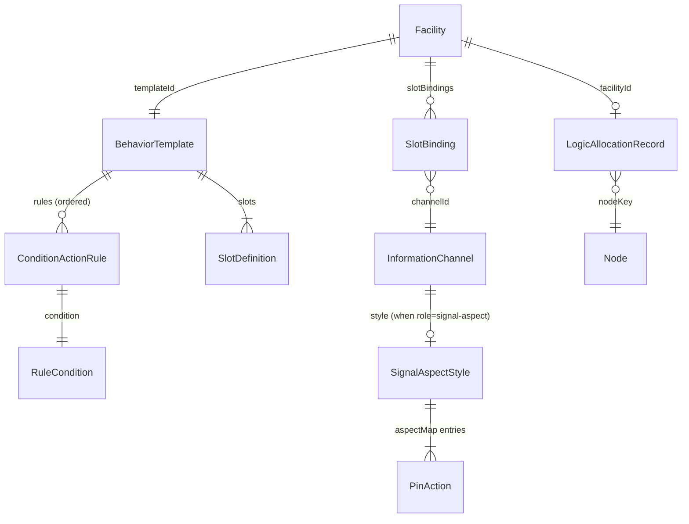
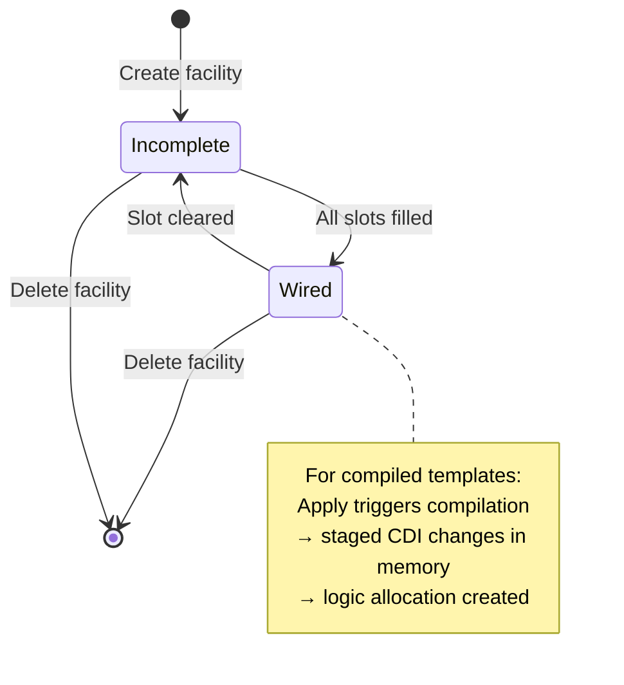
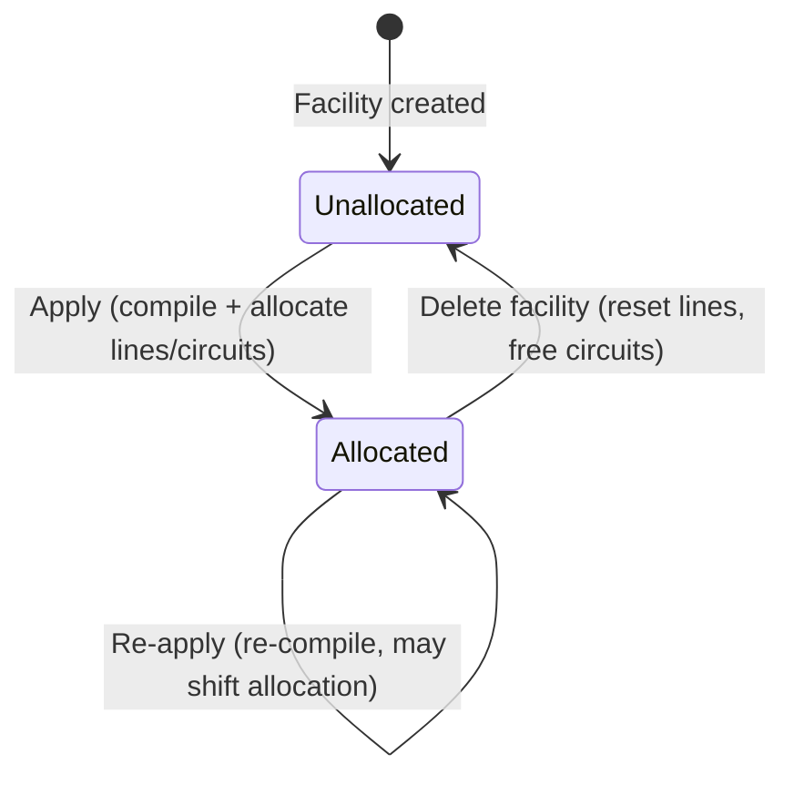

# Data Model: ABS Signaling

**Feature Branch**: `020-abs-signaling` | **Date**: 2026-07-07

## Entities

### 1. BehaviorTemplate (extended)

Extends the existing `BehaviorTemplate` entity from spec 018 with condition-action rules and compilation target.

| Field | Type | Required | Description |
|-------|------|----------|-------------|
| template_id | String | Yes | Unique identifier (e.g., `"abs-3-aspect-signal"`) |
| display_name | String | Yes | User-facing name (e.g., `"ABS 3-Aspect Signal"`) |
| slots | Vec\<SlotDefinition\> | Yes | Input/output slot declarations |
| mapping | Vec\<StateMapping\> | No | Simple state mappings (Block Indicator pattern) |
| rules | Vec\<ConditionActionRule\> | No | Ordered condition-action rules (ABS pattern) |
| compilation_target | Option\<String\> | No | Logic adapter ID (e.g., `"tower-lcc-conditional"`) |

**Invariant**: A template has either `mapping` (simple) or `rules` + `compilation_target` (compiled), not both.

### 2. SlotDefinition (existing, unchanged)

| Field | Type | Required | Description |
|-------|------|----------|-------------|
| label | String | Yes | Internal key (e.g., `"input"`, `"output"`) |
| display_label | String | Yes | User-facing label (e.g., `"Block"`, `"Signal Head"`) |
| kind | SlotKind | Yes | `Producer` or `Consumer` |
| required_role | String | Yes | Channel role this slot accepts |
| min_channels | u32 | Yes | Minimum bound channels |
| max_channels | Option\<u32\> | No | Maximum bound channels (None = unlimited) |

### 3. ConditionActionRule (new)

Ordered rules evaluated most-restrictive-first within a compiled template.

| Field | Type | Required | Description |
|-------|------|----------|-------------|
| condition | RuleCondition | Yes | What triggers this rule |
| aspect | String | Yes | Output aspect when condition is true (e.g., `"stop"`) |
| priority | u32 | Yes | Evaluation order (1 = highest priority = most restrictive) |

### 4. RuleCondition (new)

Discriminated union for rule conditions.

| Variant | Fields | Description |
|---------|--------|-------------|
| InputState | `{ input_slot: String, state: String }` | True when the named input slot's channel reports this state |
| DownstreamAspect | `{ input_slot: String, aspect: String }` | True when downstream signal reports this aspect (via Track Circuit) |
| Default | (none) | Always true — catch-all rule |

### 5. SignalAspectStyle (new)

Declares how abstract signal aspects map to physical LED on/off states.

| Field | Type | Required | Description |
|-------|------|----------|-------------|
| style_id | String | Yes | Unique identifier (e.g., `"2-led-bicolor-aspect"`) |
| display_name | String | Yes | User-facing name |
| pin_count | u32 | Yes | Number of Direct Lamp Control rows claimed |
| pin_labels | Vec\<String\> | Yes | Human-readable labels per pin (e.g., `["Red", "Green"]`) |
| aspect_map | BTreeMap\<String, Vec\<PinAction\>\> | Yes | Aspect → pin state mapping |

### 6. PinAction (new)

One pin's state within an aspect.

| Field | Type | Required | Description |
|-------|------|----------|-------------|
| pin | u32 | Yes | 0-indexed pin within the style |
| state | PinState | Yes | `On` or `Off` |

### 7. LogicAllocationRecord (new)

Tracks what hardware resources a facility has claimed on a specific node.

| Field | Type | Required | Description |
|-------|------|----------|-------------|
| facility_id | String | Yes | Owning facility's UUID |
| node_key | String | Yes | Target Tower LCC node's unique key |
| conditional_lines | Vec\<u32\> | Yes | 0-indexed line indices allocated (contiguous) |
| track_circuits | Vec\<u32\> | Yes | 1-indexed Track Circuit numbers allocated |

**Invariants**:
- `conditional_lines` must be contiguous (adjacent indices)
- `conditional_lines` values in 0..31
- `track_circuits` values in 1..8
- No two records may claim the same line or circuit on the same node

### 8. LogicAllocationsDocument (new)

Persistence wrapper for all allocation records.

| Field | Type | Required | Description |
|-------|------|----------|-------------|
| schema_version | String | Yes | `"1.0"` |
| allocations | Vec\<LogicAllocationRecord\> | Yes | All active allocations |

### 9. CompiledConditionalLine (new, transient)

Output of the template compiler — not persisted directly, but translated to CDI field writes.

| Field | Type | Required | Description |
|-------|------|----------|-------------|
| description | String | Yes | Human-readable label (e.g., `"Signal B1 - Stop"`) |
| function | ConditionalFunction | Yes | `Blocked`, `Group`, or `Last` |
| logic_operation | LogicOperation | Yes | `V1Only`, `NullTrue`, etc. |
| variable1 | Option\<CompiledVariable\> | No | First variable configuration |
| variable2 | Option\<CompiledVariable\> | No | Second variable configuration |
| action_when_true | ActionBehavior | Yes | `SendThenExit`, `EvaluateNext`, etc. |
| action_when_false | ActionBehavior | Yes | |
| action_events | Vec\<CompiledActionEvent\> | Yes | Up to 4 action events |

### 10. CompiledVariable (new, transient)

| Field | Type | Required | Description |
|-------|------|----------|-------------|
| trigger | VariableTrigger | Yes | `OnVariableChange`, `OnMatchingEvent`, `None` |
| source | VariableSource | Yes | `Events` or `TrackCircuit(1..8)` |
| track_speed | Option\<TrackSpeed\> | No | Speed threshold (when source is Track Circuit) |
| set_true_event | Option\<String\> | No | Consumer event ID (when source is Events) |
| set_false_event | Option\<String\> | No | Consumer event ID (when source is Events) |

### 11. CompiledActionEvent (new, transient)

| Field | Type | Required | Description |
|-------|------|----------|-------------|
| condition | ActionCondition | Yes | `None`, `Immediately`, `ImmediateIfTrue`, etc. |
| destination | ActionDestination | Yes | `Event` or `TrackCircuit(1..8)` |
| track_speed | Option\<TrackSpeed\> | No | Speed value (when destination is Track Circuit) |
| event_id | Option\<String\> | No | Producer event ID (when destination is Event) |

## Enums

### ConditionalFunction
`Blocked (0)` | `Group (1)` | `Last (3)`

### LogicOperation
`AND (0)` | `OR (1)` | `XOR (2)` | `ANDChange (3)` | `ORChange (4)` | `ANDThen (5)` | `NullTrue (6)` | `V1Only (7)` | `V2Only (8)`

### VariableTrigger
`OnVariableChange (0)` | `OnMatchingEvent (1)` | `None (2)`

### VariableSource
`Events (0)` | `TrackCircuit(u8)` — value 1..8

### TrackSpeed
`Stop (0)` | `Restricting (1)` | `Slow (2)` | `Medium (3)` | `Limited (4)` | `Approach (5)` | `ApproachMedium (6)` | `Clear (7)`

### ActionBehavior
`SendThenExit (0)` | `SendThenEvaluateNext (2)` | `ExitGroup (3)` | `EvaluateNext (4)`

### ActionCondition
`None (0)` | `Immediately (1)` | `AfterDelay (2)` | `ImmediateIfTrue (3)` | `ImmediateIfFalse (4)` | `DelayedIfTrue (5)` | `DelayedIfFalse (6)`

### ActionDestination
`Event (0)` | `TrackCircuit(u8)` — value 1..8

### PinState
`On` | `Off`

## Relationships

## State Transitions

### Facility Status (reuses spec 018)

### Logic Allocation Lifecycle

## Validation Rules

1. **Contiguous allocation**: `conditional_lines` must be adjacent indices (e.g., [3,4,5] not [3,5,7])
2. **Capacity limits**: No more than 32 conditional lines per node; no more than 8 Track Circuits per node
3. **No conflicts**: Two facilities cannot claim the same line or circuit on the same node
4. **Style compatibility**: Style's `aspect_map` must cover all aspects the template's rules produce
5. **Action count**: Each aspect's `PinAction` count must not exceed 4 (Tower LCC limit per line)
6. **Slot cardinality**: Slot bindings must satisfy `min_channels` ≤ count ≤ `max_channels`
