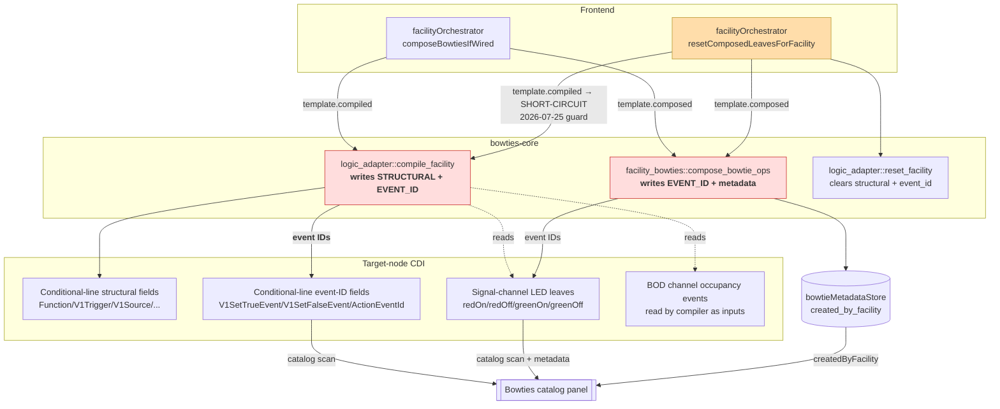
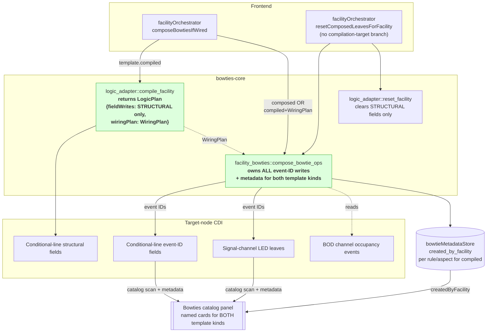

# Refactor Plan: Composer Event-Wiring Unification

**Branch**: `020-abs-signaling` | **Date**: 2026-07-26 | **Parent spec**: [spec.md](spec.md) | **Parent plan**: [plan.md](plan.md) | **Slice tracker**: [slices-event-wiring.md](slices-event-wiring.md)

## Summary

Retire the compile-side event-ID authority in `bowties-core::logic_adapter::compile_facility`. Consolidate all event-ID wiring — for both composed templates (Block Indicator) and compiled templates (ABS) — under `bowties-core::facility_bowties::compose_bowtie_ops`. The compiler emits structural CDI writes plus a typed `WiringPlan` describing the connections it needs; the bowtie composer resolves the plan against channel event IDs, writes the event IDs into both conditional-line slots and consumer LED leaves, and registers per-rule/aspect `BowtieMetadata`.

Motivating context: Spec 020 / S6 bugfix (2026-07-25) revealed that event-ID authority was split between the compiler and the composer, and the two paths' inverse (teardown) sequences were asymmetric. The Option C fix landed on 2026-07-25 encoded the symmetry as executable contract via short-circuit guards at both the frontend orchestrator and the backend composer boundary. That fix is correct and shipped, but it left the deeper root cause — dual event-wiring ownership — in place. A second user-visible bug is now observable: removing a channel from a Wired ABS facility does NOT clear the residual bowtie card from the catalog (Block Indicator clears its cards correctly). The bug persists because the compile-side inverse (`resetLogicForFacility`) is wired only into `deleteFacility`, not into `removeFromSlot`, `_cascadeDetach`, or `reconcileDanglingChannelRefsOnLoad`; the compiled facility's event IDs remain in the CDI after Un-Wire, the auto-catalog scan re-discovers them, and the residual card persists.

This refactor unifies the two owners so the residual-card bug closes uniformly across every un-Wire path without per-caller compile-inverse plumbing.

## Non-goals

- No changes to the ABS 3-Aspect Signal template's rule semantics.
- No changes to the LogicAllocation record schema or capacity enforcement.
- No cross-node cascade behavior (still deferred per spec 020 scope).
- No changes to the composed-template naming vocabulary beyond aligning Block Indicator to the same channel + state naming rule Option 1 defines below.

## Architecture Assessment

### Affected modules

| Module | Layer | Impact | Notes |
|---|---|---|---|
| [bowties-core/src/logic_adapter/mod.rs](../../bowties-core/src/logic_adapter/mod.rs) `compile_facility`, `compile_rule_to_field_writes` | Backend domain | Modified | Stops emitting event-ID variants of `ConditionalLineField`. Returns a new `LogicPlan { field_writes, wiring_plan }`. |
| [bowties-core/src/logic_adapter/mod.rs](../../bowties-core/src/logic_adapter/mod.rs) `reset_facility` | Backend domain | Modified | Stops emitting event-ID zero writes; structural fields only. |
| [bowties-core/src/logic_adapter/mod.rs](../../bowties-core/src/logic_adapter/mod.rs) `ConditionalLineField::element_type_hint()` | Backend domain | Touched | Already partitions `eventId` vs. `int`/`string`; the compiler filters on this predicate. |
| [app/src-tauri/src/commands/logic_adapter.rs](../../app/src-tauri/src/commands/logic_adapter.rs) IPC | Backend command | Modified | `compile_logic_for_facility` returns `LogicPlan`; wiring plan cached in `LayoutState` for the next compose IPC to consume. |
| [bowties-core/src/facility_bowties/mod.rs](../../bowties-core/src/facility_bowties/mod.rs) `compose_bowtie_ops` | Backend domain | Modified | Guard `Ok(vec![])` for compiled templates (added 2026-07-25) removed. Signature accepts optional `WiringPlan`. Emits `CompositionOp`s for conditional-line event-ID slots in addition to LED consumer leaves. Registers per-rule/aspect `BowtieMetadata` for compiled facilities. |
| [app/src-tauri/src/commands/facility_bowties.rs](../../app/src-tauri/src/commands/facility_bowties.rs) `compose_facility_bowties` IPC | Backend command | Modified | Guard `Ok(vec![])` for compiled templates removed. Fetches the wiring plan from `LayoutState` and threads it into `compose_bowtie_ops`. |
| [app/src/lib/orchestration/facilityOrchestrator.ts](../../app/src/lib/orchestration/facilityOrchestrator.ts) `composeBowtiesIfWired` | Frontend orchestrator | Modified | For compiled templates: call `compileLogicForFacility` (structural writes staged as drafts, wiring plan cached backend-side) then `composeFacilityBowties` (event-ID ops staged as drafts, metadata registered). |
| [app/src/lib/orchestration/facilityOrchestrator.ts](../../app/src/lib/orchestration/facilityOrchestrator.ts) `resetComposedLeavesForFacility` | Frontend orchestrator | Modified | `template.compilationTarget === 'compiled'` short-circuit (added 2026-07-25) removed. Uniform composer-forward or metadata-scan fallback for both template kinds. |
| [app/src/lib/orchestration/facilityOrchestrator.ts](../../app/src/lib/orchestration/facilityOrchestrator.ts) `deleteFacility` | Frontend orchestrator | Touched | `resetLogicForFacility` call retained for structural-field reset before allocation is freed; ordering unchanged. |
| [app/src/lib/orchestration/facilityCascadeOrchestrator.svelte.ts](../../app/src/lib/orchestration/facilityCascadeOrchestrator.svelte.ts) `_cascadeDetach`, `reconcileDanglingChannelRefsOnLoad` | Frontend orchestrator | Touched | No caller-side changes needed — the guard removal in `resetComposedLeavesForFacility` closes the residual-card bug at these sites as a side effect. If Track 1 bandage landed first, its added `resetLogicForFacility` calls at these sites are removed. |
| [bowties-core/src/facility_bowties/mod.rs](../../bowties-core/src/facility_bowties/mod.rs) bowtie naming helper | Backend domain | New | Small style-registry extension: given a channel's role and a state or pin label, return a human-readable string. Naming rule: `"<channel name> — <state or pin label>"`. Block Indicator's current state-mapping-derived names migrate to this rule for consistency. |
| [app/src/lib/stores/bowtieMetadata.svelte.ts](../../app/src/lib/stores/bowtieMetadata.svelte.ts) | Frontend store | Touched | No schema change. `bowtiesForFacility()` now returns rows for compiled facilities as well. |
| [aiwiki/seams.md](../../aiwiki/seams.md) "Facility Bowtie Lifecycle" | Docs | Modified | Rewrite the compile-vs-compose split narrative; single event-wiring owner. |
| [product/architecture/adr/0015-backend-layout-state-single-owner.md](../../product/architecture/adr/0015-backend-layout-state-single-owner.md) §"2026-07-25 extension" | ADR | Extended | Add a follow-up dated section titled "event-wiring consolidation — 2026-07-25 symmetry rule collapses to single-owner". The 2026-07-25 extension text stays intact (historically accurate); the follow-up section explains that Track 2 eliminated the two-owner situation. |

### Architectural shape

**Pattern names.**

- **Split Event-Wiring Ownership (today).** Two owners write event IDs into CDI: the composer writes them onto consumer LED leaves + registers `BowtieMetadata`, and the compiler writes them into conditional-line `V1SetTrueEvent` / `V1SetFalseEvent` / `ActionEventId(slot)` fields. Which owner runs is discriminated by `template.compilationTarget`.
- **Split Inverse-Wiring Ownership (today).** Symmetric ownership on teardown. ADR-0015 §"2026-07-25 extension" made the forward/inverse routing symmetry executable via short-circuit guards at both the frontend orchestrator and the backend composer boundary.
- **Structural Compiler + Wiring-Plan Handoff + Single Event-Wiring Owner (after).** The compiler becomes an emitter of *structural* CDI writes plus a typed `WiringPlan` describing the event-ID slots it wants filled in channel/role/slot vocabulary — no event IDs, no event-ID reads. The composer becomes the sole writer of event IDs for both template kinds. Metadata rows are registered per rule/aspect for compiled facilities, matching Block Indicator's per-state pattern.
- **Boundary-Enforced Field Partition.** `ConditionalLineField::element_type_hint()` already returns `"eventId"` for exactly the three variants Track 2 strips out (`V1SetTrueEvent` / `V1SetFalseEvent` / `ActionEventId(_)`), so the compile-side partition is a one-line predicate, not a schema change.

**Before diagram — Split ownership.**



Red = dual event-ID authorities. Amber = the 2026-07-25 short-circuit patching over the asymmetry.

**After diagram — Single event-wiring owner via WiringPlan handoff.**



Green = single-owner boundary. `compileIfWired → composer(withWiringPlan)` is a stub-and-widen pipeline: the compiler proves it can hand off a plan; the composer proves it can consume one and produce ops for both template kinds.

### Design decisions locked in

**D1 — WiringPlan handoff shape.** The compiler returns a typed `WiringPlan` inside `LogicPlan { field_writes, wiring_plan }`. `WiringPlan` enumerates each event-ID slot the compilation needs filled, in channel/role/slot vocabulary — no event IDs and no event-ID reads inside the compiler.

Approximate shape (final types resolved in S1):

```rust
pub struct WiringPlan {
    pub slots: Vec<WiringSlot>,
}

pub struct WiringSlot {
    /// Where the event ID must be written (conditional-line-side).
    pub target: ConditionalLineEventSlot {
        line_index: u32,
        field: ConditionalLineField,   // V1SetTrueEvent | V1SetFalseEvent | ActionEventId(slot)
    },
    /// Which channel slot supplies the ID and what role we want from it.
    pub source: SlotRef {
        slot_label: String,           // "input" | "output"
        role_hint: RoleHint,          // BlockOccupied | BlockClear | LedPin(pin_label) | ...
    },
    /// Which template rule and aspect this slot serves (for metadata registration).
    pub bowtie_identity: BowtieIdentity {
        rule_label: String,
        aspect: String,
    },
}
```

The composer resolves `SlotRef` → channel → existing event ID → writes to the target slot.

**D2 — IPC boundary shape.** The wiring plan lives backend-side, cached in `LayoutState` under the facility's key. The frontend orchestrator calls `compileLogicForFacility` (which returns structural field writes and caches the wiring plan) then `composeFacilityBowties` (which reads the cached wiring plan and returns event-ID `CompositionOp`s). The frontend never sees `WiringPlan` types. This keeps the frontend orchestrator symmetric with the composed-template path (it doesn't handle plans, just calls the two IPCs in order) and matches ADR-0015's single-in-memory-owner discipline.

**D3 — ActionEventId provenance.** The composer *adopts* existing event IDs from whichever side already has them; it does not mint fresh IDs during forward composition. This is the same behavior the composer already applies for composed templates via `resolution.writeTo` arbitration (per `BowtieCatalogPanel.handleNewConnection` and seams.md line 366). Applied to compiled ABS:

- `V1SetTrueEvent` / `V1SetFalseEvent` — adopted from the BOD channel's occupancy leaves.
- `ActionEventId(slot)` — adopted from the LED channel's pin leaves.

Minting fresh IDs would break the "shared bowtie" case: if the LED's event ID is already part of an existing bowtie (manually created, or shared with another consumer on the same daughterboard), a fresh ID would orphan the existing bowtie and silently create a new one-node bowtie. Adoption preserves the D6 producer-identifies-consumer-subscribes invariant that the seam entry pins.

Fresh-ID minting is retained *only* for the teardown path (`resetComposedLeavesForFacility` uses `generateFreshEventIdForNode` to break bus routing) — that behavior is unchanged.

**D4 — Bowtie naming: channel + state vocabulary (provenance-based).** The default bowtie name is `"<channel name> — <state or pin label>"`. Examples:

- BOD event: `"Block A — occupied"`, `"Block A — clear"`.
- LED event: `"Signal 5 Head — red on"`, `"Signal 5 Head — red off"`, `"Signal 5 Head — green on"`, `"Signal 5 Head — green off"`.

The channel's `role` (ADR-0013) defines the state vocabulary. A new style-registry helper (`style_state_label(role, state) → String`) does the concatenation.

Rationale: an event ID's meaning on the bus is a *provenance* concern — it's rooted at the channel leaf where the ID originated. Runtime producer identity may shift over time (a facility wiring may come or go), but the channel where the ID was born is stable. Naming from the provenance channel gives every consumer of that event a consistent name, and multi-producer configurations naturally converge on the same name because they share the same channel role + state.

Compiled facilities do NOT contribute to naming — a facility's rule name and aspect are used only for metadata *grouping* via `created_by_facility`, not for user-visible bowtie labels. This means:

- Different facilities wiring the same LED share one bowtie card named after the LED.
- A user renaming the bowtie later persists across facility re-wirings.
- The naming rule is single-sourced in the style registry, not scattered across templates.

**Block Indicator compatibility check.** Block Indicator currently derives names from the state mapping (e.g. "Block A occupied"). Under D4, Block Indicator's derived names become "Block A — occupied" (channel name + role state). The migration is small and lands in S2 as part of the naming-rule unification.

**D5 — Metadata granularity.** One `BowtieMetadata` row per event ID (unchanged schema). For compiled facilities this naturally produces one row per LED pin event (typically 4 per signal head) plus one row per input-condition event (typically 2 per BOD input), all with `createdByFacility` back-references. Matches Block Indicator's per-state pattern — the metadata key is `event_id_hex`, so per-rule/per-aspect granularity is *forced* by the schema, not chosen.

### Seams audit

**Facility Bowtie Lifecycle** ([aiwiki/seams.md](../../aiwiki/seams.md#L335), `Last-modified: 2026-07-25`, `Last-audited: 2026-07-07`).

- Owner today = frontend orchestrator + backend composer boundary (dual). After Track 2 = backend composer becomes the single event-wiring owner; compiler is demoted to a structural-writes-plus-plan contributor.
- Contributors change: `logic_adapter/mod.rs` moves from "owns forward compile AND inverse reset" (per current seam entry) to "owns forward *structural* compile AND inverse *structural* reset, plus a WiringPlan handoff." The seam entry's "Write surface is disjoint from `compose_bowtie_ops`" claim is deleted — the surfaces overlap on event-ID slots by design, with composer as arbiter.
- Consumers unchanged (catalog panel, FacilityCard status pill, D6 producer-identifies wire behavior).
- Bump `Last-modified` and `Last-audited` on landing.

**ADR-0015 Invariants table** ([product/architecture/adr/0015-*.md](../../product/architecture/adr/0015-backend-layout-state-single-owner.md#L226)).

| Invariant | Status | Evidence |
|---|---|---|
| `LayoutState` is sole in-memory owner of persistent CDI XML + trees + saved layout docs | OK | Wiring plan is cached in `LayoutState`; single-owner discipline preserved. |
| `LayoutState::cdi_xml(key)` / `config_tree(key)` prefer `captured` over `saved` | OK | Composer's compiled-template branch reads through the same effective views. |
| `LiveNodeProxy::snapshot()` always emits `cdi: None` | OK | Unchanged. |
| `AppState::OfflineBowtieData` is gone; offline branch derives from `LayoutState` | OK | Unchanged. |
| 2026-07-25 extension: any discriminator on the forward path MUST be mirrored on the inverse | **Collapses (intentional supersede)** | Track 2 removes the discriminator entirely — one owner, one path. The invariant becomes vacuous. Recorded as a follow-up dated section on ADR-0015; the 2026-07-25 extension is *not* deleted (it remains historically accurate for the pre-Track-2 codebase). |
| 2026-07-25 extension: `compose_bowtie_ops` returns `Ok(vec![])` for compiled templates as executable boundary defense | **Rewritten** | The guard's protective purpose (compose never crashes on compiled input) is preserved by extending the composer to *correctly* handle compiled input rather than short-circuit. Tests migrate from "asserts empty vec" to "asserts wiring-plan-derived ops emitted". |

ADRs 0011 (dirty breakdown), 0012 (draft layer), 0013 (channel role/style) — no `## Invariants` section; no drift risk. Deltas (`AllocateLogic`, `FreeLogic`) continue to ride the existing draft pipeline unchanged.

### Findings

**F1 — Depth of the unified composer (Depth / SOLID-SRP).** The composer today has a narrow, testable interface. Adding a `wiring_plan: Option<WiringPlan>` parameter and internally branching between consumer-leaf slots and conditional-line slots deepens the module without widening its interface — one function that hides "how event IDs flow onto a facility's targets" from all callers. The compiler symmetrically shallows: it loses ownership of a concern it was never the natural home for.  **Include.**

**F2 — WiringPlan as a real seam vs. hypothetical (Seam placement / YAGNI).** The seam has one template producer today (`ABS_3_ASPECT_SIGNAL`) but its consumer is exercised for both template kinds. Its purpose is not primarily variation — it is *ownership consolidation*. YAGNI does not apply where the seam collapses a duplicated concern rather than speculating on future variation. The ADR follow-up documents this as an "ownership seam, not variation seam."  **Include.**

**F3 — ActionEventId provenance — adopt existing IDs, do not mint.** Locked to D3 above. Not a design decision after all; the existing composer adoption behavior is the answer.  **Include.**

**F4 — Metadata granularity: forced per event ID by schema.** Locked to D5 above. Not a design decision; the schema key is `event_id_hex`.  **Include.**

**F5 — Duplication — event-ID source-of-truth (DRY).** Today the compiler reads existing event IDs from BOD occupancy leaves and LED consumer leaves and re-emits them. This is a duplication of the composer's job. Track 2 removes the duplication.  **Include.**

**F6 — Testability — WiringPlan test surface (Testability / Locality).** A typed `WiringPlan` is more testable than the current "read emitted field writes and grep for event-ID variants" pattern. Compiler tests assert plan shape; composer tests assert plan-consumption ops; end-to-end tests assert the pipeline. The current `compiled_template_short_circuits_to_empty_ops` test is replaced by "compiled template's WiringPlan is consumed to produce N ops for N slots."  **Include.**

**F7 — Cross-layer coupling — WiringPlan stays backend-side (Locality).** Locked to D2 above.  **Include.**

**F8 — Deepening opportunity — retire `reset_facility` event-ID clearing (Depth / YAGNI).** Once event IDs are composer-owned, the composer's fresh-ID rewrite during teardown already breaks bus routing. The compiler's `reset_facility` can stop emitting event-ID zeros; it only needs to reset structural fields to CDI defaults so the allocation can be freed cleanly on delete.  **Include (S4).**

**F9 — Existing debt — the 2026-07-25 extension (Existing debt / ADR compliance).** The extension is technically-correct executable contract for a two-owner design. It's a bandage in the sense that it prevents *any-caller* misuse rather than fixing the *root cause* (dual ownership). Track 2 supersedes the extension by removing the root cause; the extension gets marked historical, not deleted, in a follow-up dated ADR-0015 section.  **Include (S5).**

**F10 — Naming rule unification (Locality / DRY).** Locked to D4 above. Block Indicator's derived names migrate to the same channel + state rule for a single naming source of truth.  **Include (S2).**

### Vertical slices

Ordered risk-first. Every slice keeps the codebase green (existing tests pass after each). The 2026-07-25 short-circuit guards remain in place through S1 and S2 as a safety net; S3 removes them.

**S1: Compiler emits `LogicPlan { field_writes, wiring_plan }` with the plan cached backend-side but *unconsumed* by the composer** [HITL] [REFACTOR]

- Type: HITL — establishes the WiringPlan seam and its cache shape in `LayoutState`.
- Layers: Backend domain, Backend command, `LayoutState`.
- Blocked by: None.
- Test: ABS facility compilation returns the same `field_writes` set as before (minus event-ID variants), and the returned `WiringPlan` describes the correct slots for the ABS 3-Aspect template. All existing tests pass, including `compiled_template_short_circuits_to_empty_ops` and the S6 orchestrator tests.
- Acceptance: `cargo test -p bowties-core` and `vitest run` green. Manual demo: `npx tauri dev`, create + wire ABS facility, verify conditional-line CDI fields on the target node match today exactly (event-ID slots are still written — by the composer's short-circuit path they remain `0u8; 8` placeholders, and the frontend orchestrator's existing `resetComposedLeavesForFacility` short-circuit means they are never re-touched; the WiringPlan is cached but not yet consumed). Architecture note in slice card explains D1 and D2.

**S2: Composer consumes WiringPlan for compiled templates; registers per-event-ID `BowtieMetadata`; Block Indicator naming aligned to Option 1** [HITL] [User-visible]

- Type: HITL — establishes the "composer as sole event-wiring owner" behavior. Also touches Block Indicator's naming rule.
- Layers: Backend domain, Backend command, Frontend orchestrator (compose call), Frontend store (bowtieMetadataStore).
- Blocked by: S1.
- Test: Compiled ABS facility, after Wire, produces `CompositionOp`s that write the correct event IDs (adopted from BOD and LED channel leaves) into the conditional-line slots AND registers per-event-ID `BowtieMetadata` rows with `createdByFacility` set. Block Indicator continues to produce its existing bowties but with names derived from the new channel + state rule.
- Acceptance: `cargo test -p bowties-core` and `vitest run` green. Manual demo: wire an ABS facility, open Bowties catalog panel, see named cards for each BOD occupancy event and each LED pin event (e.g. "Block A — occupied", "Signal 5 Head — red on") with facility back-reference. Wire a Block Indicator; verify its bowtie card names read as "Block A — occupied" style (migrated from prior "Block A occupied" style).

**S3: Remove 2026-07-25 short-circuits; rewrite S6 tests to assert unified-owner contract; residual-catalog-card bug closes** [AFK] [User-visible]

- Type: AFK — pattern established by S1 + S2; this slice removes the guards and rewrites the tests they protect.
- Layers: Backend domain (`compose_bowtie_ops` guard), Backend command (`compose_facility_bowties` IPC guard), Frontend orchestrator (`resetComposedLeavesForFacility` guard). Test rewrites in `bowties-core/src/facility_bowties/mod.rs` and `app/src/lib/orchestration/facilityOrchestrator.test.ts`.
- Blocked by: S2.
- Test: `compiled_template_short_circuits_to_empty_ops` becomes `compiled_template_composes_from_wiring_plan` (asserts N `CompositionOp`s emitted for N wiring-plan slots). The two S6 orchestrator tests (`deleteFacility on Wired compiled-template facility skips the composer IPC` and `removeFromSlot on Wired compiled-template facility ...`) become their inverse (`deleteFacility` and `removeFromSlot` on Wired compiled facility DO invoke the composer, produce teardown ops for both LED and conditional-line event-ID slots, and register the metadata deletions).
- Acceptance: `cargo test -p bowties-core` and `vitest run` green. Manual demo: create + wire ABS facility, verify catalog card present. Remove one of the wired channels; verify the ABS facility's bowtie cards disappear from the catalog (same UX as Block Indicator). Trigger cascade via BOD daughterboard clear; verify catalog cards disappear. Load a layout that has a dangling channel reference on an ABS facility; verify catalog cards do not appear post-load-time-repair.

**S4: `reset_facility` stops emitting event-ID zeros (structural fields only)** [AFK] [REFACTOR]

- Type: AFK — narrow simplification following S3.
- Layers: Backend domain.
- Blocked by: S3.
- Test: `reset_facility` unit tests updated to assert no event-ID field writes are emitted. `deleteFacility` end-to-end still results in a clean allocation-free target node (composer's fresh-ID rewrite in teardown handles event IDs; compiler's structural reset handles the rest).
- Acceptance: `cargo test -p bowties-core` and `vitest run` green. Manual demo: create + wire + apply + delete an ABS facility; verify target node's conditional-line range is clean (structural fields at CDI defaults, event-ID slots at fresh non-routing IDs).

**S5: Documentation and ADR-0015 follow-up section** [AFK] [REFACTOR]

- Type: AFK — documentation-only.
- Layers: Docs.
- Blocked by: S4.
- Test: `plan.md` cross-references updated; `plan-event-wiring.md` marked complete.
- Acceptance: `aiwiki/seams.md` "Facility Bowtie Lifecycle" rewritten to reflect single-owner design; `Last-modified` and `Last-audited` bumped to landing date. `aiwiki/owners.md` updates for `bowties-core::facility_bowties` (now owns event wiring for both template kinds), `bowties-core::logic_adapter` (structural writes + WiringPlan), and the new naming helper. `aiwiki/architecture-health.md` updated to note the 2026-07-25 forward/inverse symmetry rule collapsed under Track 2. ADR-0015 gains a new dated section `## 2026-07-DD extension: event-wiring consolidation — 2026-07-25 symmetry rule collapses to single-owner`. `product/glossary.md` updated to add `WiringPlan` and clarify that the bowtie composer is the sole event-wiring owner.

### Deferred improvements

None identified in this session. If a Track 2 slice surfaces adjacent improvements they are captured as `kind/idea` GitHub issues per copilot-instructions "Issue Capture Protocol."

### Architecture decisions

- ADR-0015 gains a follow-up dated section in S5. No new ADR is written — Track 2 does not introduce a new seam; it consolidates ownership within the existing "backend LayoutState owns the in-memory layout model" seam.
