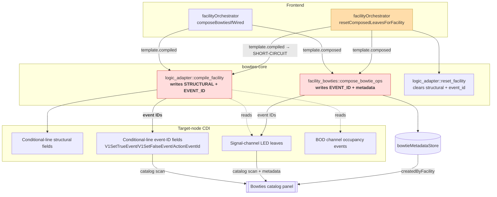
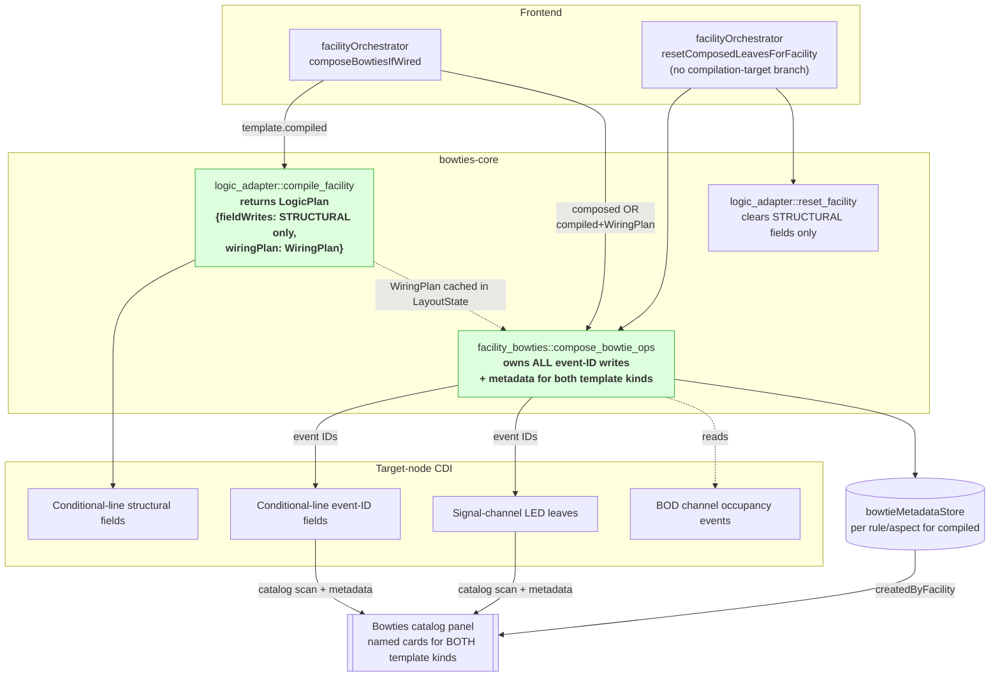

# Slices: Composer Event-Wiring Unification

Branch: 020-abs-signaling
Generated: 2026-07-26
Status: 1/5 slices complete
Parent plan: [plan-event-wiring.md](plan-event-wiring.md)

## Architecture

### Before — Split event-wiring ownership

Red = dual event-ID authorities. Amber = the 2026-07-25 short-circuits patching over the asymmetry.

### After — Single event-wiring owner via WiringPlan handoff

Green = single-owner boundary.

### Patterns

- **Structural Compiler + Wiring-Plan Handoff** — The compiler emits *structural* CDI writes plus a typed `WiringPlan` describing the event-ID slots it wants filled (channel/role/slot vocabulary, no event IDs). The plan is cached backend-side in `LayoutState`, so the frontend orchestrator stays symmetric across template kinds — it just calls compile-then-compose.
- **Single Event-Wiring Owner** — `facility_bowties::compose_bowtie_ops` becomes the sole writer of event IDs for both composed and compiled templates, and the sole registrar of `BowtieMetadata`. Teardown is symmetric: one owner runs on both forward and inverse paths, so no discriminator-mirroring rule is needed.
- **Adopt-Not-Mint** — On forward composition, the composer adopts existing event IDs from the source channel leaves (BOD occupancy, LED pins) rather than minting fresh IDs, preserving multi-consumer bowtie sharing. Fresh-ID minting is retained *only* for the teardown path (`generateFreshEventIdForNode`).
- **Provenance-Based Naming** — The default bowtie name is `"<channel name> — <state or pin label>"`. The channel's role (ADR-0013) defines the state vocabulary via a `style_state_label(role, state)` helper. Names come from the provenance channel, not from the wiring facility, so multi-producer configurations converge on the same name and Block Indicator + ABS share one naming rule.
- **Boundary-Enforced Field Partition** — `ConditionalLineField::element_type_hint()` already partitions `eventId` vs. structural fields; the compiler filters on this predicate to route event-ID slots into the `WiringPlan` and structural writes into `field_writes`.

### Module Changes

| Module | Today | After |
|---|---|---|
| [bowties-core/src/logic_adapter/mod.rs](../../bowties-core/src/logic_adapter/mod.rs) `compile_facility` | Emits structural + event-ID `ConditionalLineField` writes | Returns `LogicPlan { field_writes, wiring_plan }`; `field_writes` structural-only; `wiring_plan` describes event-ID slots in channel/role/slot vocabulary |
| [bowties-core/src/logic_adapter/mod.rs](../../bowties-core/src/logic_adapter/mod.rs) `reset_facility` | Zeros structural + event-ID fields | Zeros structural fields only; event-ID teardown handled by composer |
| [app/src-tauri/src/commands/logic_adapter.rs](../../app/src-tauri/src/commands/logic_adapter.rs) | Emits field writes only | Returns structural field writes; caches `WiringPlan` in `LayoutState` for the next compose IPC |
| [bowties-core/src/facility_bowties/mod.rs](../../bowties-core/src/facility_bowties/mod.rs) `compose_bowtie_ops` | Guard `Ok(vec![])` for compiled; owns event-ID writes to LED leaves only | Consumes optional `WiringPlan`; sole writer of event IDs (LED leaves + conditional-line slots); registers per-event `BowtieMetadata` for both template kinds |
| [bowties-core/src/facility_bowties/mod.rs](../../bowties-core/src/facility_bowties/mod.rs) style registry | Ad-hoc per-template naming | New helper `style_state_label(role, state) → String` — single source of naming truth |
| [app/src-tauri/src/commands/facility_bowties.rs](../../app/src-tauri/src/commands/facility_bowties.rs) | Guard `Ok(vec![])` for compiled | Reads cached `WiringPlan` from `LayoutState` and threads into composer |
| [app/src/lib/orchestration/facilityOrchestrator.ts](../../app/src/lib/orchestration/facilityOrchestrator.ts) `composeBowtiesIfWired` | Branches by template kind | Uniform compile-then-compose for compiled templates; unchanged for composed |
| [app/src/lib/orchestration/facilityOrchestrator.ts](../../app/src/lib/orchestration/facilityOrchestrator.ts) `resetComposedLeavesForFacility` | Short-circuits for `compilationTarget === 'compiled'` | Uniform composer-forward for both template kinds |
| [app/src/lib/orchestration/facilityCascadeOrchestrator.svelte.ts](../../app/src/lib/orchestration/facilityCascadeOrchestrator.svelte.ts) | Skips composer teardown for compiled facilities | No change — residual-card bug closes as a side effect of the guard removal in `resetComposedLeavesForFacility` |
| [app/src/lib/stores/bowtieMetadata.svelte.ts](../../app/src/lib/stores/bowtieMetadata.svelte.ts) | `bowtiesForFacility()` returns rows only for composed facilities | Returns rows for compiled facilities as well (no schema change) |
| [aiwiki/seams.md](../../aiwiki/seams.md) "Facility Bowtie Lifecycle" | Documents dual-owner design + 2026-07-25 symmetry rule | Rewritten for single-owner design; symmetry rule marked collapsed |
| [product/architecture/adr/0015-backend-layout-state-single-owner.md](../../product/architecture/adr/0015-backend-layout-state-single-owner.md) | 2026-07-25 extension: any forward discriminator must be mirrored on inverse | New follow-up dated section noting Track 2 collapsed the discriminator; 2026-07-25 extension retained as historical |
| [product/glossary.md](../../product/glossary.md) | No `WiringPlan` entry | Adds `WiringPlan`; clarifies bowtie composer is sole event-wiring owner |

### Behavior Summary

| Slice | User-visible change | Demoable? |
|---|---|---|
| S1: Compiler returns `LogicPlan` with unconsumed `WiringPlan` | Invariant preserved: ABS wiring behaves identically to today | No (REFACTOR — new seam introduced but not yet load-bearing) |
| S2: Composer consumes `WiringPlan`; named cards for ABS; Block Indicator naming migrated | Wiring an ABS facility populates the Bowties catalog with named cards (e.g. "Signal 5 Head — red on"); Block Indicator cards read as "Block A — occupied" | Yes |
| S3: Remove 2026-07-25 short-circuits; residual-card bug closes | Removing a channel from a Wired ABS facility clears its bowtie cards from the catalog (same UX as Block Indicator) | Yes |
| S4: `reset_facility` structural-only | Invariant preserved: deleting an ABS facility leaves a clean target node | No (REFACTOR) |
| S5: Docs + ADR-0015 follow-up | Invariant preserved: docs match code | No (REFACTOR) |

---

## Roadmap

| # | Slice title | Label | Blocked by | Status |
|---|---|---|---|---|
| S1 | Compiler emits `LogicPlan` with unconsumed `WiringPlan` | HITL | None | done |
| S2 | Composer consumes `WiringPlan`; named cards + naming rule unified | HITL | S1 | sketched |
| S3 | Remove 2026-07-25 short-circuits; residual-card bug closes | AFK | S2 | sketched |
| S4 | `reset_facility` emits structural fields only | REFACTOR | S3 | sketched |
| S5 | Docs + ADR-0015 follow-up | REFACTOR | S4 | sketched |

### S1: Compiler emits `LogicPlan` with unconsumed `WiringPlan` [HITL] [REFACTOR]

**Intent**: Invariant preserved — wiring an ABS facility produces the same on-node CDI as today. Establishes the `WiringPlan` as a pure derivation from `Facility + Template + Channels + CDI`, exposed alongside `compile_facility` so a later slice's composer can consume it without changing runtime behavior.
**Boundary**: Backend domain (`bowties-core::logic_adapter` — split compile emissions into structural `field_writes` + `wiring_plan`; expose `plan_facility_wiring` as a pure derivation) → Backend command (`compile_logic_for_facility` — extends `CompiledLogicPlan` DTO with `wiring_plan` for debug visibility).
**Blocked by**: None
**Status**: done
**Complexity**: medium
**User stories**: none (structural refactor — supports US-abs-wire in S2)

**Design decisions locked in HITL** (2026-07-26):

- **D1: A1 — identifier-only WiringPlan with full `bowtie_identity` locked in S1.** `WiringSlot { target, source: SlotRef { slot_label, role_hint }, bowtie_identity: { rule_label, aspect } }`. No event IDs on the compiler's output.
- **D2: A-alt — no cache; `WiringPlan` is a pure derivation.** Both `compile_facility` and future compose paths derive the plan from the same inputs (`Facility + Template + Channels + CDI`), rather than the compile step caching a value the compose step reads. This supersedes the plan document's D2 sketch ("cache in `LayoutState`"). The `CompiledLogicPlan` DTO still carries `wiring_plan` on the compile IPC return for debug/audit visibility, but nothing on either side of the IPC boundary treats it as authoritative state — a future compose IPC can recompute if it prefers. No `LayoutState` field is added. No ADR-0015 extension is needed.

**Acceptance criteria**:
- [x] Wiring an ABS 3-Aspect facility produces the exact same conditional-line field values on the target node as before this slice (structural fields from compiler; event-ID slots still filled by the existing composer short-circuit + compiler path — no observable change).
- [x] `compile_facility` returns `CompiledLogicOutput { allocation, field_writes, wiring_plan }`; `field_writes` contains only structural `ConditionalLineField` variants (no `V1SetTrueEvent` / `V1SetFalseEvent` / `ActionEventId(_)`).
- [x] The returned `WiringPlan` enumerates one `WiringSlot` for each event-ID slot the ABS template needs filled, referencing channel slots by label + role (not by event ID). Every slot carries `bowtie_identity: { rule_label, aspect }`.
- [x] `plan_facility_wiring` is exposed as a `pub` pure function taking the same input struct `compile_facility` accepts; called twice with the same input returns an equal `WiringPlan`.
- [x] All existing tests remain green — including `compiled_template_short_circuits_to_empty_ops`, the S6 orchestrator tests (`deleteFacility`/`removeFromSlot` skip composer IPC), and existing Block Indicator tests.
- [ ] Manual demo (`npx tauri dev`): create + wire an ABS facility, inspect target node's conditional-line CDI fields, confirm they match today exactly. **← awaiting user QA**

**Architecture note** *(HITL — new seam)*: Introduces the **Structural Compiler + Wiring-Plan Handoff** pattern (Finding F2 — an ownership seam, not a variation seam). Under D2 A-alt the "handoff" is a *shared pure derivation* rather than a cached artifact — categorically stronger against ADR-0015's cache-invalidation regression class (no cache, no invalidation surface). The `WiringPlan` type shape (D1 A1) is load-bearing for S2 and S3; the derivation function's `pub` signature is load-bearing for the S2 composer to call directly.

**Tasks**:
- [x] S1-T1: Integration test — RED written first, then GREEN. Test `compile_emits_wiring_plan_with_no_event_ids_in_field_writes` asserts `field_writes` has no event-ID variants and `wiring_plan.slots` matches the ABS 3-Aspect template's expected slots.
- [x] S1-T2: New submodule `bowties-core/src/logic_adapter/wiring_plan.rs` with `WiringPlan`, `WiringSlot`, `ConditionalLineEventSlot`, `SlotRef`, `RoleHint` enum, `BowtieIdentity`, and `pub fn plan_facility_wiring(input: &CompileInput) -> WiringPlan`.
- [x] S1-T3: `compile_rule_to_field_writes` split — V1SetTrueEvent, V1SetFalseEvent, ActionEventId(_) emit sites removed from structural-write path; `CompiledLogicOutput` reshaped to `{ allocation, field_writes, wiring_plan }`. `ConditionalLineField` gains `Serialize, Deserialize` derives for IPC.
- [x] S1-T4: `reset_facility` — `TODO(track-2-S4)` comment added above event-ID emit sites.
- [x] S1-T5: Backend unit tests — expected-slot-list, idempotence, and composed-template-empty-plan tests all green.
- [x] S1-T6: `CompiledLogicPlan` DTO in `commands/logic_adapter.rs` extended with `wiring_plan`.
- [x] S1-T7: `app/src/lib/api/logicAdapter.ts` TS declarations updated for extended DTO.
- [x] S1-T8: Validate — `cargo test -p bowties-core` green (54 logic_adapter + 10 facility_bowties tests); `npx vitest run` green (38 orchestrator tests); composer short-circuit test `compiled_template_short_circuits_to_empty_ops` remains green.

### S2: Composer consumes `WiringPlan`; named cards for ABS; Block Indicator naming migrated [HITL]

**Intent**: Wiring an ABS facility populates the Bowties catalog with named cards for every BOD occupancy event and every LED pin event (e.g. "Signal 5 Head — red on"), with facility back-references. Block Indicator's existing bowtie cards migrate to the same channel + state naming rule.
**Boundary**: Backend domain (`facility_bowties::compose_bowtie_ops` — remove `Ok(vec![])` compiled short-circuit; call `plan_facility_wiring` from `bowties-core::logic_adapter`; emit ops for both LED consumer leaves and conditional-line event-ID slots; register `BowtieMetadata` per event ID; new `style_state_label` helper) → Backend command (`compose_facility_bowties` IPC — remove `Ok(vec![])` compiled short-circuit) → Frontend orchestrator (`composeBowtiesIfWired` — no behavior change; the compiled-template branch just now returns ops instead of an empty vec) → Frontend store (`bowtieMetadataStore` — `bowtiesForFacility()` starts returning rows for compiled facilities as well; no schema change).
**Blocked by**: S1 ✅
**Status**: sketched

**S1 learnings that shape S2**:
- The composer calls `bowties_core::logic_adapter::plan_facility_wiring(input)` directly (D2 A-alt) — no cache read, no IPC round-trip for the plan.
- `ConditionalLineField` is already IPC-serializable, so the composer can freely construct target CDI addresses from `WiringSlot.target.field + line_index`.
- Every `WiringSlot` carries `bowtie_identity { rule_label, aspect }` — the composer uses this directly as the `BowtieMetadata` grouping key alongside the `event_id_hex` primary key.
- The `Ok(vec![])` short-circuits (backend `compose_bowtie_ops` L?? and `compose_facility_bowties` IPC L123-126) MUST be removed in S2 — without their removal, no ops are produced for compiled templates and no cards appear. The FE-side `resetComposedLeavesForFacility` short-circuit (L467-475) stays in place through S2; S3 removes it. Cards persist after `removeFromSlot` on a compiled facility until S3 lands — that residual-card bug is exactly what S3 fixes.

**Acceptance criteria**:
- [ ] After wiring an ABS 3-Aspect facility, the Bowties catalog panel shows one named card per LED pin event (typically 4 per signal head) and one per BOD input-condition event (typically 2 per BOD input), each with the facility as its `createdByFacility` back-reference.
- [ ] ABS bowtie card names follow the rule `"<channel name> — <state or pin label>"` — e.g. "Block A — occupied", "Block A — clear", "Signal 5 Head — red on", "Signal 5 Head — green off".
- [ ] Wiring a Block Indicator produces cards named by the same rule — e.g. "Block A — occupied" (migrated from prior "Block A occupied" wording).
- [ ] The composer *adopts* existing event IDs from the source channel leaves (does not mint fresh IDs during forward composition); a bowtie already present on an LED pin remains the same bowtie after ABS wiring adopts it.
- [ ] On-node CDI after wire is identical to S1 baseline (event-ID slots now written by composer instead of compiler, but the resulting values match).
- [ ] All existing tests remain green *except* `compiled_template_short_circuits_to_empty_ops`, which is rewritten as part of this slice to assert the new WiringPlan consumption behavior. The FE S6 orchestrator tests (`facilityOrchestrator.test.ts` L541 / L741) remain green — they still assert the FE short-circuit behavior, which stays intact through S2.
- [ ] `FacilityCard` status pill continues to reflect the correct Wired/Unwired state for both ABS and Block Indicator (Facility Bowtie Lifecycle seam Consumer).
- [ ] Manual demo: wire ABS facility → open catalog → see named cards with facility back-reference. Wire Block Indicator → verify migrated naming.

**Architecture note** *(HITL — pattern shift)*: This slice locks in the **Single Event-Wiring Owner** pattern (Finding F1 — deepens composer without widening interface) and the **Adopt-Not-Mint** discipline for compiled templates (Finding F3 — preserves D6 producer-identifies-consumer-subscribes seam invariant). It also unifies naming under the **Provenance-Based Naming** rule (Finding F10 / D4), which migrates Block Indicator's existing user-visible names. The Block Indicator name migration is user-visible and worth flagging before implementation. The FE `resetComposedLeavesForFacility` short-circuit remains as a safety net through S2; S3 removes it.

### S3: Remove 2026-07-25 short-circuits; residual-card bug closes [AFK]

**Intent**: Removing a channel from a Wired ABS facility (via `removeFromSlot`, cascade detach, or load-time dangling-ref repair) clears the ABS facility's bowtie cards from the catalog — the same UX Block Indicator has today. Closes the residual-catalog-card bug identified in plan-event-wiring.md.
**Boundary**: Backend domain (`compose_bowtie_ops` guard removal) → Backend command (`compose_facility_bowties` IPC guard removal) → Frontend orchestrator (`resetComposedLeavesForFacility` guard removal). Test rewrites in `bowties-core` composer tests and `facilityOrchestrator.test.ts`.
**Blocked by**: S2
**Status**: sketched

**Acceptance criteria**:
- [ ] `removeFromSlot` on a Wired ABS facility clears the facility's bowtie cards from the catalog (previously they persisted).
- [ ] Cascade detach (BOD daughterboard cleared) on a Wired ABS facility clears its bowtie cards from the catalog.
- [ ] Load-time repair of a dangling channel reference on a Wired ABS facility results in no orphaned catalog cards.
- [ ] `deleteFacility` on a Wired ABS facility still results in a clean target node with no orphaned cards (unchanged UX, different implementation path).
- [ ] `compiled_template_short_circuits_to_empty_ops` test is rewritten as `compiled_template_composes_from_wiring_plan` and asserts N `CompositionOp`s emitted for N wiring-plan slots.
- [ ] The two S6 orchestrator tests are rewritten to their inverse: `deleteFacility` and `removeFromSlot` on Wired compiled facility DO invoke the composer, produce teardown ops for both LED and conditional-line event-ID slots, and register metadata deletions.
- [ ] All test suites (`cargo test -p bowties-core`, `vitest run`) green.
- [ ] Manual demo covers all four channel-removal paths (delete, removeFromSlot, cascade, load-time repair) and confirms catalog cleanliness.

### S4: `reset_facility` emits structural fields only [REFACTOR]

**Intent**: Invariant preserved — deleting a Wired ABS facility still leaves the target node clean (structural fields at CDI defaults, event-ID slots at fresh non-routing IDs). Simplifies `reset_facility` by removing event-ID teardown, which is now the composer's sole responsibility.
**Boundary**: Backend domain (`bowties-core::logic_adapter::reset_facility`).
**Blocked by**: S3
**Status**: sketched

**Acceptance criteria**:
- [ ] `reset_facility` unit tests updated to assert no event-ID field writes are emitted.
- [ ] End-to-end `deleteFacility` on a Wired ABS facility still results in target-node conditional-line range with structural fields at CDI defaults and event-ID slots at fresh non-routing IDs (composer's `generateFreshEventIdForNode` teardown behavior handles the latter).
- [ ] `cargo test -p bowties-core` and `vitest run` green.
- [ ] Manual demo: create + wire + apply + delete an ABS facility; inspect target node's conditional-line range for cleanliness.

### S5: Docs + ADR-0015 follow-up [REFACTOR]

**Intent**: Invariant preserved — durable docs match the code after Track 2. Records the ownership consolidation so future sessions read the correct architecture.
**Boundary**: Docs only — `aiwiki/`, `product/architecture/adr/`, `product/glossary.md`.
**Blocked by**: S4
**Status**: sketched

**Acceptance criteria**:
- [ ] [aiwiki/seams.md](../../aiwiki/seams.md) "Facility Bowtie Lifecycle" rewritten to reflect single-owner design (composer as sole event-wiring owner; compiler as structural + WiringPlan producer). `Last-modified` and `Last-audited` bumped to landing date.
- [ ] [aiwiki/owners.md](../../aiwiki/owners.md) updated for `bowties-core::facility_bowties` (now owns event wiring for both template kinds), `bowties-core::logic_adapter` (structural writes + `WiringPlan`), and the new `style_state_label` naming helper.
- [ ] [aiwiki/architecture-health.md](../../aiwiki/architecture-health.md) notes that the 2026-07-25 forward/inverse symmetry rule collapsed under Track 2.
- [ ] [product/architecture/adr/0015-backend-layout-state-single-owner.md](../../product/architecture/adr/0015-backend-layout-state-single-owner.md) gains a new dated section `## 2026-07-DD extension: event-wiring consolidation — 2026-07-25 symmetry rule collapses to single-owner`. The 2026-07-25 extension text remains intact as historical record.
- [ ] [product/glossary.md](../../product/glossary.md) gains `WiringPlan` entry and clarifies that the bowtie composer is the sole event-wiring owner.
- [ ] [plan-event-wiring.md](plan-event-wiring.md) marked complete; cross-references from [plan.md](plan.md) updated.

<!-- Session: 2026-07-26 — Completed S1. Next: S2 (HITL). S2 card adjusted for S1 A-alt learnings: composer calls plan_facility_wiring directly (no cache read); ConditionalLineField already IPC-serializable; bowtie_identity already on every slot; S2 removes backend composer short-circuits (FE resetComposedLeavesForFacility short-circuit stays until S3). -->

