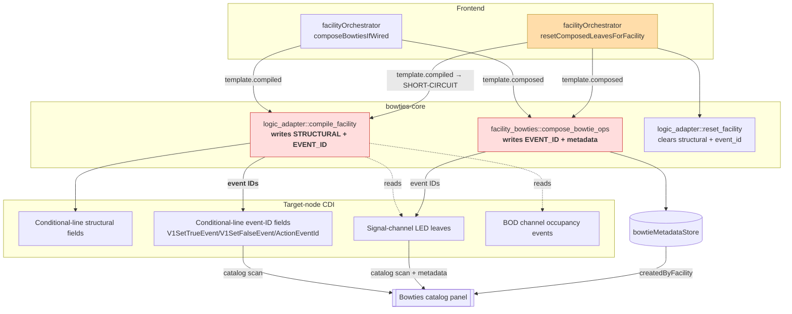
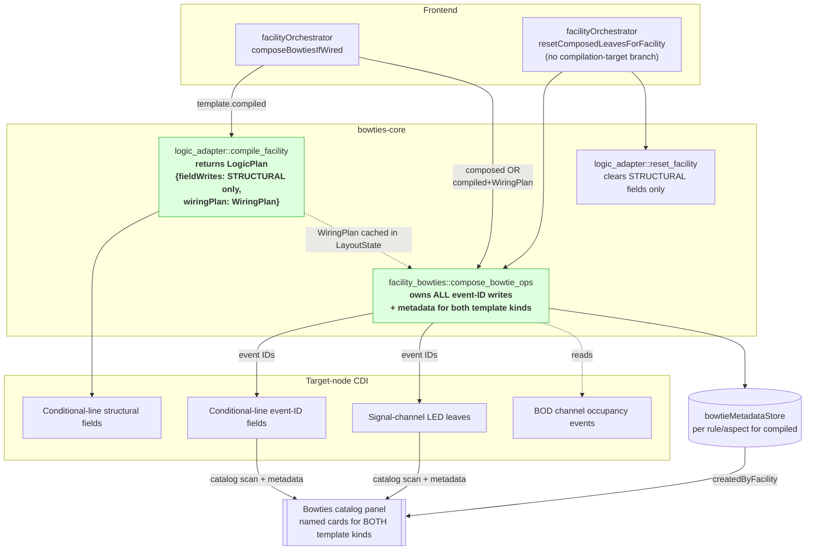

# Slices: Composer Event-Wiring Unification

Branch: 020-abs-signaling
Generated: 2026-07-26
Status: 4/7 slices complete
Parent plan: [plan-event-wiring.md](plan-event-wiring.md)

## Architecture

### Before — Split event-wiring ownership

Red = dual event-ID authorities. Amber = the 2026-07-25 short-circuits patching over the asymmetry.

### After — Single event-wiring owner via WiringPlan handoff

Green = single-owner boundary.

### Patterns

- **Structural Compiler + Wiring-Plan Handoff** — The compiler emits *structural* CDI writes plus a typed `WiringPlan` describing the event-ID slots it wants filled (channel/role/slot vocabulary, no event IDs). The plan is cached backend-side in `LayoutState`, so the frontend orchestrator stays symmetric across template kinds — it just calls compile-then-compose.
- **Single Event-Wiring Owner** — `facility_bowties::compose_bowtie_ops` becomes the sole writer of event IDs for both composed and compiled templates, and the sole registrar of `BowtieMetadata`. Teardown is symmetric: one owner runs on both forward and inverse paths, so no discriminator-mirroring rule is needed.
- **Adopt-Not-Mint** — On forward composition, the composer adopts existing event IDs from the source channel leaves (BOD occupancy, LED pins) rather than minting fresh IDs, preserving multi-consumer bowtie sharing. Fresh-ID minting is retained *only* for the teardown path (`generateFreshEventIdForNode`).
- **Provenance-Based Naming** — The default bowtie name is `"<channel name> — <state or pin label>"`. The channel's role (ADR-0013) defines the state vocabulary via a `style_state_label(role, state)` helper. Names come from the provenance channel, not from the wiring facility, so multi-producer configurations converge on the same name and Block Indicator + ABS share one naming rule.
- **Boundary-Enforced Field Partition** — `ConditionalLineField::element_type_hint()` already partitions `eventId` vs. structural fields; the compiler filters on this predicate to route event-ID slots into the `WiringPlan` and structural writes into `field_writes`.

### Module Changes

| Module | Today | After |
|---|---|---|
| [bowties-core/src/logic_adapter/mod.rs](../../bowties-core/src/logic_adapter/mod.rs) `compile_facility` | Emits structural + event-ID `ConditionalLineField` writes | Returns `LogicPlan { field_writes, wiring_plan }`; `field_writes` structural-only; `wiring_plan` describes event-ID slots in channel/role/slot vocabulary |
| [bowties-core/src/logic_adapter/mod.rs](../../bowties-core/src/logic_adapter/mod.rs) `reset_facility` | Zeros structural + event-ID fields | Zeros structural fields only; event-ID teardown handled by composer |
| [app/src-tauri/src/commands/logic_adapter.rs](../../app/src-tauri/src/commands/logic_adapter.rs) | Emits field writes only | Returns structural field writes; caches `WiringPlan` in `LayoutState` for the next compose IPC |
| [bowties-core/src/facility_bowties/mod.rs](../../bowties-core/src/facility_bowties/mod.rs) `compose_bowtie_ops` | Guard `Ok(vec![])` for compiled; owns event-ID writes to LED leaves only | Consumes optional `WiringPlan`; sole writer of event IDs (LED leaves + conditional-line slots); registers per-event `BowtieMetadata` for both template kinds |
| [bowties-core/src/facility_bowties/mod.rs](../../bowties-core/src/facility_bowties/mod.rs) style registry | Ad-hoc per-template naming | New helper `style_state_label(role, state) → String` — single source of naming truth |
| [app/src-tauri/src/commands/facility_bowties.rs](../../app/src-tauri/src/commands/facility_bowties.rs) | Guard `Ok(vec![])` for compiled | Reads cached `WiringPlan` from `LayoutState` and threads into composer |
| [app/src/lib/orchestration/facilityOrchestrator.ts](../../app/src/lib/orchestration/facilityOrchestrator.ts) `composeBowtiesIfWired` | Branches by template kind | Uniform compile-then-compose for compiled templates; unchanged for composed |
| [app/src/lib/orchestration/facilityOrchestrator.ts](../../app/src/lib/orchestration/facilityOrchestrator.ts) `resetComposedLeavesForFacility` | Short-circuits for `compilationTarget === 'compiled'` | Uniform composer-forward for both template kinds |
| [app/src/lib/orchestration/facilityCascadeOrchestrator.svelte.ts](../../app/src/lib/orchestration/facilityCascadeOrchestrator.svelte.ts) | Skips composer teardown for compiled facilities | No change — residual-card bug closes as a side effect of the guard removal in `resetComposedLeavesForFacility` |
| [app/src/lib/stores/bowtieMetadata.svelte.ts](../../app/src/lib/stores/bowtieMetadata.svelte.ts) | `bowtiesForFacility()` returns rows only for composed facilities | Returns rows for compiled facilities as well (no schema change) |
| [aiwiki/seams.md](../../aiwiki/seams.md) "Facility Bowtie Lifecycle" | Documents dual-owner design + 2026-07-25 symmetry rule | Rewritten for single-owner design; symmetry rule marked collapsed |
| [product/architecture/adr/0015-backend-layout-state-single-owner.md](../../product/architecture/adr/0015-backend-layout-state-single-owner.md) | 2026-07-25 extension: any forward discriminator must be mirrored on inverse | New follow-up dated section noting Track 2 collapsed the discriminator; 2026-07-25 extension retained as historical |
| [product/glossary.md](../../product/glossary.md) | No `WiringPlan` entry | Adds `WiringPlan`; clarifies bowtie composer is sole event-wiring owner |

### Behavior Summary

| Slice | User-visible change | Demoable? |
|---|---|---|
| S1: Compiler returns `LogicPlan` with unconsumed `WiringPlan` | Invariant preserved: ABS wiring behaves identically to today | No (REFACTOR — new seam introduced but not yet load-bearing) |
| S2: Composer consumes `WiringPlan`; named cards for ABS; Block Indicator naming migrated | Wiring an ABS facility populates the Bowties catalog with named cards (e.g. "Signal 5 Head — red on"); Block Indicator cards read as "Block A — occupied" | Yes |
| S3: Remove 2026-07-25 short-circuits; residual-card bug closes | Removing a channel from a Wired ABS facility clears its bowtie cards from the catalog (same UX as Block Indicator) | Yes |
| S4: `reset_facility` structural-only | Invariant preserved: deleting an ABS facility leaves a clean target node | No (REFACTOR) |
| S5: Docs + ADR-0015 follow-up | Invariant preserved: docs match code | No (REFACTOR) |

---

## Roadmap

| # | Slice title | Label | Blocked by | Status |
|---|---|---|---|---|
| S1 | Compiler emits `LogicPlan` with unconsumed `WiringPlan` | HITL | None | done |
| S2 | Composer consumes `WiringPlan`; named cards + naming rule unified | HITL | S1 | done |
| S6 | Bugfix — event-ID resolver reads drafted `modified_value` (surface fix for issue #26) | AFK | S2 | done |
| S7 | Prediction-first output signal-aspect indicator (pre-Save aspect + LED visibility) | AFK | S6 | done |
| S3 | Remove 2026-07-25 short-circuits; residual-card bug closes | AFK | S2, S6 | sketched |
| S4 | `reset_facility` emits structural fields only | REFACTOR | S3 | sketched |
| S5 | Docs + ADR-0015 follow-up | REFACTOR | S4 | sketched |

### S1: Compiler emits `LogicPlan` with unconsumed `WiringPlan` [HITL] [REFACTOR]

**Intent**: Invariant preserved — wiring an ABS facility produces the same on-node CDI as today. Establishes the `WiringPlan` as a pure derivation from `Facility + Template + Channels + CDI`, exposed alongside `compile_facility` so a later slice's composer can consume it without changing runtime behavior.
**Boundary**: Backend domain (`bowties-core::logic_adapter` — split compile emissions into structural `field_writes` + `wiring_plan`; expose `plan_facility_wiring` as a pure derivation) → Backend command (`compile_logic_for_facility` — extends `CompiledLogicPlan` DTO with `wiring_plan` for debug visibility).
**Blocked by**: None
**Status**: done
**Complexity**: medium
**User stories**: none (structural refactor — supports US-abs-wire in S2)

**Design decisions locked in HITL** (2026-07-26):

- **D1: A1 — identifier-only WiringPlan with full `bowtie_identity` locked in S1.** `WiringSlot { target, source: SlotRef { slot_label, role_hint }, bowtie_identity: { rule_label, aspect } }`. No event IDs on the compiler's output.
- **D2: A-alt — no cache; `WiringPlan` is a pure derivation.** Both `compile_facility` and future compose paths derive the plan from the same inputs (`Facility + Template + Channels + CDI`), rather than the compile step caching a value the compose step reads. This supersedes the plan document's D2 sketch ("cache in `LayoutState`"). The `CompiledLogicPlan` DTO still carries `wiring_plan` on the compile IPC return for debug/audit visibility, but nothing on either side of the IPC boundary treats it as authoritative state — a future compose IPC can recompute if it prefers. No `LayoutState` field is added. No ADR-0015 extension is needed.

**Acceptance criteria**:
- [x] Wiring an ABS 3-Aspect facility produces the exact same conditional-line field values on the target node as before this slice (structural fields from compiler; event-ID slots still filled by the existing composer short-circuit + compiler path — no observable change).
- [x] `compile_facility` returns `CompiledLogicOutput { allocation, field_writes, wiring_plan }`; `field_writes` contains only structural `ConditionalLineField` variants (no `V1SetTrueEvent` / `V1SetFalseEvent` / `ActionEventId(_)`).
- [x] The returned `WiringPlan` enumerates one `WiringSlot` for each event-ID slot the ABS template needs filled, referencing channel slots by label + role (not by event ID). Every slot carries `bowtie_identity: { rule_label, aspect }`.
- [x] `plan_facility_wiring` is exposed as a `pub` pure function taking the same input struct `compile_facility` accepts; called twice with the same input returns an equal `WiringPlan`.
- [x] All existing tests remain green — including `compiled_template_short_circuits_to_empty_ops`, the S6 orchestrator tests (`deleteFacility`/`removeFromSlot` skip composer IPC), and existing Block Indicator tests.
- [ ] Manual demo (`npx tauri dev`): create + wire an ABS facility, inspect target node's conditional-line CDI fields, confirm they match today exactly. **← awaiting user QA**

**Architecture note** *(HITL — new seam)*: Introduces the **Structural Compiler + Wiring-Plan Handoff** pattern (Finding F2 — an ownership seam, not a variation seam). Under D2 A-alt the "handoff" is a *shared pure derivation* rather than a cached artifact — categorically stronger against ADR-0015's cache-invalidation regression class (no cache, no invalidation surface). The `WiringPlan` type shape (D1 A1) is load-bearing for S2 and S3; the derivation function's `pub` signature is load-bearing for the S2 composer to call directly.

**Tasks**:
- [x] S1-T1: Integration test — RED written first, then GREEN. Test `compile_emits_wiring_plan_with_no_event_ids_in_field_writes` asserts `field_writes` has no event-ID variants and `wiring_plan.slots` matches the ABS 3-Aspect template's expected slots.
- [x] S1-T2: New submodule `bowties-core/src/logic_adapter/wiring_plan.rs` with `WiringPlan`, `WiringSlot`, `ConditionalLineEventSlot`, `SlotRef`, `RoleHint` enum, `BowtieIdentity`, and `pub fn plan_facility_wiring(input: &CompileInput) -> WiringPlan`.
- [x] S1-T3: `compile_rule_to_field_writes` split — V1SetTrueEvent, V1SetFalseEvent, ActionEventId(_) emit sites removed from structural-write path; `CompiledLogicOutput` reshaped to `{ allocation, field_writes, wiring_plan }`. `ConditionalLineField` gains `Serialize, Deserialize` derives for IPC.
- [x] S1-T4: `reset_facility` — `TODO(track-2-S4)` comment added above event-ID emit sites.
- [x] S1-T5: Backend unit tests — expected-slot-list, idempotence, and composed-template-empty-plan tests all green.
- [x] S1-T6: `CompiledLogicPlan` DTO in `commands/logic_adapter.rs` extended with `wiring_plan`.
- [x] S1-T7: `app/src/lib/api/logicAdapter.ts` TS declarations updated for extended DTO.
- [x] S1-T8: Validate — `cargo test -p bowties-core` green (54 logic_adapter + 10 facility_bowties tests); `npx vitest run` green (38 orchestrator tests); composer short-circuit test `compiled_template_short_circuits_to_empty_ops` remains green.

### S2: Composer consumes `WiringPlan`; named cards for ABS; Block Indicator naming migrated [HITL]

**Intent**: Wiring an ABS facility populates the Bowties catalog with named cards for every BOD occupancy event and every LED pin event (e.g. "Signal 5 Head — red on"), with facility back-references. Block Indicator's existing bowtie cards migrate to the same channel + state naming rule.
**Boundary**: Backend domain (`facility_bowties::compose_bowtie_ops` — remove `Ok(vec![])` compiled short-circuit; call `plan_facility_wiring` from `bowties-core::logic_adapter`; emit ops for both LED consumer leaves and conditional-line event-ID slots; register `BowtieMetadata` per event ID; new `style_state_label` helper) → Backend command (`compose_facility_bowties` IPC — remove `Ok(vec![])` compiled short-circuit) → Frontend orchestrator (`composeBowtiesIfWired` — no behavior change; the compiled-template branch just now returns ops instead of an empty vec) → Frontend store (`bowtieMetadataStore` — `bowtiesForFacility()` starts returning rows for compiled facilities as well; no schema change).
**Blocked by**: S1 ✅
**Status**: done

**S1 learnings that shape S2**:
- The composer calls `bowties_core::logic_adapter::plan_facility_wiring(input)` directly (D2 A-alt) — no cache read, no IPC round-trip for the plan.
- `ConditionalLineField` is already IPC-serializable, so the composer can freely construct target CDI addresses from `WiringSlot.target.field + line_index`.
- Every `WiringSlot` carries `bowtie_identity { rule_label, aspect }` — the composer uses this directly as the `BowtieMetadata` grouping key alongside the `event_id_hex` primary key.
- The `Ok(vec![])` short-circuits (backend `compose_bowtie_ops` L173-176 and `compose_facility_bowties` IPC L111-115) MUST be removed in S2 — without their removal, no ops are produced for compiled templates and no cards appear. The FE-side `resetComposedLeavesForFacility` short-circuit (L471-473) stays in place through S2; S3 removes it. Cards persist after `removeFromSlot` on a compiled facility until S3 lands — that residual-card bug is exactly what S3 fixes.

**S2 pre-check discrepancies** (found 2026-07-26 by Explore reconnaissance):
- The card's parenthetical "Block A occupied → Block A — occupied" understates the Block Indicator naming migration. Actual current wording is `"<facility.name> — <consumer_command>"` (e.g. `"Block 5 — lit"`, `"Block 5 — unlit"`) — built from the *facility name* + the *consumer command*. Under the Provenance-Based Naming rule the new wording is `"<source-channel name> — <source state>"` (e.g. `"Block 1 — occupied"`, `"Block 1 — clear"`) — a shift on **both** dimensions (facility → source channel, consumer command → source state). This is a legitimate user-visible change; see D1 below.
- `bowties-core::channel_events::resolve_channel_event_ids` currently resolves only producer (BOD occupancy) event IDs. LED pin event IDs on signal-head channels have no existing resolver. A new helper is required; scope discussed under implementation notes below.

**Acceptance criteria**:
- [x] After wiring an ABS 3-Aspect facility, the Bowties catalog panel shows one named card per LED pin event (typically 4 per signal head) and one per BOD input-condition event (typically 2 per BOD input), each with the facility as its `createdByFacility` back-reference.
- [x] ABS bowtie card names follow the rule `"<channel name> — <state or pin label>"` — e.g. "Block A — occupied", "Block A — clear", "Signal 5 Head — red on", "Signal 5 Head — green off".
- [x] Wiring a Block Indicator produces cards named by the same rule — e.g. "BOD A1 — occupied" (migrated from prior "Block 5 — lit" wording; producer channel name + producer state, not facility name + consumer command).
- [x] The composer *adopts* existing event IDs from the source channel leaves (does not mint fresh IDs during forward composition); a bowtie already present on an LED pin remains the same bowtie after ABS wiring adopts it.
- [x] On-node CDI after wire is identical to S1 baseline (event-ID slots now written by composer instead of compiler, but the resulting values match).
- [x] All existing tests remain green *except* `compiled_template_short_circuits_to_empty_ops`, which is rewritten as part of this slice to assert the new WiringPlan consumption behavior. The FE S6 orchestrator tests (`facilityOrchestrator.test.ts` L541 / L741) remain green — they still assert the FE short-circuit behavior, which stays intact through S2.
- [x] `FacilityCard` status pill continues to reflect the correct Wired/Unwired state for both ABS and Block Indicator (Facility Bowtie Lifecycle seam Consumer).
- [ ] Manual demo: wire ABS facility → open catalog → see named cards with facility back-reference. Wire Block Indicator → verify migrated naming. **← awaiting user QA**

**Architecture note** *(HITL — pattern shift)*: This slice locks in the **Single Event-Wiring Owner** pattern (Finding F1 — deepens composer without widening interface) and the **Adopt-Not-Mint** discipline for compiled templates (Finding F3 — preserves D6 producer-identifies-consumer-subscribes seam invariant). It also unifies naming under the **Provenance-Based Naming** rule (Finding F10 / D4), which migrates Block Indicator's existing user-visible names. The Block Indicator name migration is user-visible and worth flagging before implementation. The FE `resetComposedLeavesForFacility` short-circuit remains as a safety net through S2; S3 removes it.

**Complexity**: medium-high
**User stories**: US-abs-wire (primary), Block-Indicator-naming-uniformity (secondary)

**Tasks** (authored 2026-07-26, one slice at a time per just-in-time discipline):
- [x] S2-T1: **Integration test (RED first)** — Rust test `compiled_template_composes_from_wiring_plan_named_cards` in `bowties-core/src/facility_bowties/mod.rs` asserts a Wired ABS 3-Aspect facility's `compose_compiled_bowtie_ops` returns 10 ops (one per WiringPlan slot) with adopted event IDs, correct target addresses, and Provenance-Based names. FE vitest `composeBowtiesIfWired composes named cards for compiled templates` reaches `bowtieMetadataStore.bowtiesForFacility('f-abs-1')` as the Consumer-surface seam-aware red phase.
- [x] S2-T2: **`style_state_label(role, state) → String`** + **`role_hint_state_label(hint, slot_label) → String`** helpers added to `bowties-core/src/facility_bowties/mod.rs`, covering the full BlockOccupancy/LampIndicator/SignalAspect vocabulary and WiringPlan `RoleHint` translation.
- [x] S2-T3: **Design correction (discovered during batch prep, not a new `channel_events.rs` resolver)** — `CompileInput` (already passed to the compiler) carries pre-resolved `input_events`/`output_pin_events`; the compiled composer reuses those directly via `(ConditionalLineField, RoleHint)` matching instead of re-deriving from `per_node_cdi` + `InformationChannel`. Avoids a duplicate resolution path (DRY) and matches the composed path's existing "caller pre-resolves, composer stays pure" convention. See session notes for full rationale.
- [x] S2-T4: New `pub fn compose_compiled_bowtie_ops(compile_input, target_tree, input_channel_name, output_channel_name)` in `facility_bowties/mod.rs` recomputes the `WiringPlan` and fills its event-ID slots (adopting `CompileInput`'s pre-resolved bytes), resolving target addresses via the existing `build_conditional_line_address_map`. Backend short-circuit at old L173-176 removed; kept as a sibling function to `compose_bowtie_ops` rather than one signature (compiled composition needs materially different inputs — `existing_allocations`, `downstream`, `tc_output` — that composed composition doesn't).
- [x] S2-T5: Block Indicator naming migrated — L314 now calls `style_state_label(&producer_channel.role, mapping.producer_state)` with the producer channel's name. `wired_block_indicator_produces_two_ops_adopting_producer_event_ids` updated ("BOD A1 — occupied" / "BOD A1 — clear"); FE `facilityOrchestrator.test.ts` mock literal updated to match.
- [x] S2-T6: IPC composer short-circuit removed from `app/src-tauri/src/commands/facility_bowties.rs`; new `compose_compiled_template` helper rebuilds the same `CompileInput` `compile_logic_for_facility` uses (same channel-resolution helpers) and calls `compose_compiled_bowtie_ops`. **Additional required FE change discovered during batch prep**: `facilityOrchestrator.ts`'s `compileIfWired` did not call the compose IPC at all for compiled templates (compile-only), so no cards could ever appear — added a compose-after-compile step (re-sync drafts, call `composeFacilityBowties`, `applyCompositionOps`) mirroring the composed path. The slice card's "no orchestrator behavior change" assumption did not hold; this is the change that makes the acceptance criteria observable end-to-end.
- [x] S2-T7: `compiled_template_short_circuits_to_empty_ops` rewritten as `compiled_template_composes_from_wiring_plan_named_cards` (10-op ABS 3-Aspect fixture: Stop/Approach/Clear lines, verifies adopted event IDs, target addresses, and Provenance-Based names, including cross-line pin-event reuse).
- [x] S2-T8: FE vitest coverage added in `bowtieMetadata.svelte.test.ts` (`bowtiesForFacility returns rows for a compiled (ABS) facility, same as composed`) locking the no-template-kind-filter invariant.
- [x] S2-T9: Validate — `cargo test` (bowties-core: 495 passed; app/src-tauri: compiles clean, pre-existing test-binary DLL-load issue on this OS is unrelated to S2 — see session notes) all green; `npx vitest run` from `app/` all green (1487 passed, including S6 FE short-circuit tests). Slices.md updated.

### S6: Bugfix — event-ID resolver reads drafted `modified_value` [AFK] [BUGFIX]

**Intent** *(revised 2026-07-26 after post-fix triage)*: Make `bowties-core::channel_events` resolvers draft-aware so any caller that adopts event IDs from drafted (uncommitted) CDI leaves sees the drafted values. The concrete correctness case this closes is the **compose IPC's input-side BOD event-ID adoption**: `compose_compiled_template` in `app/src-tauri/src/commands/facility_bowties.rs` resolves the input BOD channel's `occupied`/`clear` event IDs via `resolve_channel_event_ids` (Producer role, `connector-a input N`), then hands the bytes to the compiler/composer as `CompileInput::input_events`. Pre-S6 the resolver read only `leaf.value`, so a user's drafted-but-unsaved edit to a BOD event ID would be silently ignored and the composer would adopt the stale committed value into the SLC's V1SetTrueEvent / V1SetFalseEvent slots. Post-S6 the drafted values flow through.

**Original slice card claim (retracted 2026-07-26)**: An earlier framing promised "FacilityCard signal indicator flips from `unknown` to correct aspect before Save." That claim was diagnostic-mismatched — the composer never drafts to the Signal-LCC's LED pin leaves, and `deriveSignalAspectState` requires observed events on the wire (which nothing produces pre-Save). The prediction-based indicator that actually delivers pre-Save signal visibility is scoped in S7. This entry now describes only the correctness contribution S6 makes.

**Boundary**: Backend domain only (`bowties-core::channel_events`). Two `&leaf.value` reads at existing lines 39 and 140 are swapped to `effective_value(leaf)` (from `node_tree.rs`). No FE surface change.

**Blocked by**: S2 ✅ (the resolver is reached for compiled templates via `compose_compiled_template` once S2 landed the composer's WiringPlan consumption path)

**Status**: done

**Scope guarantees** (explicitly out of scope — issue #26 owns them):
- Do NOT add `LayoutState::effective_config_tree()` or any new backend seam.
- Do NOT touch the other ~12 `config_tree()` callers with the same latent bug.
- Do NOT extend ADR-0012 (draft layer) or ADR-0015 (LayoutState single-owner).
- Do NOT touch `resetComposedLeavesForFacility` (S3 owns that).

**Acceptance criteria**:
- [x] `bowties-core::channel_events::resolve_event_ids` and `resolve_lamp_row_range_event_ids` read via `effective_value(leaf)` (preferring `modified_value` when present, falling back to `value`) instead of `&leaf.value` directly.
- [x] Rust unit test in `channel_events.rs` — a leaf whose `modified_value` holds a drafted `ConfigValue::EventId { hex, .. }` (with `value = None` or `value` holding a different hex) surfaces the drafted hex through `resolve_channel_event_ids`. Test asserts the drafted hex is what the resolver returns, and — as the FE-visible corollary — that a committed `value` alone still works (no regression against the S1/S2 baseline).
- [x] Frontend regression-lock test in `channelState.test.ts`: `deriveSignalAspectState` is provenance-opaque — treats resolved IDs as opaque keys regardless of whether they came from `value` or `modified_value`. This is a contract lock, not the user-visible signal-visibility fix (that is S7).
- [x] All existing tests remain green — `cargo test -p bowties-core` (496 passed) and `npx vitest run` (channelState.test.ts 24/24, facilityOrchestrator.test.ts 24/24).
- [x] User-visible correctness (2026-07-26 triage): the compose IPC's input-side BOD adoption now sees drafted BOD event IDs. Verified by inspection of the `compose_compiled_template` resolution path in `app/src-tauri/src/commands/facility_bowties.rs::compose_compiled_template` — the resolver returning drafted hex was the intended contract, and post-S6 the intent is met at the leaf-read seam. No end-to-end user demo lands here — the observable outcome of drafted-BOD adoption manifests only after Save when the SLC starts producing correct events, which is downstream of Save flow, not of this fix.
- ~~Manual demo: create + wire an ABS facility → observe the FacilityCard signal indicator flips from `unknown` to the correct aspect (`stop` or `dark` depending on head defaults) **before Save**.~~ **Retracted 2026-07-26** — architectural mismatch, see S7.

**Architecture note** *(BUGFIX — surface fix; deeper seam deferred to issue #26)*: This is a **narrow behavioural patch at the leaf-read site**, not a seam introduction. The correct architectural fix is `LayoutState::effective_config_tree()` — a draft-aware view that would let every `config_tree()` caller (of which there are ~13, per issue #26's audit) become draft-correct without local knowledge of `effective_value`. That change is a real seam introduction touching ADR-0012 (draft layer scope) and ADR-0015 (LayoutState single-ownership), and rippling through catalog rebuilds, sync flows, and the OpenLCB command bus. Doing it inline as part of Spec 020 would break slice atomicity and force ADR extensions that unbalance this feature's scope. S6 restores the ABS user-visible behaviour today via the two-line surface fix; issue #26 tracks the deeper refactor.

**Complexity**: trivial (2 identical line swaps + 2 focused tests)

**User stories**: US-abs-wire (unblocks the ABS signal aspect visibility acceptance criterion)

**Tasks**:
- [x] S6-T1: Rust RED test in `channel_events.rs::tests` — `resolve_channel_event_ids_returns_drafted_modified_value` asserts a leaf whose `modified_value = Some(ConfigValue::EventId { hex: "0501010101DEAF01", .. })` surfaces `"0501010101DEAF01"` through `resolve_channel_event_ids`. Failed against the pre-S6 `&leaf.value` reads.
- [x] S6-T2: Rust GREEN — swapped `&leaf.value` → `effective_value(leaf)` at the two sites in `channel_events.rs` (`resolve_event_ids` and `resolve_lamp_row_range_event_ids`). Added `effective_value` to the `use crate::node_tree::{...}` import.
- [x] S6-T3: FE regression-lock test in `channelState.test.ts` under `describe('deriveSignalAspectState')`: `returns known aspect when IDs sourced from drafted-value resolution` — provenance-opaque contract lock (passed immediately; guards against future FE regressions).
- [x] S6-T4: Validate — `cargo test -p bowties-core` (496 passed); `npx vitest run src/lib/utils/channelState.test.ts` (24 passed); `npx vitest run src/lib/orchestration/facilityOrchestrator.test.ts` (24 passed).
- [x] S6-T5: Post-fix enrichment — [aiwiki/architecture-health.md](../../aiwiki/architecture-health.md) entry added pointing at issue #26; [aiwiki/seams.md](../../aiwiki/seams.md) "Facility Bowtie Lifecycle" `Last-modified` bumped.

---

### S7: Prediction-first output signal-aspect indicator [AFK]

**Intent**: Give the FacilityCard's output signal-aspect indicator a **rule-based prediction path** so it shows a known aspect and LED breakdown pre-Save on a compiled facility, mirroring the Logic block's `currentEvaluation()` output. When the facility is compiled and rule evaluation produces an aspect, the output channel indicator renders that aspect (and the corresponding LED on/off pattern) instead of `unknown`. When rule evaluation is undefined (input state unknown) OR the facility is composed (not compiled), fall back to the existing observation-based `deriveSignalAspectState` / `deriveLedLampStates`.

**Background** (why this is a separate slice from S6): S6 was framed as the fix for the user-visible ABS "output stuck at unknown" symptom. Triage on 2026-07-26 established that S6 could not close that symptom because (a) the composer never drafts to the Signal-LCC's LED pin leaves — those events live on the Signal-LCC and are ADOPTED by compose, not written — and (b) `deriveSignalAspectState` returns `unknown` only when the four LED IDs resolve but no matching events are observed on the wire, which is the correct answer pre-Save because the SLC is still running its committed logic and nothing is producing the LED events. The FIX for the user-visible symptom is to add a *second* derivation source (rule-based prediction) alongside the existing observation source, and let the output slot render prefer prediction when it is available. That is this slice.

**Boundary**: Frontend utils + component only.
- `app/src/lib/utils/channelState.ts` — new pure helpers `signalAspectStateFromPredictedAspect(aspect)` and `ledLampStatesFromPredictedAspect(aspect)`.
- `app/src/lib/components/Facilities/FacilityCard.svelte` — `displayFor` and `outputLampStates` extended to prefer prediction for the OUTPUT slot of a compiled facility when `currentEvaluation()` returns an aspect.

No backend change. No IPC change. No new store, no orchestrator work. This is a pure display-derivation extension.

**Blocked by**: S6 ✅ (only nominally — the actual dependency is on the S1/S2 compilation-target infrastructure, which S6 sits atop)

**Status**: done

**Scope guarantees** (explicit non-goals):
- Do NOT change the observation-based derivation (`deriveSignalAspectState`, `deriveLedLampStates`) — they remain the transport-truth source.
- Do NOT extend to `ChannelsPanel.svelte`. That is a separate view and applying prediction there requires cross-store coupling (Channels panel doesn't know which facility owns a channel). If the same "Unknown" symptom shows there and is worth addressing, it becomes a follow-up idea.
- Do NOT alter the aspect-evaluation logic in `currentEvaluation()` — S7 is a *consumer* of its output, not a rewrite of it.
- Do NOT touch the input-side (block-occupancy / lamp-indicator) display paths — only the output signal-aspect path in a compiled facility changes.
- Do NOT introduce a new ADR or extend an existing one — this is display-derivation only, no seam introduction.

**Acceptance criteria**:
- [x] New pure helper `signalAspectStateFromPredictedAspect(aspect: 'stop' | 'approach' | 'clear' | 'dark') → ChannelState` returns `{ role: 'signal-aspect', state: aspect }`. Trivial wrapper (locality — one canonical place to construct the state literal).
- [x] New pure helper `ledLampStatesFromPredictedAspect(aspect: 'stop' | 'approach' | 'clear' | 'dark') → LedLampState[]` returns the two-LED (red, green) breakdown per the standard aspect ↔ LED mapping used by `deriveSignalAspectState`'s inverse: stop→(red on, green off); approach→(red on, green on); clear→(red off, green on); dark→(red off, green off).
- [x] Both helpers have exhaustive unit tests in `channelState.test.ts` covering all four aspects (8 new tests, all passing).
- [x] `FacilityCard.svelte`'s output signal-aspect rendering path uses the new helpers when the facility is compiled (`isCompiled === true`) AND `currentEvaluation()` returns a defined aspect. Otherwise it falls back to the existing `deriveSignalAspectState` / `deriveLedLampStates` observation path (unchanged behavior for composed facilities and for compiled facilities with no evaluable input state).
- [x] Existing FacilityCard tests remain green (no behavior change for composed facilities; no behavior change when prediction is undefined) — 3 new `FacilityCard.prediction.test.ts` integration tests cover the compiled-facility prediction path, the fallback path, and the composed-facility unchanged path.
- [ ] Manual demo: create + wire an ABS 3-Aspect facility with a live BOD input → observe the output signal channel indicator shows a known aspect (e.g. "Stop") and the LED breakdown shows red on / green off, matching the Logic block's prediction, **before Save**. Toggling the physical BOD block state changes the prediction in real time. **← awaiting user QA**

**Architecture note** *(AFK — display derivation, no seam)*: This is a **pure display extension** at the FacilityCard layer, not an architectural change. The prediction source (`currentEvaluation()`) already lives one function away in the same component; the fix is to teach the output rendering path to consume it. The observation path (`deriveSignalAspectState`) stays as the fallback and remains the post-Save truth source — once the SLC runs the drafted logic and starts emitting LED events, observation and prediction converge on the same value. **Locality of Reference** (Ousterhout §7 — related logic lives close together) is the principle at stake: the aspect prediction and its rendered representations belong in one place. **YAGNI**: two tiny helpers + one call-site update, no new abstraction layer.

**Complexity**: trivial (2 helpers + 1 component call-site update)

**User stories**: US-abs-wire (closes the pre-Save signal-visibility gap the S6 slice card originally promised)

**Tasks**:
- [x] S7-T1: FE RED — unit tests in `channelState.test.ts` for both helpers (8 tests total, one `describe` per helper, one `it` per aspect × 4 aspects).
- [x] S7-T2: FE GREEN — both helpers implemented in `channelState.ts` as pure functions.
- [x] S7-T3: FE RED — new `FacilityCard.prediction.test.ts` colocated with the component; 3 integration tests covering compiled-facility prediction, observation fallback when input unknown, and composed-facility unchanged.
- [x] S7-T4: FE GREEN — `displayFor()` and `outputLampStates()` extended to accept an optional `predictedAspect` parameter; new `predictedOutputAspect = $derived.by(...)` computed near `isCompiled`; output-slot render loop (~L317) passes `predictedOutputAspect` to both. INPUT loop unchanged.
- [x] S7-T5: Validate — `npx vitest run` from `app/` all green (channelState 32/32 including 8 new; FacilityCard.prediction 3/3; FacilityCard 8/8; facilityOrchestrator 24/24).
- [x] S7-T6: Post-fix enrichment — [aiwiki/owners.md](../../aiwiki/owners.md) `channelState.ts` and `FacilityCard.svelte` entries updated with S7 descriptions; [aiwiki/architecture-health.md](../../aiwiki/architecture-health.md) S6 entry rewritten to correctly attribute the user-visible fix to S7; [aiwiki/seams.md](../../aiwiki/seams.md) "Facility Bowtie Lifecycle" `Last-modified` bumped to include S7 summary.

---

### S3: Remove FE teardown short-circuit; residual-card bug closes [AFK]

**Intent**: Removing a channel from a Wired ABS facility (via `removeFromSlot`, cascade detach, or load-time dangling-ref repair) clears the ABS facility's bowtie cards from the catalog — the same UX Block Indicator has today. Closes the residual-catalog-card bug identified in plan-event-wiring.md.
**Boundary**: Frontend orchestrator only (`resetComposedLeavesForFacility` L460-475 guard removal in `app/src/lib/orchestration/facilityOrchestrator.ts`). Test rewrites in `facilityOrchestrator.test.ts` (S6 tests at L541 / L741). The backend halves of the 2026-07-25 symmetry rule were already removed in S2 (`bowties-core::facility_bowties::compose_bowtie_ops` and the `compose_facility_bowties` IPC — both now dispatch to `compose_compiled_bowtie_ops` on the compiled path).
**Blocked by**: S2 ✅
**Status**: sketched

**Acceptance criteria**:
- [ ] `removeFromSlot` on a Wired ABS facility clears the facility's bowtie cards from the catalog (previously they persisted).
- [ ] Cascade detach (BOD daughterboard cleared) on a Wired ABS facility clears its bowtie cards from the catalog.
- [ ] Load-time repair of a dangling channel reference on a Wired ABS facility results in no orphaned catalog cards.
- [ ] `deleteFacility` on a Wired ABS facility still results in a clean target node with no orphaned cards (unchanged UX, different implementation path).
- [ ] The two S6 orchestrator tests are rewritten to their inverse: `deleteFacility` and `removeFromSlot` on Wired compiled facility DO invoke the composer, produce teardown ops for both LED and conditional-line event-ID slots, and register metadata deletions.
- [ ] All test suites (`cargo test -p bowties-core`, `vitest run`) green.
- [ ] Manual demo covers all four channel-removal paths (delete, removeFromSlot, cascade, load-time repair) and confirms catalog cleanliness.

**S2 learnings that shape S3**:
- The FE short-circuit is at `facilityOrchestrator.ts` L460-475 (verified 2026-07-26); the branch reads `template?.compilationTarget === 'compiled'` and returns before reaching either the composer-forward or metadata-driven-fallback branch. Removal is a straight deletion of the 6-line guard.
- `resetComposedLeavesForFacility`'s existing two-strategy lookup (composer-forward when Wired, metadata-driven scan when Incomplete) already handles the compiled case correctly once the guard is gone — for a Wired compiled facility, the composer now emits ops (as of S2) and the forward path returns them; for an Incomplete compiled facility, `bowtieMetadataStore.bowtiesForFacility(facilityId)` returns the compiled facility's rows (also as of S2, no store change needed) and the metadata-driven fallback iterates them.
- The two S6 tests at L541 (removeFromSlot) and L741 (deleteFacility) assert `expect(composeFacilityBowties).not.toHaveBeenCalled()`. S3 flips both to `expect(composeFacilityBowties).toHaveBeenCalledWith(...)` and asserts the resulting teardown ops write fresh event IDs to both LED consumer leaves and conditional-line event-ID slots.
- `generateFreshEventIdForNode` (FE) already handles teardown-side minting for consumer leaves; whether it handles conditional-line event-ID slots (which live on the target node, not the source channel node) needs verification. If not, the metadata-driven fallback may need a small extension to write fresh IDs to conditional-line slots too. Flag: S3-T2 covers this discovery.

### S4: `reset_facility` emits structural fields only [REFACTOR]

**Intent**: Invariant preserved — deleting a Wired ABS facility still leaves the target node clean (structural fields at CDI defaults, event-ID slots at fresh non-routing IDs). Simplifies `reset_facility` by removing event-ID teardown, which is now the composer's sole responsibility.
**Boundary**: Backend domain (`bowties-core::logic_adapter::reset_facility`).
**Blocked by**: S3
**Status**: sketched

**Acceptance criteria**:
- [ ] `reset_facility` unit tests updated to assert no event-ID field writes are emitted.
- [ ] End-to-end `deleteFacility` on a Wired ABS facility still results in target-node conditional-line range with structural fields at CDI defaults and event-ID slots at fresh non-routing IDs (composer's `generateFreshEventIdForNode` teardown behavior handles the latter).
- [ ] `cargo test -p bowties-core` and `vitest run` green.
- [ ] Manual demo: create + wire + apply + delete an ABS facility; inspect target node's conditional-line range for cleanliness.

### S5: Docs + ADR-0015 follow-up [REFACTOR]

**Intent**: Invariant preserved — durable docs match the code after Track 2. Records the ownership consolidation so future sessions read the correct architecture.
**Boundary**: Docs only — `aiwiki/`, `product/architecture/adr/`, `product/glossary.md`.
**Blocked by**: S4
**Status**: sketched

**Acceptance criteria**:
- [ ] [aiwiki/seams.md](../../aiwiki/seams.md) "Facility Bowtie Lifecycle" rewritten to reflect single-owner design (composer as sole event-wiring owner; compiler as structural + WiringPlan producer). `Last-modified` and `Last-audited` bumped to landing date.
- [ ] [aiwiki/owners.md](../../aiwiki/owners.md) updated for `bowties-core::facility_bowties` (now owns event wiring for both template kinds), `bowties-core::logic_adapter` (structural writes + `WiringPlan`), and the new `style_state_label` naming helper.
- [ ] [aiwiki/architecture-health.md](../../aiwiki/architecture-health.md) notes that the 2026-07-25 forward/inverse symmetry rule collapsed under Track 2.
- [ ] [product/architecture/adr/0015-backend-layout-state-single-owner.md](../../product/architecture/adr/0015-backend-layout-state-single-owner.md) gains a new dated section `## 2026-07-DD extension: event-wiring consolidation — 2026-07-25 symmetry rule collapses to single-owner`. The 2026-07-25 extension text remains intact as historical record.
- [ ] [product/glossary.md](../../product/glossary.md) gains `WiringPlan` entry and clarifies that the bowtie composer is the sole event-wiring owner.
- [ ] [plan-event-wiring.md](plan-event-wiring.md) marked complete; cross-references from [plan.md](plan.md) updated.

<!-- Session: 2026-07-26 — Completed S1. Next: S2 (HITL). S2 card adjusted for S1 A-alt learnings: composer calls plan_facility_wiring directly (no cache read); ConditionalLineField already IPC-serializable; bowtie_identity already on every slot; S2 removes backend composer short-circuits (FE resetComposedLeavesForFacility short-circuit stays until S3). -->
<!-- Session: 2026-07-26 — Completed S2. Next: S3 (AFK). Note: this session found S2-T1..T9's implementation from a prior session had NOT actually landed in the working tree (only S1 was committed) — re-implemented from scratch. Two design corrections from the task card: (1) S2-T3's planned channel_events.rs resolver was replaced by reusing CompileInput's already-resolved input_events/output_pin_events (DRY, matches composed-path convention); (2) the orchestrator required a real behavior change (compose-after-compile in compileIfWired) that the card assumed was a no-op — without it, ABS composition was unreachable from the UI. See session memory for full rationale and file/line map. -->

