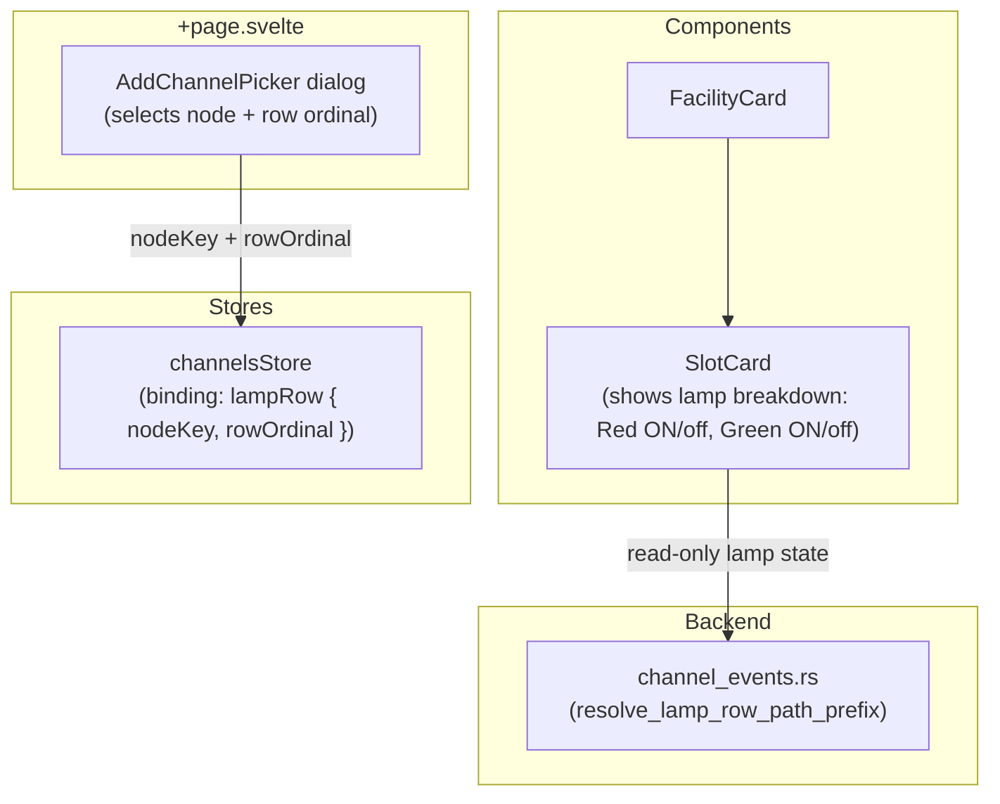
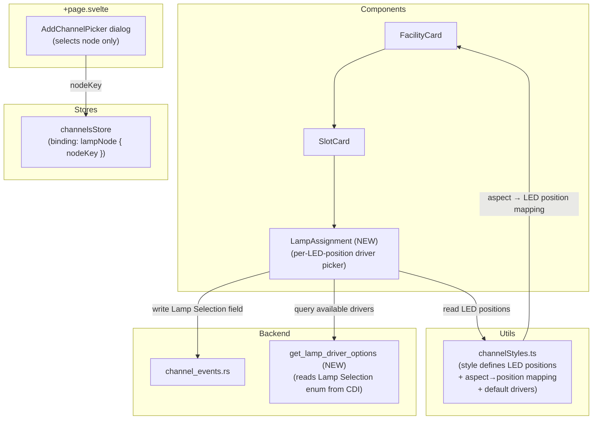

# Slices: In-Card Lamp Selection for Signal Facilities

Branch: 020-abs-signaling
Generated: 2026-07-30
Status: 0/3 slices complete

## Context

Today, when a user creates an ABS signal facility, they pick a Signal-LCC node and a **row ordinal** in the AddChannelPicker dialog. The row ordinal is an opaque 1-based index into the Direct Lamp Control segment — the user sees "Lamp 1", "Lamp 2", etc. but has no way to specify which physical LED driver (#1 H1-G through #16 H4-L) each LED position uses. That mapping is left to the existing CDI tree configuration UI, forcing the user to leave the Railroad tab.

This work surfaces lamp driver assignment directly in the facility output card using a **style-driven LED-position model**. The signal head style (e.g., "2-LED Bicolor R/G") declares which LED positions exist (Red, Green); the user assigns each position to a physical driver; Bowties auto-derives per-rule Appearance configurations from those assignments. The user never needs to know that "yellow = both LEDs on" — the style encodes that mapping.

First delivery: 2-LED bicolor (R/G) for 3-aspect ABS only. Additional styles (3-color R/Y/G, multi-head, etc.) follow the same pattern — add a style definition, no UX changes needed.

## Architecture

### Before



### After



### Patterns

- **Style-driven LED-position model** — The signal head style declares a set of LED positions (e.g., Red, Green for bicolor) and an aspect-to-position mapping (e.g., Approach → [Red, Green]). The user assigns each LED position to a physical driver (#1 H1-G, #3 H1-R, etc.). Bowties derives per-rule appearances automatically. Adding a new head type means adding a style definition — no UI changes.
- **Output card as configuration surface** — The output card in the comprehension view becomes an editable surface, not just a state display. LED position dropdowns write CDI field values via the existing `configEditor.applyEdit()` path, appearing as normal config drafts in the Save toolbar. This pattern will be reused by Rule to Aspect (where the same assignments write to Mast/Rule/Appearance fields instead of Direct Lamp Control fields).
- **Signal-LCC node binding** — The channel binding changes from `lampRow { nodeKey, rowOrdinal }` to `lampNode { nodeKey }`. The row-ordinal concept is replaced by per-position driver selection stored as CDI config edits. This is a stepping stone to Rule to Aspect where the binding target becomes a mast ordinal.

### Style Definition: 2-LED Bicolor (R/G)

```
Style ID: 2-led-bicolor-aspect

LED Positions:
  red:   { label: "Red LED",   defaultDriver: "#3 H1-R" }
  green: { label: "Green LED", defaultDriver: "#1 H1-G" }

Aspect → LED Position Mapping:
  Stop:     [red]           → Red ON,  Green OFF
  Approach: [red, green]    → Red ON,  Green ON  (= yellow)
  Clear:    [green]         → Red OFF, Green ON
```

The user sees:

```
Red LED:   [#3 H1-R ▼]
Green LED: [#1 H1-G ▼]
```

Bowties knows that Approach lights both positions — the user doesn't configure this.

### Module Changes

| Module | Today | After |
|---|---|---|
| `app/src/lib/utils/channelStyles.ts` | `STYLE_EVENT_MAPPINGS['2-led-bicolor-aspect']` with consumer leaf indices | Gains `SignalHeadStyle` type with LED positions, aspect→position map, and default driver assignments |
| `app/src/lib/components/Facilities/LampAssignment.svelte` | Does not exist | NEW: Per-LED-position driver picker; one dropdown per position defined by the style |
| `app/src/lib/components/Facilities/FacilityCard.svelte` | Output card shows read-only lamp state (Red ON/off, Green ON/off) with row labels | Output card shows LampAssignment component; lamp state display uses driver labels |
| `app/src/lib/components/Facilities/AddChannelPicker.svelte` | Shows individual lamp rows grouped by node; user selects a specific row ordinal | Shows Signal-LCC nodes only for signal-aspect slots (no row-level selection) |
| `app/src/lib/stores/channels.svelte.ts` | Binding: `lampRow { nodeKey, rowOrdinal }` | Gains `lampNode { nodeKey }` binding variant for signal-aspect channels; `lampRow` retained for lamp-indicator channels |
| `bowties-core/src/layout/channels.rs` | `LampRow { node_key, row_ordinal }` binding variant | Gains `LampNode { node_key }` variant |
| `app/src/lib/orchestration/facilityOrchestrator.ts` | `addChannelForSlot` takes `lampRowNodeKey + rowOrdinal` | Takes `lampNodeKey` for signal-aspect; writes default driver assignments from style definition |
| `app/src-tauri/src/commands/channel_events.rs` | `resolve_lamp_row_path_prefix` for event resolution | Gains driver-based resolution that finds the Direct Lamp Control slot assigned to the target driver |

### Behavior Summary

| Slice | User-visible change | Demoable? |
|---|---|---|
| S1: Style-driven LampAssignment component + output card | Per-LED-position driver dropdowns in the output card; user assigns Red LED and Green LED to physical drivers | Yes |
| S2: AddChannelPicker simplification + binding migration | Node-level picker for signal-aspect channels; existing layouts auto-migrate | Yes |
| S3: Default driver assignments + event resolution update | Creating a signal auto-assigns H1-R/H1-G defaults; event state monitoring uses selected drivers | Yes |

---

## Roadmap

| # | Slice title | Label | Blocked by | Status |
|---|---|---|---|---|
| S1 | Style-driven LampAssignment component + output card | HITL | None | tasked |
| S2 | AddChannelPicker simplification + binding migration | AFK | None | sketched |
| S3 | Default driver assignments + event resolution update | AFK | S1, S2 | sketched |

### S1: Style-driven LampAssignment component + output card integration [HITL]

**Intent**: The facility output card shows one dropdown per LED position defined by the signal head style. For the 2-LED bicolor style, the user sees "Red LED" and "Green LED" dropdowns and assigns each to a physical driver. Bowties auto-derives which LEDs light for each aspect from the style's aspect→position mapping.
**Boundary**: Component → Utils (style definition) → Route → Backend query (driver enum) → configEditor (CDI writes)
**Blocked by**: None
**Status**: tasked
**Complexity**: medium
**User stories**: US1, US3

**Acceptance criteria**:
- [ ] `channelStyles.ts` gains `SignalHeadStyle` type: `positions` (keyed by position ID, each with label + defaultDriver), `aspectMap` (keyed by aspect, each listing which positions are lit)
- [ ] `2-led-bicolor-aspect` style defines: positions `red` (#3 H1-R default) + `green` (#1 H1-G default); aspectMap: stop→[red], approach→[red, green], clear→[green]
- [ ] Output card for a signal-aspect channel shows one dropdown per LED position (2 for bicolor: "Red LED", "Green LED")
- [ ] Each dropdown lists the 16 LED driver labels from the Signal-LCC CDI (#1 H1-G through #16 H4-L), plus "Not assigned"
- [ ] Selecting a driver writes the Lamp Selection field value to the Direct Lamp Control slot's CDI via `configEditor.applyEdit()` — Save toolbar shows dirty
- [ ] Dropdown shows the currently selected driver by reading the existing CDI field value from the config tree
- [ ] Selecting a driver already assigned to the other LED position in the same facility shows a warning
- [ ] Aspect-to-position mapping is visible in the output card: each aspect row shows which LED positions light (e.g., "Approach: Red + Green")
- [ ] Adding a new style (e.g., 3-color R/Y/G) requires only a new style definition — no LampAssignment component changes

**Architecture note**: The LampAssignment component is style-driven: it reads the style's `positions` array to render dropdowns and the `aspectMap` to display the aspect-to-LED mapping. Available drivers are read from the Signal-LCC node's CDI tree (Lamp Selection enum options) via a backend query, not hardcoded. Writes go through `configEditor.applyEdit()` so they participate in Save/Discard.

**Tasks**:
- [ ] S1-T1: Write integration test — a signal output card renders style-defined position assignments and aspect mapping; selecting a driver updates the visible assignment, duplicate warning, and Save toolbar dirty state
- [ ] S1-T2: Backend query — expose Signal-LCC Lamp Selection enum options through canonical CDI traversal and register the IPC/API boundary
- [ ] S1-T3: Style utility — define the signal-head style model, bicolor positions/defaults/aspect map, and generic lookup helpers
- [ ] S1-T4: Assignment adapter — project effective CDI values into position assignments and translate selection intent into `configEditor.applyEdit()` keys using the approved durable position identity
- [ ] S1-T5: Facilities components — add the style-driven LampAssignment editor and compose it through SlotCard's generic extra-content surface
- [ ] S1-T6: Route integration — supply the output card with driver options, effective assignments, and edit intent without moving workflow ownership into rendering components
- [ ] S1-T7: Validate — run focused frontend/backend tests, type checks, and the Slice 1 integration test

### S2: AddChannelPicker simplification + binding migration [AFK]

**Intent**: For signal-aspect channels, the AddChannelPicker shows Signal-LCC nodes (not individual lamp rows). The channel binding changes from row-specific to node-specific. Existing saved layouts with `lampRow` bindings for signal-aspect channels auto-migrate on load.
**Boundary**: Component (AddChannelPicker) → Store (channels) → Backend (layout deserialization)
**Blocked by**: None
**Status**: sketched
**Complexity**: small

**Acceptance criteria**:
- [ ] AddChannelPicker for signal-aspect slots shows one entry per Signal-LCC node (nodes with a Direct Lamp Control segment), not one per lamp row
- [ ] AddChannelPicker for lamp-indicator slots continues to show individual rows (no change)
- [ ] Channel binding for signal-aspect channels uses `lampNode { nodeKey }` — no row ordinal
- [ ] Existing saved layouts with `lampRow` bindings on signal-aspect channels auto-migrate to `lampNode` on load (row ordinal dropped; lamp assignments preserved as CDI config values)
- [ ] `channelsStore.collectDeltas()` serializes the new binding variant correctly
- [ ] Backend `ChannelResolutionBinding` gains `LampNode` variant; deserialization handles both old and new formats

**Architecture note**: The `lampRow` binding variant is retained for `lamp-indicator` channels (block-detection facilities still pick specific rows). Only `signal-aspect` channels move to `lampNode`. Migration is a one-way transform on layout load — no version field needed because the discriminant (`lampRow` vs `lampNode`) is unambiguous.

### S3: Default driver assignments + event resolution update [AFK]

**Intent**: Creating a signal-aspect channel auto-assigns default drivers from the style definition (H1-R for Red, H1-G for Green) so the signal works out of the box on standard wiring. Event state resolution uses the selected drivers instead of row ordinals.
**Boundary**: Orchestrator (defaults) → Utils (style defaults) → Backend (event resolution from driver selection)
**Blocked by**: S1, S2
**Status**: sketched
**Complexity**: medium

**Acceptance criteria**:
- [ ] When `addChannelForSlot` creates a signal-aspect channel, it writes default Lamp Selection values from the style's `positions[*].defaultDriver` to the Signal-LCC CDI (Red → #3 H1-R, Green → #1 H1-G)
- [ ] Defaults come from the style definition in `channelStyles.ts`, not hardcoded in the orchestrator
- [ ] User can override defaults via the LampAssignment dropdowns (S1) — overrides are normal CDI edits
- [ ] `resolveChannelEventIds` in eventStateOrchestrator resolves event IDs using the selected Lamp Selection values from the config tree, not from the old row ordinal
- [ ] Signal-aspect state monitoring (Stop/Approach/Clear/Dark derivation) works correctly with driver-based resolution
- [ ] Compiler's aspect-to-event expansion uses the style's `aspectMap` to determine which drivers fire for each aspect, reading the assigned driver IDs from CDI
- [ ] If a LED position has no assigned driver, the compiler surfaces a clear validation error before apply

**Architecture note**: Default driver assignments are written as CDI config edits during channel creation, making them visible and overridable from the first moment. The event resolution path changes from "walk Direct Lamp Control/Lamp#N" (positional) to "find the Direct Lamp Control slot whose Lamp Selection == target driver" (value-based lookup). The compiler's `AspectPinMap` is replaced by the style's `aspectMap` — the compiler resolves each aspect's lit positions to their assigned drivers, then to the corresponding On/Off event IDs.
