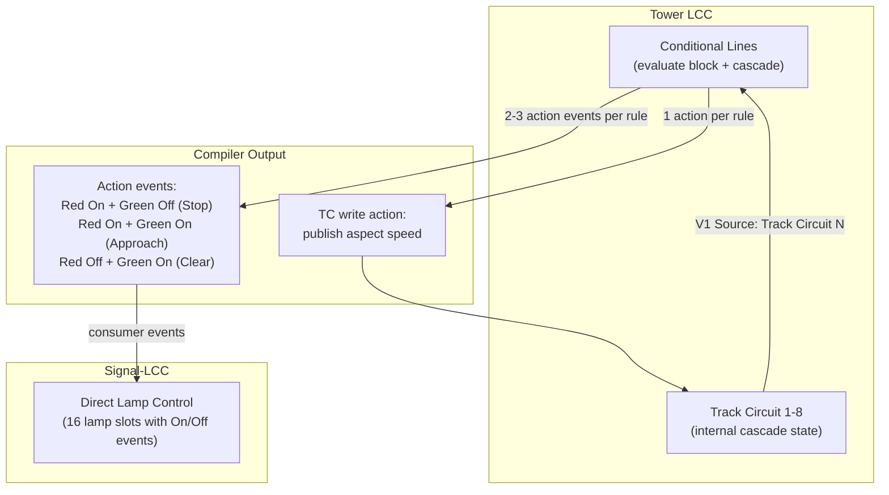
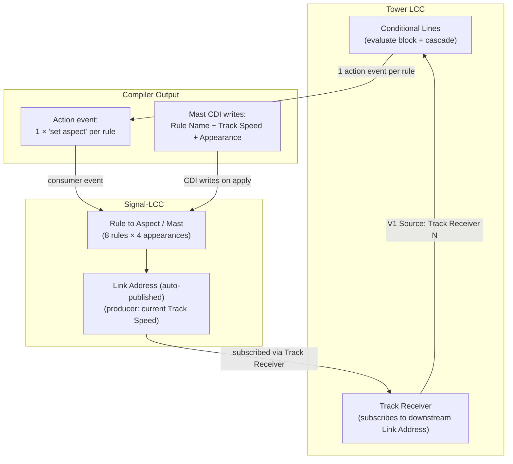

# Slices: Rule to Aspect Migration

Branch: 020-abs-signaling
Generated: 2026-07-30
Status: 0/4 slices complete
Depends on: slices-lamp-selection.md (must be completed first)

## Context

After the in-card lamp selection work lands, signal-aspect channels will have node-level bindings and the output card will surface lamp driver assignment as an editable configuration. However, the compilation output still targets Direct Lamp Control — each conditional line fires individual lamp On/Off events, and cascade uses Tower LCC Track Circuit write actions.

This work migrates from Direct Lamp Control to **Signal-LCC's Rule to Aspect** segment:
- The **Signal-LCC mast** becomes the output target (rules map to NORAC indications with lamp appearances)
- **Tower LCC conditional lines** fire a single "set aspect" consumer event per rule (instead of 2+ lamp events)
- **Cascade uses Link Address** — each mast auto-publishes its Track Speed; upstream nodes subscribe via Track Receiver/Circuit RX
- **State monitoring** switches from 4-event LED combinatorics to "aspect is set"/"aspect cleared" producer events

## Architecture

### Before (post lamp-selection)

### After (Rule to Aspect)

### Key Differences

| Aspect | Before (Direct Lamp Control) | After (Rule to Aspect) |
|---|---|---|
| Action events per rule | 2–3 (lamp On/Off + TC write) | 1 (set aspect) |
| Cascade publish | Explicit TC write action in conditional | Automatic — mast publishes Link Address |
| Lamp control | Events → Direct Lamp Control slots | Mast internally selects lamps per rule |
| State monitoring | 4 LED events → 2×2 combinatoric matrix | 1 "aspect is set" event per rule |
| Cross-node cascade | Not supported (TC is node-internal) | Natural — Link Address is a bus event |
| Multi-aspect scaling | Hits 4-action-slot ceiling | Unlimited — still 1 action per rule |
| Flash/fade | Not supported | Native (Lamp Phase + Lamp Fade per mast) |

### Patterns

- **Dual-node compilation** — A single `compile_facility()` call produces CDI writes targeting TWO nodes: conditional lines on Tower LCC and mast configuration on Signal-LCC. The `CompiledLogicOutput` gains a `mast_writes: Vec<CompiledFieldWrite>` alongside the existing `field_writes` (now conditional-only). The orchestrator dispatches writes to the correct node's config editor.
- **Mast allocation** — Each facility claims one mast ordinal (1–8) on a Signal-LCC node. Tracked in `LogicAllocation` alongside conditional line allocation. Freed on delete. The binding `signalMast { nodeKey, mastOrdinal }` is the facility's claim on that mast.
- **Link Address subscription** — For cascade, the compiler writes the downstream mast's Link Address (a fixed producer event ID read from CDI) into the upstream Tower LCC's Track Receiver segment. The upstream conditional's Variable then sources from that Track Receiver to evaluate downstream speed.
- **Set-aspect event sourcing** — The "set aspect" consumer event IDs are read from the Signal-LCC mast CDI (they are pre-assigned by the node firmware, not user-chosen). The compiler reads them and uses them as the conditional line's action event targets.

### Module Changes

| Module | Before | After |
|---|---|---|
| `bowties-core/src/logic_adapter/mod.rs` | Compiler produces lamp On/Off action events + TC write per rule | Produces 1 "set aspect" action event per rule; gains `mast_writes` in output for Signal-LCC CDI |
| `bowties-core/src/logic_adapter/mast_config.rs` | Does not exist | NEW: Mast CDI field types, mast allocation, mast write generation (Rule Names, Track Speeds, Appearances) |
| `bowties-core/src/layout/channels.rs` | `LampNode { node_key }` binding for signal-aspect | `SignalMast { node_key, mast_ordinal }` binding |
| `bowties-core/src/channel_events.rs` | `resolve_lamp_row_range_event_ids` for state monitoring | `resolve_mast_event_ids` — reads "aspect is set"/"aspect cleared" producer events from mast |
| `app/src/lib/stores/channels.svelte.ts` | `lampNode` binding variant | `signalMast` binding variant with `mastOrdinal` field |
| `app/src/lib/orchestration/facilityOrchestrator.ts` | Compile → stage Tower LCC drafts only | Compile → stage Tower LCC drafts + Signal-LCC mast drafts (two config editors) |
| `app/src/lib/components/Facilities/AddChannelPicker.svelte` | Shows Signal-LCC nodes for signal-aspect | Shows available masts per node (Mast Processing = Unused) |
| `app/src/lib/components/Facilities/LampAssignment.svelte` | Writes Lamp Selection to Direct Lamp Control slots | Writes Lamp Selection to Rule to Aspect/Mast/Rule/Appearance slots |
| `app/src/lib/utils/channelState.ts` | `deriveSignalAspectState` uses 4-event LED matrix | `deriveSignalAspectState` uses "aspect is set" event per rule |
| `app/src/lib/orchestration/eventStateOrchestrator.ts` | `LampRowRange` binding → 4 consumer leaf events | `SignalMast` binding → producer events per rule |

### Behavior Summary

| Slice | User-visible change | Demoable? |
|---|---|---|
| S1: Full vertical — mast binding + compiler + CDI writes | Apply produces mast config on Signal-LCC + set-aspect actions on Tower LCC; signal displays correct aspect | Yes |
| S2: Cascade via Link Address | Chained signals cascade via Link Address; cross-node cascade works | Yes |
| S3: State monitoring via aspect events | Railroad panel shows signal aspect from mast producer events; simpler + more reliable | Yes |
| S4: Cleanup — remove Direct Lamp Control signal path | Old code removed; saved layouts migrated; single clean code path | No (internal) |

---

## Roadmap

| # | Slice title | Label | Blocked by | Status |
|---|---|---|---|---|
| S1 | Full vertical — mast binding + compiler + dual-node CDI writes | HITL | lamp-selection S3 | not started |
| S2 | Cascade via Link Address | HITL | S1 | not started |
| S3 | State monitoring via aspect producer events | AFK | S1 | not started |
| S4 | Cleanup — remove Direct Lamp Control signal path | AFK | S2, S3 | not started |

### S1: Full vertical — mast binding + compiler + dual-node CDI writes [HITL]

**Intent**: User creates an ABS signal facility, selects a mast on a Signal-LCC node, applies — and the Signal-LCC mast is configured (Rule Names, Track Speeds, Appearances) while Tower LCC conditional lines fire "set aspect" events. The signal displays the correct aspect on hardware.
**Boundary**: Component → Store → Orchestrator → Backend (compiler + mast config) → CDI writes on two nodes
**Blocked by**: lamp-selection S3
**Status**: not started
**Complexity**: large

**Acceptance criteria**:
- [ ] Channel binding for signal-aspect channels is `signalMast { nodeKey, mastOrdinal }` — identifies a specific mast slot on a Signal-LCC node
- [ ] AddChannelPicker for signal-aspect slots shows available masts (Mast Processing = Unused) per Signal-LCC node, not individual lamp rows
- [ ] On facility apply, compiler writes Signal-LCC mast CDI: Mast Processing = Normal, Mast Description (facility name), Lamp Fade = Incandescent
- [ ] Compiler writes one Rule per template aspect: Rule Name (0-Stop, 21-Approach, 29-Clear), Track Speed (Stop/Approach/Clear), Appearance lamp assignments from user's selection (via LampAssignment component)
- [ ] Compiler writes Tower LCC conditional lines with 1 action per rule: action event = the mast rule's "set aspect" consumer event ID (read from Signal-LCC CDI)
- [ ] Conditional line logic structure unchanged: V1 evaluates block occupancy → Stop; fallback → Clear; downstream TC → Approach
- [ ] Save toolbar shows dirty for BOTH nodes (Tower LCC + Signal-LCC)
- [ ] Discard reverts CDI changes on both nodes
- [ ] Delete facility resets mast to Processing = Unused and clears conditional lines
- [ ] `CompiledLogicOutput` contains `mast_writes` field for Signal-LCC and `field_writes` for Tower LCC
- [ ] Mast ordinal allocation tracked in `LogicAllocation`; freed on delete
- [ ] End-to-end: Apply + Save + bus write → signal shows correct aspect in response to block occupancy events

**Architecture note**: The compiler becomes a dual-target emitter: one call produces writes for two nodes. `CompileInput` gains the Signal-LCC mast's CDI tree reference (for reading "set aspect" event IDs and validating Lamp Selection options). Orchestrator dispatches `mast_writes` to the Signal-LCC's config editor and `field_writes` to the Tower LCC's config editor. The existing Dirty Aggregation seam handles multi-node dirtiness naturally (each node's config editor independently tracks its own dirty state).

### S2: Cascade via Link Address [HITL]

**Intent**: Chaining ABS signals uses Signal-LCC mast Link Address for cascade instead of Tower LCC Track Circuit write actions. Cross-node cascade (signals on different Tower LCC nodes) works naturally.
**Boundary**: Backend (compiler cascade logic) → Orchestrator (compile ordering) → Tower LCC Track Receiver CDI writes
**Blocked by**: S1
**Status**: not started
**Complexity**: medium

**Acceptance criteria**:
- [ ] Downstream Signal-LCC mast automatically publishes its current Track Speed on its Link Address (no compile action needed — this is built into Signal-LCC firmware)
- [ ] Compiler writes the downstream mast's Link Address event ID into the upstream Tower LCC's Track Receiver/Circuit RX Link Address field (CDI write on Tower LCC)
- [ ] Upstream conditional line's Variable 1 Source references the Track Receiver slot (existing VariableSource mechanism)
- [ ] Compiler no longer emits TC-write actions in conditional line action slots for cascade
- [ ] Same-node cascade (both signals' logic on same Tower LCC) works: Track Receiver subscribes to the local Signal-LCC mast's Link Address
- [ ] Cross-node cascade works: upstream Tower LCC's Track Receiver subscribes to a downstream Signal-LCC mast's Link Address on a different bus segment
- [ ] Compile-order dependency: downstream must be compiled first (its mast's Link Address is an input to upstream compilation) — orchestrator enforces ordering
- [ ] 3-signal cascade produces correct Stop → Approach → Clear propagation
- [ ] Track Circuit allocation on Tower LCC is no longer needed for cascade (simplifies capacity tracking)
- [ ] `LogicAllocation.track_circuit` field becomes `track_receiver: Option<u8>` (which Track Receiver slot is written)

**Architecture note**: The cascade mechanism flips from "downstream actively writes TC speed" to "downstream passively publishes Link Address; upstream subscribes." This is simpler because the downstream mast's Link Address is a pre-existing producer event (read from CDI, not computed). The compiler reads the downstream Signal-LCC's mast Link Address event ID and writes it to the upstream Tower LCC's Track Receiver. The conditional's Variable Source references that Track Receiver — same evaluation logic, different data source. Cross-node cascade is free because Link Address is a standard LCC producer event visible to any bus participant.

### S3: State monitoring via aspect producer events [AFK]

**Intent**: Signal-aspect channel state in the Railroad panel is derived from the mast's "aspect is set" / "aspect cleared" producer events — one event per aspect change, replacing the 4-event LED combinatoric matrix.
**Boundary**: Utils (state derivation) → Orchestrator (event resolution) → Backend (mast event resolution)
**Blocked by**: S1
**Status**: not started
**Complexity**: small

**Acceptance criteria**:
- [ ] `resolveChannelEventIds` for signal-aspect channels resolves from the mast's rule producer events: each rule's "aspect is set" event ID, keyed by rule name (stop/approach/clear)
- [ ] `deriveSignalAspectState` simplified: most-recent "aspect is set" event determines the current aspect (no 2×2 LED matrix)
- [ ] `ChannelState` for signal-aspect still shows `stop | approach | clear | dark` — same UI, simpler derivation
- [ ] If no "aspect is set" event has been observed, state is `dark` (initial/unknown state)
- [ ] State updates immediately when a new "aspect is set" event is observed on the bus
- [ ] `STYLE_EVENT_MAPPINGS['2-led-bicolor-aspect']` leaf index mapping no longer used for state monitoring (but may be retained until S4 cleanup)
- [ ] Per-lamp breakdown in the output card derives from the active rule's Appearance configuration (static, not event-based) — shows which lamps are configured for the current aspect

**Architecture note**: State monitoring simplifies from "observe 4 individual LED events and compute a 2×2 combination" to "observe which rule's aspect-is-set event fired most recently." The backend `resolve_mast_event_ids` walks the Rule to Aspect segment and returns each rule's "aspect is set" producer event ID keyed by rule name. The frontend maps rule names to aspect states. The existing `eventStateOrchestrator` subscription mechanism handles the new event IDs without structural changes — it just subscribes to different events.

### S4: Cleanup — remove Direct Lamp Control signal path [AFK]

**Intent**: Remove the old Direct Lamp Control compilation path for signal-aspect channels. Single clean code path through Rule to Aspect.
**Boundary**: All layers — backend, stores, orchestrator, utils, components
**Blocked by**: S2, S3
**Status**: not started
**Complexity**: small

**Acceptance criteria**:
- [ ] `LampRow` and `LampNode` binding variants removed from signal-aspect channel types (retained only for `lamp-indicator` channels)
- [ ] `LampRowRange` backend resolution path removed
- [ ] Compiler no longer produces lamp On/Off action events (all lamp-action code removed from `compile_rule_to_field_writes`)
- [ ] `AspectPinMap` / `BICOLOR_2LED_ASPECT_MAP` removed from `logic_adapter` (mast Appearance replaces it)
- [ ] `STYLE_EVENT_MAPPINGS['2-led-bicolor-aspect']` consumer leaf index mapping removed
- [ ] `deriveSignalAspectState` old 4-event LED derivation path removed
- [ ] `resolve_lamp_row_range_event_ids` removed from `channel_events.rs`
- [ ] Existing saved layouts with old binding formats auto-migrate on load to `signalMast` binding
- [ ] `reset_facility` clears mast (Mast Processing = Unused, rules to defaults) instead of clearing Direct Lamp Control conditional line fields
- [ ] All tests pass with only the Rule to Aspect path
- [ ] No dead code: unused style mappings, unused binding variants, unused resolution paths all removed

**Architecture note**: This is a subtraction slice. No new features — just removing the parallel code path that existed during the transition. Migration logic on layout load converts old `lampRow`/`lampNode` bindings; since the mast ordinal wasn't previously stored, migration requires a heuristic (assign first available mast on the same Signal-LCC node) or prompts the user to re-bind on first open.
