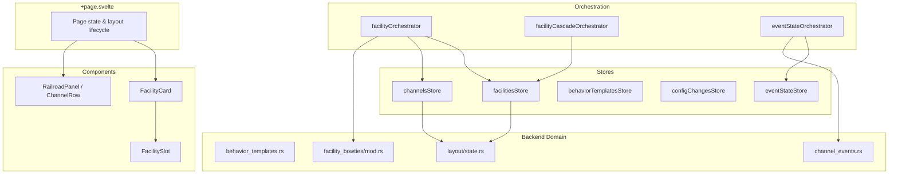

# Slices: ABS Signaling

Branch: 020-abs-signaling
Generated: 2026-07-07
Status: 4/7 slices complete

## Architecture

### Before

### After

```mermaid
graph TD
    subgraph Route["+page.svelte"]
        PageState["Page state & layout lifecycle"]
        LogicTargetDialog["Logic target selection dialog"]
    end

    subgraph Components["Components"]
        FacilityCard["FacilityCard"]
        FacilitySlot["FacilitySlot"]
        RailroadPanel["RailroadPanel / ChannelRow"]
        LogicTargetSelector["LogicTargetSelector (NEW)"]
    end

    subgraph Orchestration["Orchestration"]
        FacilityOrch["facilityOrchestrator<br/>(+ compile-before-compose)"]
        CascadeOrch["facilityCascadeOrchestrator"]
        EventStateOrch["eventStateOrchestrator"]
    end

    subgraph Stores["Stores"]
        FacilitiesStore["facilitiesStore<br/>(+ logic allocation field)"]
        ChannelsStore["channelsStore<br/>(+ signal-aspect role)"]
        BehaviorTemplates["behaviorTemplatesStore"]
        ConfigChanges["configChangesStore"]
        EventState["eventStateStore"]
    end

    subgraph Backend["Backend Domain"]
        BehaviorTemplateMod["behavior_templates.rs<br/>(+ ABS template + rules)"]
        FacilityBowties["facility_bowties/mod.rs"]
        ChannelEvents["channel_events.rs<br/>(+ signal-aspect resolution)"]
        LayoutState["layout/state.rs<br/>(+ allocation persistence)"]
        LogicAdapter["logic_adapter/ (NEW)<br/>compiler.rs + allocation.rs"]
    end

    PageState --> FacilityCard
    PageState --> LogicTargetDialog
    LogicTargetDialog --> LogicTargetSelector
    FacilityCard --> FacilitySlot
    PageState --> RailroadPanel
    FacilityOrch --> FacilitiesStore
    FacilityOrch --> ChannelsStore
    FacilityOrch --> LogicAdapter
    FacilityOrch --> FacilityBowties
    CascadeOrch --> FacilitiesStore
    EventStateOrch --> EventState
    EventStateOrch --> ChannelEvents
    FacilitiesStore --> LayoutState
    ChannelsStore --> LayoutState
    LogicAdapter --> LayoutState
```

### Patterns

- **Compile-before-compose** — Compiled behavior templates produce CDI field writes directly via the logic adapter, instead of relying on bowtie composition for event wiring. The compiler expands abstract rules into concrete conditional line configurations with resolved event IDs.
- **Stub-and-widen** — S1 wires the full vertical path with a stubbed compiler; S2 replaces the stub with real compilation logic. The IPC contract is proven end-to-end before the backend is built.
- **Function-level adapter seam** — `logic_adapter/` is a concrete module with function-level interface. No trait/dynamic dispatch until a second compilation target (STL, LogixNG) arrives (YAGNI).
- **Per-facility allocation field** — Logic allocation is a field on the facility record in `facilitiesStore`, not a separate store. Avoids a new dirty bucket, a new `LayoutScopedParticipant`, and a new `collectDeltas()` implementor.

### Module Changes

| Module | Today | After |
|---|---|---|
| `bowties-core/src/behavior_templates.rs` | Template registry with slot definitions and state mappings | Gains `ConditionActionRule`, `RuleCondition`, `compilation_target` field; ABS 3-Aspect template registered |
| `bowties-core/src/logic_adapter/` | Does not exist | NEW: Tower LCC compiler (template→conditional lines), allocation tracking, capacity enforcement |
| `bowties-core/src/layout/types.rs` | `LayoutEditDelta` with facility/channel/bowtie variants | Gains `AllocateLogic` / `FreeLogic` delta variants |
| `bowties-core/src/layout/state.rs` | Saved/captured/drafts three-layer projection | Gains logic allocation persistence in saved layer |
| `bowties-core/src/channel_events.rs` | Producer (connector-input) + consumer (lampRow) event resolution | Gains signal-aspect channel resolution path |
| `app/src/lib/orchestration/facilityOrchestrator.ts` | Compose-if-wired apply workflow | Gains compile-before-compose path for compiled templates; logic-target selection step |
| `app/src/lib/stores/facilities.svelte.ts` | Facility records with slot bindings | Gains logic allocation field per facility; `AllocateLogic`/`FreeLogic` in `collectDeltas()` |
| `app/src/lib/stores/channels.svelte.ts` | block-occupancy + lamp-indicator channel roles | Gains signal-aspect channel role |
| `app/src/lib/utils/channelStyles.ts` | `STYLE_EVENT_MAPPINGS` for BOD + lamp styles | Gains `2-led-bicolor-aspect` style entry |
| `app/src/lib/components/Facilities/LogicTargetSelector.svelte` | Does not exist | NEW: Node picker with capacity display |

### Behavior Summary

| Slice | User-visible change | Demoable? |
|---|---|---|
| S1: ABS template + full vertical apply (stub compile) | User creates ABS signal facility, binds channels, selects logic target, applies — CDI changes staged as drafts | Yes |
| S2: Real Tower LCC compiler | Compiled conditional lines match Tower LCC CDI exactly — correct signal behavior on hardware | Yes |
| S3: Fix channel state display + signal-aspect event resolution | Channel state dots work for block-occupancy (regression fix) and signal-aspect channels | Yes |
| S4: Facility comprehension view + editable bindings | Inputs→Logic→Outputs detail view for applied facilities; explicit logic target selection; per-lamp output state; editable downstream-signal slot | Yes |
| S5: ABS cascade via same-node Track Circuits | Chaining signals produces Stop → Approach → Clear cascade | Yes |
| S6: Facility deletion + resource reclamation | Delete reclaims conditional lines and Track Circuits | Yes |
| S7: Capacity display + target node suggestion | Capacity numbers visible per candidate node before apply | Yes |

---

## Roadmap

The ordered slice set. An overview table for at-a-glance scanning, followed by one **roadmap card** per slice. `/build` appends a task breakdown to a card when it implements that slice; it does not pre-author tasks.

| # | Slice title | Label | Blocked by | Status |
|---|---|---|---|---|
| S1 | ABS template + signal-aspect style + full vertical apply path (stub compile) | HITL | None | done |
| S2 | Real Tower LCC conditional line compiler | HITL | S1 | done |
| S3 | Signal-aspect channel state display | AFK | S1 | done |
| S4 | Facility comprehension view + editable bindings | HITL | S3 | done |
| S5 | ABS cascade via same-node Track Circuits | HITL | S4 | sketched |
| S6 | Facility deletion + resource reclamation | AFK | S2 | sketched |
| S7 | Capacity display + target node suggestion | AFK | S4 | sketched |

### S1: ABS template + signal-aspect style + full vertical apply path (stub compile) [HITL]

**Intent**: User can create an ABS 3-Aspect Signal facility, bind channels, select a logic target node, and apply — seeing compiled CDI changes staged as drafts.
**Boundary**: Route → Component → Orchestrator → Store → API → Backend command → Backend domain (stubbed compiler)
**Blocked by**: None
**Status**: done
**Complexity**: large
**User stories**: US1, US3

**Acceptance criteria**:
- [ ] User selects "ABS 3-Aspect Signal" template when creating a facility; input slot accepts block-occupancy channels, output slot accepts signal-aspect channels
- [ ] User creates a signal-aspect output channel via Add-channel, bound to 2 Direct Lamp Control rows on a Signal LCC node (2-LED bicolor style)
- [ ] User selects a Tower LCC logic target node during the apply step
- [ ] Apply produces CDI config drafts (conditional line values) via the stubbed compiler — Save toolbar shows dirty; close prompt warns about unsaved changes
- [ ] Logic allocation record is persisted — Save + reopen layout shows allocation intact
- [ ] Discard reverts all compiled CDI changes and frees the allocation
- [ ] Delete-facility removes the user-owned signal-aspect channel alongside the facility (no orphan channels)
- [ ] Facility status shows Wired after all slots are filled (existing `facilityStatus` derivation)

**Architecture note**: Introduces the **compile-before-compose** workflow pattern — compiled templates produce CDI writes directly via the logic adapter module, instead of bowtie composition for event wiring. Establishes `logic_adapter/` as a function-level module seam (no trait/dynamic dispatch until a second adapter arrives — YAGNI). Logic allocation is a per-facility field in `facilitiesStore` — no new dirty bucket in the Dirty Aggregation seam, no new `LayoutScopedParticipant` registration.

**Tasks**:
- [x] S1-T1: Write integration test — end-to-end: create ABS facility → bind channels → select logic target → apply → verify CDI drafts staged + allocation record persisted
- [x] S1-T2: bowties-core domain — Register ABS 3-Aspect Signal behavior template with `ConditionActionRule` types, `signal-aspect` channel role enum, `compilation_target` field; create `logic_adapter/` module with stub compiler returning structurally valid `CompiledLogicPlan`; add allocation types and `InsufficientCapacity` error
- [x] S1-T3: bowties-core layout — Add `AllocateLogic`/`FreeLogic` `LayoutEditDelta` variants (camelCase serde); extend layout state to persist logic allocation records in saved facility layer
- [x] S1-T4: Tauri IPC — Add `compile_logic_for_facility` command (calls stub compiler, returns plan); add `get_logic_capacity` query command
- [x] S1-T5: Frontend utils + stores — Add `2-led-bicolor-aspect` style to `channelStyles.ts`; extend `facilities.svelte.ts` with `logicAllocation` field + `logicTargetNodeKey` + `collectDeltas` for logic state; extend `channels.svelte.ts` for `signal-aspect` role
- [x] S1-T6: Frontend orchestrator — Extend `facilityOrchestrator` with compile-before-compose workflow: after slots wired → compile → stage CDI drafts → compose bowties; add logic target node selection step
- [x] S1-T7: Frontend components + route — `LogicTargetSelector` component with capacity display; integrate into apply workflow in `+page.svelte`
- [x] S1-T8: Validate — `cargo test -p bowties-core` green; `vitest run` green; save/discard/reopen round-trip verified

<!-- Session: 2026-07-07 — Completed S1. Next: S2 (HITL). -->

### S2: Real Tower LCC conditional line compiler [HITL]

**Intent**: Compiled conditional lines match Tower LCC CDI structure exactly — Save + bus write produces correct signal behavior on hardware.
**Boundary**: Backend domain (`logic_adapter/`) + IPC layer (`commands/logic_adapter.rs`)
**Blocked by**: S1
**Status**: done
**Complexity**: medium
**User stories**: US1

**Acceptance criteria**:
- [x] Compiler produces 3 contiguous conditional lines for a standalone 3-aspect signal in correct mast group structure (Group/Group/Last flags)
- [x] Evaluation order is most-restrictive-first: Stop (priority 1) → Approach (priority 2) → Clear (priority 3)
- [x] Variable inputs reference the block-occupancy channel's event IDs (occupied = set-true, clear = set-false)
- [x] Aspect-to-event map expansion: each aspect's compiled actions contain the correct lamp On/Off event IDs from the 2-LED bicolor style
- [x] End-of-line signal (no downstream input): Approach rule omitted, compiler produces 2 conditional lines (Stop + Clear) with Group/Last structure
- [x] Compiler rejects configurations that exceed 32 conditional lines per node with a clear `InsufficientCapacity` error
- [x] Compiler rejects styles whose action count per aspect exceeds 4 (Tower LCC line limit)
- [x] Compiled values round-trip through Save + bus write — CDI on target node matches expected field values

**Architecture note**: Compiler is a pure function (`CompileInput → Result<CompiledLogicPlan, CompileError>`). `CompileInput` bundles the template, resolved channel event IDs, and aspect-to-pin-action map — the IPC command gathers this data from `LayoutState` (following the `compose_facility_bowties` pattern). Capacity enforcement is compiler-owned. Intermediate `CompiledConditionalLine` types make each compilation step independently testable before flattening to `CompiledFieldWrite`. Style aspect-to-pin maps are defined in `bowties-core` alongside the compiler (different purpose than the frontend `channelStyles.ts` leaf-index mapping).

**Tasks**:
- [x] S2-T1: Integration test — compile standalone 3-aspect signal with mock channel bindings → verify CompiledLogicPlan field writes produce correct Tower LCC CDI addresses, enum values, and event IDs; compile end-of-line signal → verify 2-line output with Group/Last structure
- [x] S2-T2: Domain types — `CompileInput` struct (template, facility info, input channel events, output channel pin events, optional downstream binding); `CompiledConditionalLine` intermediate type with CDI field enums (ConditionalFunction, LogicOperation, VariableTrigger, VariableSource, ActionBehavior, ActionCondition, ActionDestination); `AspectPinMap` for style-to-pin-action resolution; CDI layout constants (LINE_SIZE=122, SEGMENT_ORIGIN=2528, field offsets)
- [x] S2-T3: Compiler core — replace stub `compile_facility` with real implementation: rule filtering (omit Approach when no downstream), rule→CompiledConditionalLine expansion (mast group flags, variable inputs from event IDs, logic operation, exit format), aspect→action event expansion (pin map + channel events → up to 4 action events per line), flatten to CompiledFieldWrite via address calculation
- [x] S2-T4: IPC update — refactor `compile_logic_for_facility` to read from `LayoutState` effective views (matching `compose_facility_bowties` pattern), resolve channel event IDs from config trees, build `CompileInput`, call compiler
- [x] S2-T5: Validate — `cargo test -p bowties-core` green; `vitest run` green; existing save/discard round-trip unchanged

<!-- Session: 2026-07-19 — Completed S2. Next: S3 (AFK, blocked by S1 only — ready), S4 (HITL, blocked by S2 — now unblocked). -->

### S3: Signal-aspect channel state display [AFK]

**Intent**: Signal-aspect channels show the current aspect (Stop / Approach / Clear / Dark) in the Railroad panel state dots, derived from observed lamp On/Off PCERs on the bus.
**Boundary**: Utils → Backend (`channel_events.rs`) → Component (`ChannelRow`) → Orchestrator (`eventStateOrchestrator`)
**Blocked by**: S1
**Status**: done
**Complexity**: medium
**User stories**: US1

**Acceptance criteria**:
- [x] `ChannelState` union includes `{ role: 'signal-aspect'; state: 'stop' | 'approach' | 'clear' | 'dark' }` discriminant
- [x] `STYLE_EVENT_MAPPINGS['2-led-bicolor-aspect']` maps LED-level events (`redOn`/`redOff`/`greenOn`/`greenOff`) with correct consumer leaf indices for multi-row resolution
- [x] Backend supports `LampRowRange` binding variant — resolves events from N consecutive lamp rows, indexing sequentially
- [x] `resolveChannelEventIds` orchestrator handles signal-aspect channels: sends `lampRowRange` binding with correct rowCount from style registry
- [x] `deriveSignalAspectState` derives aspect from 4 LED events using per-LED most-recent-wins → 2×2 combination matrix
- [x] `ChannelsPanel` dispatches signal-aspect derivation for signal-aspect channels
- [x] `ChannelRow` renders stop/approach/clear/dark state dots with distinct CSS styles + tooltips
- [x] Signal-aspect channels appear grouped under "Direct Lamp Control" in Railroad panel (existing groupLabel logic — no change needed)

**Architecture note**: Signal-aspect state derivation is fundamentally different from the 2-state occupied/clear or lit/unlit pattern. It requires resolving 4 consumer events (2 per LED row) and combining 2 independent LED states into an aspect via a 2×2 matrix. The `LampRowRange` backend binding variant avoids sending multiple IPC requests per channel. The style mapping is repurposed from aspect-oriented (compilation reference, now handled by bowties-core `AspectPinMap`) to LED-oriented (state display). No conflict: S2 compiler uses its own `AspectPinMap` in bowties-core.

**Tasks**:
- [x] S3-T1: Integration test — signal-aspect channel with 4 resolved events: derive correct aspect from LED combination; verify ChannelsPanel produces correct ChannelState for signal-aspect channels
- [x] S3-T2: bowties-core — add `resolve_lamp_row_range_event_ids(tree, start_row, row_count, role, leaf_index_map)` that collects consumer event leaves from N consecutive rows in order; unit test
- [x] S3-T3: Backend IPC — add `LampRowRange { startRowOrdinal, rowCount }` variant to `ChannelResolutionBinding`; dispatch to new resolution function
- [x] S3-T4: Frontend utils — extend `ChannelState` union with signal-aspect discriminant; add `deriveSignalAspectState` function; update `channelStateClass`/`channelStateLabel`/`roleForChannelState`; update `STYLE_EVENT_MAPPINGS['2-led-bicolor-aspect']` to LED-level mapping
- [x] S3-T5: Frontend orchestrator — extend `resolveChannelEventIds` to detect signal-aspect role, use `lampRowRange` binding with `getStyleRowCount`, map LED-level leaf indices
- [x] S3-T6: Frontend components — extend `ChannelsPanel` derivation loop for signal-aspect; add stop/approach/clear/dark CSS classes + tooltips to `ChannelRow`
- [x] S3-T7: Validate — `cargo test -p bowties-core` green; `vitest run` green; signal-aspect state derivation correct

<!-- Session: 2026-07-19 — Completed S3. Next: S4 (HITL), S5 (AFK), S6 (AFK). -->

### S4: Facility comprehension view + editable bindings [HITL]

**Intent**: Applied facilities display an Inputs → Logic → Outputs detail view in the Railroad panel. Users can inspect live state, see compiled rules, explicitly select/change the logic target, view per-lamp output state, and edit the downstream-signal binding after initial apply.
**Boundary**: Route → Component → Store → Orchestrator (recompile on binding edit) → Backend IPC (downstream resolution)
**Blocked by**: S3
**Status**: done
**Complexity**: medium
**User stories**: US1

**Acceptance criteria**:
- [ ] Selecting a facility in the Railroad panel renders the comprehension view: Input cards (left), Logic card (center), Output cards (right) with flow arrows
- [ ] Each Input card shows channel name, role, and live state badge (top-right of card): occupied/clear for block-occupancy, stop/approach/clear for downstream signal
- [ ] Logic card shows: compiled rules with evaluation priority, target node name, current evaluation result (e.g. "Stop — next block occupied"), and a "Select target node" button
- [ ] "Select target node" button opens the LogicTargetSelector; changing the target triggers recompilation and re-stages CDI drafts for the new node (freeing the old allocation)
- [ ] Output cards show signal aspect state badge (top-right) and per-lamp breakdown (e.g. "Row 5 — Red: ON", "Row 6 — Green: off")
- [ ] Downstream-signal input slot is visible as an input card; when empty, shows "End of line — no cascade" with an "Add downstream signal →" action
- [ ] Binding a downstream signal to an existing facility triggers recompilation (2-line → 3-line, adds Approach rule); unbinding triggers recompilation back to 2-line
- [ ] State dots/badges use the card-header position (top-right) consistently across input and output cards

**Architecture note**: Downstream-signal is a 3rd slot on the ABS template (D1: Option A — slot reuse). `required_role: "signal-aspect"`, `minChannels: 0`, `maxChannels: 1`, `shared: true`. Orchestrator resolves bound channel → owning facility → logic allocation → `DownstreamBinding` at compile time. Per-lamp state derived by component from the same 4 event timestamps S3 uses. Compiled rules summary derived on frontend from template rules + live channel state (no new backend query). In-card expansion pattern: `$state(false)` + CSS grid swap.

**Tasks**:
- [x] S4-T1: Integration test — expand FacilityCard for compiled-template facility → verify 3-column comprehension view renders with input/logic/output cards; bind downstream-signal slot → verify recompile triggers 3-line output; unbind → verify recompile back to 2-line; change logic target → verify CDI drafts restaged for new node
- [x] S4-T2: bowties-core — Add 3rd slot `downstream-signal` to ABS template (`signal-aspect`, shared, `minChannels: 0`, `maxChannels: 1`); update IPC `compile_logic_for_facility` to resolve downstream from slot binding (channel → owning facility → allocation → `DownstreamBinding`); unit test
- [x] S4-T3: Frontend orchestrator — Extend `compileLogicIfNeeded` to pass downstream-signal slot binding to IPC; add recompile trigger on downstream-signal attach/detach (calls existing `compileLogicForFacility` path)
- [x] S4-T4: Frontend components — `FacilityComprehensionView.svelte` (3-column: input cards with live state badges, logic card with rules/evaluation/target-button, output cards with aspect badge + per-lamp LED state); `FacilityCard.svelte` gains expand toggle + conditional rendering
- [x] S4-T5: Frontend components — Downstream-signal input card: empty state ("End of line — no cascade" + "Add downstream signal →" action); filled state (channel name + live aspect badge); bind/unbind actions dispatch through orchestrator
- [x] S4-T6: Validate — `cargo test -p bowties-core` green; `vitest run` green; expand/collapse round-trip; downstream bind/unbind → recompile → correct line count; target change → CDI drafts restaged

<!-- Session: 2026-07-19 — Completed S4. Next: S5 (HITL). -->

### S5: ABS cascade via same-node Track Circuits [HITL]

**Intent**: User can chain multiple ABS signal facilities so that occupying a block cascades Stop → Approach → Clear backward through the block system.
**Boundary**: Orchestrator → Store → API → Backend domain (`logic_adapter/` compiler extension)
**Blocked by**: S4
**Status**: sketched

**Acceptance criteria**:
- [ ] User binds an upstream signal's downstream-signal input slot to a downstream signal facility's output
- [ ] Compiler allocates a Track Circuit (1–8) for the cascade connection and records it in the logic allocation
- [ ] Upstream signal's Approach rule compiles to a Track Circuit read variable (TC source + speed threshold match)
- [ ] Downstream signal's compiled actions include a Track Circuit write action publishing its current aspect as a speed value
- [ ] 3-signal cascade compiles correctly: occupied block → protecting signal Stop, one behind → Approach, two behind → Clear
- [ ] Compiler rejects cascade wiring when all 8 Track Circuits on the target node are allocated, with a clear capacity error

**Architecture note**: Track Circuits are an internal Tower LCC communication primitive (8 per node) that carry aspect/speed values between conditional groups. This slice extends the compiler's variable resolution to include TC-sourced reads and the action expansion to include TC-destination writes. Cross-node cascade (via Track Transmitter/Receiver linking) is explicitly deferred.

### S6: Facility deletion + resource reclamation [AFK]

**Intent**: Deleting a signal facility fully reclaims all allocated conditional lines and Track Circuits — resources are immediately available for reuse.
**Boundary**: Orchestrator → Backend (`logic_adapter/` + `LayoutState`)
**Blocked by**: S2
**Status**: sketched

**Acceptance criteria**:
- [ ] Deleting an applied facility resets its conditional lines to disabled/default state (all variable and action fields cleared as CDI drafts)
- [ ] Logic allocation record is removed — conditional lines and Track Circuits freed for reuse
- [ ] A subsequent facility can reuse the same lines and circuits without manual intervention
- [ ] When deleting a facility referenced as a downstream signal by other facilities, Bowties warns listing affected upstream facilities and requires confirmation before proceeding
- [ ] Save toolbar and close prompt reflect the deletion-related CDI changes (Dirty Aggregation seam — Save toolbar + close prompt consumers)
- [ ] User-owned signal-aspect channel is removed alongside the facility (no orphan channels; User-Owned Channel Lifecycle seam)

### S7: Capacity display + target node suggestion [AFK]

**Intent**: User sees available conditional line and Track Circuit capacity per candidate node before applying a signal facility.
**Boundary**: Route → Component → Store → Backend
**Blocked by**: S4
**Status**: sketched

**Acceptance criteria**:
- [ ] LogicTargetSelector displays "X/32 conditional lines used, Y/8 Track Circuits used" per candidate node
- [ ] Capacity numbers update correctly after applying or deleting a facility
- [ ] Bowties suggests the node hosting the most input channels as the default target, with an option to override
- [ ] Attempting to apply when the target node has insufficient conditional lines surfaces the compiler's `InsufficientCapacity` error with a clear message in the UI
