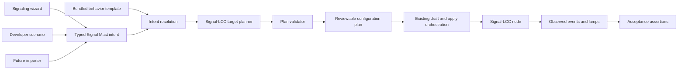

# Headless Signaling Intent Pipeline — Plan

Status: **proposed.** This plan captures an implementation direction for review. It does not supersede the signaling UX charter or commit Bowties to a public template-file format.

## Purpose

Build the signaling domain capability before making it dependent on a finished wizard. A developer tool, automated test, importer, or future UX should be able to describe the same railroad intent and receive the same validated Signal-LCC configuration plan.

The first proving case is the hardware-validated three-aspect mast:

- protected block occupied → Stop;
- protected block clear and next mast restrictive → Approach;
- protected block clear and next mast permissive → Clear.

This turns subsequent bench work into acceptance testing of production domain logic rather than disposable hand configuration.

## Relationship To The UX Charter

The user-facing experience continues to begin with railroad intent, particularly **what the signal protects**. Hardware architecture remains hidden. The wizard is a client of this pipeline: it gathers understandable answers and produces typed intent; it does not compile conditional lines itself.

The pipeline therefore supports the charter rather than creating a parallel developer-only model. The same intent must produce the same plan whether it came from:

- the future signaling wizard;
- a developer acceptance scenario;
- a future layout importer;
- a future batch or migration workflow.

## Architectural Shape

## Separation Of Responsibilities

### Typed Signal Mast intent

Intent describes the railroad behavior and bindings:

- what the mast protects;
- supported aspect vocabulary;
- protected-block occupancy input;
- next mast in advance, when present;
- turnout, bridge, hold, or local-override inputs when required;
- physical signal display style and binding;
- selected behavior-template identity.

Intent does **not** contain CDI paths, conditional indices, Track Circuit numbers, raw enum values, or event IDs.

### Bundled behavior template

A behavior template supplies reusable policy such as:

1. protected block occupied → Stop;
2. next mast restrictive → Approach;
3. otherwise → Clear.

Templates declare required inputs, possible outputs, ordered rules, and applicability constraints. They remain hardware-independent. The first implementation may keep bundled templates in typed Rust data. A public YAML schema and user-authored templates are deferred until multiple real consumers establish a stable abstraction.

A behavior template is distinct from:

- a structure profile, which explains a node's CDI;
- a test scenario, which supplies stimuli and expected observations;
- a target planner, which lowers policy into hardware configuration.

### Signal-LCC target planner

The target planner converts resolved intent into a declarative configuration plan containing:

- Rule-to-Aspect rule configuration;
- conditional groups in most-restrictive-first order;
- Track Circuit allocation and references;
- output ownership and mast appearance assignments;
- required event-wiring slots;
- resource allocations and inverse cleanup information.

The planner is pure domain logic in `bowties-core`: identical input and node capabilities produce identical output. It does not mutate layout state, call IPC, or write to the bus.

The existing Tower-LCC-oriented logic adapter is prior implementation evidence, not automatically the final abstraction. Planning must reconcile it with the current Signal-LCC-first direction rather than exposing Tower-LCC concepts through the new intent API.

### Plan validator

Validation runs against the target node's current CDI-derived structure and effective configuration. It checks at least:

- every planned enum value exists in the current CDI;
- existing Signal-LCC conditional Function values are recognized;
- every active `Group` run reaches a valid `Last (Single)` terminator;
- malformed earlier groups are reported because they can silence later groups;
- required conditional, mast, rule, Track Circuit, action, and lamp capacity exists;
- planned resources do not overlap existing claims;
- every aspect is realizable by the selected display style;
- required event-wiring sources resolve without inventing duplicate ownership.

Unknown existing values are preserved for round-trip safety. Repair is never silent: the eventual UX or developer caller must receive an explicit diagnostic and, if repair is supported, an explicit proposed repair.

### Configuration plan

The planner returns a serializable, reviewable plan rather than applying side effects. The plan distinguishes:

- structural CDI writes;
- event-wiring requirements;
- resource claims;
- diagnostics and proposed repairs;
- inverse operations needed for removal or rollback.

This allows deterministic snapshot tests and lets a developer inspect the exact plan before hardware application.

### Apply orchestration

Existing Bowties orchestration remains responsible for:

- reading effective layout and node state;
- resolving event IDs through the established bowtie-composition owner;
- staging edits in the draft layer;
- presenting confirmation and diagnostics;
- saving layout state and writing to the bus in the established order;
- handling cancellation, partial failure, cleanup, and retry.

A developer-facing entry point must call this same application workflow. It must not create a second path that writes directly to the node and bypasses draft, persistence, or event-ownership invariants.

### Acceptance scenario

A scenario is test data layered over intent. It defines stimuli and expected observations, for example:

| Protected block | Next mast | Expected local aspect |
|---|---|---|
| Clear | Clear | Clear |
| Clear | Stop | Approach |
| Occupied | Stop | Stop |
| Occupied | Clear | Stop |

Compiler tests can assert the generated plan without hardware. A future hardware-in-the-loop runner can publish the stimuli and assert aspect, lamp, and Track Circuit events using the same scenario.

## First Vertical Proving Path

### Slice 1 — Typed intent and plan preview

Express the already-proven S4r/B3/Bt experiment as typed intent and compile it into a serializable Signal-LCC plan. Expose a developer-readable preview. Do not apply it yet.

Acceptance:

- no CDI concepts leak into intent;
- generated Rule-to-Aspect and conditional structures match the validated bench configuration;
- unknown Function value `3` in a fixture produces a structural diagnostic;
- plan generation is deterministic and covered by focused Rust tests.

### Slice 2 — Normal-path application

Apply the previewed plan through the existing draft and save orchestration, including event-ID composition and inverse cleanup ownership.

Acceptance:

- the developer invokes one intent-level operation rather than editing CDI fields;
- all writes appear as ordinary drafts and remain Save/Discard compatible;
- applying and removing the intent leave no untracked allocation or event wiring;
- no direct hardware-write bypass exists.

### Slice 3 — Hardware acceptance of the proven single mast

Generate and apply the S4r event-driven configuration that was previously entered by hand, then run the established transition matrix.

Acceptance:

- Stop, Approach, and Clear match the known-good manual result;
- the independent B3 indicator continues to operate;
- malformed existing groups block apply with a useful diagnostic rather than silently producing an inert later group.

### Slice 4 — Track Circuit cascade acceptance

Extend the same intent with a next-mast reference. Allocate and configure one Track Circuit and replace the reduced Bt detector input with downstream mast speed.

Acceptance:

- downstream Stop causes local Approach while the protected block is clear;
- protected-block occupancy retains Stop regardless of downstream changes;
- downstream Clear restores local Clear when the protected block is clear;
- the observed event sequence and any Track Speed comparison semantics are recorded in the durable Signal-LCC hardware documentation.

### Slice 5 — UX adapter

Build the signaling wizard as an adapter that creates and edits the same typed intent. It does not acquire a separate compiler or apply workflow.

Acceptance:

- a wizard-created intent and an equivalent developer scenario produce identical plans;
- hardware details remain absent from user-facing questions;
- plan diagnostics are translated into actionable railroad-language explanations.

## Additional Uses Enabled

Once the core seam is proven, it can support:

- reproducible hardware acceptance fixtures;
- exact change previews and diagnostics;
- batch creation of similar masts;
- importing signaling intent from JMRI or another layout description;
- comparing existing configuration with intended behavior;
- migrating a mast to a newer bundled template version;
- future user-authored behavior templates, after the internal schema stabilizes.

These are consumers of the seam, not requirements for its first implementation.

## Non-Goals

The first implementation does not include:

- a general-purpose signaling programming language;
- a user-facing template authoring UI;
- silent repair of unknown or reserved configuration values;
- reverse engineering arbitrary existing conditionals into intent;
- direct bus writes from tests or developer tools;
- cross-node cascade unless the first same-node Track Circuit slice proves that it is needed immediately;
- Signal Plant aggregation, which remains a later phase built over Signal Mast intent.

## Planning Decisions Still Required

Before implementation planning, decide:

1. Whether existing `Facility` persistence can represent Signal Mast intent cleanly or requires a distinct persisted domain object.
2. Whether bundled behavior templates remain typed Rust initially or need a private serialized format for fixtures.
3. Which owner validates table-wide Signal-LCC conditional structure.
4. How diagnostics and explicit repair proposals enter the draft workflow.
5. Which existing Spec 020 modules are reusable after removing the obsolete Tower-LCC-first and `ABS 3-Aspect Signal` UX assumptions.
6. How the older active Spec 020 artifacts are superseded or archived once the replacement slices are accepted.

## Source Material

- [Signaling UX charter](goals-and-constraints.md)
- [Signaling design decisions](design-decisions.md)
- [Signal-LCC conditionals](../../../product/hardware/signal-lcc/conditionals.md)
- [Signal-LCC Rule-to-Aspect](../../../product/hardware/signal-lcc/rule-to-aspect.md)
- [Signal-LCC Track Circuits](../../../product/hardware/signal-lcc/track-circuits.md)
- [Code placement and ownership](../../../product/architecture/code-placement-and-ownership.md)
- [Existing Spec 020 plan](../../020-abs-signaling/plan.md)
